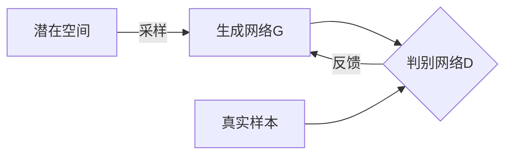

# GAN在气象与气候预测中的应用

## 1.背景介绍

### 1.1 气象与气候预测的重要性

气象和气候预测对于人类社会的可持续发展至关重要。准确的天气预报可以帮助农业生产做出明智决策,减少自然灾害带来的损失,优化交通运输等。而气候变化预测则有助于制定应对气候变化的长期战略,保护生态环境,确保粮食安全等。

### 1.2 传统气象气候预测方法的局限性  

传统的气象气候预测方法主要依赖于数值天气预报模型,通过对大气运动方程、辐射传输方程等进行求解来模拟大气运动。然而,这些模型需要大量观测数据作为输入,且计算量巨大,存在一定误差。另一方面,统计学习方法虽然可以从历史数据中挖掘出一些规律,但很难充分考虑复杂的动力学过程。

### 1.3 GAN在气象气候领域的应用前景

近年来,生成对抗网络(Generative Adversarial Networks, GAN)在图像、语音、自然语言处理等领域取得了巨大成功,展现出强大的生成能力。GAN能够从数据中学习到潜在的分布,并生成新的高质量样本,为气象气候预测提供了新的思路。通过GAN生成高分辨率的气象场,并与物理约束相结合,有望突破传统数值模型的瓶颈,提高预测精度。

## 2.核心概念与联系

### 2.1 生成对抗网络GAN

GAN由生成网络G和判别网络D组成,二者相互对抗,相互博弈。生成网络从潜在空间采样,生成尽可能逼真的样本,试图欺骗判别网络;而判别网络则努力区分生成样本和真实样本,并反馈给生成网络。两个网络相互训练,最终达到一个纳什均衡,使生成样本的分布极其接近真实样本分布。



### 2.2 GAN在气象气候预测中的应用

GAN可以通过学习历史观测数据,生成高分辨率、物理合理的气象场,例如温度场、风场、降水场等。这些生成的气象场可以作为数值天气预报模型的初始场或边界场输入,提高模型的预测精度。

另一方面,GAN也可以直接对未来的气象场进行预测。通过序列生成模型(如时间序列GAN)学习气象场的时空演化规律,对未来一段时间的气象场进行预测。这种端到端的预测方式,避免了数值模型中的累积误差。

### 2.3 GAN与物理约束的结合

尽管GAN能够生成高质量的样本,但生成的气象场可能会违反一些基本的物理定律,如质量守恒、能量守恒等。因此,需要将GAN生成的结果与物理约束相结合,使其符合自然规律。常见的方法包括:

1. 将物理约束编码到GAN的生成网络或判别网络中
2. 在GAN生成结果的基础上,使用投影或修正算法强制满足物理约束
3. 将GAN生成的结果作为数值模型的初始场,经过一段时间模拟后自动满足物理约束

## 3.核心算法原理具体操作步骤

### 3.1 基本GAN算法

假设我们有一个真实样本的数据集$\mathcal{X}$,其概率分布为$p_{data}(x)$。生成网络G的目标是从一个潜在空间$\mathcal{Z}$中采样噪声$z$,并将其映射到数据空间$\mathcal{X}$,生成样本$G(z)$,使其分布$p_g(x)$尽可能接近真实数据分布$p_{data}(x)$。

判别网络D则从数据空间$\mathcal{X}$中采样样本,判断它们是来自真实数据分布$p_{data}(x)$还是生成分布$p_g(x)$。D和G相互对抗,形成一个两人零和博弈,目标函数为:

$$\underset{G}{\operatorname{min}}\,\underset{D}{\operatorname{max}}\, V(D,G) = \mathbb{E}_{x\sim p_{data}(x)}\big[\log D(x)\big] + \mathbb{E}_{z\sim p_z(z)}\big[\log(1-D(G(z)))\big]$$

对于生成网络G,目标是最小化$V(G,D)$;而对于判别网络D,目标是最大化$V(G,D)$。在训练过程中,G和D通过交替优化的方式达到纳什均衡。

算法步骤如下:

1. 初始化生成网络G和判别网络D的参数
2. 对判别网络D: 
    - 从真实数据集$\mathcal{X}$中采样一个小批量样本
    - 从潜在空间$\mathcal{Z}$中采样一个噪声小批量
    - 使用当前G将噪声批量生成样本
    - 更新D的参数,最大化$\log D(x) + \log(1-D(G(z)))$
3. 对生成网络G:
    - 从潜在空间$\mathcal{Z}$中采样一个噪声小批量
    - 使用当前D,更新G的参数,最小化$\log(1-D(G(z)))$
4. 重复步骤2和3,直到达到收敛条件

### 3.2 GAN在气象领域的应用算法

对于气象领域,我们希望生成网络G能够生成逼真的气象场,例如温度场$T(x,y,z,t)$。这里我们采用基于卷积的生成网络,输入为随机噪声$z$和时空坐标$(x,y,z,t)$,输出为对应位置和时刻的温度值。

判别网络D则输入为一个四维温度场,输出为该温度场来自真实观测数据的概率。G和D相互对抗训练,G努力生成逼真的温度场来欺骗D,而D则努力区分生成的温度场和真实温度场。

此外,我们还需要将物理约束编码到网络中,例如在生成网络G的输出层加入一个物理约束模块,对生成的温度场进行修正,使其满足质量守恒、能量守恒等物理定律。

算法步骤如下:

1. 准备训练数据:真实观测的温度场数据集
2. 初始化生成网络G和判别网络D
3. 对判别网络D:
    - 从真实数据集中采样一个小批量温度场
    - 从潜在空间采样一个噪声小批量
    - 使用当前G生成一个小批量温度场
    - 更新D参数,最大化$\log D(T_{real}) + \log(1-D(G(z)))$
4. 对生成网络G:
    - 从潜在空间采样一个噪声小批量
    - 使用当前D,更新G参数,最小化$\log(1-D(G(z)))$
    - 对G生成的温度场应用物理约束模块
5. 重复3、4直到收敛
6. 使用训练好的G生成高质量温度场,输入数值天气预报模型

通过上述方法,我们可以获得物理合理且接近真实的温度场,为数值天气预报提供高质量的初始场和边界场输入。

## 4.数学模型和公式详细讲解举例说明

在GAN中,生成网络G将潜在空间的噪声$z$映射到数据空间,生成样本$G(z)$。判别网络D则从数据空间中采样,判断该样本是来自真实数据分布$p_{data}(x)$还是生成分布$p_g(x)$。二者的目标函数为:

$$\underset{G}{\operatorname{min}}\,\underset{D}{\operatorname{max}}\, V(D,G) = \mathbb{E}_{x\sim p_{data}(x)}\big[\log D(x)\big] + \mathbb{E}_{z\sim p_z(z)}\big[\log(1-D(G(z)))\big]$$

对于判别网络D,它的目标是最大化上式,使$D(x)$对于真实样本$x\sim p_{data}(x)$的值尽可能接近1,对于生成样本$G(z)$的值尽可能接近0。

对于生成网络G,它的目标是最小化上式,使判别器D尽可能被欺骗,即对于生成样本$G(z)$,使$D(G(z))$的值尽可能接近1。

在训练过程中,G和D通过交替优化的方式达到纳什均衡,此时生成分布$p_g(x)$将极其接近真实数据分布$p_{data}(x)$。

以温度场$T(x,y,z,t)$为例,我们可以构建如下的生成网络G和判别网络D:

生成网络G:

$$G(z,x,y,z,t) = f_G(z,x,y,z,t;\theta_G)$$

其中$z$为潜在空间的随机噪声, $(x,y,z,t)$为时空坐标, $\theta_G$为G的网络参数, $f_G$为卷积神经网络的映射函数。G的输出为对应位置和时刻的温度值。

判别网络D:

$$D(T) = f_D(T;\theta_D)$$

其中$T$为四维温度场, $\theta_D$为D的网络参数, $f_D$为卷积神经网络的映射函数。D的输出为温度场来自真实数据的概率值。

在训练过程中,我们最小化下面的损失函数:

$$\mathcal{L}(D,G) = \mathbb{E}_{T\sim p_{data}}\big[\log D(T)\big] + \mathbb{E}_{z\sim p_z}\big[\log(1-D(G(z)))\big]$$

对于G,我们最小化$\log(1-D(G(z)))$,使D尽可能被欺骗;对于D,我们最大化$\log D(T) + \log(1-D(G(z)))$,使D能够正确区分真实样本和生成样本。

通过交替优化G和D,当二者达到纳什均衡时,G生成的温度场将极其接近真实温度场的分布。

## 5.项目实践:代码实例和详细解释说明

这里我们给出一个使用PyTorch实现的GAN在温度场生成中的代码示例,并对关键步骤进行说明。

### 5.1 导入库和定义参数

```python
import torch
import torch.nn as nn
import numpy as np

# 定义参数
z_dim = 100 # 潜在空间维度
temp_channels = 1 # 温度场通道数
leak_value = 0.2 # Leaky ReLU的参数
epochs = 200 # 训练epochs
batch_size = 64 # 批量大小
```

### 5.2 定义生成网络G

```python
class Generator(nn.Module):
    def __init__(self):
        super(Generator, self).__init__()
        self.net = nn.Sequential(
            nn.ConvTranspose3d(z_dim+4, 512, 4, 1, 0, bias=False),
            nn.BatchNorm3d(512),
            nn.ReLU(True),
            nn.ConvTranspose3d(512, 256, 4, 2, 1, bias=False),
            nn.BatchNorm3d(256),
            nn.ReLU(True),
            nn.ConvTranspose3d(256, 128, 4, 2, 1, bias=False),
            nn.BatchNorm3d(128),
            nn.ReLU(True),
            nn.ConvTranspose3d(128, temp_channels, 4, 2, 1, bias=False),
            nn.Tanh()
        )

    def forward(self, z, coords):
        z = z.view(-1, z_dim, 1, 1, 1)
        coords = coords.view(-1, 4, 1, 1, 1)
        input = torch.cat((z, coords), 1)
        return self.net(input)
```

说明:
- G由一系列3D转置卷积层组成,输入为潜在空间噪声$z$和时空坐标$(x,y,z,t)$,输出为对应位置和时刻的温度值
- 使用BatchNorm和ReLU进行归一化和非线性映射
- 最后一层使用Tanh激活函数,将输出值限制在(-1,1)范围内

### 5.3 定义判别网络D

```python
class Discriminator(nn.Module):
    def __init__(self):
        super(Discriminator, self).__init__()
        self.net = nn.Sequential(
            nn.Conv3d(temp_channels, 64, 4, 2, 1, bias=