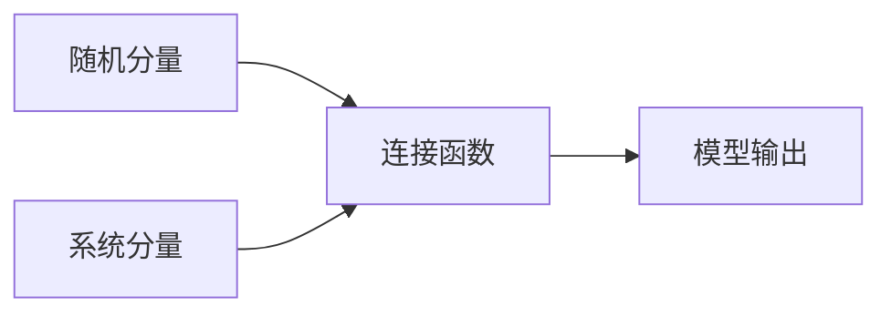

# GLM原理与代码实例讲解

## 1. 背景介绍

广义线性模型（Generalized Linear Model，简称GLM）是统计学中用于数据分析的一种灵活的模型框架，它推广了传统的线性模型，允许响应变量的概率分布属于指数分布族，而不仅仅是正态分布。GLM在多个领域都有广泛应用，包括医学、生物统计、工程和社会科学等。

## 2. 核心概念与联系

GLM由三个主要组成部分构成：随机分量、系统分量和连接函数。随机分量指的是响应变量的概率分布，系统分量则是解释变量的线性组合，连接函数是随机分量的均值与系统分量之间的桥梁。



## 3. 核心算法原理具体操作步骤

GLM的建模过程包括以下步骤：

1. 选择合适的概率分布来描述响应变量。
2. 确定解释变量的线性组合。
3. 选择一个连接函数将响应变量的均值与解释变量的线性组合相连。
4. 使用最大似然估计或者拟合优度来估计模型参数。
5. 对模型进行诊断和验证。

## 4. 数学模型和公式详细讲解举例说明

GLM的数学表达式可以写为：

$$
g(\mu) = \beta_0 + \beta_1X_1 + \beta_2X_2 + ... + \beta_pX_p
$$

其中，$g(\cdot)$ 是连接函数，$\mu$ 是响应变量的均值，$\beta_0, \beta_1, ..., \beta_p$ 是模型参数，$X_1, X_2, ..., X_p$ 是解释变量。

例如，对于二项分布的响应变量，可以使用逻辑斯蒂连接函数：

$$
g(\mu) = \log\left(\frac{\mu}{1-\mu}\right)
$$

## 5. 项目实践：代码实例和详细解释说明

以Python中的`statsmodels`库为例，我们可以使用以下代码来拟合一个GLM：

```python
import statsmodels.api as sm

# 假设data是一个pandas DataFrame，包含响应变量y和解释变量X
X = data[['X1', 'X2', 'X3']]
y = data['y']

# 添加截距项
X = sm.add_constant(X)

# 指定二项分布和逻辑斯蒂连接函数
glm_binom = sm.GLM(y, X, family=sm.families.Binomial())

# 拟合模型
res = glm_binom.fit()

# 输出模型摘要
print(res.summary())
```

## 6. 实际应用场景

GLM可以应用于多种场景，如：

- 医学研究中的疾病风险评估
- 金融领域的信用评分模型
- 工程领域的可靠性分析
- 社会科学中的调查数据分析

## 7. 工具和资源推荐

- `statsmodels`：Python中的统计建模库，提供了GLM的实现。
- `R`语言：广泛用于统计分析，拥有强大的GLM功能。
- `SAS/STAT`：商业统计软件，提供了丰富的GLM过程。

## 8. 总结：未来发展趋势与挑战

GLM作为一种成熟的统计模型，其理论基础已经非常扎实。未来的发展趋势可能会集中在如何更好地处理大数据、提高计算效率、以及如何结合机器学习方法来提升模型的预测能力。挑战则包括如何处理高维数据、避免过拟合以及如何解释复杂模型。

## 9. 附录：常见问题与解答

- Q: GLM与线性回归有何不同？
- A: 线性回归假设响应变量正态分布，而GLM允许响应变量属于指数分布族。

- Q: 如何选择合适的连接函数？
- A: 连接函数的选择通常基于响应变量的分布和实际问题的需求。

- Q: GLM的参数估计方法有哪些？
- A: 最常用的是最大似然估计，也可以使用贝叶斯方法或者准似然方法。

作者：禅与计算机程序设计艺术 / Zen and the Art of Computer Programming