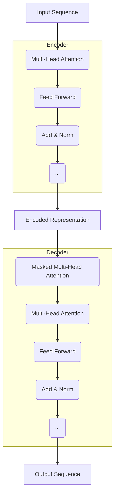

# GPT-4原理与代码实例讲解

## 1. 背景介绍

自然语言处理(NLP)是人工智能领域中一个非常活跃和富有成效的研究方向。近年来,大型语言模型(Large Language Model, LLM)取得了令人瞩目的进展,尤其是OpenAI公司推出的GPT(Generative Pre-trained Transformer)系列模型,在自然语言生成、理解、翻译、问答等任务上展现出了强大的能力。

GPT-4作为GPT系列的最新成员,是一个多模态大型语言模型,不仅能够处理文本数据,还能够处理图像、视频等非结构化数据。它在自然语言理解、推理、多任务综合能力等方面都有了突破性的提升,被誉为"通用人工智能"(Artificial General Intelligence, AGI)的一个重要里程碑。

本文将深入探讨GPT-4模型的核心原理、算法细节、数学模型以及代码实现,旨在为读者提供全面的理解和实践指导。

## 2. 核心概念与联系

### 2.1 自注意力机制(Self-Attention)

自注意力机制是Transformer模型的核心,它能够捕捉输入序列中任意两个位置之间的关系,从而更好地建模长距离依赖关系。相比于RNN和CNN,自注意力机制并行计算,更高效且不受输入长度的限制。

自注意力机制的计算过程如下:

1. 线性投影: 将输入序列 $X$ 分别投影到查询(Query)、键(Key)和值(Value)空间,得到 $Q$、$K$、$V$。
2. 相似度计算: 计算查询 $Q$ 与所有键 $K$ 的相似度,得到注意力分数 $\alpha$。
3. 加权求和: 将注意力分数 $\alpha$ 与值 $V$ 进行加权求和,得到注意力输出 $Z$。

数学表示为:

$$\begin{aligned}
Q &= XW_Q \\
K &= XW_K \\
V &= XW_V \\
\alpha &= \text{softmax}(\frac{QK^T}{\sqrt{d_k}}) \\
Z &= \alpha V
\end{aligned}$$

其中, $W_Q$、$W_K$、$W_V$ 为可学习的投影矩阵, $d_k$ 为缩放因子。

### 2.2 Transformer 编码器-解码器架构

Transformer 采用了编码器-解码器架构,用于序列到序列(Seq2Seq)任务,如机器翻译、文本生成等。

编码器的作用是将输入序列 $X$ 映射到连续的表示 $Z$,解码器则根据 $Z$ 生成输出序列 $Y$。编码器和解码器都由多层自注意力和前馈网络组成,通过残差连接和层归一化实现更好的梯度传播。

此外,解码器还引入了"掩码"(Mask)机制,确保在生成每个标记时,只依赖于输入序列和已生成的标记,而不会违反因果关系。

### 2.3 GPT 模型

GPT(Generative Pre-trained Transformer)是一种基于 Transformer 解码器的自回归语言模型,专门用于生成任务。它通过掩码自注意力机制,在生成每个标记时,只依赖于之前生成的标记序列。

GPT 模型先在大量无监督文本数据上进行预训练,获得通用的语言表示能力。然后,可以在特定任务上进行少量的微调(Fine-tuning),快速适应新的数据分布,实现多种自然语言生成应用。

GPT 系列模型规模越来越大,从最初的 GPT(1.5 亿参数)到 GPT-2(15 亿参数)、GPT-3(1750 亿参数),再到 GPT-4(超过 1 万亿参数),模型能力不断提升。

### 2.4 GPT-4 的创新点

相较于前代 GPT 模型,GPT-4 在以下几个方面有了重大突破:

1. **多模态**: 除了文本数据,GPT-4 还能够处理图像、视频等非结构化数据,实现了真正的多模态学习。
2. **推理能力增强**: GPT-4 在推理、分析、解决问题等方面的能力有了大幅提升,更接近人类水平。
3. **安全性和可控性**: GPT-4 采用了多种策略来提高模型的安全性和可控性,减少有害输出。
4. **泛化能力增强**: GPT-4 在看不见的任务上的泛化能力更强,能够更好地应对新的场景和数据分布。

## 3. 核心算法原理具体操作步骤

### 3.1 GPT-4 预训练

GPT-4 的预训练过程包括以下几个关键步骤:

1. **数据收集和预处理**: 收集大量的文本、图像、视频等多模态数据,进行必要的清洗和标注。
2. **词元化(Tokenization)**: 将文本数据转换为词元(Token)序列,图像和视频则转换为像素值序列。
3. **数据扩增**: 通过各种数据扩增技术(如随机裁剪、旋转等)生成更多的训练样本。
4. **模型初始化**: 初始化 GPT-4 的 Transformer 编码器-解码器模型参数。
5. **自监督预训练**: 在多模态数据上进行自监督学习,优化模型参数。常用的预训练目标包括:
   - 掩码语言模型(Masked Language Modeling, MLM): 预测被掩码的词元。
   - 图像文本对应(Image-Text Matching): 判断图像和文本描述是否匹配。
   - 视频文本生成(Video Caption Generation): 根据视频生成文本描述。
6. **模型保存**: 保存预训练好的 GPT-4 模型参数,用于后续的微调和部署。

### 3.2 GPT-4 微调

在特定任务上使用 GPT-4 时,需要进行微调(Fine-tuning)以适应新的数据分布。微调的基本步骤如下:

1. **准备任务数据**: 收集并预处理目标任务的训练数据,如机器翻译的平行语料、问答对等。
2. **加载预训练模型**: 加载预训练好的 GPT-4 模型参数。
3. **构建微调模型**: 根据任务需求,设计合适的输入表示、损失函数和训练策略。
4. **模型微调**: 在任务数据上进行有监督训练,优化 GPT-4 的模型参数。
5. **模型评估**: 在验证集或测试集上评估微调后模型的性能。
6. **模型部署**: 将微调好的模型部署到生产环境中,提供实际服务。

通过微调,GPT-4 可以快速适应新的任务,发挥出强大的泛化能力。

### 3.3 GPT-4 生成

在实际应用中,GPT-4 常用于自然语言生成任务。生成过程可以概括为:

1. **输入编码**: 将生成任务的上下文信息(如问题描述)编码为 GPT-4 可以理解的表示。
2. **上下文注意力**: GPT-4 模型根据编码后的上下文信息,计算注意力分布。
3. **自回归生成**: 基于注意力分布和已生成的标记,自回归地预测下一个最可能的标记。
4. **结果解码**: 将生成的标记序列解码为最终的自然语言输出。
5. **后处理(可选)**: 对生成结果进行必要的后处理,如去重、过滤有害内容等。

在生成过程中,GPT-4 会综合利用上下文信息和自身的语言知识,生成流畅、连贯、相关的自然语言输出。

## 4. 数学模型和公式详细讲解举例说明

### 4.1 自注意力计算

回顾一下自注意力机制的数学表示:

$$\begin{aligned}
Q &= XW_Q \\
K &= XW_K \\
V &= XW_V \\
\alpha &= \text{softmax}(\frac{QK^T}{\sqrt{d_k}}) \\
Z &= \alpha V
\end{aligned}$$

其中, $X \in \mathbb{R}^{n \times d}$ 为输入序列, $n$ 为序列长度, $d$ 为特征维度。$W_Q$、$W_K$、$W_V \in \mathbb{R}^{{d \times d_k}$ 为可学习的投影矩阵, $d_k$ 为缩放因子。

我们以一个简单的例子来说明自注意力的计算过程:

假设输入序列为 $X = \begin{bmatrix} x_1 \\ x_2 \\ x_3 \end{bmatrix}$, 其中 $x_i \in \mathbb{R}^d$ 为 $d$ 维向量。令 $d_k = 2$, 投影矩阵为:

$$W_Q = W_K = W_V = \begin{bmatrix}
1 & 0 \\
0 & 1
\end{bmatrix}$$

则查询 $Q$、键 $K$ 和值 $V$ 为:

$$\begin{aligned}
Q &= \begin{bmatrix}
x_1 & x_1 \\
x_2 & x_2 \\
x_3 & x_3
\end{bmatrix} \\
K &= \begin{bmatrix}
x_1 & x_1 \\
x_2 & x_2 \\
x_3 & x_3
\end{bmatrix} \\
V &= \begin{bmatrix}
x_1 & x_1 \\
x_2 & x_2 \\
x_3 & x_3
\end{bmatrix}
\end{aligned}$$

计算 $Q$ 与 $K^T$ 的点积,得到相似度矩阵:

$$QK^T = \begin{bmatrix}
x_1^Tx_1 & x_1^Tx_2 & x_1^Tx_3 \\
x_2^Tx_1 & x_2^Tx_2 & x_2^Tx_3 \\
x_3^Tx_1 & x_3^Tx_2 & x_3^Tx_3
\end{bmatrix}$$

对相似度矩阵进行缩放和 softmax 操作,得到注意力分数矩阵 $\alpha$:

$$\alpha = \text{softmax}(\frac{1}{\sqrt{2}}QK^T)$$

最后,将注意力分数 $\alpha$ 与值 $V$ 进行加权求和,得到自注意力的输出 $Z$:

$$Z = \alpha V$$

通过上述计算,输入序列 $X$ 的每个位置都能够关注到其他所有位置的信息,从而建模长距离依赖关系。

### 4.2 Transformer 模型

Transformer 模型由多个编码器层和解码器层组成,每一层都包含多头自注意力(Multi-Head Attention)和前馈网络(Feed Forward Network)。

多头自注意力的计算公式为:

$$\begin{aligned}
\text{MultiHead}(Q, K, V) &= \text{Concat}(head_1, \dots, head_h)W^O \\
\text{where } head_i &= \text{Attention}(QW_i^Q, KW_i^K, VW_i^V)
\end{aligned}$$

其中, $W_i^Q$、$W_i^K$、$W_i^V$ 和 $W^O$ 为可学习的投影矩阵, $h$ 为头数。通过多头机制,模型可以从不同的子空间捕捉不同的关注模式。

前馈网络的计算公式为:

$$\text{FFN}(x) = \max(0, xW_1 + b_1)W_2 + b_2$$

其中, $W_1$、$W_2$、$b_1$、$b_2$ 为可学习的参数,实现了非线性映射。

在 Transformer 的每一层中,输出都会经过残差连接和层归一化,以保持梯度的稳定性:

$$\begin{aligned}
\text{output} &= \text{LayerNorm}(x + \text{Sublayer}(x)) \\
\text{where Sublayer} &= \text{MultiHea