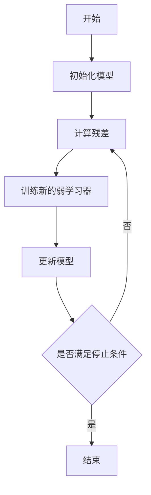

# Gradient Boosting 原理与代码实战案例讲解

## 1. 背景介绍
在机器学习领域，提升方法（Boosting）是一种强大的学习算法，用于解决分类和回归问题。Gradient Boosting是提升方法的一种，它通过结合多个弱学习器，通常是决策树，来构建一个更强大的模型。Gradient Boosting模型在多个数据科学竞赛和实际应用中展现出了卓越的性能，成为了预测分析的重要工具。

## 2. 核心概念与联系
Gradient Boosting的核心在于逐步构建模型，每一步都在尝试减少前一步模型的残差。这个过程可以用以下的Mermaid流程图表示：



在这个过程中，每一步都是在优化一个损失函数，这与梯度下降法的思想相似，因此得名“Gradient Boosting”。

## 3. 核心算法原理具体操作步骤
Gradient Boosting算法的操作步骤如下：

1. 初始化模型为一个常数值。
2. 计算残差，即当前模型预测与真实值之间的差异。
3. 训练一个新的弱学习器，以拟合当前的残差。
4. 将这个弱学习器的预测结果乘以一个学习率参数，然后添加到现有模型中。
5. 重复步骤2-4，直到达到预定的迭代次数或模型性能不再显著提升。

## 4. 数学模型和公式详细讲解举例说明
Gradient Boosting的数学模型基于以下公式：

$$ F_{m}(x) = F_{m-1}(x) + \gamma_m h_m(x) $$

其中，$ F_{m}(x) $ 是第m步的模型，$ h_m(x) $ 是第m个弱学习器的预测，$ \gamma_m $ 是学习率。

损失函数L的梯度可以表示为：

$$ g_m = -\frac{\partial L(y, F(x))}{\partial F(x)} $$

在每一步，我们训练一个弱学习器$h_m(x)$来拟合这个梯度。

## 5. 项目实践：代码实例和详细解释说明
以下是使用Python中的scikit-learn库实现Gradient Boosting的一个简单例子：

```python
from sklearn.ensemble import GradientBoostingRegressor
from sklearn.datasets import make_regression
from sklearn.model_selection import train_test_split

# 生成模拟数据
X, y = make_regression(n_samples=1000, n_features=100, noise=0.1)

# 划分训练集和测试集
X_train, X_test, y_train, y_test = train_test_split(X, y, test_size=0.2)

# 创建Gradient Boosting模型
gbr = GradientBoostingRegressor(n_estimators=100, learning_rate=0.1, max_depth=3)

# 训练模型
gbr.fit(X_train, y_train)

# 预测测试集
y_pred = gbr.predict(X_test)
```

在这个例子中，`GradientBoostingRegressor`是一个回归模型，`n_estimators`参数设置了弱学习器的数量，`learning_rate`设置了学习率，`max_depth`设置了每个决策树的最大深度。

## 6. 实际应用场景
Gradient Boosting在许多领域都有应用，包括但不限于金融风险评估、生物信息学、网络安全、推荐系统等。

## 7. 工具和资源推荐
- scikit-learn：一个广泛使用的Python机器学习库，包含了Gradient Boosting的实现。
- XGBoost：一个优化的分布式梯度提升库，能够在Gradient Boosting的基础上提供更快的性能和更好的可扩展性。
- LightGBM：由Microsoft开发的一个快速、分布式、高性能的梯度提升（GBDT、GBRT、GBM）框架。

## 8. 总结：未来发展趋势与挑战
Gradient Boosting作为一种强大的机器学习算法，其未来的发展趋势在于进一步提升性能、降低计算成本、增强模型的可解释性。同时，如何避免过拟合、如何处理大规模数据集等，也是Gradient Boosting面临的挑战。

## 9. 附录：常见问题与解答
Q1: Gradient Boosting如何防止过拟合？
A1: 通过设置适当的学习率、限制弱学习器的复杂度（如决策树的深度）、引入子采样等方法可以帮助防止过拟合。

Q2: Gradient Boosting和Random Forest有什么区别？
A2: Gradient Boosting是逐步构建模型，每一步都在减少前一步的残差；而Random Forest是并行构建多个决策树，然后进行投票或平均。

作者：禅与计算机程序设计艺术 / Zen and the Art of Computer Programming