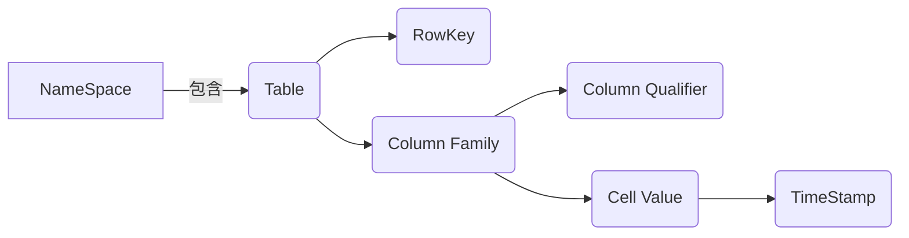

好的,我会严格遵循您提供的约束条件,以《HBase原理与代码实例讲解》为题,撰写一篇专业的技术博客文章。

# HBase原理与代码实例讲解

## 1.背景介绍

### 1.1 大数据时代的到来

随着互联网、移动互联网、物联网的飞速发展,海量的结构化和非结构化数据不断产生和积累。传统的关系型数据库已经无法满足存储和处理如此庞大数据量的需求,大数据时代应运而生。大数据技术应用于各行各业,为企业带来了新的商业价值和竞争优势。

### 1.2 大数据存储的挑战

大数据存储面临着数据量大、种类多、增长快等挑战。关系型数据库在处理海量数据时,读写性能、扩展能力、容错能力等方面都存在瓶颈。分布式文件系统HDFS虽然能存储大规模数据,但只能进行批量的顺序读写操作,无法支持实时的随机读写访问。

### 1.3 HBase的诞生

为解决大数据场景下的实时随机读写需求,HBase应运而生。HBase是建立在HDFS之上的分布式、面向列存储的数据库,具有高可靠性、高性能、可伸缩、易扩展等特点,非常适合于存储和查询海量数据。HBase继承了Google的BigTable理念和设计,是开源社区活跃的大数据存储利器。

## 2.核心概念与联系



### 2.1 NameSpace

命名空间是HBase逻辑上的命名区间,用于对表进行分组和隔离。每个命名空间下可以创建多个表。

### 2.2 Table

表是HBase中存储数据的基本单元,由多行数据组成。表按行键(RowKey)的字典序排列,支持按范围进行扫描。

### 2.3 RowKey

行键是用来对存储单元进行唯一标识的主键,访问HBase中的数据,都需要先定位到RowKey。RowKey的设计直接影响到数据的分布和查询效率。

### 2.4 Column Family

列族是列的逻辑分组,同一列族下的所有列都存储在同一个文件中。列族需要在创建表时指定,并且创建后不能修改。

### 2.5 Column Qualifier

列限定符是列的名称,用于唯一标识同一列族下的某一列。

### 2.6 Cell Value

单元格值就是存储的数据内容,是字节数组的形式。

### 2.7 TimeStamp

时间戳是HBase中数据版本化的体现。每个单元格的值都是由行键、列族、列限定符和时间戳这四个维度唯一确定的。

## 3.核心算法原理具体操作步骤  

HBase的核心算法主要包括数据模型、存储机制、读写流程等几个方面。

### 3.1 数据模型

HBase的数据模型借鉴了Google的BigTable设计思想,使用三维稀疏、持久、分布式的多维度排序映射表来存储数据。

1. 行键(Row Key)按字典序排序。
2. 列族(Column Family)按字典序排序。
3. 列限定符(Column Qualifier)按字典序排序。
4. 时间戳(Timestamp)按降序排序。

这种多维度设计,使得HBase具有高性能的随机读写能力。

### 3.2 存储机制

HBase的存储机制主要包括MemStore、HFile、WAL等几个部分。

#### 3.2.1 MemStore

MemStore是写缓存,接收系统的所有数据更新操作,将数据保存在内存中。当MemStore达到一定阈值时,就会被刷写到HFile。

#### 3.2.2 WAL(Write Ahead Log)

WAL是预写日志,所有对MemStore的数据操作,都会先记录在WAL中,用于数据的容错和恢复。

#### 3.2.3 HFile

HFile是HBase的持久化数据存储格式,存储在HDFS上。一个HFile就对应MemStore中的一个数据段。HFile中的数据是持久化的、只读的。

#### 3.2.4 BlockCache

BlockCache是读缓存,用于缓存频繁读取的数据块,提高读取性能。

### 3.3 读数据流程

1. 客户端发起Get/Scan请求。
2. 先查找MemStore,如果有则直接返回。
3. 如果MemStore没有,则查找BlockCache。
4. 如果BlockCache没有,则从HFile中读取。

### 3.4 写数据流程 

1. 客户端发起Put请求。
2. 先写入MemStore和WAL。
3. 当MemStore达到刷写阈值时,将MemStore刷写为一个新的HFile。
4. 将新的HFile合并到已有的HFile中,形成一个大的HFile。

### 3.5 Region Split

为了支持数据的动态扩展,HBase会根据数据量自动对表进行拆分,拆分为多个Region。每个Region都是一个独立的存储单元,拥有完整的数据结构。

## 4.数学模型和公式详细讲解举例说明

HBase中有一些核心的数学模型和公式,对系统的性能和扩展性有很大影响。

### 4.1 数据分布公式

HBase中的数据是通过RowKey进行分布的,分布策略遵循下面的公式:

$$region = hash(rowkey) \bmod R$$

其中,R是当前表的Region数量。这个公式保证了数据在Region上的均匀分布。

### 4.2 读放大问题

HBase在读取数据时,可能会发生读放大(Read Amplification)的问题,导致实际读取的数据量远大于需求量。读放大程度可以用下面公式表示:

$$读放大率 = \frac{实际读取的数据量}{需求读取的数据量}$$

如果读放大率过高,会严重影响读取性能。解决读放大的关键是优化RowKey和列族的设计。

### 4.3 写放大问题  

类似地,HBase在写入数据时也可能发生写放大(Write Amplification)的问题,导致实际写入的数据量远大于需求量。写放大率可以用下面公式表示:

$$写放大率 = \frac{实际写入的数据量}{需求写入的数据量}$$

写放大的主要原因是MemStore刷写、HFile合并等操作。解决写放大的方法包括优化写入模式、调整配置参数等。

### 4.4 Region分裂公式

HBase会根据数据量自动对表进行拆分,形成多个Region。Region分裂的阈值可以用下面公式表示:

$$Region大小 > max(region\_max\_filesize, region\_split\_policy)$$

其中,region_max_filesize和region_split_policy是可配置的参数,用于控制Region的大小上限。合理设置这些参数,可以优化Region分裂的效率。

## 5.项目实践:代码实例和详细解释说明

为了更好地理解HBase的使用,我们通过一个实际的项目案例来演示HBase的基本操作。

### 5.1 环境准备

本案例使用HBase 2.4.9版本,运行在Hadoop 3.3.1集群环境中。首先需要启动Hadoop和HBase集群服务。

```bash
# 启动Hadoop集群
start-dfs.sh
start-yarn.sh

# 启动HBase集群
start-hbase.sh
```

### 5.2 创建表

使用HBase Shell命令行工具,我们创建一个名为"access_log"的表,包含两个列族"info"和"stats"。

```java
hbase> create 'access_log', 'info', 'stats'
```

### 5.3 插入数据

接下来,我们使用Java API向表中插入一些示例数据。

```java
import org.apache.hadoop.conf.Configuration;
import org.apache.hadoop.hbase.HBaseConfiguration;
import org.apache.hadoop.hbase.TableName;
import org.apache.hadoop.hbase.client.*;
import org.apache.hadoop.hbase.util.Bytes;

import java.io.IOException;

public class HBaseExample {
    public static void main(String[] args) throws IOException {
        Configuration config = HBaseConfiguration.create();
        Connection connection = ConnectionFactory.createConnection(config);
        Table table = connection.getTable(TableName.valueOf("access_log"));

        // 插入一行数据
        Put put = new Put(Bytes.toBytes("row1"));
        put.addColumn(Bytes.toBytes("info"), Bytes.toBytes("user_id"), Bytes.toBytes("user123"));
        put.addColumn(Bytes.toBytes("info"), Bytes.toBytes("timestamp"), Bytes.toBytes(System.currentTimeMillis()));
        put.addColumn(Bytes.toBytes("stats"), Bytes.toBytes("bytes_sent"), Bytes.toBytes(1024));
        table.put(put);

        // 插入另一行数据
        put = new Put(Bytes.toBytes("row2"));
        put.addColumn(Bytes.toBytes("info"), Bytes.toBytes("user_id"), Bytes.toBytes("user456"));
        put.addColumn(Bytes.toBytes("info"), Bytes.toBytes("timestamp"), Bytes.toBytes(System.currentTimeMillis()));
        put.addColumn(Bytes.toBytes("stats"), Bytes.toBytes("bytes_sent"), Bytes.toBytes(2048));
        table.put(put);

        table.close();
        connection.close();
    }
}
```

这段代码首先创建HBase连接,然后构造Put对象,并设置行键、列族、列限定符和值,最后调用put方法将数据插入到表中。

### 5.4 查询数据

使用Scan操作,我们可以遍历表中的所有数据。

```java
import org.apache.hadoop.conf.Configuration;
import org.apache.hadoop.hbase.HBaseConfiguration;
import org.apache.hadoop.hbase.TableName;
import org.apache.hadoop.hbase.client.*;
import org.apache.hadoop.hbase.util.Bytes;

import java.io.IOException;

public class HBaseScanExample {
    public static void main(String[] args) throws IOException {
        Configuration config = HBaseConfiguration.create();
        Connection connection = ConnectionFactory.createConnection(config);
        Table table = connection.getTable(TableName.valueOf("access_log"));

        Scan scan = new Scan();
        ResultScanner scanner = table.getScanner(scan);
        for (Result result : scanner) {
            System.out.println("Row Key: " + Bytes.toString(result.getRow()));
            for (Cell cell : result.rawCells()) {
                System.out.println("Column Family: " + Bytes.toString(CellUtil.cloneFamily(cell)));
                System.out.println("Column Qualifier: " + Bytes.toString(CellUtil.cloneQualifier(cell)));
                System.out.println("Value: " + Bytes.toString(CellUtil.cloneValue(cell)));
                System.out.println("Timestamp: " + cell.getTimestamp());
            }
            System.out.println("-------------------");
        }
        scanner.close();
        table.close();
        connection.close();
    }
}
```

这段代码创建Scan对象,并使用getScanner方法获取ResultScanner。然后遍历ResultScanner,输出每一行数据的行键、列族、列限定符、值和时间戳。

### 5.5 删除数据

我们可以使用Delete对象删除指定的行或列数据。

```java
import org.apache.hadoop.conf.Configuration;
import org.apache.hadoop.hbase.HBaseConfiguration;
import org.apache.hadoop.hbase.TableName;
import org.apache.hadoop.hbase.client.*;
import org.apache.hadoop.hbase.util.Bytes;

import java.io.IOException;

public class HBaseDeleteExample {
    public static void main(String[] args) throws IOException {
        Configuration config = HBaseConfiguration.create();
        Connection connection = ConnectionFactory.createConnection(config);
        Table table = connection.getTable(TableName.valueOf("access_log"));

        // 删除一行数据
        Delete delete = new Delete(Bytes.toBytes("row1"));
        table.delete(delete);

        // 删除一列数据
        delete = new Delete(Bytes.toBytes("row2"));
        delete.addColumn(Bytes.toBytes("stats"), Bytes.toBytes("bytes_sent"));
        table.delete(delete);

        table.close();
        connection.close();
    }
}
```

这段代码首先创建Delete对象,并设置要删除的行键。如果要删除整行数据,直接调用table.delete(delete)即可。如果要删除某一列的数据,需要先调用delete.addColumn指定列族和列限定符,然后再执行删除操作。

## 6.实际应用场景

HBase作为一种高性能的分布式列存储数据库,在各个领域都有广泛的应用场景。

### 6.1 物联网数据存储

在物联网领域,大量的传感器设备会不断产生海量的时序数据。HBase非常适合存储这种按时间戳排序的、持续增长的数据,可以高效地进行随机读写操作。

### 6.2 网站访问日志分析

网站的访问日志是一种典型的大数据场景。HBase可以高效地存储和查询这些访问日志数据,为