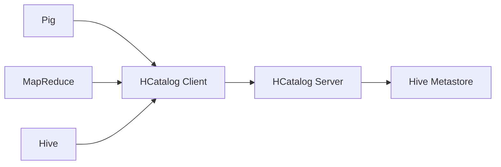

# HCatalog Table原理与代码实例讲解

## 1. 背景介绍

### 1.1 大数据处理的痛点

在大数据时代,企业需要处理海量的结构化、半结构化和非结构化数据。传统的数据处理方式难以应对如此庞大的数据量,面临着存储容量不足、处理效率低下、数据管理混乱等诸多挑战。Hadoop作为开源的分布式计算平台,为大数据处理提供了新的思路。

### 1.2 Hadoop生态系统概述

Hadoop生态系统包括HDFS分布式文件系统、MapReduce分布式计算框架、HBase列式存储、Hive数据仓库等多个组件,共同构建了一个完整的大数据处理平台。其中,Hive作为构建在Hadoop之上的数据仓库工具,提供了类SQL查询语言HiveQL,大大简化了海量数据的查询和分析。

### 1.3 Hive与HCatalog

Hive将结构化的数据文件映射为一张数据库表,并提供HiveQL查询功能,但是底层数据存储在HDFS文件中。这就导致其他工具如Pig、MapReduce等在访问Hive表数据时,需要了解表的具体模式和HDFS路径,使用不便。

HCatalog应运而生,它提供了一个统一的元数据管理和表抽象机制,使得Pig、MapReduce等工具可以像Hive一样操作表,而不必关心底层数据的存储细节。HCatalog让不同的工具和框架可以更好地协同工作,极大地提升了Hadoop生态系统的易用性。

## 2. 核心概念与联系

### 2.1 Hive表

Hive表是结构化数据在HDFS上的映射,包含表名、字段名、字段类型、分隔符、数据存储路径等元数据信息。Hive支持内部表和外部表两种类型,内部表由Hive自己管理数据,外部表则只有表结构,数据由外部掌管。

### 2.2 HCatalog

HCatalog是Hadoop的表和存储管理服务,是Hive metastore的一个封装,它提供了一个统一的元数据接口,使得MapReduce、Pig、Hive等工具可以无缝共享数据。

HCatalog的架构如下:



HCatalog引入了一些核心概念:

- Table: 数据表,对应Hive表
- Partition: 分区,Hive表的分区
- Storage Handler: 存储处理器,用于读写不同格式的数据

### 2.3 Hive与HCatalog的关系

Hive metastore是Hive的元数据管理服务,而HCatalog是对Hive metastore的一个封装,对外提供统一的接口。可以说HCatalog是Hive metastore的一个代理。

Hive、Pig等都可以通过HCatalog访问Hive表,HCatalog简化了不同工具之间的数据共享和交互。

## 3. HCatalog Table原理

### 3.1 HCatalog Table概述

HCatalog Table是对Hive表的一个封装,它包含表的schema信息和底层HDFS数据路径。通过HCatalog可以像操作数据库表一样操作Hive表,而无需关心数据格式和存储细节。

### 3.2 HCatalog Table的创建

HCatalog支持以下几种方式创建表:

1. 纯HCatalog方式

```java
// 定义schema
HCatSchema schema = new HCatSchema(
    Lists.newArrayList(
        new HCatFieldSchema("id",Type.INT,null), 
        new HCatFieldSchema("name",Type.STRING,null)
    )
);

// 创建表
HCatCreateTableDesc tableDesc = new HCatCreateTableDesc("test_table", schema);
client.createTable(tableDesc);
```

2. 基于现有Hive表

```java
String dbName = "default";
String tableName = "test_table";
Table table = client.getTable(dbName, tableName);
```

3. 指定存储Handler

```java
HCatCreateTableDesc tableDesc = new HCatCreateTableDesc("test_table", schema, fileFormat, null);
Map<String, String> tblProps = new HashMap<String, String>();
tblProps.put(IOConstants.STORAGE_HANDLER, RCFileInputStorageHandler.class.getName());
tableDesc.setTblProps(tblProps);
client.createTable(tableDesc);
```

### 3.3 HCatalog Table的读写

1. 写入数据

```java
HCatSchema schema = new HCatSchema(
    Lists.newArrayList(
        new HCatFieldSchema("id",Type.INT,null), 
        new HCatFieldSchema("name",Type.STRING,null)
    )
);

HCatWriter writer = DataTransferFactory.getHCatWriter(
    ObjectSerializer.class.getName(), 
    conf, 
    "default", 
    "test_table",
    null
);

HCatRecord record = new DefaultHCatRecord(2);
record.set("id", 1);
record.set("name","Tom");
writer.write(record);
writer.close();
```

2. 读取数据

```java
HCatReader reader = DataTransferFactory.getHCatReader(
    "default", 
    "test_table", 
    null
);

HCatRecord record = null;
while ((record = reader.read()) != null) {
    System.out.println(record.getInteger("id"));
    System.out.println(record.getString("name"));
}
reader.close();
```

## 4. 数学模型和公式

HCatalog本身不涉及复杂的数学模型,主要是对Hive表的封装。但是在使用HCatalog进行数据分析时,可能会涉及一些常见的数学模型,如:

### 4.1 TF-IDF

TF-IDF(Term Frequency-Inverse Document Frequency)是一种用于信息检索和文本挖掘的常用加权技术。对于一个文档d,其TF-IDF值为:

$$
tfidf(t,d) = tf(t,d) * idf(t)
$$

其中,$tf(t,d)$表示词项t在文档d中出现的频率,$idf(t)$表示逆文档频率,用于衡量词项t的重要性:

$$
idf(t) = log(\frac{N}{df(t)})
$$

$N$为文档总数,$df(t)$为包含词项t的文档数。

### 4.2 协同过滤

协同过滤是常用的推荐算法,基本思想是利用用户的历史行为数据计算用户或物品之间的相似度,然后给用户推荐相似用户喜欢的或者与用户喜欢物品相似的物品。

用户u对物品i的评分预测公式为:

$$
r_{ui} = \frac{\sum_{v\in S(u,K)}sim(u,v)r_{vi}}{\sum_{v\in S(u,K)}sim(u,v)}
$$

其中,$S(u,K)$表示与用户u最相似的K个用户集合,$sim(u,v)$表示用户u和用户v的相似度。

## 5. 项目实践:代码实例

下面通过一个具体的代码实例来演示如何使用HCatalog操作Hive表。

### 5.1 创建Hive表

```sql
CREATE TABLE test_table (
    id int,
    name string
)
ROW FORMAT DELIMITED
FIELDS TERMINATED BY ',';
```

### 5.2 使用HCatalog写入数据

```java
public class HCatWriter {

    public static void main(String[] args) throws Exception {
        Configuration conf = new Configuration();
        HiveConf hiveConf = new HiveConf(conf, HiveConf.class);
        HCatClient client = HCatClient.create(hiveConf);
        
        HCatSchema schema = new HCatSchema(
            Lists.newArrayList(
                new HCatFieldSchema("id",Type.INT,null), 
                new HCatFieldSchema("name",Type.STRING,null)
            )
        );
        
        HCatWriter writer = DataTransferFactory.getHCatWriter(
            ObjectSerializer.class.getName(), 
            conf, 
            "default", 
            "test_table",
            null
        );
        
        HCatRecord record = new DefaultHCatRecord(2);
        record.set("id", 1);
        record.set("name","Tom");
        writer.write(record);
        
        record.set("id", 2);
        record.set("name", "Jerry");
        writer.write(record);
        
        writer.close();
        client.close();
    }
}
```

### 5.3 使用HCatalog读取数据

```java
public class HCatReader {
    
    public static void main(String[] args) throws Exception {
        Configuration conf = new Configuration();
        HiveConf hiveConf = new HiveConf(conf, HiveConf.class);
        HCatClient client = HCatClient.create(hiveConf);
        
        HCatReader reader = DataTransferFactory.getHCatReader(
            "default", 
            "test_table", 
            null
        );
        
        HCatRecord record = null;
        while ((record = reader.read()) != null) {
            System.out.println(record.getInteger("id"));
            System.out.println(record.getString("name"));
        }
        
        reader.close();
        client.close();
    }
}
```

## 6. 实际应用场景

HCatalog在实际的大数据项目中有广泛的应用,主要体现在以下几个方面:

### 6.1 数据共享与交换

不同的数据处理工具如Hive、Pig、MapReduce等可以通过HCatalog共享和交换数据,避免了数据的重复存储和转换,提高了效率。

### 6.2 数据仓库与分析

HCatalog可以作为数据仓库的元数据管理工具,与Hive、Impala等分析型数据库协同工作,为数据分析和挖掘提供数据支撑。

### 6.3 流式数据处理

HCatalog可以与Storm、Spark Streaming等流式计算框架集成,实现对实时数据流的处理和分析。通过HCatalog可以将计算结果写入Hive表,与离线数据结合进行综合分析。

## 7. 工具和资源推荐

### 7.1 HCatalog官方文档

官方文档是学习和使用HCatalog的权威资料,提供了完整的使用指南和API参考。

https://cwiki.apache.org/confluence/display/Hive/HCatalog

### 7.2 《Hadoop: The Definitive Guide》

经典的Hadoop学习著作,对Hadoop生态系统有全面深入的讲解,其中也包括了HCatalog的相关内容。

### 7.3 Hortonworks Sandbox

Hortonworks Sandbox是一个单节点的Hadoop学习环境,预装了HCatalog等多个大数据组件,可以快速搭建学习环境。

https://hortonworks.com/products/sandbox/

## 8. 总结:未来发展趋势与挑战

### 8.1 融合与统一

随着大数据平台的不断发展,各种不同的数据处理和分析工具层出不穷。HCatalog作为一个通用的数据共享和交换层,有望成为大数据生态圈的标准和规范,实现不同系统之间的无缝整合。

### 8.2 实时化

HCatalog目前主要用于离线数据的管理,如何适应实时数据处理的需求,与流式计算引擎更好地集成,是其面临的一个新的挑战和发展方向。

### 8.3 数据治理

大数据时代数据来源广泛、数据质量参差不齐,HCatalog在提供数据共享和管理的同时,如何强化数据质量控制,建立数据血缘、安全、审计等数据治理体系,也是一个亟待解决的问题。

## 9. 附录:常见问题与解答

### 9.1 HCatalog与Hive的关系是什么?

HCatalog是Hive Metastore的一个封装,对外提供统一的接口,使得其他工具可以像Hive一样操作表和数据。可以将HCatalog看作是Hive Metastore的一个代理。

### 9.2 HCatalog支持哪些文件格式?

HCatalog支持RCFile、ORCFile、Parquet、CSV、JSON等多种文件格式,可以通过InputFormat和OutputFormat接口扩展。

### 9.3 HCatalog能否支持Hive之外的其他数据源?

HCatalog当前主要用于管理Hive表,但是其设计是开放的,可以通过扩展StorageHandler接口,支持HBase、Accumulo等其他数据源。这也是HCatalog未来的一个发展方向。

作者：禅与计算机程序设计艺术 / Zen and the Art of Computer Programming