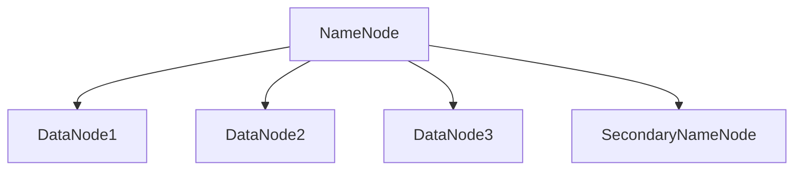
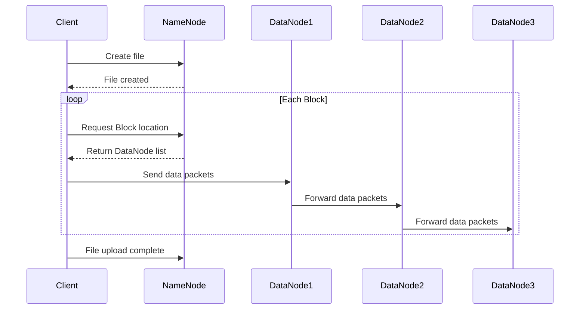
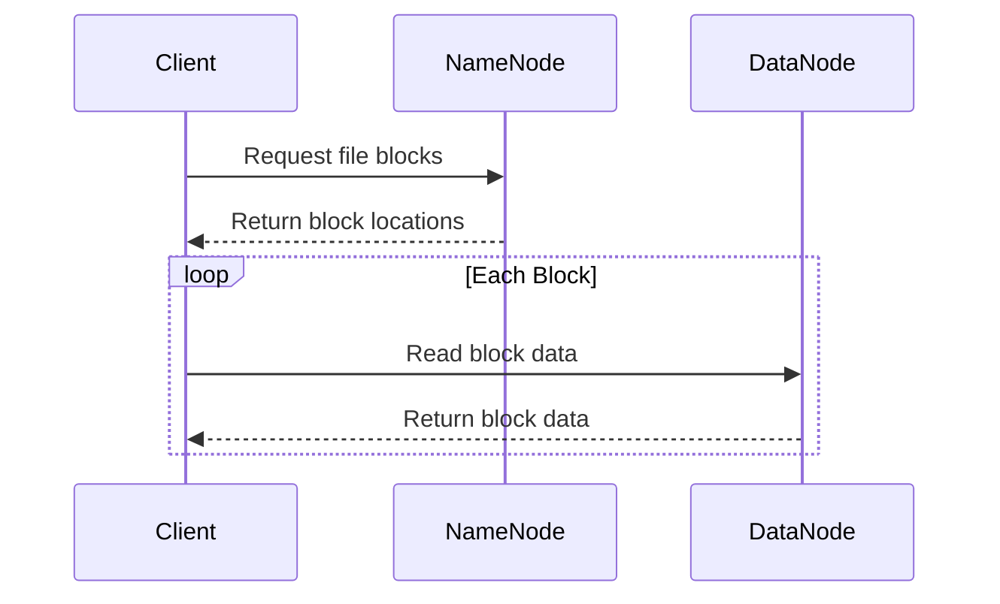

# HDFS原理与代码实例讲解

## 1. 背景介绍

### 1.1 大数据处理的挑战

在当今大数据时代,企业需要处理海量的数据。传统的数据存储和处理方式已经无法满足大数据处理的需求。面对TB、PB级别的海量数据,单台服务器的存储和计算能力是远远不够的。因此,迫切需要一种能够可靠存储海量数据、并能够横向扩展的分布式存储系统。

### 1.2 HDFS的诞生

HDFS(Hadoop Distributed File System)就是在这样的背景下诞生的。它是Hadoop生态系统中的重要组成部分,为上层的MapReduce、Hive、HBase等大数据处理框架和工具提供了高可靠、高吞吐、可扩展的底层分布式存储支持。

### 1.3 HDFS的定位

HDFS是一个适合存储大文件的分布式文件系统。它的设计目标是支持数据密集型的应用,而不是用户交互型应用。HDFS采用write-once-read-many的模型,数据集通常由数据源生成或拷贝,然后在此基础上进行各种分析。HDFS为数据提供了高吞吐量的访问,非常适合大规模数据集的应用。

## 2. 核心概念与联系

### 2.1 HDFS的架构

HDFS采用主/从(Master/Slave)架构模型。一个HDFS集群是由一个NameNode和若干个DataNode组成的。

- NameNode: 主节点,管理文件系统的命名空间,维护文件系统树及整棵树内所有的文件和目录。它还会保存每个文件中各个块所在的DataNode信息。

- DataNode: 在本地文件系统存储文件块数据,以及块数据的校验和。

- Secondary NameNode: 用来监控HDFS状态的辅助后台程序,每隔一段时间获取HDFS元数据的快照。



### 2.2 文件系统命名空间

HDFS支持传统的层次型文件组织结构。用户或应用程序可以创建目录,然后将文件保存在这些目录里。文件系统命名空间的层次结构和大多数现有的文件系统类似,用户可以创建、删除、移动或重命名文件。NameNode负责维护文件系统命名空间,记录对名称空间或其属性的任何更改。

### 2.3 数据复制

HDFS被设计成能在一个大集群中跨机器可靠地存储超大文件。它将每个文件存储成一系列的块,文件的所有块除了最后一个块以外,都是同样的大小。为保证容错,文件的各个块会有多个副本。块的大小和复制因子都是可配置的。应用程序可以指定文件的复制数目。复制的数量可在文件创建的时候指定,也可以在之后改变。

### 2.4 数据一致性模型

HDFS是设计成支持一次写入多次读取(write-once-read-many)访问模型。一个文件经过创建、写入和关闭之后就不需要改变了。这一假设简化了数据一致性问题,并且使高吞吐量的数据访问成为可能。

## 3. 核心算法原理具体操作步骤

### 3.1 写文件流程

1. 客户端将文件切分成块(Block),并通过RPC调用NameNode,在文件系统的命名空间中创建一个新文件。
2. NameNode检查文件是否已存在、客户端是否有创建文件的权限。如果校验通过,NameNode就会为文件创建一个新的条目,并返回一个成功信息给客户端。
3. 客户端请求上传第一个Block,NameNode为该Block返回一个DataNode列表,这些DataNode将会存储数据的副本。
4. 客户端将Block切分成小的数据包(Packet),并使用pipeline的方式依次传输到各个DataNode。
5. 当一个Block传输完成,客户端再次请求NameNode上传下一个Block。重复步骤3-5,直到文件所有Block传输完成。
6. 客户端告诉NameNode文件上传完成。如果NameNode收到了成功的确认,则将文件标记为已完成。



### 3.2 读文件流程

1. 客户端通过RPC调用NameNode,获取要读取文件的元数据信息,包括文件的Block列表以及每个Block的位置信息。
2. 对于每一个Block,NameNode返回存有该Block副本的DataNode地址。
3. 客户端直接联系DataNode读取Block的数据。如果该读取操作失败,客户端会尝试连接下一个拥有该Block副本的DataNode。
4. 一旦客户端读取到了整个文件的所有Block,或者应用程序结束读取,读取操作完成。



## 4. 数学模型和公式详细讲解举例说明

### 4.1 数据复制策略

HDFS采用数据复制的容错机制。每个文件的Block会有多个副本,默认复制因子是3。复制因子可以在文件创建时指定,也可以在后续修改。

设某个文件有 $n$ 个Block,复制因子为 $r$,则该文件在HDFS上总共存储的Block数为:

$$
Total\ Blocks = n \times r
$$

举例说明,假设一个100MB的文件,HDFS的Block大小设置为128MB,复制因子为3。则该文件在HDFS中实际占用的存储空间为:

$$
Storage\ Space = 100MB \times 3 = 300MB 
$$

### 4.2 Block的放置策略

为了最大限度地减少带宽消耗和读取延迟,HDFS采用机架感知(Rack Awareness)的Block放置策略。对于一个复制因子为3的文件,HDFS的放置策略是:

- 将一个副本放在上传文件的DataNode上。
- 将另一个副本放在与上传DataNode不同机架的另一个DataNode上。
- 将最后一个副本放在与第二个副本相同机架的另一个DataNode上。

这种策略可以减少机架间的写入流量,从而提高写入性能。同时,这种策略在读取数据时,可以从多个机架获取Block的副本,提高可靠性和读取性能。

假设集群有 $m$ 个机架,每个机架有 $n$ 个DataNode。根据上述策略,对于复制因子为3的Block,其所在的DataNode分布概率为:

- $P(同一机架) = \frac{2}{m} \times \frac{1}{n}$
- $P(不同机架) = \frac{m-1}{m} \times \frac{1}{n}$

其中, $P(同一机架)$ 表示两个副本位于同一机架的概率, $P(不同机架)$ 表示两个副本位于不同机架的概率。

## 5. 项目实践：代码实例和详细解释说明

下面通过Java代码示例,演示如何使用HDFS API进行文件的创建、写入和读取操作。

### 5.1 创建目录

```java
public void mkdir(String path) throws IOException {
  Path dirPath = new Path(path);
  FileSystem fs = FileSystem.get(URI.create(hdfsPath), conf);
  if (!fs.exists(dirPath)) {
    fs.mkdirs(dirPath);
    System.out.println("Create dir success: " + path);
  }
  fs.close();
}
```

说明:
- 首先创建一个Path对象,表示要创建的目录路径。 
- 通过FileSystem.get()方法获取HDFS文件系统的实例。
- 调用FileSystem的mkdirs()方法创建目录。
- 最后关闭FileSystem实例。

### 5.2 上传文件

```java
public void uploadFile(String localPath, String hdfsPath) throws IOException {
  Path srcPath = new Path(localPath);
  Path dstPath = new Path(hdfsPath);
  FileSystem fs = FileSystem.get(URI.create(hdfsPath), conf);
  fs.copyFromLocalFile(srcPath, dstPath);
  System.out.println("Upload to " + hdfsPath);
  fs.close();
}
```

说明:
- 创建源文件和目标文件的Path对象。
- 通过FileSystem的copyFromLocalFile()方法将本地文件上传到HDFS。

### 5.3 读取文件

```java
public void readFile(String hdfsFile) throws IOException {
  Path path = new Path(hdfsFile);
  FileSystem fs = FileSystem.get(URI.create(hdfsFile), conf);
  FSDataInputStream inputStream = fs.open(path);
  BufferedReader reader = new BufferedReader(new InputStreamReader(inputStream));
  String line;
  while ((line = reader.readLine()) != null) {
    System.out.println(line);
  }
  reader.close();
  inputStream.close();
  fs.close();
}
```

说明:
- 创建要读取的HDFS文件的Path对象。
- 通过FileSystem的open()方法打开文件的输入流FSDataInputStream。
- 将输入流包装成BufferedReader,然后逐行读取文件内容并打印。
- 关闭BufferedReader、FSDataInputStream和FileSystem。

## 6. 实际应用场景

HDFS在大数据领域有广泛的应用,下面列举几个典型的应用场景:

### 6.1 日志存储与分析

互联网公司每天会产生大量的日志数据,如用户访问日志、应用程序日志等。将这些日志数据存储在HDFS上,可以便于后续的离线批处理和分析。常见的日志分析任务包括用户行为分析、异常检测、安全审计等。

### 6.2 数据仓库与数据挖掘

企业可以将来自各个业务系统的数据统一存储在HDFS上,构建数据仓库。在此基础上,可以使用Hive、Spark SQL等工具进行数据分析和数据挖掘,支持OLAP查询、用户画像、个性化推荐等业务。

### 6.3 内容存储与分发

HDFS可以用于存储非结构化数据,如图片、视频、音频等。一些内容分发平台利用HDFS存储海量的多媒体资源,并结合CDN技术实现高效的内容分发。

### 6.4 备份与归档

HDFS的高容错、高可靠特性使其非常适合用于数据备份和归档。企业可以将业务数据定期备份到HDFS集群,既可以防止数据丢失,又可以节省本地存储空间。

## 7. 工具和资源推荐

### 7.1 HDFS常用工具

- HDFS Shell: HDFS提供的命令行工具,可以完成文件和目录的基本操作,如创建目录、上传/下载文件、查看文件内容等。

- HDFS UI: HDFS的Web管理界面,可以查看集群的状态信息,如NameNode概要、DataNode列表、文件目录结构等。

- DistCp: 一个用于大规模集群间复制的工具。它使用MapReduce实现文件分发,可以快速地将HDFS中的数据拷贝到另一个HDFS集群。

### 7.2 学习资源

- 官方文档: Apache Hadoop官网提供了详尽的用户文档和API文档,是学习和使用HDFS的权威资料。
- 书籍: 
  - 《Hadoop权威指南》: 详细介绍了Hadoop各个组件的原理和使用方法,是Hadoop入门的经典读物。
  - 《Hadoop技术内幕: 深入解析HDFS和MapReduce架构设计与实现原理》: 深入剖析了HDFS和MapReduce的架构设计和实现细节,适合进阶学习。
- 视频教程: 一些在线教育平台如Coursera、Udacity等,提供了优质的Hadoop视频课程,由业内大牛讲解Hadoop生态系统的原理和实践。

## 8. 总结：未来发展趋势与挑战

### 8.1 未来发展趋势

- 融合对象存储: HDFS与对象存储技术的融合已成为一个趋势。对象存储可以提供更高的扩展性和