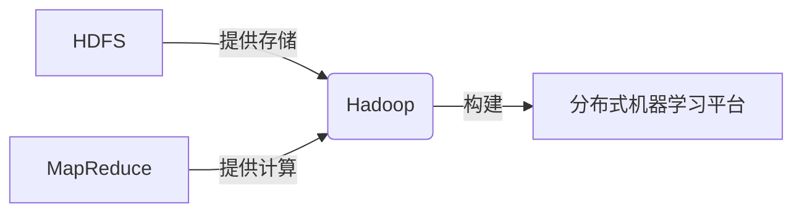
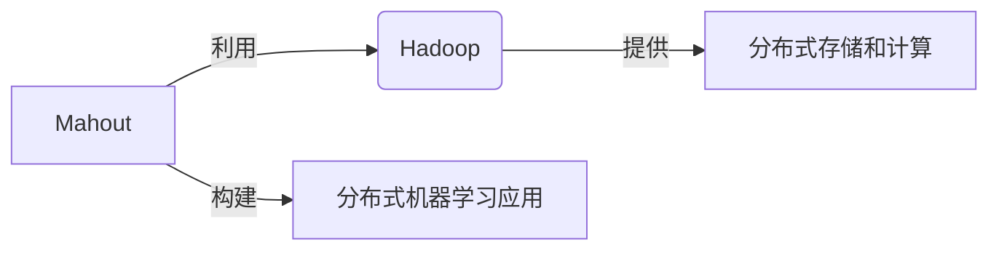

# Hadoop与Mahout：构建分布式机器学习平台

## 1.背景介绍

### 1.1 大数据时代的到来

随着互联网、物联网、社交媒体等技术的快速发展,数据的产生量正以前所未有的速度呈爆炸式增长。根据IDC(国际数据公司)的预测,到2025年,全球数据总量将达到175ZB(1ZB=1万亿TB)。这种海量的数据不仅体现在数据量的大小,还体现在数据种类的多样性和产生速度的快速性。传统的数据处理和分析方法已经无法满足当前的需求,迫切需要新的技术来解决大数据带来的挑战。

### 1.2 大数据处理的挑战

大数据给数据处理和分析带来了诸多挑战:

1. **数据量大**:海量的数据需要巨大的存储空间和计算能力。
2. **种类多样**:结构化数据(如关系数据库)、半结构化数据(如XML文件)和非结构化数据(如图像、视频)的混合。
3. **传输速率快**:数据产生和传输的速率非常快,需要实时处理。
4. **价值密度低**:有价值的数据往往被淹没在海量无用数据中。

### 1.3 大数据处理的需求

为了有效处理大数据,需要满足以下需求:

1. **可扩展性**:能够轻松扩展以处理更多数据。
2. **容错性**:能够自动容忍硬件故障而不影响整体运行。
3. **高吞吐量**:能够快速处理大量数据。
4. **低延迟**:对于某些应用,需要实时或近实时处理。

### 1.4 大数据生态系统

为了满足上述需求,出现了一系列大数据技术,构成了大数据生态系统。其中,Apache Hadoop是最著名的开源大数据处理平台,提供了分布式存储(HDFS)和分布式计算(MapReduce)能力。Apache Mahout则是基于Hadoop的机器学习和数据挖掘库,可以构建可扩展的机器学习应用程序。

## 2.核心概念与联系  

### 2.1 Hadoop

Apache Hadoop是一个开源的分布式系统基础架构,最初是为了解决大数据处理问题而设计的。它主要由两个核心组件组成:

1. **HDFS(Hadoop分布式文件系统)**:一个高度容错的分布式文件系统,可以在廉价的机器上可靠地存储大量数据。
2. **MapReduce**:一种编程模型,用于在大型集群上并行处理和生成大型数据集。

HDFS和MapReduce的结合使Hadoop能够可靠、高效地处理海量数据。

#### 2.1.1 HDFS

HDFS的设计目标是在低成本的硬件上提供高吞吐量的数据访问。它具有以下特点:

1. **高容错性**:通过数据块复制实现容错,可自动处理节点故障。
2. **高吞吐量**:通过并行处理数据块实现高吞吐量。
3. **大规模扩展**:简单地通过添加更多节点来扩展存储容量。

HDFS采用主从架构,由单个NameNode(名称节点)管理文件系统元数据,以及一组DataNode(数据节点)存储实际数据。

#### 2.1.2 MapReduce

MapReduce是一种编程模型,用于在大型集群上并行处理和生成大型数据集。它将计算过程分为两个阶段:Map(映射)和Reduce(归约)。

1. **Map阶段**:输入数据被拆分为独立的数据块,并行处理以生成键值对序列。
2. **Reduce阶段**:对Map阶段输出的键值对进行合并和归约操作。

MapReduce框架负责任务调度、监控和重新执行失败任务,从而实现高可用性和容错性。



### 2.2 Mahout

Apache Mahout是一个可扩展的机器学习和数据挖掘库,专门为分布式环境(如Apache Hadoop)设计。它支持多种机器学习算法,可用于聚类、分类、协同过滤、推荐等任务。

Mahout利用Hadoop的分布式计算能力,可以在大型数据集上高效地执行机器学习算法。它提供了以下主要功能:

1. **机器学习算法库**:包括聚类、分类、推荐、回归等多种算法。
2. **数据准备工具**:用于数据抽取、转换和加载(ETL)。
3. **评估工具**:用于评估算法性能和准确性。
4. **可扩展性**:可以轻松扩展以处理更大的数据集。

Mahout与Hadoop的结合,使得构建大规模分布式机器学习应用程序成为可能。



## 3.核心算法原理具体操作步骤

在本节中,我们将探讨Mahout中一些常用的机器学习算法的原理和具体操作步骤。

### 3.1 K-Means聚类

K-Means是一种常用的无监督聚类算法,旨在将数据划分为K个簇,使得每个数据点都属于离它最近的簇。算法的基本思想是通过迭代优化,不断调整簇的中心点,直到数据点不再发生簇的转移。

#### 3.1.1 算法原理

给定一个数据集 $D = \{x_1, x_2, \ldots, x_n\}$,其中 $x_i$ 是一个 $d$ 维向量,K-Means算法的目标是将数据划分为 $K$ 个簇 $C = \{C_1, C_2, \ldots, C_K\}$,使得以下目标函数最小化:

$$J = \sum_{j=1}^K \sum_{x_i \in C_j} \|x_i - \mu_j\|^2$$

其中 $\mu_j$ 是簇 $C_j$ 的质心(均值向量)。算法的步骤如下:

1. 随机选择 $K$ 个初始质心。
2. 对每个数据点 $x_i$,将其分配到与其最近的质心 $\mu_j$ 对应的簇 $C_j$。
3. 重新计算每个簇的质心 $\mu_j$,作为簇内所有点的均值。
4. 重复步骤2和3,直到质心不再发生变化或达到最大迭代次数。

#### 3.1.2 Mahout实现

在Mahout中,可以使用`org.apache.mahout.clustering.kmeans.KMeansDriver`类来执行K-Means聚类。具体步骤如下:

1. 准备输入数据,将其转换为Mahout可识别的向量格式。
2. 创建`KMeansDriver`对象,设置相关参数(如输入数据路径、输出路径、簇数量等)。
3. 调用`run()`方法执行聚类算法。
4. 使用`org.apache.mahout.clustering.display.DisplayClustering`类可视化聚类结果。

以下是一个示例代码片段:

```java
// 设置输入数据路径和输出路径
Path input = new Path("data/points/random-vectors");
Path output = new Path("output/kmeans");

// 创建KMeansDriver对象
KMeansDriver kmeans = new KMeansDriver();
kmeans.run(input, output, 0.001, 10, 10); // 设置参数

// 显示聚类结果
DisplayClustering display = new DisplayClustering();
display.printClusters(output, new int[] {2, 4});
```

### 3.2 协同过滤推荐

协同过滤是一种常用的推荐算法,通过分析用户之间的相似性或项目之间的相似性,为用户推荐感兴趣的项目。Mahout支持基于用户和基于项目的协同过滤算法。

#### 3.2.1 算法原理

假设我们有一个用户-项目评分矩阵 $R$,其中 $R_{ij}$ 表示用户 $i$ 对项目 $j$ 的评分。基于用户的协同过滤算法通过计算用户之间的相似性,为目标用户推荐与其相似用户喜欢的项目。基于项目的协同过滤算法则是计算项目之间的相似性,为用户推荐与其喜欢的项目相似的其他项目。

常用的相似性度量方法包括皮尔逊相关系数、余弦相似度等。以皮尔逊相关系数为例,用户 $u$ 和 $v$ 的相似度可表示为:

$$sim(u, v) = \frac{\sum_{i \in I}(R_{ui} - \overline{R_u})(R_{vi} - \overline{R_v})}{\sqrt{\sum_{i \in I}(R_{ui} - \overline{R_u})^2}\sqrt{\sum_{i \in I}(R_{vi} - \overline{R_v})^2}}$$

其中 $I$ 是用户 $u$ 和 $v$ 都评分过的项目集合, $\overline{R_u}$ 和 $\overline{R_v}$ 分别表示用户 $u$ 和 $v$ 的平均评分。

#### 3.2.2 Mahout实现

在Mahout中,可以使用`org.apache.mahout.cf.taste.impl.recommender`包中的类来实现协同过滤推荐。以基于用户的协同过滤为例,具体步骤如下:

1. 准备用户-项目评分数据,将其转换为Mahout可识别的`DataModel`格式。
2. 创建`UserSimilarity`对象,用于计算用户之间的相似度。
3. 创建`UserNeighborhood`对象,用于查找目标用户的相似用户集合。
4. 创建`UserBasedRecommender`对象,用于生成推荐。
5. 调用`recommend()`方法获取推荐结果。

以下是一个示例代码片段:

```java
// 创建DataModel
File file = new File("data/ratings.csv");
DataModel model = new FileDataModel(file);

// 计算用户相似度
UserSimilarity similarity = new PearsonCorrelationSimilarity(model);

// 创建UserNeighborhood对象
UserNeighborhood neighborhood = new NearestNUserNeighborhood(2, similarity, model);

// 创建UserBasedRecommender对象
UserBasedRecommender recommender = new GenericUserBasedRecommender(model, neighborhood, similarity);

// 获取推荐结果
List<RecommendedItem> recommendations = recommender.recommend(1, 3);
for (RecommendedItem item : recommendations) {
    System.out.println(item);
}
```

## 4.数学模型和公式详细讲解举例说明

在机器学习算法中,数学模型和公式扮演着重要的角色。本节将详细讲解一些常用的数学模型和公式,并给出具体的例子说明。

### 4.1 线性回归

线性回归是一种常用的监督学习算法,用于建立自变量和因变量之间的线性关系模型。给定一组数据 $(x_i, y_i)$,其中 $x_i$ 是自��量向量, $y_i$ 是因变量,线性回归模型可表示为:

$$y = \theta_0 + \theta_1x_1 + \theta_2x_2 + \ldots + \theta_nx_n$$

其中 $\theta_i$ 是模型参数,需要通过训练数据来估计。通常使用最小二乘法来求解参数,目标是最小化以下代价函数:

$$J(\theta) = \frac{1}{2m}\sum_{i=1}^m(h_\theta(x^{(i)}) - y^{(i)})^2$$

其中 $m$ 是训练样本数量, $h_\theta(x^{(i)})$ 是模型对样本 $x^{(i)}$ 的预测值。

**示例**:假设我们有一组房价数据,其中 $x_1$ 表示房屋面积, $x_2$ 表示房龄, $y$ 表示房价。我们可以使用线性回归来建立房价预测模型:

$$y = \theta_0 + \theta_1x_1 + \theta_2x_2$$

通过训练数据估计参数 $\theta_0$, $\theta_1$, $\theta_2$,就可以对新房源的价格进行预测。

### 4.2 逻辑回归

逻辑回归是一种用于分类问题的算法,它将输入映射到0到1之间的值,可以解释为样本属于某个类别的概率。对于二分类问题,