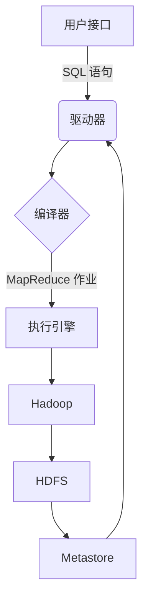

# Hive原理与代码实例讲解

## 1.背景介绍

Apache Hive 是一种建立在 Hadoop 之上的数据仓库基础架构，它提供了一种类似 SQL 的查询语言 HiveQL,使得用户可以通过类似 SQL 的方式来查询和管理存储在 Hadoop 分布式文件系统(HDFS)中的海量数据。Hive 支持多种数据格式,包括文本文件、SequenceFile、RCFile 等,并且支持用户自定义格式。Hive 的设计目标是将结构化的数据文件映射为一张数据库表,并且允许用户使用 SQL 语句对这些表进行查询、插入、删除等操作。

Hive 的核心思想是将 Hadoop 的 MapReduce 作业转换为 SQL 语句,然后由 Hive 将 SQL 语句转换为一系列 MapReduce 作业执行。Hive 提供了一个命令行工具和一个基于 JDBC 的服务器接口,允许用户通过多种方式与 Hive 进行交互,包括 CLI、Web UI 和各种编程语言接口。

### Hive 架构

Hive 的架构主要由以下几个核心组件组成:



1. **用户接口**:提供了多种方式与 Hive 进行交互,如命令行接口(CLI)、JDBC/ODBC 接口等。
2. **驱动器(Driver)**:接收用户输入的 SQL 语句,并将其转发给编译器。
3. **编译器(Compiler)**:将 SQL 语句转换为一系列 MapReduce 作业。
4. **执行引擎(Execution Engine)**:执行由编译器生成的 MapReduce 作业。
5. **Hadoop**:Hive 底层依赖的 Hadoop 集群,用于执行 MapReduce 作业。
6. **HDFS(Hadoop 分布式文件系统)**:存储用户数据的分布式文件系统。
7. **Metastore**:存储 Hive 元数据,如表、分区、列等信息。

## 2.核心概念与联系

### Hive 表

Hive 中的表可以分为两种类型:内部表(Managed Table)和外部表(External Table)。

**内部表**是由 Hive 自身管理的表,表数据和元数据都存储在 Hive 自己的目录中。当删除内部表时,Hive 会删除表的元数据和数据文件。

**外部表**是由用户自己管理的表,表数据存储在用户指定的目录中,而表的元数据存储在 Hive 的 Metastore 中。当删除外部表时,Hive 只会删除表的元数据,而不会删除数据文件。

### Hive 分区(Partitions)和存储桶(Buckets)

**分区**是 Hive 中一种将大表按照某些列的值进行分割的技术,每个分区都是实际数据文件的一个目录。分区可以大大提高查询效率,因为查询时只需要扫描相关的分区目录即可。

**存储桶**是 Hive 中一种将数据按照某些列的 Hash 值进行分割的技术,每个存储桶对应一个文件。存储桶可以提高 MapReduce 作业的并行度,因为每个存储桶可以由一个独立的 Mapper 处理。

### Hive 文件格式

Hive 支持多种文件格式,包括:

1. **TextFile**:纯文本格式,数据以行为单位,每行表示一条记录,字段之间用分隔符分隔。
2. **SequenceFile**:Hadoop 自身的一种平面文件格式,它将数据存储为二进制键/值对。
3. **RCFile(Record Columnar File)**:列式存储格式,按列存储数据,适合于只读取部分列的场景。
4. **ORC(Optimized Row Columnar)**:优化的列式存储格式,相比 RCFile 有更好的压缩比和更高的读取效率。
5. **Parquet**:另一种列式存储格式,由 Cloudera 和 Twitter 联合开发,具有高效的压缩和编码方案。

## 3.核心算法原理具体操作步骤

Hive 的核心算法原理是将 SQL 语句转换为一系列 MapReduce 作业,并在 Hadoop 集群上执行这些作业。这个过程主要包括以下几个步骤:

1. **语法解析**:Hive 使用 Antlr 工具将 SQL 语句解析为抽象语法树(AST)。
2. **语义分析**:对 AST 进行语义检查,包括表是否存在、列是否匹配等。
3. **逻辑优化**:对 AST 进行一系列逻辑优化,如投影列剪裁、分区剪裁等。
4. **物理优化**:根据输入数据的统计信息,选择最优的执行计划。
5. **执行优化**:生成 MapReduce 作业,并进行一些执行优化,如本地化、压缩等。
6. **作业提交**:将优化后的 MapReduce 作业提交到 Hadoop 集群上执行。

下面以一个简单的 SELECT 查询为例,说明 Hive 的执行流程:

```sql
SELECT col1, col2 FROM table WHERE col3 > 100;
```

1. **语法解析**:将 SQL 语句解析为抽象语法树(AST)。

```
QueryBlock
  ├── FromClause
  │   └── TableName
  ├── SelectClause
  │   ├── SelectItem: col1
  │   └── SelectItem: col2
  └── WhereClause
      └── Predicate: (col3 > 100)
```

2. **语义分析**:检查 `table` 是否存在,`col1`、`col2`、`col3` 是否为合法列名。
3. **逻辑优化**:由于只需要 `col1` 和 `col2` 两列,因此可以进行投影列剪裁,只读取这两列的数据。
4. **物理优化**:如果 `table` 按照 `col3` 列进行了分区,则可以进行分区剪裁,只扫描满足 `col3 > 100` 条件的分区。
5. **执行优化**:生成 MapReduce 作业,并进行一些执行优化,如本地化、压缩等。
6. **作业提交**:将优化后的 MapReduce 作业提交到 Hadoop 集群上执行。

## 4.数学模型和公式详细讲解举例说明

在 Hive 中,常用的数学模型和公式主要包括:

### 1. 数据采样

在处理大规模数据集时,通常需要先对数据进行采样,以便快速获取数据的统计信息,从而指导后续的查询优化。Hive 使用伯努利采样(Bernoulli Sampling)的方法进行数据采样。

伯努利采样的基本思想是:对每条记录,以一定的概率 $p$ 决定是否将其纳入样本。具体来说,对于每条记录 $r$,计算 $h(r)$,其中 $h$ 是一个哈希函数。如果 $h(r) \lt p$,则将 $r$ 纳入样本,否则舍弃。

为了保证样本的随机性,Hive 使用的哈希函数是:

$$h(r) = \phi(x) = (ax + b) \bmod p \bmod 1$$

其中 $a$ 和 $b$ 是随机选择的整数,用于引入随机性;$p$ 是一个大质数,通常取 $2^{32}$ 或 $2^{64}$。

通过调整采样率 $p$,可以控制样本的大小。例如,如果希望采样率为 $10\%$,则可以设置 $p=0.1$。

### 2. 数据分桶

Hive 中的分桶(Bucketing)技术,是将数据按照某些列的哈希值进行分割,每个分割对应一个文件(称为桶/Bucket)。分桶可以提高 MapReduce 作业的并行度,因为每个桶可以由一个独立的 Mapper 处理。

分桶的过程如下:对于每条记录 $r$,计算 $hash(r)$,其中 $hash$ 是一个哈希函数,通常使用 Murmur Hash。然后将 $hash(r)$ 对桶的总数 $n$ 取模,得到桶的编号 $i$,即 $i = hash(r) \bmod n$。最后,将记录 $r$ 写入编号为 $i$ 的桶中。

例如,如果我们将一张表按照 `id` 列进行分桶,并设置桶的总数为 32,那么记录 `(1, 'Alice')` 和 `(33, 'Bob')` 可能会被分配到同一个桶中,因为 `1 % 32 = 33 % 32 = 1`。

分桶的优点是可以提高某些操作的效率,如 Join 操作。当两张表按照相同的列进行分桶时,只需要将相同编号的桶进行 Join 即可,从而避免了笛卡尔积的计算。

### 3. 数据采样与分桶的组合使用

在实际应用中,Hive 通常会结合使用数据采样和分桶技术,以获得更好的查询性能。

具体来说,Hive 首先对数据进行采样,获取数据的统计信息,如每列的值的分布、列之间的相关性等。然后,根据这些统计信息,决定是否对数据进行分桶,以及分桶的列和桶的数量。

例如,如果发现两列 `A` 和 `B` 之间存在较强的相关性,那么可以考虑将表按照 `A` 和 `B` 两列进行分桶,以提高将来 Join 操作的效率。

同时,Hive 还会根据采样得到的统计信息,对查询进行优化,如选择合适的 Join 算法、投影列剪裁等。

通过采样、分桶和查询优化的组合使用,Hive 可以显著提高查询的执行效率,尤其是对于大规模数据集。

## 5.项目实践:代码实例和详细解释说明

### 创建表

```sql
CREATE TABLE users (
    id INT,
    name STRING,
    age INT
)
PARTITIONED BY (country STRING)
CLUSTERED BY (id) INTO 32 BUCKETS
STORED AS ORC;
```

这条语句创建了一个名为 `users` 的 Hive 表,包含三个列 `id`、`name` 和 `age`。该表按照 `country` 列进行了分区,并且按照 `id` 列进行了分桶,共分为 32 个桶。数据以 ORC 格式存储。

### 加载数据

```sql
LOAD DATA LOCAL INPATH '/path/to/users.txt' 
OVERWRITE INTO TABLE users
PARTITION (country = 'US');
```

这条语句将本地文件 `/path/to/users.txt` 中的数据加载到 `users` 表的 `US` 分区中。`OVERWRITE` 关键字表示如果该分区已经存在数据,则会被覆盖。

### 查询

```sql
SELECT name, age 
FROM users
WHERE country = 'US' AND age > 30;
```

这条语句从 `users` 表中查询所有国家为 `US`、年龄大于 30 的记录的 `name` 和 `age` 列。由于使用了分区,Hive 只需要扫描 `US` 分区的数据,从而提高了查询效率。

### Join

```sql
SELECT u.name, o.order_id
FROM users u
JOIN orders o ON u.id = o.user_id
WHERE u.country = 'US' AND o.order_date > '2022-01-01';
```

这条语句执行了一个 Join 操作,将 `users` 表和 `orders` 表按照 `id` 和 `user_id` 列进行连接。由于两张表都按照相同的列进行了分桶,Hive 只需要将相同编号的桶进行 Join,从而避免了笛卡尔积的计算,提高了效率。

### 创建视图

```sql
CREATE VIEW active_users AS
SELECT id, name
FROM users
WHERE country = 'US' AND age BETWEEN 20 AND 40;
```

这条语句创建了一个名为 `active_users` 的视图,包含了所有国家为 `US`、年龄在 20 到 40 岁之间的用户的 `id` 和 `name`。视图可以像普通表一样进行查询,但是不存储任何数据,只是一个逻辑上的表。

### 插入数据

```sql
INSERT INTO TABLE users
PARTITION (country = 'CN')
VALUES (1, 'Alice', 25), (2, 'Bob', 30);