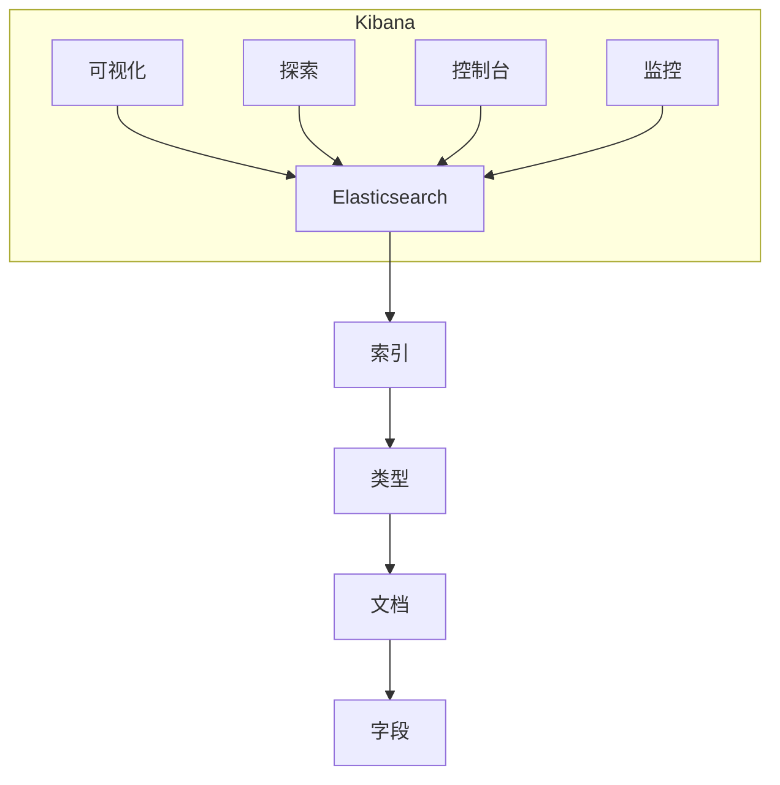

# Kibana原理与代码实例讲解

## 1.背景介绍

随着大数据时代的到来,海量数据的采集、存储、分析和可视化成为了当前IT行业的重中之重。Elasticsearch作为一款开源的分布式搜索和分析引擎,凭借其高性能、分布式、RESTful等优势,成为了大数据领域的佼佼者。而Kibana作为Elasticsearch的数据分析和可视化管理平台,为用户提供了友好的操作界面,使得数据分析和可视化工作变得前所未有的简单高效。

## 2.核心概念与联系

### 2.1 Elasticsearch

Elasticsearch是一个基于Lucene构建的开源、分布式、RESTful搜索引擎。它具有以下核心概念:

- 索引(Index):用于存储关联数据的地方,相当于关系型数据库中的数据库。
- 类型(Type):索引的逻辑分类/分区,相当于数据库中的表。
- 文档(Document):可以被索引的基本数据单元,相当于数据库中的一行数据。
- 字段(Field):文档中的属性,相当于数据库中的列。

Elasticsearch通过RESTful API与外部进行交互,支持分布式集群部署,能够提供近乎实时的搜索响应。

### 2.2 Kibana

Kibana是一个开源的分析和可视化平台,设计用于和Elasticsearch一起工作。它的主要功能包括:

- 数据可视化:以图表、表格等形式展示Elasticsearch数据。
- 数据探索:使用强大的搜索功能发现和调查数据。
- 操作控制台:通过Dev Tools控制台与Elasticsearch进行交互。
- 监控管理:监控Elasticsearch集群健康状态和性能。

Kibana与Elasticsearch通过RESTful API进行无缝集成,为用户提供了友好的Web界面,简化了数据分析和可视化的操作流程。



## 3.核心算法原理具体操作步骤

### 3.1 数据建模

在将数据导入Elasticsearch之前,需要先对数据进行建模,设计索引、类型和字段映射。这一步对于后续的数据检索和分析至关重要。Elasticsearch支持以下数据类型:

- 核心数据类型:字符串、数值、布尔、日期等。
- 复杂数据类型:对象、嵌套对象、地理位置等。
- 特殊数据类型:IP、附件等。

根据数据的特点和业务需求,选择合适的数据类型并设置相应的映射,能够最大程度发挥Elasticsearch的查询性能。

### 3.2 数据导入

数据可以通过以下几种方式导入Elasticsearch:

1. **Logstash**:Elasticsearch家族中的数据处理管道,支持从各种数据源读取数据,并将其自动化地推入Elasticsearch。
2. **Beats**:轻量级数据采集器,用于从成百上千台机器向Logstash或Elasticsearch发送数据。
3. **RESTful API**:直接通过Elasticsearch提供的RESTful API,使用诸如curl、Postman等工具手动导入数据。

无论使用哪种方式,数据最终都会被索引到Elasticsearch的索引和类型中。

### 3.3 数据检索

在Elasticsearch中检索数据,主要有以下几种方式:

1. **查询DSL(Query DSL)**:基于JSON的请求体结构,提供了非常丰富且灵活的查询语法。
2. **查询字符串(Query String)**:以命令形式表示的compactquery语法。
3. **RESTful API**:通过HTTP方法(GET、POST等)发送请求,并使用路径、查询参数等指定查询条件。

无论使用何种方式,Elasticsearch的查询都遵循相同的工作流程:查询请求 -> 查询解析 -> 重写查询 -> 生成查询执行计划 -> 执行查询 -> 获取结果。

### 3.4 数据分析

在Kibana中,可以通过多种方式对Elasticsearch中的数据进行分析:

1. **发现(Discover)**:以表格和图表形式探索和分析数据。
2. **可视化(Visualize)**:使用丰富的图表类型对数据进行可视化展示。
3. **Canvas**:基于可视化的工作区,支持自由拖拽和布局,创建动态数据报告。
4. **机器学习(Machine Learning)**:利用机器学习算法对数据进行异常检测、预测等高级分析。

Kibana还提供了各种聚合和分析函数,如桶、指标、管道等,使得数据分析变得更加灵活和强大。

### 3.5 集群管理

对于生产环境中的Elasticsearch集群,需要进行全面的监控和管理,以确保其稳定、高效地运行。Kibana提供了以下功能:

1. **集群监控**:监视集群的整体健康状况、节点状态、索引状态等。
2. **索引管理**:查看和管理Elasticsearch中的所有索引。
3. **快照和备份**:创建和恢复Elasticsearch数据的快照,实现数据备份。
4. **安全管理**:配置用户认证、角色权限、加密通信等安全策略。

通过Kibana的Web界面,可以轻松地完成上述管理任务,无需直接操作Elasticsearch集群。

## 4.数学模型和公式详细讲解举例说明

在Elasticsearch的相关性算分公式中,涉及到了一些数学模型和公式,下面将对其进行详细讲解。

Elasticsearch使用的是基于TF-IDF的相关性算分公式,即Term Frequency-Inverse Document Frequency(词频-逆向文档频率)。该算法的基本思想是:如果某个词或短语在一篇文档中出现的频率越高,同时在整个文档集合中出现的频率越低,则认为这个词或短语对这篇文档越有价值,从而提高该文档的相关性评分。

TF-IDF算分公式的具体定义如下:

$$score(q,d) = \sum_{t\in q} tf(t,d) \cdot idf(t)^2 \cdot boost(t) \cdot queryNorm(q)$$

其中:

- $q$表示查询语句
- $d$表示文档
- $t$表示文档$d$中的词条(term)
- $tf(t,d)$表示词条$t$在文档$d$中的词频(Term Frequency)
- $idf(t)$表示词条$t$的逆向文档频率(Inverse Document Frequency)
- $boost(t)$表示对词条$t$的权重因子
- $queryNorm(q)$表示查询语句$q$的规范化因子

下面分别对各个因子进行解释:

1. **词频(Term Frequency, $tf(t,d)$)**

词频是指词条$t$在文档$d$中出现的次数,可以直接使用原始出现次数作为$tf$值。但通常会对其进行一些平滑处理,以防止过于偏向长文档。常用的平滑函数有:

$$tf(t,d) = \sqrt{freq(t,d)}$$
$$tf(t,d) = \frac{freq(t,d)}{max\_freq\_in\_doc}$$

其中$freq(t,d)$表示词条$t$在文档$d$中的原始出现次数。

2. **逆向文档频率(Inverse Document Frequency, $idf(t)$)**

逆向文档频率是用来评估词条的稀有程度。如果一个词条在整个文档集合中出现的频率越高,则其作为关键词对查询结果的区分度就越低。$idf$的计算公式为:

$$idf(t) = \log \frac{1 + n}{1 + df(t)}$$

其中$n$表示文档集合中的总文档数量,$df(t)$表示包含词条$t$的文档数量。

通过将$tf$和$idf$相乘,可以权衡一个词条在当前文档中的重要性和在整个文档集合中的稀有程度,从而得到该词条对查询的贡献分数。

3. **词条权重(Term Boost, $boost(t)$)**

有时我们需要对某些词条进行手动加权,以提高或降低其对最终相关性评分的影响。这就是词条权重$boost(t)$的作用。如果没有显式设置,则$boost(t)$的默认值为1。

4. **查询规范化因子(Query Normalization Factor, $queryNorm(q)$)**

查询规范化因子是为了防止过长的查询语句导致相关性评分过高。它的计算公式为:

$$queryNorm(q) = \frac{1}{\sqrt{sumOfSquaredWeights}}$$

其中$sumOfSquaredWeights$是查询语句中所有词条的加权平方和。

通过上述公式,Elasticsearch能够根据词条在文档和文档集合中的分布情况,以及手动设置的权重等因素,为每个文档计算出一个相关性评分,并按照评分高低对查询结果进行排序。

## 5.项目实践:代码实例和详细解释说明

为了更好地理解Kibana的使用方式,我们将通过一个实际项目案例,演示如何利用Kibana对Elasticsearch中的数据进行可视化分析。

### 5.1 项目背景

假设我们是一家在线零售商,需要分析网站的用户行为数据,以优化产品和营销策略。我们将使用Elastic Stack(Elasticsearch、Logstash、Kibana)来构建这个分析系统。

### 5.2 数据导入

首先,我们需要将网站的用户行为日志数据导入到Elasticsearch中。这里我们使用Logstash作为数据处理管道。

1. 配置Logstash的输入源(input),例如从文件或Kafka消费数据:

```ruby
input {
  file {
    path => "/path/to/logs/*.log"
    start_position => "beginning"
  }
}
```

2. 对数据进行过滤和解析(filter):

```ruby
filter {
  grok {
    match => { "message" => "%{COMBINEDAPACHELOG}" }
  }
  date {
    match => [ "timestamp" , "dd/MMM/yyyy:HH:mm:ss Z" ]
  }
}
```

3. 配置输出目标(output),将数据发送到Elasticsearch:

```ruby
output {
  elasticsearch {
    hosts => ["http://elasticsearch:9200"]
    index => "website-logs-%{+YYYY.MM.dd}"
  }
}
```

通过上述配置,Logstash会自动从日志文件中读取数据,进行grok解析和日期转换,然后将解析后的数据发送到Elasticsearch的website-logs索引中。

### 5.3 数据可视化

接下来,我们将在Kibana中对导入的数据进行可视化分析。

1. 创建索引模式(Index Pattern),让Kibana知道要分析的是哪个索引:

```
website-logs-*
```

2. 在Discover视图中,可以通过搜索框查询感兴趣的数据,并以表格或图表的形式查看:

```json
{
  "size": 1000,
  "query": {
    "match_all": {}
  }
}
```

3. 在Visualize视图中,可以创建各种图表,例如饼图、折线图、地理坐标图等,对数据进行可视化展示:

```json
{
  "aggs": {
    "2": {
      "terms": {
        "field": "response.keyword",
        "order": {
          "_count": "desc"
        },
        "size": 5
      }
    }
  },
  "size": 0,
  "query": {
    "match_all": {}
  }
}
```

上面的聚合查询统计了网站的前5个最常见的HTTP响应码及其出现次数。

4. 在Dashboard视图中,可以将多个可视化图表组合到同一个仪表板中,形成一个全面的数据分析报告。

5. 在Canvas视图中,可以使用拖拽式的界面,自由组合各种元素(图表、图像、文字等),创建生动的数据报告。

6. 利用Kibana的机器学习功能,可以对数据进行异常检测、预测等高级分析,例如预测未来的网站流量趋势、发现异常的用户行为模式等。

通过上述步骤,我们就可以使用Kibana对网站的用户行为数据进行全方位的分析和可视化,从而更好地了解用户需求,优化网站的产品和营销策略。

## 6.实际应用场景

Kibana作为Elasticsearch的数据分析和可视化平台,在许多领域都有广泛的应用场景,例如:

1. **日志分析**:分析系统、应用和安全日志,用于故障排查、性能优化和安全监控等。
2. **网络安全**:检测和分析网