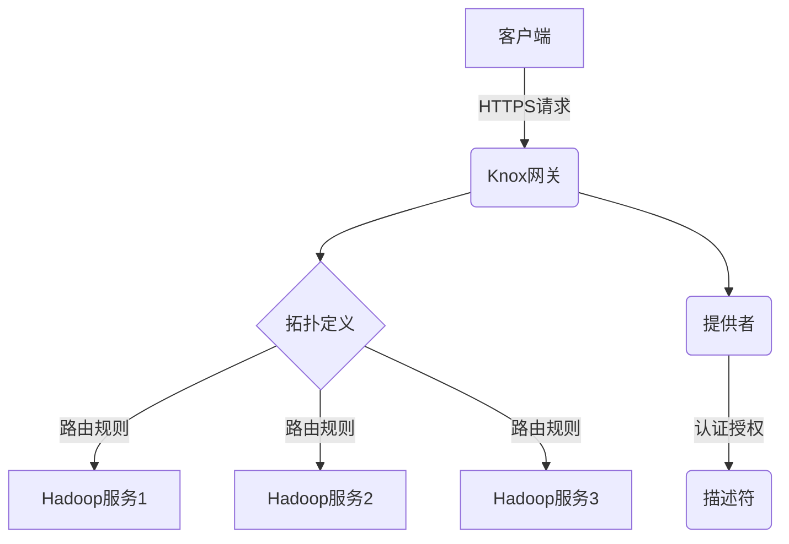

# Knox原理与代码实例讲解

## 1.背景介绍

Knox是一种用于构建安全数据访问平台的开源框架,旨在为大数据集群提供统一的安全认证和授权机制。在大数据时代,数据安全性和访问控制变得越来越重要,Knox为Hadoop生态系统提供了一个集中的网关,通过为每个用户和应用程序提供单一入口点来简化数据访问管理。

Apache Knox最初由Hortonworks公司开发,于2014年9月正式加入Apache软件基金会,成为Apache顶级项目。它基于REST(Representational State Transfer)架构,为Hadoop集群提供了一个反向代理网关。通过Knox,用户和应用程序可以使用标准协议(如HTTPS)安全地访问Hadoop服务,而无需直接连接到集群节点。

Knox的主要目标是:

1. **安全性**: 通过集中的认证和授权机制,确保只有经过授权的用户和应用程序才能访问Hadoop服务。

2. **简化访问管理**: 提供单一入口点,简化了对多个Hadoop服务的访问管理。

3. **扩展性**: 支持插件化架构,可以轻松扩展以支持新的Hadoop服务和认证机制。

4. **审计和监控**: 提供集中的审计和监控功能,帮助管理员跟踪和分析数据访问活动。

Knox的架构设计使其成为大数据环境中一个关键的安全组件,为企业级Hadoop部署提供了必要的安全性和可管理性。

## 2.核心概念与联系

Knox的核心概念包括:

1. **Gateway (网关)**: Knox的核心组件,充当反向代理,将客户端请求路由到相应的Hadoop服务。

2. **Topology (拓扑)**: 定义了Knox如何将请求路由到特定的Hadoop服务,包括服务URL、认证和授权规则等信息。

3. **Provider (提供者)**: 实现特定的认证和授权机制,如LDAP、Kerberos等。

4. **Descriptor (描述符)**: 定义了服务的元数据,如服务名称、版本等。

这些概念相互关联,共同构建了Knox的安全数据访问平台。网关根据拓扑定义将请求路由到相应的Hadoop服务,并使用提供者进行认证和授权。描述符则提供了服务的元数据信息。



## 3.核心算法原理具体操作步骤

Knox的核心算法原理包括请求路由、认证和授权三个主要部分:

### 3.1 请求路由算法

1. 客户端发送HTTPS请求到Knox网关。
2. 网关根据请求URL查找匹配的拓扑定义。
3. 如果找到匹配的拓扑定义,则根据定义中的路由规则将请求转发到相应的Hadoop服务。
4. 如果未找到匹配的拓扑定义,则返回404错误。

### 3.2 认证算法

1. 网关根据拓扑定义中配置的认证提供者(如LDAP、Kerberos等)进行认证。
2. 如果认证成功,则继续执行授权步骤。
3. 如果认证失败,则返回401未授权错误。

### 3.3 授权算法

1. 网关根据拓扑定义中配置的授权提供者(如Apache Ranger等)进行授权检查。
2. 如果用户具有访问请求资源的权限,则将请求转发到相应的Hadoop服务。
3. 如果用户没有访问权限,则返回403禁止访问错误。

这些算法的具体实现细节可能因不同的提供者而有所不同,但总体流程是相似的。Knox通过这些核心算法,实现了对Hadoop服务的安全访问控制。

## 4.数学模型和公式详细讲解举例说明

在Knox的认证和授权过程中,可能会涉及一些数学模型和公式,例如基于角色的访问控制(RBAC)模型和密码学算法。

### 4.1 基于角色的访问控制(RBAC)模型

RBAC是一种广泛使用的访问控制模型,它通过将用户与角色相关联,并将角色与权限相关联,来管理对资源的访问。RBAC模型可以用以下数学公式表示:

$$
U \subseteq U \times R \\
R \subseteq R \times P \\
P \subseteq O \times A
$$

其中:

- $U$ 表示用户集合
- $R$ 表示角色集合
- $P$ 表示权限集合
- $O$ 表示对象集合(如文件、目录等)
- $A$ 表示操作集合(如读、写等)

第一个公式表示用户与角色之间的关系,即一个用户可以关联多个角色。第二个公式表示角色与权限之间的关系,即一个角色可以关联多个权限。第三个公式表示权限与对象和操作之间的关系,即一个权限定义了对特定对象执行特定操作的权限。

在Knox中,RBAC模型可以用于管理对Hadoop服务和资源的访问权限。管理员可以定义角色,并将用户和权限分配给相应的角色,从而实现细粒度的访问控制。

### 4.2 密码学算法

Knox还可能使用各种密码学算法来保护数据传输和存储的安全性,例如对称加密算法(如AES)、非对称加密算法(如RSA)和哈希算法(如SHA-256)等。

以AES(Advanced Encryption Standard)对称加密算法为例,它可以用以下数学模型表示:

$$
C = E_k(P) \\
P = D_k(C)
$$

其中:

- $P$ 表示明文
- $C$ 表示密文
- $k$ 表示密钥
- $E_k$ 表示使用密钥 $k$ 的加密函数
- $D_k$ 表示使用密钥 $k$ 的解密函数

加密过程是将明文 $P$ 通过加密函数 $E_k$ 和密钥 $k$ 转换为密文 $C$,解密过程则是将密文 $C$ 通过解密函数 $D_k$ 和密钥 $k$ 还原为明文 $P$。

在Knox中,这些密码学算法可以用于保护数据传输的安全性,例如使用HTTPS协议加密客户端与网关之间的通信,或者使用加密算法保护敏感数据的存储。

## 5.项目实践：代码实例和详细解释说明

在本节中,我们将通过一个示例项目来演示如何使用Knox构建安全的数据访问平台。

### 5.1 环境准备

首先,我们需要准备以下环境:

- Apache Hadoop集群
- Apache Knox
- LDAP服务器(用于认证)
- Apache Ranger(用于授权,可选)

### 5.2 配置Knox拓扑

Knox的配置主要通过编辑拓扑文件(`topology.xml`)来完成。以下是一个示例拓扑文件:

```xml
<topology>
  <gateway>
    <provider>
      <role>authentication</role>
      <name>ShiroProvider</name>
      <enabled>true</enabled>
      <param>
        <name>main.ldapRealm</name>
        <value>org.apache.knox.gateway.shiroldag.ldap.LdapRealm</value>
      </param>
      <param>
        <name>main.ldapRealm.contextFactory</name>
        <value>org.apache.knox.gateway.shiroldag.ldap.LdapContextFactory</value>
      </param>
      <param>
        <name>main.ldapRealm.userDnTemplate</name>
        <value>uid={0},ou=people,dc=example,dc=com</value>
      </param>
      <param>
        <name>main.ldapRealm.contextFactory.url</name>
        <value>ldap://ldap.example.com:389</value>
      </param>
      <param>
        <name>urls./**</name>
        <value>authcBasic</value>
      </param>
    </provider>
    <provider>
      <role>authorization</role>
      <name>AclsAuthz</name>
      <enabled>true</enabled>
    </provider>
    <service>
      <role>HDFS</role>
      <url>hdfs://namenode.example.com:8020</url>
    </service>
    <service>
      <role>HIVE</role>
      <url>http://hiveserver.example.com:10000</url>
    </service>
  </gateway>
  <service>
    <role>HDFS</role>
    <route>
      <path>/hdfs/**</path>
    </route>
  </service>
  <service>
    <role>HIVE</role>
    <route>
      <path>/hive/**</path>
    </route>
  </service>
</topology>
```

在这个示例中,我们配置了以下内容:

1. 使用LDAP作为认证提供者,并指定了LDAP服务器的URL和用户DN模板。
2. 启用了基于ACL的授权提供者。
3. 定义了HDFS和Hive两个Hadoop服务,并分别指定了它们的URL。
4. 配置了请求路由规则,将以`/hdfs/`开头的请求路由到HDFS服务,将以`/hive/`开头的请求路由到Hive服务。

### 5.3 客户端访问示例

配置完成后,客户端可以通过Knox网关安全地访问Hadoop服务。以下是一个使用Python的示例:

```python
import requests

# 认证凭据
username = 'user1'
password = 'password1'

# Knox网关URL
knox_url = 'https://knox.example.com:8443/gateway'

# 访问HDFS
hdfs_url = f'{knox_url}/hdfs/webhdfs/v1/?op=LISTSTATUS&user.name={username}'
response = requests.get(hdfs_url, auth=(username, password), verify=False)
print(response.text)

# 访问Hive
hive_url = f'{knox_url}/hive/jdbc/query?user.name={username}'
data = {'query': 'SHOW DATABASES'}
response = requests.post(hive_url, auth=(username, password), data=data, verify=False)
print(response.text)
```

在这个示例中,我们首先定义了用户名和密码作为认证凭据。然后,我们构建了HDFS和Hive服务的URL,并通过Knox网关发送HTTP请求。请求中包含了用户名和密码用于认证。

对于HDFS,我们发送了一个GET请求来列出HDFS文件系统的内容。对于Hive,我们发送了一个POST请求,在请求体中包含了SQL查询语句。

请注意,在实际生产环境中,您应该使用更安全的方式传递认证凭据,例如使用Kerberos票据或SSL客户端证书等。

## 6.实际应用场景

Knox作为一个安全数据访问平台,在以下场景中发挥着重要作用:

1. **企业大数据平台**: 在企业级大数据平台中,Knox可以为Hadoop集群提供统一的安全访问入口,简化访问管理并加强安全性。

2. **云环境**: 在云环境中,Knox可以为Hadoop集群提供安全的公共访问入口,同时保护内部集群免受未经授权的访问。

3. **多租户环境**: 在多租户环境中,Knox可以通过细粒度的访问控制机制,为不同的租户提供隔离的数据访问权限。

4. **数据湖**: 在构建数据湖时,Knox可以为各种数据源(如HDFS、Hive、Kafka等)提供统一的安全访问入口,简化数据集成和分析过程。

5. **物联网(IoT)和边缘计算**: 在物联网和边缘计算场景中,Knox可以为分布式的数据源和计算节点提供安全的数据访问和管理功能。

6. **混合云环境**: 在混合云环境中,Knox可以为跨云和本地环境的Hadoop集群提供统一的安全访问入口,简化管理并确保数据安全。

总的来说,Knox为各种大数据场景提供了一个安全、可扩展和易于管理的数据访问解决方案,是构建企业级大数据平台的重要组件之一。

## 7.工具和资源推荐

在使用Knox构建安全数据访问平台时,以下工具和资源可能会很有帮助:

1. **Apache Ranger**: Apache Ranger是一个开源的集中式安全管理平台,可与Knox集成,提供细粒度的授权管理功能。

2. **Kerberos**: Kerberos是一种广泛使用的网络认证协议,可与Knox集成,提供强大的认证和单点登录功能。

3. **LDAP**: LDAP(Lightweight Directory Access Protocol)是一种开放的目录