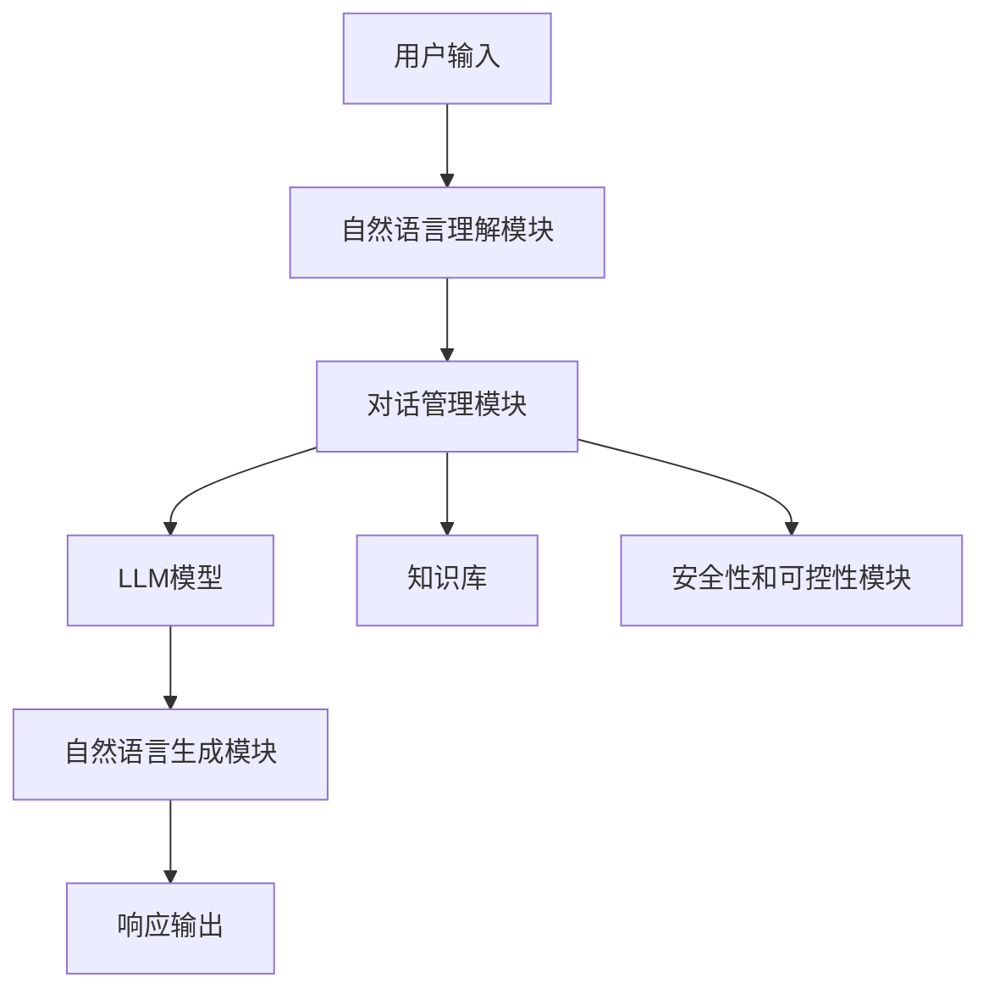

# LLM-based Chatbot System Evaluation

## 1. 背景介绍

随着人工智能技术的不断发展,大型语言模型(Large Language Model, LLM)已经成为当前最先进的自然语言处理技术之一。LLM通过在海量文本数据上进行预训练,能够学习到丰富的语言知识和上下文信息,从而在自然语言理解、生成、推理等任务上展现出卓越的性能。

基于LLM的对话系统(Chatbot)近年来受到了广泛关注。与传统的基于规则或检索的对话系统不同,LLM-based Chatbot能够根据上下文生成连贯、多样的自然语言响应,为用户提供更加人性化和智能化的对话体验。目前,一些知名的LLM-based Chatbot系统已经在特定领域展现出令人印象深刻的能力,如OpenAI的ChatGPT、谷歌的LaMDA、Anthropic的Claude等。

然而,尽管取得了长足进步,LLM-based Chatbot系统仍然存在诸多需要解决的挑战,例如一致性、可靠性、安全性等方面的问题。因此,对LLM-based Chatbot系统进行全面、客观的评估至关重要,这不仅有助于发现系统中存在的缺陷和局限性,更有利于推动该领域的持续发展和技术进步。

## 2. 核心概念与联系

### 2.1 大型语言模型 (LLM)

大型语言模型(LLM)是一种基于深度学习的自然语言处理模型,通过在海量文本数据上进行预训练,能够学习到丰富的语言知识和上下文信息。常见的LLM包括GPT、BERT、XLNet、RoBERTa等。这些模型在自然语言理解、生成、推理等任务上展现出卓越的性能。

LLM的核心思想是利用自监督学习(Self-Supervised Learning)的方式,通过设计合理的预训练目标(如掩码语言模型、下一句预测等),在海量文本数据上进行预训练,从而学习到通用的语言表示。经过预训练后,LLM可以在下游任务上进行微调(Fine-tuning),从而快速适应特定的应用场景。

### 2.2 LLM-based Chatbot

基于LLM的对话系统(LLM-based Chatbot)是指利用LLM作为核心组件,构建具有自然语言交互能力的对话系统。与传统的基于规则或检索的对话系统不同,LLM-based Chatbot能够根据上下文生成连贯、多样的自然语言响应,为用户提供更加人性化和智能化的对话体验。

在LLM-based Chatbot系统中,LLM通常承担了自然语言理解(NLU)和自然语言生成(NLG)的主要功能。系统首先将用户的输入转换为LLM可以理解的表示形式,然后由LLM根据上下文生成相应的响应,最后将LLM的输出转换为自然语言形式呈现给用户。

除了LLM之外,LLM-based Chatbot系统还包括其他重要组件,如对话管理模块、知识库、安全性和可控性模块等,共同构建了一个完整的对话系统。

### 2.3 Chatbot系统评估

对话系统评估是指通过一定的方法和指标,全面、客观地评价对话系统的性能和质量。评估的目的在于发现系统中存在的缺陷和局限性,并为系统的持续优化和改进提供依据。

对话系统评估通常包括以下几个方面:

- **自然语言理解能力**:评估系统对自然语言输入的理解程度,包括词法、语义、语用等多个层面。
- **自然语言生成能力**:评估系统生成响应的质量,包括语法、流畅性、多样性、相关性等。
- **任务完成能力**:评估系统在特定任务场景下的执行效果,如问答、推理、决策等。
- **交互体验**:评估用户与系统交互过程中的体验,如一致性、可控性、安全性等。
- **可解释性**:评估系统的决策过程和结果的可解释性,以增加系统的可信度。

对LLM-based Chatbot系统的评估,需要结合LLM和对话系统的特点,设计合理的评估方法和指标,以全面、客观地评价系统的性能和质量。

## 3. 核心算法原理具体操作步骤

### 3.1 LLM预训练

LLM的预训练过程是基于自监督学习的范式,通过设计合理的预训练目标,在海量文本数据上进行预训练,从而学习到通用的语言表示。常见的预训练目标包括:

1. **掩码语言模型(Masked Language Modeling, MLM)**: 随机掩码部分输入词元,模型需要根据上下文预测被掩码的词元。这有助于模型学习到双向的语义表示。

2. **下一句预测(Next Sentence Prediction, NSP)**: 给定两个句子,模型需要判断第二个句子是否为第一个句子的下一句。这有助于模型学习到更长范围的上下文信息。

3. **因果语言模型(Causal Language Modeling, CLM)**: 给定前面的词元序列,模型需要预测下一个词元。这类似于传统的语言模型任务,有助于模型学习到单向的语义表示。

4. **序列到序列预训练(Sequence-to-Sequence Pretraining)**: 将输入序列映射为目标序列,常用于机器翻译、摘要生成等任务的预训练。

预训练过程通常采用自回归(Auto-Regressive)的方式,即模型根据已生成的部分序列,预测下一个词元。预训练目标的损失函数通常是交叉熵损失,优化方法常用的是随机梯度下降(SGD)及其变体。

预训练完成后,LLM可以在下游任务上进行微调(Fine-tuning),以适应特定的应用场景。微调过程通常只需要少量的任务相关数据,并在预训练模型的基础上进行少量epochs的训练,即可获得良好的性能。

### 3.2 LLM-based Chatbot系统架构

LLM-based Chatbot系统的核心架构通常包括以下几个主要组件:



1. **自然语言理解模块(NLU)**:将用户的自然语言输入转换为机器可以理解的表示形式,如词元序列、语义表示等。常用的NLU技术包括词法分析、句法分析、实体识别、意图识别等。

2. **对话管理模块**:根据当前对话状态和上下文信息,决定系统的响应策略,包括查询知识库、调用LLM模型、执行特定任务等。对话管理模块是整个系统的控制中心。

3. **LLM模型**:系统的核心组件,负责根据上下文生成自然语言响应。常见的LLM模型包括GPT、BERT、XLNet等。

4. **自然语言生成模块(NLG)**:将LLM模型的输出转换为自然语言形式,以便呈现给用户。NLG模块可能包括文本规范化、语言生成等步骤。

5. **知识库**:存储系统所需的结构化知识和数据,为对话提供信息支持。知识库的构建和维护是系统性能的关键因素之一。

6. **安全性和可控性模块**:确保系统的响应符合预期,不会产生有害或不当的内容。这包括内容过滤、偏差检测、响应约束等机制。

上述各个组件通过有机结合,共同构建了一个完整的LLM-based Chatbot系统。在实际应用中,系统架构可能会根据具体需求进行调整和扩展。

## 4. 数学模型和公式详细讲解举例说明

### 4.1 LLM模型的数学表示

LLM模型通常基于transformer架构,其核心是自注意力(Self-Attention)机制。自注意力机制能够捕捉输入序列中任意两个位置之间的关系,从而学习到更加准确的语义表示。

对于一个长度为n的输入序列$X = (x_1, x_2, \dots, x_n)$,自注意力机制首先计算查询(Query)、键(Key)和值(Value)向量:

$$
Q = XW^Q, K = XW^K, V = XW^V
$$

其中$W^Q, W^K, W^V$分别是查询、键和值的投影矩阵。

然后,计算查询和键之间的相似度分数:

$$
\text{Attention}(Q, K, V) = \text{softmax}\left(\frac{QK^T}{\sqrt{d_k}}\right)V
$$

其中$d_k$是缩放因子,用于防止内积过大导致梯度消失。

多头自注意力(Multi-Head Attention)是将多个注意力头的结果拼接在一起,从而捕捉到不同的关系:

$$
\text{MultiHead}(Q, K, V) = \text{Concat}(head_1, \dots, head_h)W^O
$$

$$
\text{where } head_i = \text{Attention}(QW_i^Q, KW_i^K, VW_i^V)
$$

$W_i^Q, W_i^K, W_i^V$是第i个注意力头的投影矩阵,$W^O$是一个可学习的线性变换。

基于自注意力机制,transformer模型通过编码器-解码器架构对输入序列进行编码和解码,从而实现序列到序列的映射。LLM模型通常采用transformer解码器的结构,并在预训练过程中学习到通用的语言表示。

### 4.2 LLM模型的损失函数

在LLM的预训练过程中,常用的损失函数是交叉熵损失(Cross-Entropy Loss)。对于一个长度为n的目标序列$Y = (y_1, y_2, \dots, y_n)$,交叉熵损失可以表示为:

$$
\mathcal{L}_{CE} = -\frac{1}{n}\sum_{i=1}^{n}\log P(y_i|y_{<i}, X)
$$

其中$P(y_i|y_{<i}, X)$是模型根据输入序列$X$和前面的目标词元$y_{<i}$预测当前词元$y_i$的概率。

对于掩码语言模型(MLM)任务,交叉熵损失可以表示为:

$$
\mathcal{L}_{MLM} = -\frac{1}{|M|}\sum_{i\in M}\log P(x_i|X_{\backslash i})
$$

其中$M$是被掩码的词元位置集合,$X_{\backslash i}$表示将第i个位置的词元掩码后的输入序列。

对于下一句预测(NSP)任务,交叉熵损失可以表示为:

$$
\mathcal{L}_{NSP} = -\log P(y|X_1, X_2)
$$

其中$y\in\{0, 1\}$表示两个输入序列$X_1$和$X_2$是否为连续的句子对。

在实际训练中,上述不同预训练目标的损失函数通常会加权求和,作为模型的总损失函数进行优化。

## 5. 项目实践:代码实例和详细解释说明

在本节中,我们将提供一个基于Hugging Face的Transformers库实现LLM-based Chatbot系统的代码示例,并对关键步骤进行详细解释。

### 5.1 导入所需库

```python
import torch
from transformers import AutoTokenizer, AutoModelForCausalLM
```

我们首先导入PyTorch和Hugging Face的Transformers库。`AutoTokenizer`用于对输入进行tokenize,`AutoModelForCausalLM`用于加载预训练的LLM模型。

### 5.2 加载预训练模型和tokenizer

```python
model_name = "microsoft/DialoGPT-large"
tokenizer = AutoTokenizer.from_pretrained(model_name)
model = AutoModelForCausalLM.from_pretrained(model_name)
```

我们选择了微软开源的DialoGPT-large作为预训练模型。`from_pretrained`方法用于从Hugging Face的模型库中加载预训练模型和tokenizer。

### 5.3 定义对话函数

```python
def chat(input_text, history=[]):
    new_input_ids = tokenizer.encode(input_text + tokenizer.eos_token, return_tensors='pt')
    bot_input_ids = torch.cat([torch.tensor(history), new_input