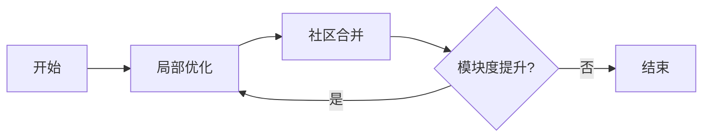

## 1. 背景介绍

社区发现（Community Detection）是网络科学领域的一个重要研究方向，它旨在揭示网络中的模块结构，即将网络划分为若干个社区，使得同一社区内的节点相互连接紧密，而不同社区之间的连接相对稀疏。Louvain算法是一种高效的社区发现算法，由Vincent D. Blondel等人于2008年提出，因其出色的性能和易于实现而广受欢迎。

## 2. 核心概念与联系

在深入Louvain算法之前，我们需要理解以下几个核心概念：

- **社区（Community）**：网络中的一组节点，这些节点内部的连接比与外部节点的连接更为紧密。
- **模块度（Modularity）**：用于量化社区划分质量的指标，模块度高意味着社区内部连接密集，而社区间连接稀疏。
- **层次优化（Hierarchical Optimization）**：Louvain算法采用的策略，通过逐层优化来发现社区结构。

## 3. 核心算法原理具体操作步骤

Louvain算法的操作步骤可以分为以下几个阶段：

1. **局部优化**：对每个节点，尝试将其移动到邻居节点的社区中，如果这样做可以增加模块度，则执行移动。
2. **社区合并**：将得到的社区视为新的节点，构建一个新的网络。
3. **重复步骤**：在新网络上重复步骤1和2，直到模块度不再增加。



## 4. 数学模型和公式详细讲解举例说明

模块度$Q$的定义为：

$$ Q = \frac{1}{2m} \sum_{ij} \left[ A_{ij} - \frac{k_i k_j}{2m} \right] \delta(c_i, c_j) $$

其中，$A_{ij}$表示节点$i$和$j$之间的边的权重，$k_i$是节点$i$的度，$m$是网络中所有边的权重之和，$c_i$是节点$i$所属的社区，$\delta$是克罗内克函数，当$c_i = c_j$时取1，否则取0。

## 5. 项目实践：代码实例和详细解释说明

以下是Louvain算法的Python代码实例：

```python
import community as community_louvain
import networkx as nx

# 创建网络
G = nx.les_miserables_graph()

# 应用Louvain算法
partition = community_louvain.best_partition(G)

# 打印社区成员
for community, nodes in partition.items():
    print(f"社区{community}: {list(nodes)}")
```

代码解释说明：

1. 导入`community`模块和`networkx`模块。
2. 创建一个网络`G`，这里使用的是经典的《悲惨世界》人物关系网络。
3. 使用`community_louvain.best_partition`函数来找到网络的最佳社区划分。
4. 打印出每个社区的成员。

## 6. 实际应用场景

Louvain算法在多个领域都有广泛的应用，例如：

- 社交网络分析：发现社交网络中的紧密联系群体。
- 生物信息学：识别功能相关的基因或蛋白质群组。
- 信息检索：提高搜索引擎的相关性通过识别主题相关的网页群组。

## 7. 工具和资源推荐

- **NetworkX**：Python语言的网络分析库，支持创建、操作复杂网络结构以及执行网络算法。
- **python-louvain**：一个Python实现的Louvain算法库，易于安装和使用。

## 8. 总结：未来发展趋势与挑战

Louvain算法由于其简单高效，在社区发现领域占据了重要地位。未来的发展趋势可能会集中在算法的并行化和优化上，以处理更大规模的网络。同时，如何更好地定义和量化社区，以及如何处理动态变化的网络，也是未来研究的挑战。

## 9. 附录：常见问题与解答

- **Q1**: Louvain算法的时间复杂度是多少？
- **A1**: Louvain算法的时间复杂度通常是线性的，但最坏情况下可能达到平方级别。

- **Q2**: 如何评价Louvain算法的社区划分结果？
- **A2**: 可以通过计算模块度来评价，模块度越高，社区划分的质量越好。

- **Q3**: Louvain算法是否适用于有向图或加权图？
- **A3**: 是的，Louvain算法可以应用于有向图和加权图。

作者：禅与计算机程序设计艺术 / Zen and the Art of Computer Programming