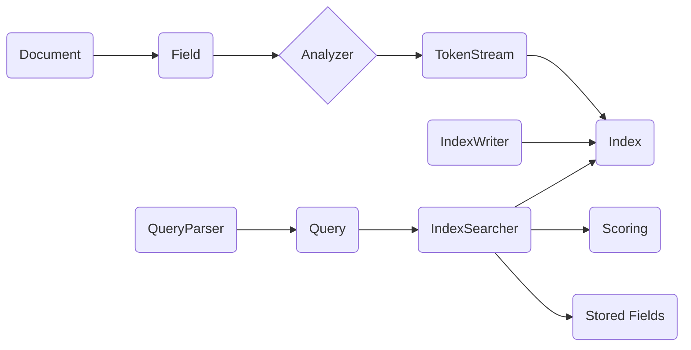

# Lucene原理与代码实例讲解

## 1.背景介绍
### 1.1 什么是Lucene
Lucene是一个高性能、可扩展的全文检索引擎工具包,由Apache软件基金会开发并提供支持。它不是一个完整的搜索应用程序,而是为你想要开发的应用程序提供了搜索功能。Lucene使用Java语言编写,目的是为软件开发人员提供一个简单易用的工具包,以方便地在他们的产品中实现全文检索的功能,或者是以Lucene为基础构建全文检索引擎。

### 1.2 为什么要学习Lucene
在大数据时代,海量数据的存储和检索是每个开发者都需要面对的问题。Lucene作为业界公认的高性能、高扩展、成熟的全文检索引擎,无疑是解决这一问题的利器。通过学习Lucene,你可以:

1. 掌握全文检索的基本原理
2. 理解倒排索引的核心概念
3. 学会如何使用Lucene构建搜索引擎
4. 了解Lucene的架构设计和扩展点
5. 积累搜索引擎优化的实践经验

无论你是Java工程师,还是大数据开发人员,学习Lucene都能让你在海量数据处理方面如虎添翼。

## 2.核心概念与联系
### 2.1 文档(Document)
文档是Lucene和索引与搜索的基本单元。文档包含了一个或多个存有数据的字段。每个字段都有一个名称和一个或多个值。字段值可以是文本、数字、日期等类型。 

### 2.2 字段(Field)
字段是文档的一部分,它是一个键值对。字段的名称可以重复,一个文档可以有多个相同名称的字段。字段有以下属性:

- 是否分词(Tokenized)
- 是否索引(Indexed)
- 是否存储(Stored)

### 2.3 分词器(Analyzer)
分词器用于将字段文本值拆分为词元(Token),以建立倒排索引。不同的语言和领域可以使用不同的分词器。Lucene内置了多种分词器,如StandardAnalyzer、WhitespaceAnalyzer等。

### 2.4 索引(Index)
索引是Lucene对文档搜索的核心数据结构。它是文档的集合,由多个Segment组成。索引的目的是为了加快搜索的速度。Lucene索引存储在磁盘上,以文件的形式存在。

### 2.5 索引写入(IndexWriter)
IndexWriter是用来写入和更新索引的主要类。通过IndexWriter可以添加、删除和更新文档。

### 2.6 搜索(Searching)
搜索是Lucene的核心功能。通过IndexSearcher类,Lucene可以在索引中快速找到与查询匹配的文档。搜索的过程是先对查询语句进行解析,生成查询对象,然后在索引中匹配文档。

### 2.7 查询解析器(QueryParser)
查询解析器是将用户输入的查询字符串解析成Lucene内部Query对象的组件。Lucene提供了多个查询解析器,如StandardQueryParser、MultiFieldQueryParser等。

### 2.8 查询(Query)
Query是一个抽象的类,代表了一个查询的各个组成部分,如词项(Term)、布尔操作(BooleanQuery)、模糊搜索(FuzzyQuery)等。通过组合各种Query,可以表达非常复杂的查询语义。

### 2.9 打分(Scoring)
打分是搜索引擎的重要功能,用于评估文档与查询的相关度。Lucene使用了TF-IDF算法来给文档评分,同时还支持自定义打分策略。

### 2.10 存储(Store)
存储是将文档的字段值完整地存储到索引中,以便于搜索时获取文档的原始内容。存储字段会增加索引文件的大小。

### 核心概念之间的关系


## 3.核心算法原理具体操作步骤
### 3.1 索引阶段
#### 3.1.1 文档解析
将原始文档内容解析为一系列的字段(Field),每个字段包含名称和值。

#### 3.1.2 字段处理 
对需要分词的字段调用分词器(Analyzer)进行分词,生成词元(Token)流。对不需要分词的字段,视为一个单独的词元。

#### 3.1.3 词元处理
对每个词元进行一系列处理,包括小写转换、停用词过滤、同义词处理、词干提取等,最终得到词(Term)。

#### 3.1.4 索引写入
对所有的词(Term)和文档ID建立倒排索引,即Term Dictionary和Posting List。同时,将需要存储的字段值写入存储文件。

### 3.2 搜索阶段  
#### 3.2.1 查询解析
将用户输入的查询字符串通过查询解析器(QueryParser)解析为Lucene内部的查询对象(Query)。

#### 3.2.2 查询重写
对查询对象进行一系列的重写和优化,如通配符、模糊搜索等Query重写为等价的组合查询。

#### 3.2.3 查询执行
通过索引搜索器(IndexSearcher)在倒排索引中执行查询,获取符合查询条件的文档ID。

#### 3.2.4 文档获取
通过文档ID从存储文件中获取文档的原始字段值。

#### 3.2.5 结果排序
根据相关度(Scoring)或其他排序规则对结果文档进行排序。

#### 3.2.6 结果高亮
对命中的关键词进行高亮处理,以便用户快速定位相关内容。

## 4.数学模型和公式详细讲解举例说明
Lucene的打分机制基于TF-IDF(Term Frequency-Inverse Document Frequency)算法。即文档的相关度由两部分组成:词频(TF)和逆文档频率(IDF)。

### 4.1 词频(TF)
词频指一个词在当前文档中出现的频率。词频越高,说明该词对表达文档主题越重要。Lucene中,词频是归一化的,计算公式为:
$$
tf(t,d) = \sqrt{frequency}
$$
其中,frequency表示词t在文档d中出现的次数。开方的目的是减少词频的影响。

### 4.2 逆文档频率(IDF)
逆文档频率用于衡量一个词的重要程度。如果一个词在很多文档中出现,那么它的区分度就低;反之如果一个词在比较少的文档中出现,那么它的区分度就高。IDF的计算公式为:
$$
idf(t) = 1 + \log(\frac{numDocs}{docFreq+1})
$$
其中,numDocs表示索引中的总文档数,docFreq表示包含该词的文档数。分母加1的目的是防止分母为0。

### 4.3 文档得分
一个文档d对查询q的最终得分为所有查询词的TF-IDF值求和,再乘以一些其他因子,如字段权重、协调因子等。计算公式为:  
$$
score(q,d) = \sum_{t \in q}(tf(t,d) \cdot idf(t)^2 \cdot boost(t) \cdot norm(d)) \cdot coord(q,d)
$$

其中,boost(t)是查询词的权重,norm(d)是文档长度归一值,coord(q,d)是协调因子,用于奖励那些包含更多查询词的文档。

举个例子,假设我们有以下两个文档:

- d1: "The quick brown fox jumps over the lazy dog"
- d2: "Quick fox jumps over lazy dog"

查询语句为:"quick fox"。那么两个文档对该查询的TF-IDF值计算如下:

对于d1:
- tf(quick, d1) = $\sqrt{1}$ = 1
- tf(fox, d1) = $\sqrt{1}$ = 1
- idf(quick) = 1 + $\log(\frac{2}{2})$ = 1
- idf(fox) = 1 + $\log(\frac{2}{2})$ = 1

score(q, d1) = $(1 \cdot 1^2 + 1 \cdot 1^2) \cdot \frac{2}{2}$ = 2

对于d2:  
- tf(quick, d2) = $\sqrt{1}$ = 1
- tf(fox, d2) = $\sqrt{1}$ = 1
- idf(quick) = 1 + $\log(\frac{2}{2})$ = 1 
- idf(fox) = 1 + $\log(\frac{2}{2})$ = 1

score(q, d2) = $(1 \cdot 1^2 + 1 \cdot 1^2) \cdot \frac{2}{2}$ = 2

可以看到,虽然d1比d2多了一些无关词,但是对于查询"quick fox",两个文档的得分是一样的。这就是TF-IDF的力量,它只关注那些对查询有区分度的词。

## 5.项目实践：代码实例和详细解释说明
下面我们通过一个简单的例子来演示如何使用Lucene进行索引和搜索。

### 5.1 创建索引
```java
//创建文档对象
Document doc1 = new Document();
doc1.add(new TextField("content", "The quick brown fox jumps over the lazy dog", Field.Store.YES));
doc1.add(new StringField("path", "doc1", Field.Store.YES));

Document doc2 = new Document();
doc2.add(new TextField("content", "Quick fox jumps over lazy dog", Field.Store.YES));        
doc2.add(new StringField("path", "doc2", Field.Store.YES));

//创建分词器  
Analyzer analyzer = new StandardAnalyzer();

//创建索引写入器配置
IndexWriterConfig config = new IndexWriterConfig(analyzer);

//创建索引目录
Directory directory = FSDirectory.open(Paths.get("index"));

//创建索引写入器  
IndexWriter writer = new IndexWriter(directory, config);

//写入文档
writer.addDocument(doc1);
writer.addDocument(doc2);

//提交并关闭索引写入器
writer.close();
```

上面的代码首先创建了两个文档对象,每个文档包含了两个字段:content和path。其中content字段是分词字段,path字段是不分词字段。

然后创建了标准分词器和索引写入器配置,并指定了索引存储目录。

接着创建索引写入器,将两个文档写入索引,最后提交并关闭索引写入器。

### 5.2 执行搜索
```java
//创建查询解析器
QueryParser parser = new QueryParser("content", new StandardAnalyzer());

//解析查询语句
Query query = parser.parse("quick fox");

//创建索引目录和索引读取器
Directory directory = FSDirectory.open(Paths.get("index"));
IndexReader reader = DirectoryReader.open(directory);

//创建索引搜索器
IndexSearcher searcher = new IndexSearcher(reader);

//执行搜索,返回前10个结果
TopDocs docs = searcher.search(query, 10);

//遍历搜索结果
for (ScoreDoc scoreDoc : docs.scoreDocs) {
    //获取文档ID
    int docID = scoreDoc.doc;
    //通过ID获取文档对象
    Document doc = searcher.doc(docID);
    //打印文档路径
    System.out.println(doc.get("path"));
}

//关闭索引读取器
reader.close();
```

上面的代码首先创建了一个查询解析器,并指定了StandardAnalyzer分词器。然后使用解析器解析查询语句"quick fox",得到一个查询对象。

接着创建索引目录和索引读取器,并基于读取器创建一个索引搜索器。

然后使用搜索器执行查询,搜索结果通过TopDocs对象返回,里面包含了排名靠前的文档。

最后遍历TopDocs,获取每个文档的ID,然后通过ID从搜索器中获取文档对象,并打印文档的path字段值。

## 6.实际应用场景
Lucene作为一个强大的全文检索库,在很多场景下都能发挥重要作用,下面列举几个常见的应用场景。

### 6.1 站内搜索
很多网站都需要为用户提供站内搜索功能,比如论坛、博客、新闻等。通过Lucene,可以轻松实现对网站内容的索引和搜索,提供快速、准确的搜索体验。

### 6.2 文档管理系统
对于企业内部的文档管理系统,如合同、客户资料、产品说明书等,通过Lucene可以建立一套灵活的文档检索系统,方便员工快速查找所需的文件。

### 6.3 日志分析
对于海量的系