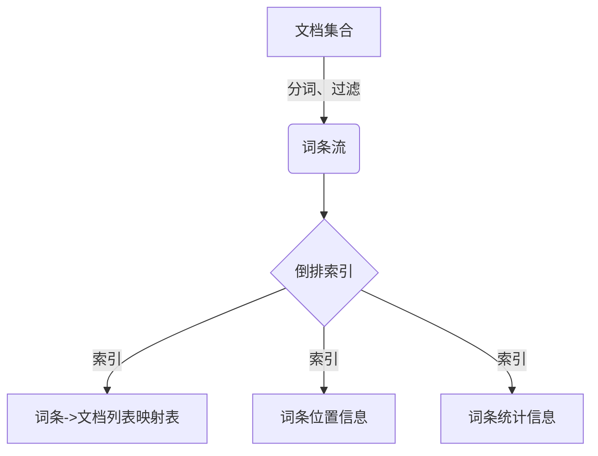
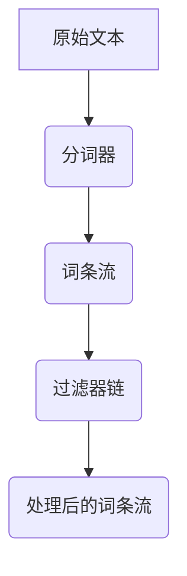
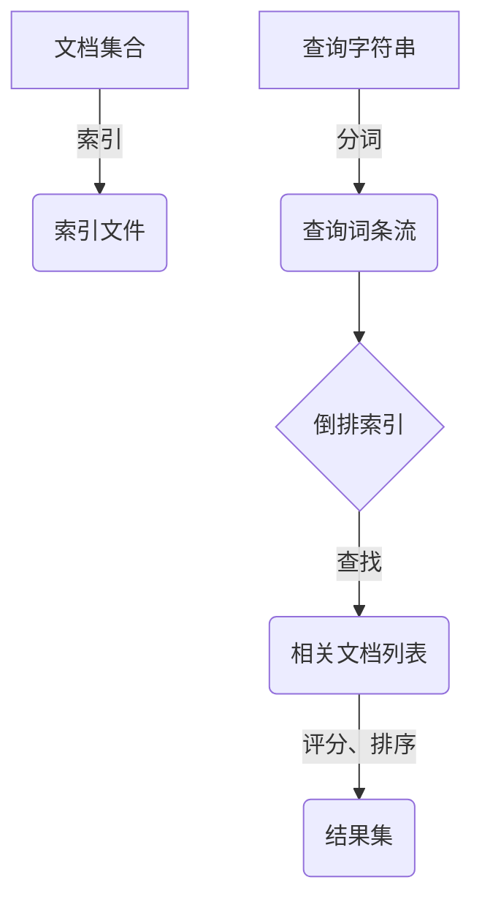
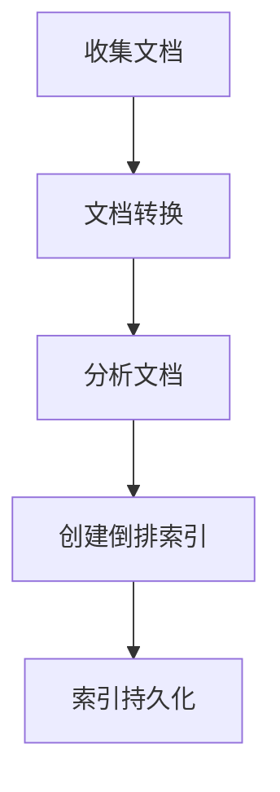
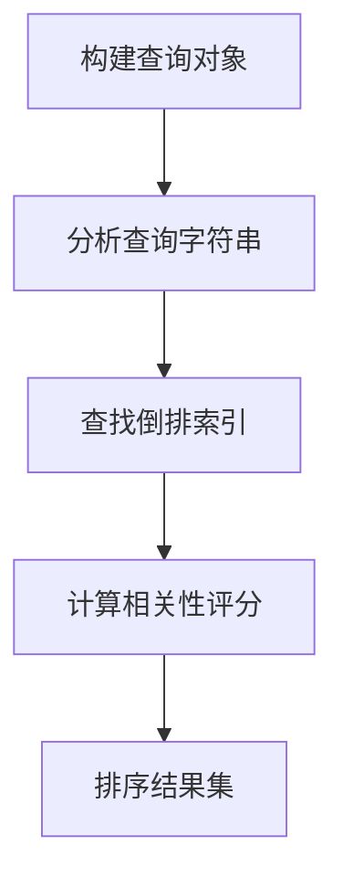

# Lucene开发最佳实践：构建高效可靠的搜索应用

## 1.背景介绍

在当今信息时代,数据量呈现爆炸式增长,如何高效地检索和利用这些海量数据成为了一个巨大的挑战。Apache Lucene是一个基于Java的高性能、全功能的搜索引擎库,被广泛应用于各种应用程序中,用于添加搜索功能。它提供了强大的索引和搜索功能,可以快速有效地从大量数据中检索相关信息。

Lucene的核心是一个简单却极其强大的基于倒排索引的搜索算法。它支持全文检索、多字段查询、模糊查询、近似查询、通配符查询等丰富的查询类型,并提供了分词、过滤、高亮等功能,可以满足各种复杂的搜索需求。同时,Lucene还具有高度可扩展性,可以通过插件机制进行功能扩展。

本文将深入探讨Lucene的核心概念、工作原理和最佳实践,帮助读者掌握Lucene的开发技巧,构建高效、可靠的搜索应用程序。

## 2.核心概念与联系

### 2.1 倒排索引

倒排索引是Lucene的核心数据结构,它将文档中的每个词条映射到包含该词条的文档列表。这种数据结构可以高效地支持全文搜索,因为它允许快速查找包含特定词条的所有文档。



### 2.2 分词器

分词器(Analyzer)负责将文本转换为一个个词条(Term)的流。Lucene提供了多种分词器,如标准分词器(StandardAnalyzer)、白空格分词器(WhitespaceAnalyzer)、英语分词器(EnglishAnalyzer)等,可以根据需求选择合适的分词器。



### 2.3 索引与搜索

Lucene将文档集合通过分词和建立倒排索引的过程转换为索引文件。搜索时,查询字符串也会经过分词处理,然后在倒排索引中查找相关文档。Lucene会根据相关性评分算法计算每个文档与查询的相关程度,并返回排序后的结果集。



## 3.核心算法原理具体操作步骤

### 3.1 索引创建流程

1. **收集文档**：从数据源(如文件系统、数据库等)收集待索引的文档。
2. **文档转换**：将文档转换为Lucene可识别的文档对象(Document)。
3. **分析文档**：使用分词器(Analyzer)将文档内容分解为词条流。
4. **创建倒排索引**：遍历词条流,为每个词条创建倒排索引条目,包括词条->文档列表的映射、词条位置信息和词条统计信息。
5. **索引持久化**：将内存中的倒排索引数据结构写入磁盘,形成索引文件。



### 3.2 搜索查询流程

1. **构建查询对象**：根据用户输入的查询字符串,构建Lucene查询对象(Query)。
2. **分析查询字符串**：使用分词器(Analyzer)将查询字符串分解为词条流。
3. **查找倒排索引**：在倒排索引中查找与查询词条相关的文档列表。
4. **计算相关性评分**：使用相关性评分算法(如TF-IDF、BM25等)计算每个文档与查询的相关程度。
5. **排序结果集**：根据评分结果对文档进行排序,形成最终的结果集。



## 4.数学模型和公式详细讲解举例说明

### 4.1 TF-IDF算法

TF-IDF(Term Frequency-Inverse Document Frequency)是一种常用的相关性评分算法,它将文档相关性分解为两个部分:词条频率(TF)和逆文档频率(IDF)。

**词条频率(TF):**
$$
TF(t,d) = \frac{freq(t,d)}{max\_freq(d)}
$$
其中,`freq(t,d)`表示词条`t`在文档`d`中出现的次数,`max_freq(d)`表示文档`d`中出现次数最多的词条的频率。

**逆文档频率(IDF):**
$$
IDF(t,D) = \log\frac{|D|}{df(t,D)} + 1
$$
其中,`|D|`表示语料库中文档的总数,`df(t,D)`表示包含词条`t`的文档数量。

**TF-IDF评分:**
$$
Score(t,d,D) = TF(t,d) \times IDF(t,D)
$$
文档`d`与查询`q`的相关性评分为查询中所有词条的TF-IDF评分之和:
$$
Score(q,d,D) = \sum_{t\in q}Score(t,d,D)
$$

例如,假设我们有一个包含3个文档的语料库:

- D1: "The cat sat on the mat."
- D2: "The cat ate the rat."
- D3: "The dog chased the cat."

对于查询"cat"来说,各文档的TF-IDF评分如下:

- D1: TF(cat, D1) = 1/2, IDF(cat, D) = log(3/3) + 1 = 1, Score(cat, D1, D) = 1/2 * 1 = 0.5
- D2: TF(cat, D2) = 1/2, IDF(cat, D) = 1, Score(cat, D2, D) = 1/2 * 1 = 0.5
- D3: TF(cat, D3) = 1/2, IDF(cat, D) = 1, Score(cat, D3, D) = 1/2 * 1 = 0.5

可以看出,三个文档对于查询"cat"的相关性评分相同,因为它们都包含一次"cat"这个词条。

### 4.2 BM25算法

BM25是一种改进的相关性评分算法,它考虑了文档长度对评分的影响。BM25算法的公式如下:

$$
Score(q,d) = \sum_{t\in q}IDF(t) \times \frac{tf(t,d) \times (k_1 + 1)}{tf(t,d) + k_1 \times (1 - b + b \times \frac{|d|}{avgdl})}
$$

其中:

- `IDF(t)`是词条`t`的逆文档频率,与TF-IDF算法中的定义相同。
- `tf(t,d)`是词条`t`在文档`d`中出现的次数。
- `|d|`是文档`d`的长度(词条数量)。
- `avgdl`是语料库中所有文档的平均长度。
- `k1`和`b`是调节参数,通常取值`k1 = 1.2`和`b = 0.75`。

BM25算法通过引入文档长度的因素,可以更好地处理长文档和短文档之间的差异。对于长文档,算法会适当降低其评分,避免长文档过于占优。

例如,假设我们有两个文档:

- D1: "The cat sat on the mat."
- D2: "The cat ate the rat. The cat chased the mouse. The cat played with the toy."

对于查询"cat"来说,各文档的BM25评分如下(假设`k1 = 1.2`,`b = 0.75`,`avgdl = 6`):

- D1: `tf(cat, D1) = 1`, `|D1| = 5`, `Score(cat, D1) = log(3/3) * (1 * (1.2 + 1)) / (1 + 1.2 * (1 - 0.75 + 0.75 * 5/6)) = 0.69`
- D2: `tf(cat, D2) = 3`, `|D2| = 12`, `Score(cat, D2) = log(3/3) * (3 * (1.2 + 1)) / (3 + 1.2 * (1 - 0.75 + 0.75 * 12/6)) = 1.39`

可以看出,虽然D2比D1长,但由于BM25算法考虑了文档长度的影响,D2的评分更高,这更符合直观预期。

## 5.项目实践:代码实例和详细解释说明

### 5.1 创建索引

```java
// 1. 创建索引写入器
Directory directory = FSDirectory.open(Paths.get("index"));
IndexWriterConfig config = new IndexWriterConfig(new StandardAnalyzer());
IndexWriter indexWriter = new IndexWriter(directory, config);

// 2. 添加文档到索引
Document doc1 = new Document();
doc1.add(new TextField("content", "The cat sat on the mat.", Field.Store.YES));
indexWriter.addDocument(doc1);

Document doc2 = new Document();
doc2.add(new TextField("content", "The cat ate the rat.", Field.Store.YES));
indexWriter.addDocument(doc2);

// 3. 提交并关闭索引写入器
indexWriter.commit();
indexWriter.close();
```

1. 首先,我们创建一个`IndexWriter`对象,用于将文档写入索引。`FSDirectory`表示索引文件将存储在本地文件系统中的"index"目录下。`StandardAnalyzer`是一种常用的分词器,用于将文档内容分解为词条流。

2. 接下来,我们创建两个`Document`对象,每个文档包含一个"content"字段,存储文档的文本内容。我们使用`TextField`类型来存储文本,并指定`Field.Store.YES`以便在搜索结果中返回完整的文档内容。

3. 最后,我们调用`addDocument`方法将文档添加到索引中,并调用`commit`方法将内存中的索引数据写入磁盘。关闭`IndexWriter`以释放资源。

### 5.2 搜索查询

```java
// 1. 创建索引读取器
Directory directory = FSDirectory.open(Paths.get("index"));
IndexReader indexReader = DirectoryReader.open(directory);

// 2. 创建查询对象
String queryString = "cat";
Analyzer analyzer = new StandardAnalyzer();
QueryParser queryParser = new QueryParser("content", analyzer);
Query query = queryParser.parse(queryString);

// 3. 执行搜索并获取结果
IndexSearcher indexSearcher = new IndexSearcher(indexReader);
TopDocs topDocs = indexSearcher.search(query, 10);
ScoreDoc[] scoreDocs = topDocs.scoreDocs;

// 4. 处理搜索结果
for (ScoreDoc scoreDoc : scoreDocs) {
    Document doc = indexSearcher.doc(scoreDoc.doc);
    System.out.println("Score: " + scoreDoc.score);
    System.out.println("Content: " + doc.get("content"));
}

// 5. 关闭索引读取器
indexReader.close();
```

1. 首先,我们创建一个`IndexReader`对象,用于从磁盘读取索引数据。`FSDirectory`指定索引文件所在的目录。

2. 接下来,我们创建一个`QueryParser`对象,用于解析查询字符串并构建`Query`对象。我们使用`StandardAnalyzer`作为分词器,并指定要搜索的字段为"content"。

3. 调用`IndexSearcher`的`search`方法执行搜索查询,并获取前10个最相关的文档。`TopDocs`对象包含了这些文档的相关性评分和文档ID。

4. 我们遍历`TopDocs`中的`ScoreDoc`对象,使用`IndexSearcher`的`doc`方法获取完整的`Document`对象,并输出相关性评分和文档内容。

5. 最后,关闭`IndexReader`以释放资源。

### 5.3 高亮显示

Lucene还提供了高亮显示功能,可以在搜索结果中突出显示匹配的词条。

```java
// 1. 创建高亮器
QueryScorer scorer = new QueryScorer(query);
Fragmenter fragmenter = new SimpleSpanFragmenter(scorer);
Highlighter highlighter = new Highlighter(formatter, scorer);
highlighter.setTextFragmenter(fragmenter);

// 2. 获取高