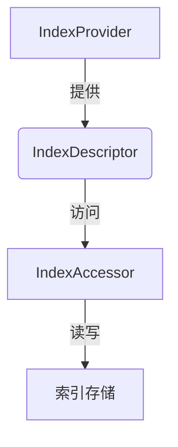
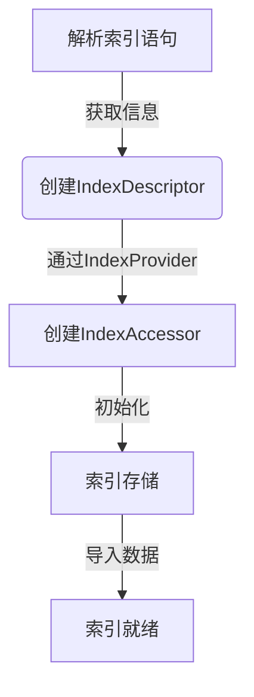
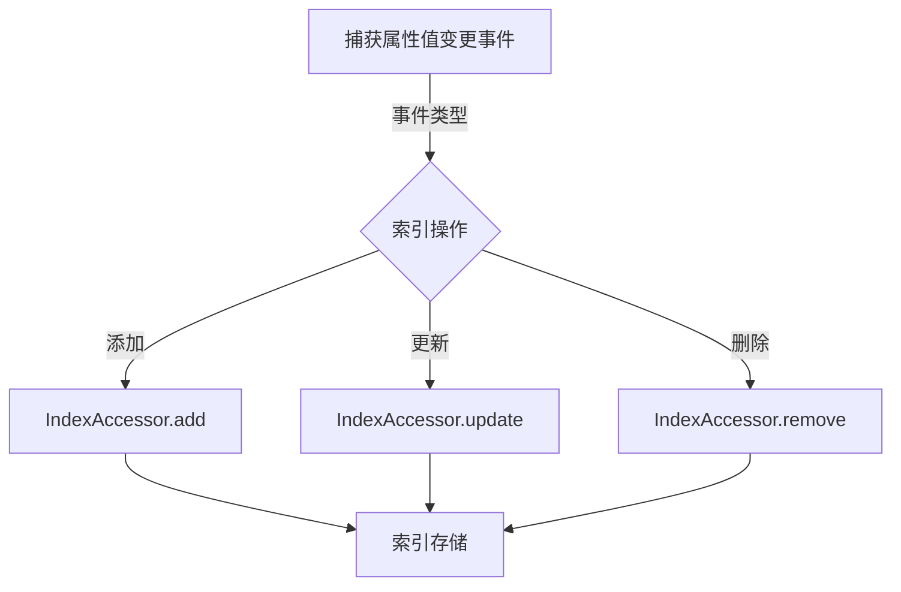
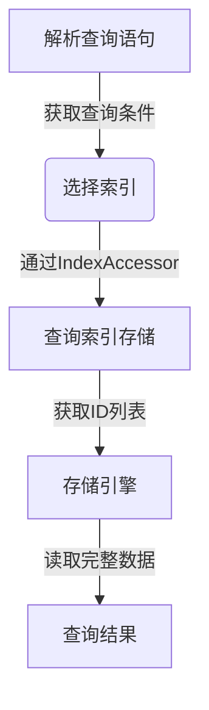

# Neo4j索引机制深度剖析

## 1.背景介绍

### 1.1 什么是Neo4j

Neo4j是一种高性能的NoSQL图形数据库,专门处理高度相连的数据。作为一种图形数据库,Neo4j能够高效地构建、存储和导航属性图形结构,非常适合处理复杂的数据建模场景。

### 1.2 Neo4j的应用场景

Neo4j广泛应用于社交网络、推荐引擎、欺诈检测、生物信息学等领域。其强大的图形处理能力可以轻松处理复杂的数据关系查询。

### 1.3 索引在数据库中的作用

在数据库系统中,索引扮演着至关重要的角色。索引是一种数据结构,可以加快数据的检索速度。在没有索引的情况下,数据库需要进行全表扫描,这在数据量较大时会导致查询效率低下。而有了索引,数据库可以快速定位到符合查询条件的数据,从而大大提高查询效率。

## 2.核心概念与联系

### 2.1 Neo4j索引概述

Neo4j支持对节点和关系的属性建立索引。索引可以加快属性的查找速度,提高查询性能。Neo4j提供了多种索引类型,包括节点索引、关系索引、全文索引和复合索引等。

### 2.2 节点索引

节点索引是Neo4j中最基本的索引类型。它可以为节点的属性值建立索引,加快对节点的查找速度。节点索引支持等值查询、范围查询和正则表达式查询。

```java
// 创建节点索引
CREATE INDEX ON :Person(name)

// 查询使用索引
MATCH (p:Person)
WHERE p.name = 'John'
RETURN p
```

### 2.3 关系索引

关系索引可以为关系的属性值建立索引,加快对关系的查找速度。关系索引支持等值查询和范围查询。

```java
// 创建关系索引
CREATE INDEX ON :Person-[:KNOWS]->(friend:Person)

// 查询使用索引 
MATCH (p:Person)-[r:KNOWS]->(friend:Person)
WHERE r.since > 2010
RETURN p, friend
```

### 2.4 全文索引

全文索引可以为节点或关系的属性值建立全文索引,支持全文搜索。全文索引使用Apache Lucene库实现,可以提供高效的全文搜索功能。

```java
// 创建全文索引
CALL db.index.fulltext.addNode("personIndex", ["Person"], ["name", "bio"])

// 全文搜索
CALL db.index.fulltext.queryNodes("personIndex", "John")
YIELD node, score
RETURN node
```

### 2.5 复合索引

复合索引可以为多个属性值建立组合索引,加快对多个属性的组合查询。复合索引可以应用于节点或关系。

```java
// 创建复合索引
CREATE INDEX ON :Person(name, age)

// 查询使用复合索引
MATCH (p:Person)
WHERE p.name = 'John' AND p.age > 30
RETURN p
```

### 2.6 Neo4j索引架构概述

Neo4j的索引架构由多个组件组成,包括索引提供者(IndexProvider)、索引描述符(IndexDescriptor)、索引访问器(IndexAccessor)等。这些组件协同工作,实现了高效的索引创建、更新和查询功能。



## 3.核心算法原理具体操作步骤

### 3.1 索引创建过程

Neo4j的索引创建过程包括以下几个步骤:

1. 解析索引语句,获取索引类型、标签/关系类型和属性列表。
2. 根据索引类型和属性列表,创建索引描述符(IndexDescriptor)对象。
3. 通过索引提供者(IndexProvider)创建索引访问器(IndexAccessor)对象。
4. 使用索引访问器初始化索引存储,包括创建索引文件和内存数据结构。
5. 将已存在的数据导入索引。



### 3.2 索引更新过程

当节点或关系的属性值发生变化时,Neo4j会自动更新相应的索引:

1. 捕获属性值变更事件。
2. 根据事件类型(添加、更新或删除),执行相应的索引操作。
3. 通过索引访问器读取或修改索引存储中的数据。



### 3.3 索引查询过程

当执行查询语句时,Neo4j会利用索引加速查询:

1. 解析查询语句,获取查询条件。
2. 根据查询条件,选择合适的索引。
3. 通过索引访问器查询索引存储,获取符合条件的节点或关系ID列表。
4. 根据ID列表,从存储引擎中读取完整的节点或关系数据。



## 4.数学模型和公式详细讲解举例说明

### 4.1 B+树索引

Neo4j的属性索引使用B+树数据结构实现。B+树是一种平衡树,具有高效的查找、插入和删除操作。

B+树的数学模型如下:

- 设树的阶数为m,则每个节点最多有m-1个关键字。
- 根节点至少有两个子节点,除根节点外,其他节点至少有 $\lceil m/2 \rceil$ 个子节点。
- 所有叶子节点位于同一层,叶子节点之间有链表相连。

B+树的查找、插入和删除算法复杂度为 $O(\log_m N)$,其中N为索引项的数量。

### 4.2 全文索引向量空间模型

Neo4j的全文索引使用向量空间模型(Vector Space Model)来表示文本数据。每个文档被表示为一个向量,其中每个维度对应一个词项的权重。

向量空间模型中,文档向量 $\vec{d}$ 和查询向量 $\vec{q}$ 的相似度可以用余弦相似度来计算:

$$
\text{sim}(\vec{d}, \vec{q}) = \frac{\vec{d} \cdot \vec{q}}{|\vec{d}||\vec{q}|} = \frac{\sum_{i=1}^{n} w_{d,i} w_{q,i}}{\sqrt{\sum_{i=1}^{n} w_{d,i}^2} \sqrt{\sum_{i=1}^{n} w_{q,i}^2}}
$$

其中 $w_{d,i}$ 和 $w_{q,i}$ 分别表示文档向量和查询向量在第i个维度上的权重。

Neo4j使用BM25算法计算词项权重,公式如下:

$$
w_{d,i} = \frac{(k_1 + 1) \times \text{tf}_{d,i}}{K + \text{tf}_{d,i}} \times \log \frac{N - \text{df}_i + 0.5}{\text{df}_i + 0.5}
$$

其中 $\text{tf}_{d,i}$ 表示词项i在文档d中出现的频率, $\text{df}_i$ 表示包含词项i的文档数量, $N$ 表示总文档数量, $k_1$ 和 $K$ 是调节因子。

## 5.项目实践：代码实例和详细解释说明

### 5.1 创建节点索引

```java
// 创建节点索引
CREATE INDEX ON :Person(name)

// 查询使用索引
MATCH (p:Person)
WHERE p.name = 'John'
RETURN p
```

在上面的示例中,我们为Person节点的name属性创建了一个索引。在查询时,Neo4j会自动利用这个索引加速对name属性的等值查询。

### 5.2 创建关系索引

```java
// 创建关系索引
CREATE INDEX ON :(Person)-[r:KNOWS]->(friend:Person)

// 查询使用索引
MATCH (p:Person)-[r:KNOWS]->(friend:Person)
WHERE r.since > 2010
RETURN p, friend
```

这个示例为KNOWS关系的since属性创建了一个索引。在查询时,Neo4j会利用这个索引加速对since属性的范围查询。

### 5.3 创建全文索引

```java
// 创建全文索引
CALL db.index.fulltext.addNode("personIndex", ["Person"], ["name", "bio"])

// 全文搜索
CALL db.index.fulltext.queryNodes("personIndex", "John")
YIELD node, score
RETURN node
```

上面的示例创建了一个全文索引,包含Person节点的name和bio属性。我们可以使用CALL db.index.fulltext.queryNodes过程调用执行全文搜索。

### 5.4 创建复合索引

```java
// 创建复合索引
CREATE INDEX ON :Person(name, age)

// 查询使用复合索引
MATCH (p:Person)
WHERE p.name = 'John' AND p.age > 30
RETURN p
```

这个示例为Person节点的name和age属性创建了一个复合索引。在查询时,Neo4j会利用这个索引加速对name和age属性的组合查询。

## 6.实际应用场景

### 6.1 社交网络

在社交网络应用中,Neo4j可以高效地存储和查询用户之间的关系数据。我们可以为用户节点的属性(如姓名、年龄等)创建索引,加快对用户信息的查询。同时,也可以为用户关系(如好友关系)的属性创建索引,加快对关系的查询。

### 6.2 推荐引擎

推荐引擎需要分析用户的历史行为数据,以及物品之间的相似性,从而为用户推荐感兴趣的物品。Neo4j可以将用户、物品和行为数据建模为图结构,并利用索引加速对这些数据的查询和分析。

### 6.3 欺诈检测

在金融领域,Neo4j可以用于构建欺诈检测系统。我们可以将交易数据、账户信息等建模为图结构,并为关键属性创建索引。通过图形查询和索引,我们可以快速发现异常交易模式,从而及时发现和防止欺诈行为。

### 6.4 生物信息学

在生物信息学领域,Neo4j可以用于存储和分析基因组数据、蛋白质相互作用网络等。我们可以为基因或蛋白质的属性创建索引,加快对这些数据的查询和分析。

## 7.工具和资源推荐

### 7.1 Neo4j Desktop

Neo4j Desktop是Neo4j官方提供的图形化工具,可以方便地管理Neo4j数据库实例、运行Cypher查询、可视化数据等。它支持多种操作系统,是学习和使用Neo4j的好工具。

### 7.2 Neo4j Browser

Neo4j Browser是一个基于Web的图形化界面,内置在Neo4j服务器中。它提供了编写和执行Cypher查询的界面,以及可视化查询结果的功能。Neo4j Browser是探索和理解Neo4j数据的好方法。

### 7.3 Neo4j驱动程序

Neo4j提供了多种编程语言的官方驱动程序,如Java驱动、Python驱动、JavaScript驱动等。这些驱动程序可以方便地将应用程序与Neo4j数据库集成,执行CRUD操作和图形查询。

### 7.4 Neo4j在线培训

Neo4j官方网站提供了丰富的在线培训资源,包括视频教程、文档和示例代码。这些资源可以帮助开发者快速掌握Neo4j的使用方法和最佳实践。

## 8.总结:未来发展趋势与挑战

### 8.1 图数据库的发展趋势

随着大数据时代的到来,越来越多的数据具有复杂的关系结构,传统的关系数据库和NoSQL数据库都难以高效地处理这些数据。因此,图数据库凭借其优秀的关系查询能力,在许多领域受到广泛关注和应用。

未来,图数据库将继续在社交