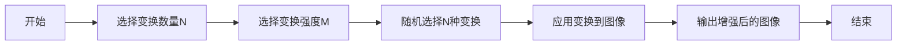

# RandAugment与边缘计算

## 1. 背景介绍

在深度学习领域，数据增强是一种常见的技术，用于通过对训练数据进行变换来扩充数据集，从而提高模型的泛化能力。RandAugment是一种新型的数据增强方法，它通过随机选择和组合多种简单的图像变换操作来增强数据，有效减少了超参数的数量，简化了增强策略的搜索过程。

边缘计算作为一种新兴的计算范式，旨在将数据处理从云端迁移到网络边缘，以减少延迟，提高响应速度，并减轻中心服务器的负担。在边缘计算环境中，资源受限的设备需要运行复杂的深度学习模型，这就要求模型必须具有高效的计算性能和良好的泛化能力。

本文将探讨RandAugment在边缘计算环境中的应用，分析其对提升边缘设备上深度学习模型性能的潜在影响，并讨论实现这一目标的具体策略。

## 2. 核心概念与联系

### 2.1 数据增强的意义

数据增强通过对原始数据进行变换，创造出新的训练样本，有助于模型学习到更加鲁棒的特征表示，提高模型对未见数据的预测能力。

### 2.2 RandAugment的创新点

RandAugment的核心在于其随机性和简洁性。它不需要复杂的超参数搜索过程，只需设定两个主要的超参数：变换的数量和变换的强度。

### 2.3 边缘计算的特点

边缘计算强调在接近数据源头的位置进行数据处理，以此减少数据传输时间，提高实时性，并降低对中心数据中心的依赖。

### 2.4 RandAugment与边缘计算的结合

结合RandAugment和边缘计算可以在数据预处理阶段提升模型的泛化能力，同时减少模型在边缘设备上的计算负担。

## 3. 核心算法原理具体操作步骤

### 3.1 RandAugment算法流程



### 3.2 具体操作步骤

1. 确定变换操作集合，包括旋转、翻转、缩放等基本图像处理操作。
2. 随机选择N种变换操作。
3. 对每种变换操作设置强度M，控制变换的程度。
4. 将选定的变换依次应用到图像上，生成增强后的图像。

## 4. 数学模型和公式详细讲解举例说明

### 4.1 RandAugment的数学模型

RandAugment可以被视为一个随机变换函数集合的组合，数学表示为：

$$ T = \{t_1, t_2, ..., t_k\} $$

其中，$t_i$ 是一个图像变换函数，$k$ 是变换集合的大小。

### 4.2 变换强度的量化

变换强度M可以通过一个连续或离散的参数来控制，例如：

$$ M \in [0, 1] $$

或

$$ M \in \{0, 0.1, 0.2, ..., 1\} $$

### 4.3 举例说明

假设选择了旋转和翻转两种变换，旋转的强度为0.5，翻转的概率为0.5，则增强后的图像可以表示为：

$$ I' = t_{flip}(t_{rotate}(I, M_{rotate}=0.5), M_{flip}=0.5) $$

其中，$I$ 是原始图像，$I'$ 是增强后的图像。

## 5. 项目实践：代码实例和详细解释说明

### 5.1 环境准备

```python
import numpy as np
import matplotlib.pyplot as plt
from PIL import Image
import random
```

### 5.2 RandAugment实现代码

```python
def random_rotate(image, max_angle):
    angle = random.uniform(-max_angle, max_angle)
    return image.rotate(angle)

def random_flip(image, p=0.5):
    if random.random() < p:
        return image.transpose(Image.FLIP_LEFT_RIGHT)
    return image

def randaugment(image, N, M):
    transforms = [random_rotate, random_flip]  # 变换操作集合
    selected_transforms = random.sample(transforms, N)  # 随机选择N种变换
    for transform in selected_transforms:
        image = transform(image, M)  # 应用变换
    return image
```

### 5.3 使用示例

```python
# 加载图像
original_image = Image.open('example.jpg')

# 应用RandAugment
augmented_image = randaugment(original_image, N=2, M=0.5)

# 显示图像
plt.imshow(augmented_image)
plt.show()
```

## 6. 实际应用场景

### 6.1 自动驾驶

在自动驾驶系统中，通过RandAugment增强的图像数据可以帮助模型更好地识别不同光照和天气条件下的道路情况。

### 6.2 医疗影像分析

医疗影像分析中，RandAugment可以用于增强少量的病例图像，提高模型在诊断不同疾病时的准确性。

### 6.3 智能监控

在智能监控领域，RandAugment可以提高模型对于不同角度和距离下目标的识别能力。

## 7. 工具和资源推荐

- TensorFlow和PyTorch：两个流行的深度学习框架，都有实现RandAugment的库和插件。
- PIL和OpenCV：常用的图像处理库，可以用于实现RandAugment中的图像变换操作。
- EdgeX Foundry：一个开源的边缘计算平台，可以用于部署和管理边缘计算应用。

## 8. 总结：未来发展趋势与挑战

随着边缘计算的发展，将会有更多的深度学习模型部署在边缘设备上。RandAugment作为一种高效的数据增强方法，可以帮助这些模型更好地适应边缘计算环境中的数据变化和资源限制。未来的挑战包括如何进一步优化RandAugment以适应更多种类的数据和任务，以及如何在保证模型性能的同时减少边缘设备的计算和存储需求。

## 9. 附录：常见问题与解答

### Q1: RandAugment适用于哪些类型的数据？

A1: RandAugment主要适用于图像数据，但其核心思想可以扩展到其他类型的数据，如文本和音频。

### Q2: 如何选择RandAugment的超参数N和M？

A2: N和M的选择通常依赖于具体任务和数据集。一般可以通过实验来确定最佳的参数设置。

### Q3: 在边缘计算环境中，如何平衡模型的性能和资源消耗？

A3: 可以通过模型压缩、量化和剪枝等技术来减小模型大小，同时使用RandAugment等数据增强技术来保持模型性能。

作者：禅与计算机程序设计艺术 / Zen and the Art of Computer Programming