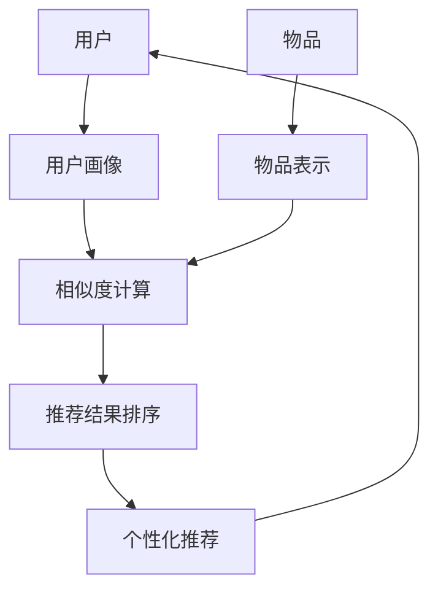

# Recommendation Systems原理与代码实例讲解

## 1. 背景介绍
### 1.1 推荐系统的发展历程
### 1.2 推荐系统在各领域的应用现状
### 1.3 推荐系统面临的机遇与挑战

## 2. 核心概念与联系  
### 2.1 推荐系统的定义与分类
#### 2.1.1 基于内容的推荐
#### 2.1.2 协同过滤推荐
#### 2.1.3 混合推荐
### 2.2 用户画像与物品表示
#### 2.2.1 用户画像的构建
#### 2.2.2 物品表示的方法
### 2.3 相似度计算与排序
#### 2.3.1 相似度计算方法
#### 2.3.2 推荐结果排序策略

## 3. 核心算法原理具体操作步骤
### 3.1 基于内容的推荐算法
#### 3.1.1 TF-IDF算法
#### 3.1.2 Word2Vec算法
### 3.2 协同过滤推荐算法 
#### 3.2.1 基于用户的协同过滤
#### 3.2.2 基于物品的协同过滤
#### 3.2.3 矩阵分解算法
### 3.3 深度学习推荐算法
#### 3.3.1 深度神经网络推荐
#### 3.3.2 循环神经网络推荐
#### 3.3.3 图神经网络推荐

## 4. 数学模型和公式详细讲解举例说明
### 4.1 矩阵分解模型
#### 4.1.1 奇异值分解(SVD)
#### 4.1.2 非负矩阵分解(NMF) 
### 4.2 概率图模型
#### 4.2.1 隐语义模型(LSA/pLSA)
#### 4.2.2 主题模型(LDA)
### 4.3 深度学习模型  
#### 4.3.1 多层感知机(MLP)
#### 4.3.2 卷积神经网络(CNN)
#### 4.3.3 循环神经网络(RNN)

## 5. 项目实践：代码实例和详细解释说明
### 5.1 基于TensorFlow实现矩阵分解
### 5.2 基于PyTorch实现深度神经网络推荐
### 5.3 基于Gensim实现LDA主题模型
### 5.4 基于NetworkX实现图推荐算法
### 5.5 基于Surprise库实现经典推荐算法

## 6. 实际应用场景
### 6.1 电商平台商品推荐 
### 6.2 视频网站个性化推荐
### 6.3 社交网络好友推荐
### 6.4 音乐平台歌曲推荐
### 6.5 新闻app文章推荐

## 7. 工具和资源推荐
### 7.1 开源推荐系统框架
#### 7.1.1 LibRec
#### 7.1.2 LightFM
#### 7.1.3 Surprise
### 7.2 主流深度学习框架
#### 7.2.1 TensorFlow
#### 7.2.2 PyTorch  
### 7.3 相关数据集资源
#### 7.3.1 MovieLens
#### 7.3.2 Amazon Product Data
#### 7.3.3 Yelp Dataset

## 8. 总结：未来发展趋势与挑战
### 8.1 个性化与多样性的平衡
### 8.2 推荐的公平性与透明性
### 8.3 在线学习与实时推荐
### 8.4 跨域推荐与迁移学习
### 8.5 对抗生成网络在推荐中的应用

## 9. 附录：常见问题与解答
### 9.1 如何解决冷启动问题？
### 9.2 如何平衡准确率和多样性？
### 9.3 如何评估推荐系统的效果？ 
### 9.4 如何处理稀疏数据问题？
### 9.5 推荐系统存在哪些潜在风险？

推荐系统是利用大数据和人工智能技术，通过分析用户的历史行为数据，挖掘用户的兴趣偏好，从而主动为用户推荐感兴趣的内容或物品的一种智能应用。它广泛应用于电商、视频、社交等领域，为用户提供个性化的服务体验，提高用户粘性和满意度，同时也为平台带来更多的商业价值。

推荐系统主要分为以下三类：

1. 基于内容的推荐(Content-based Recommendation)：通过分析物品本身的内容特征，如文本、图像等，计算物品之间的相似度，然后根据用户的历史偏好，推荐与其喜欢的物品相似的其他物品。

2. 协同过滤推荐(Collaborative Filtering)：通过分析用户或物品之间的相互作用数据，如用户的浏览、评分、购买记录等，发现用户或物品之间的相似性，然后利用相似用户或物品的偏好，为目标用户推荐感兴趣的物品。协同过滤又分为基于用户的协同过滤和基于物品的协同过滤。

3. 混合推荐(Hybrid Recommendation)：综合利用基于内容和协同过滤的方法，取长补短，提高推荐的准确性和多样性。常见的混合策略有加权混合、分层混合、特征组合等。

推荐系统的核心是用户画像和物品表示。用户画像是对用户各种属性和行为的抽象表示，可以通过人口统计学特征、兴趣标签、行为序列等方式构建。物品表示是对物品内容和属性的结构化表示，可以使用关键词、主题、嵌入向量等方法实现。

相似度计算是推荐系统的关键步骤，常用的相似度度量有欧氏距离、余弦相似度、皮尔逊相关系数、jaccard系数等。推荐结果的生成需要综合考虑相似度、新颖度、多样性等因素，常见的排序策略有TOP-N推荐、基于隐因子的排序等。

下面通过一个流程图来直观展示推荐系统的基本架构和工作流程：



推荐系统的核心算法主要包括：

1. 基于内容的推荐算法：
- TF-IDF：通过统计词频和逆文档频率，对文本内容进行关键词提取和权重计算，生成物品的特征向量。
- Word2Vec：通过浅层神经网络，学习文本的词嵌入表示，捕捉词语之间的语义关系，将词语映射到低维空间。

2. 协同过滤推荐算法：
- 基于用户的协同过滤：计算用户之间的相似度，为目标用户推荐相似用户喜欢的物品。
- 基于物品的协同过滤：计算物品之间的相似度，为目标用户推荐与其喜欢的物品相似的其他物品。
- 矩阵分解：通过将高维稀疏的用户-物品评分矩阵分解为低维稠密的用户和物品隐向量，来预测用户对未评分物品的偏好。

3. 深度学习推荐算法：
- 深度神经网络：使用多层感知机、卷积神经网络等模型，学习用户和物品的非线性特征交互，捕捉复杂的偏好模式。
- 循环神经网络：使用LSTM、GRU等模型，建模用户的序列行为数据，挖掘时间动态演化的偏好。  
- 图神经网络：使用GCN、GAT等模型，在用户-物品二部图上传播信息，学习图结构信息，增强表示学习能力。

推荐系统的数学建模主要涉及以下几类模型：

1. 矩阵分解模型：
- 奇异值分解(SVD)：将评分矩阵 $R$ 分解为用户隐空间 $U$、奇异值 $\Sigma$ 和物品隐空间 $V$ 的乘积，即 $R=U\Sigma V^T$。
- 非负矩阵分解(NMF)：在矩阵分解的基础上，引入非负约束，使得分解后的隐因子具有可解释性，即 $R=WH$，其中 $W$ 和 $H$ 都是非负矩阵。

2. 概率图模型：
- 隐语义模型(LSA/pLSA)：通过引入隐变量（主题），对文本-词语共现矩阵进行概率分解，挖掘词语之间的隐含语义关系。
- 主题模型(LDA)：在pLSA的基础上引入狄利克雷先验，通过贝叶斯推断学习文本的主题分布和主题-词语分布，实现无监督主题挖掘。

3. 深度学习模型：
- 多层感知机(MLP)：通过多层神经元的级联，学习用户和物品的高阶非线性特征交互。
- 卷积神经网络(CNN)：通过卷积和池化操作，提取局部特征，捕捉用户和物品的空间结构信息。
- 循环神经网络(RNN)：通过递归连接和门控机制，建模用户的时序行为，挖掘动态演化的偏好模式。

下面以矩阵分解模型为例，详细讲解其数学原理。以用户-物品评分矩阵 $R \in \mathbb{R}^{m \times n}$ 为例，其中 $m$ 为用户数，$n$ 为物品数，$r_{ui}$ 表示用户 $u$ 对物品 $i$ 的评分。矩阵分解的目标是找到两个低秩矩阵 $P \in \mathbb{R}^{m \times k}$ 和 $Q \in \mathbb{R}^{n \times k}$，使得 $R \approx PQ^T$，其中 $k$ 为隐向量的维度，$k \ll min(m,n)$。$P$ 和 $Q$ 分别表示用户和物品在 $k$ 维隐空间的表示。

矩阵分解的优化目标是最小化重构误差，即：

$$
\min_{P,Q} \sum_{(u,i) \in R} (r_{ui} - p_u^T q_i)^2 + \lambda (||P||_F^2 + ||Q||_F^2)
$$

其中，$p_u$ 和 $q_i$ 分别为 $P$ 和 $Q$ 的第 $u$ 行和第 $i$ 行，$\lambda$ 为正则化系数，$||\cdot||_F$ 为矩阵的Frobenius范数，用于控制模型复杂度，防止过拟合。

求解上述优化问题的常用方法有随机梯度下降(SGD)和交替最小二乘法(ALS)。以SGD为例，每次迭代randomly选择一个评分 $r_{ui}$，然后对 $p_u$ 和 $q_i$ 进行如下更新：

$$
\begin{aligned}
p_u &\leftarrow p_u + \eta (e_{ui} \cdot q_i - \lambda p_u) \\
q_i &\leftarrow q_i + \eta (e_{ui} \cdot p_u - \lambda q_i)
\end{aligned}
$$

其中，$e_{ui} = r_{ui} - p_u^T q_i$ 为重构误差，$\eta$ 为学习率。重复迭代直到收敛或达到最大迭代次数。

在得到用户和物品的隐向量 $P$ 和 $Q$ 后，可以通过向量内积来预测用户 $u$ 对物品 $i$ 的评分：

$$
\hat{r}_{ui} = p_u^T q_i
$$

然后根据预测评分的高低，为用户推荐TOP-N的物品。

下面通过一个简单的Python代码实例，演示如何基于TensorFlow实现矩阵分解模型：

```python
import numpy as np
import tensorflow as tf

# 构造用户-物品评分矩阵
R = np.array([[4, 0, 2, 0], 
              [0, 2, 3, 0],
              [1, 0, 2, 4],
              [5, 0, 0, 3]])

# 定义模型参数  
num_users, num_items = R.shape
k = 2  # 隐向量维度

# 定义占位符
users = tf.placeholder(tf.int32, shape=[None])
items = tf.placeholder(tf.int32, shape=[None])  
ratings = tf.placeholder(tf.float32, shape=[None])

# 定义用户和物品的隐向量
P = tf.Variable(tf.random_normal([num