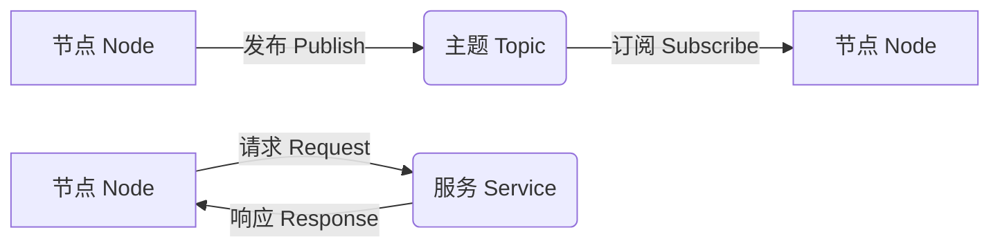

以下是关于《Robot Operating System (ROS) 原理与代码实战案例讲解》的技术博客文章正文部分：

# Robot Operating System (ROS) 原理与代码实战案例讲解

## 1. 背景介绍

### 1.1 机器人操作系统概述

机器人操作系统 (Robot Operating System, ROS) 是一个开源的机器人软件框架,旨在简化机器人应用程序的开发和部署过程。它提供了一套标准的操作系统服务,如硬件抽象、底层设备控制、常用功能实现、消息传递和包管理等。ROS 支持多种编程语言,如 C++、Python 和 Lisp,并且可在多种计算机操作系统上运行,如 Linux、macOS 和 Windows。

### 1.2 ROS 的发展历史

ROS 最初由斯坦福大学人工智能实验室于 2007 年开发,后由 Willow Garage 公司进一步推广和维护。2013 年,ROS 成为一个由开源机器人操作系统 (OSRF) 基金会管理的开源项目。该基金会由一些主要机器人公司和研究机构资助,旨在推动 ROS 的发展和应用。目前,ROS 已经成为机器人领域事实上的标准,被广泛应用于学术研究、产品开发和工业自动化等领域。

### 1.3 ROS 的优势

ROS 具有以下主要优势:

1. **开源**:ROS 是完全开源的,任何人都可以免费使用、修改和分发。这促进了社区的贡献和快速发展。
2. **模块化**:ROS 采用模块化设计,可以轻松集成各种机器人硬件和软件组件。
3. **跨语言支持**:ROS 支持多种编程语言,如 C++、Python 和 Lisp,使开发人员可以选择最合适的语言。
4. **工具丰富**:ROS 提供了大量工具,如可视化工具 (RViz)、调试工具 (rqt) 和模拟器 (Gazebo),极大地简化了开发和调试过程。
5. **社区支持**:ROS 拥有庞大的社区,提供了大量的教程、示例代码和开源软件包,方便开发者学习和使用。

## 2. 核心概念与联系

### 2.1 ROS 计算图形模型

ROS 采用了一种基于计算图形的分布式架构模型。在这个模型中,节点 (Node) 是处理数据的计算进程,它们通过发布/订阅 (Publish/Subscribe) 模式在主题 (Topic) 上交换数据。节点还可以通过服务 (Service) 请求/响应模式提供或使用计算功能。



### 2.2 主要组件

ROS 由以下主要组件组成:

1. **节点 (Node)**: 节点是 ROS 中最小的执行单元,可以执行特定的任务,如传感器数据处理、运动规划或控制算法等。
2. **主题 (Topic)**: 主题是一种异步通信机制,用于在节点之间传递消息。节点可以发布或订阅相关主题以交换数据。
3. **服务 (Service)**: 服务提供了一种同步通信机制,允许节点发送请求并接收响应。
4. **参数服务器 (Parameter Server)**: 参数服务器用于存储和检索参数值,这些参数值可以在运行时动态配置节点的行为。
5. **消息 (Message)**: 消息是节点之间传递数据的结构化数据单元,它们定义了特定类型的数据字段。
6. **主控节点 (Master)**: 主控节点提供命名和注册服务,以帮助节点发现彼此并进行通信。

### 2.3 ROS 工具集

ROS 提供了丰富的工具集,用于开发、部署和调试机器人应用程序:

1. **rqt**: 一个用于可视化和分析 ROS 系统的图形用户界面工具集。
2. **rviz**: 一个 3D 可视化工具,用于显示传感器数据、机器人模型和其他可视化信息。
3. **Gazebo**: 一个强大的 3D 机器人模拟器,可以模拟各种传感器和物理环境。
4. **rosbag**: 一个用于记录和回放 ROS 消息数据的工具,用于调试和分析。
5. **roslaunch**: 一个用于启动多个 ROS 节点的工具,可以方便地管理复杂的机器人系统。

## 3. 核心算法原理具体操作步骤

### 3.1 发布/订阅模式

发布/订阅模式是 ROS 中异步通信的核心机制。它允许节点发布消息到指定的主题,而其他节点可以订阅该主题以接收这些消息。这种松散耦合的通信方式使得系统具有很好的可扩展性和模块化。

发布/订阅模式的具体操作步骤如下:

1. **创建发布者节点**:发布者节点需要初始化一个发布者对象,指定要发布的主题名称和消息类型。
2. **创建订阅者节点**:订阅者节点需要初始化一个订阅者对象,指定要订阅的主题名称和消息类型,并提供一个回调函数来处理接收到的消息。
3. **发布消息**:发布者节点可以在适当的时候创建一个消息对象,填充相关数据,并通过发布者对象将消息发布到指定的主题。
4. **接收消息**:当订阅者节点收到消息时,它会调用预先注册的回调函数,并将接收到的消息作为参数传递给该函数进行处理。

下面是一个简单的发布/订阅示例,其中发布者节点发布字符串消息,而订阅者节点打印接收到的消息:

```python
# 发布者节点
import rospy
from std_msgs.msg import String

def talker():
    pub = rospy.Publisher('chatter', String, queue_size=10)
    rospy.init_node('talker', anonymous=True)
    rate = rospy.Rate(10) # 10hz
    while not rospy.is_shutdown():
        hello_str = "hello world %s" % rospy.get_time()
        rospy.loginfo(hello_str)
        pub.publish(hello_str)
        rate.sleep()

if __name__ == '__main__':
    try:
        talker()
    except rospy.ROSInterruptException:
        pass

# 订阅者节点
import rospy
from std_msgs.msg import String

def callback(data):
    rospy.loginfo(rospy.get_caller_id() + "I heard %s", data.data)

def listener():
    rospy.init_node('listener', anonymous=True)
    rospy.Subscriber("chatter", String, callback)
    rospy.spin()

if __name__ == '__main__':
    listener()
```

### 3.2 服务请求/响应模式

服务请求/响应模式提供了一种同步通信机制,允许节点发送请求并接收响应。这种模式通常用于执行一次性的计算或查询操作。

服务请求/响应模式的具体操作步骤如下:

1. **定义服务类型**:首先需要定义一个服务类型,它包含请求和响应的消息类型。
2. **创建服务器节点**:服务器节点需要初始化一个服务对象,指定服务名称和服务类型,并提供一个回调函数来处理请求并生成响应。
3. **创建客户端节点**:客户端节点需要初始化一个服务代理对象,指定要访问的服务名称和服务类型。
4. **发送请求并接收响应**:客户端节点可以创建一个请求对象,填充相关数据,并通过服务代理对象发送请求。服务器节点会处理请求并生成响应,客户端节点可以接收到该响应。

下面是一个简单的服务请求/响应示例,其中客户端节点请求服务器节点对两个数字进行相加运算:

```python
# 服务器节点
from ros_tutorials.srv import AddTwoInts, AddTwoIntsResponse
import rospy

def handle_add_two_ints(req):
    result = req.a + req.b
    rospy.loginfo("Returning [%s + %s = %s]" % (req.a, req.b, result))
    return AddTwoIntsResponse(result)

def add_two_ints_server():
    rospy.init_node('add_two_ints_server')
    s = rospy.Service('add_two_ints', AddTwoInts, handle_add_two_ints)
    rospy.loginfo("Ready to add two ints.")
    rospy.spin()

if __name__ == "__main__":
    add_two_ints_server()

# 客户端节点
import rospy
from ros_tutorials.srv import AddTwoInts

def add_two_ints_client(x, y):
    rospy.wait_for_service('add_two_ints')
    try:
        add_two_ints = rospy.ServiceProxy('add_two_ints', AddTwoInts)
        resp = add_two_ints(x, y)
        return resp.sum
    except rospy.ServiceException as e:
        print("Service call failed: %s" % e)

if __name__ == "__main__":
    rospy.init_node('add_two_ints_client')
    result = add_two_ints_client(3, 5)
    print("Result: %s" % result)
```

## 4. 数学模型和公式详细讲解举例说明

在机器人运动规划和控制领域,常常需要使用数学模型和公式来描述机器人的运动状态、运动轨迹和控制算法。以下是一些常见的数学模型和公式:

### 4.1 机器人运动学模型

机器人运动学模型描述了机器人各个关节的运动关系,以及关节运动与末端执行器位置和姿态之间的映射关系。常用的模型包括:

1. **前向运动学 (Forward Kinematics)**:给定关节角度,计算末端执行器的位置和姿态。

$$
\begin{bmatrix}
x\\y\\z\\\phi\\\theta\\\psi
\end{bmatrix} = f(\theta_1, \theta_2, \ldots, \theta_n)
$$

其中 $(x, y, z)$ 表示末端执行器的位置, $(\phi, \theta, \psi)$ 表示末端执行器的姿态 (roll, pitch, yaw), $\theta_i$ 表示第 $i$ 个关节的角度, $f$ 是前向运动学函数。

2. **逆向运动学 (Inverse Kinematics)**:给定末端执行器的期望位置和姿态,计算实现该状态所需的关节角度。

$$
\begin{bmatrix}
\theta_1\\\theta_2\\\vdots\\\theta_n
\end{bmatrix} = f^{-1}\begin{bmatrix}
x\\y\\z\\\phi\\\theta\\\psi
\end{bmatrix}
$$

其中 $f^{-1}$ 是逆向运动学函数。逆向运动学问题通常没有解析解,需要使用数值优化或几何方法求解。

### 4.2 机器人运动规划

机器人运动规划旨在为机器人生成平滑、无碰撞的运动轨迹,从起点到达目标点。常用的规划算法包括:

1. **多项式轨迹规划**:使用多项式函数拟合期望的位置、速度和加速度曲线,生成平滑的轨迹。

$$
q(t) = a_0 + a_1t + a_2t^2 + \ldots + a_nt^n
$$

其中 $q(t)$ 表示关节角度或笛卡尔位置的轨迹, $a_i$ 是多项式系数,通过边界条件求解。

2. **采样优化规划**:在高维空间中随机采样点,并使用优化算法 (如 RRT、RRT* 等) 搜索无碰撞的最优路径。

### 4.3 机器人控制算法

机器人控制算法用于计算关节驱动器的控制输入,使机器人能够跟踪期望的运动轨迹。常用的控制算法包括:

1. **PID 控制**:基于误差的比例、积分和微分项,计算控制输入。

$$
u(t) = K_p e(t) + K_i \int_0^t e(\tau) d\tau + K_d \frac{de(t)}{dt}
$$

其中 $u(t)$ 是控制输入, $e(t)$ 是跟踪误差, $K_p$、$K_i$ 和 $K_d$ 分别是比例、积分和微分系数。

2. **计算力矩控制**:基于机器人动力学模型,计算实现期望运动所需的关节力矩或驱动力。