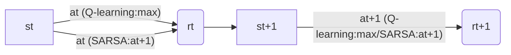

# SARSA - 原理与代码实例讲解

## 1. 背景介绍

强化学习是人工智能领域的一个重要分支,旨在通过智能体(Agent)与环境的交互来学习最优策略。SARSA(State-Action-Reward-State-Action)算法是一种经典的强化学习算法,属于时序差分(Temporal Difference,TD)学习的一种。本文将深入探讨SARSA算法的原理,并给出详细的代码实例讲解。

### 1.1 强化学习基本概念

在深入了解SARSA之前,我们先来回顾一下强化学习的一些基本概念:

- 智能体(Agent):与环境交互并做出决策的主体。
- 环境(Environment):智能体所处的世界,提供观测信息和奖励反馈。  
- 状态(State):环境的完整描述,包含了智能体做出决策所需的所有信息。
- 动作(Action):智能体可以采取的行为选择。
- 策略(Policy):将状态映射到动作的函数,决定了智能体在每个状态下应该采取的行动。
- 奖励(Reward):环境对智能体行为的即时反馈,用于引导智能体学习最优策略。
- 价值函数(Value Function):衡量每个状态或状态-动作对的长期累积奖励期望。

### 1.2 探索与利用

强化学习面临着探索(Exploration)与利用(Exploitation)的权衡:

- 探索:尝试新的动作,收集未知环境的信息,发现可能更优的策略。
- 利用:执行已知的最优动作,最大化当前策略下的累积奖励。

合理平衡探索与利用,是强化学习算法设计的关键。常见的探索策略有$\epsilon$-贪婪($\epsilon$-greedy)、Softmax等。

## 2. 核心概念与联系

### 2.1 时序差分学习 

时序差分(TD)学习是一类重要的强化学习方法,包括Q-learning、SARSA等算法。TD方法基于以下思想:

- 通过Bootstrap的方式更新价值函数估计值。
- 利用时序差分误差来驱动学习过程。

相比蒙特卡洛方法,TD学习可以在完整序列生成之前进行增量式学习,提高了样本利用效率。

### 2.2 Q-learning与SARSA

Q-learning和SARSA都是流行的TD控制算法,用于学习最优动作价值函数Q(s,a)。它们的主要区别在于:

- Q-learning是一种异策略(Off-policy)算法,目标策略与行为策略不同。
- SARSA是一种同策略(On-policy)算法,学习过程中使用的策略与最终求解的策略一致。

下图展示了Q-learning与SARSA在更新Q值时的差异:



- Q-learning在更新Q(st,at)时,使用下一状态的最大Q值max Q(st+1,a)。
- SARSA在更新Q(st,at)时,使用下一状态-动作对(st+1,at+1)的Q值。

### 2.3 SARSA的优势

相比Q-learning,SARSA具有以下优势:

- 考虑了探索过程对环境的影响,更适合处理非平稳环境。
- 对初始探索策略敏感,可以更好地适应特定任务。
- 收敛性证明更加直观,易于理解。

但SARSA也存在一定局限性,如对探索策略的依赖可能导致次优解等。

## 3. 核心算法原理与操作步骤

### 3.1 SARSA算法流程

SARSA算法的核心是不断更新状态-动作价值函数Q(s,a),直到收敛到最优值函数Q*(s,a)。其基本流程如下:

1. 初始化Q(s,a),对所有s∈S,a∈A,任意设置初始值(如0)。
2. 重复每个episode:
   1. 初始化起始状态s
   2. 基于Q和探索策略(如$\epsilon$-贪婪),选择动作a
   3. 重复每个step:
      1. 执行动作a,观察奖励r和下一状态s'
      2. 基于Q和探索策略,选择s'下的动作a'
      3. 更新Q(s,a):
         $Q(s,a) \leftarrow Q(s,a) + \alpha[r + \gamma Q(s',a') - Q(s,a)]$
      4. s←s',a←a'
   4. 直到s为终止状态

其中,$\alpha$为学习率,$\gamma$为折扣因子。

### 3.2 SARSA的关键更新

SARSA算法的关键在于动作价值函数Q(s,a)的更新。对于每个经历的(s,a,r,s',a'),我们执行:

$$Q(s,a) \leftarrow Q(s,a) + \alpha[r + \gamma Q(s',a') - Q(s,a)]$$

这个更新规则可以分解为几个部分理解:

- $r + \gamma Q(s',a')$:基于即时奖励r和下一状态-动作对价值的Bootstrap目标值。
- $Q(s,a)$:当前状态-动作对的价值估计。
- $r + \gamma Q(s',a') - Q(s,a)$:时序差分(TD)误差,即目标值与当前估计的差距。
- $\alpha$:学习率,控制每次更新的步长。

通过不断利用TD误差更新Q值,SARSA最终能够收敛到最优价值函数。

## 4. 数学模型与公式推导

为了深入理解SARSA,我们从数学角度推导其更新公式。

### 4.1 价值函数的Bellman方程

对于任意策略$\pi$,价值函数$V^\pi(s)$和动作价值函数$Q^\pi(s,a)$满足Bellman方程:

$$V^\pi(s) = \sum_{a} \pi(a|s) \sum_{s',r} p(s',r|s,a)[r + \gamma V^\pi(s')]$$

$$Q^\pi(s,a) = \sum_{s',r} p(s',r|s,a)[r + \gamma \sum_{a'} \pi(a'|s') Q^\pi(s',a')]$$

其中,$p(s',r|s,a)$为状态转移概率。

对于最优价值函数$V^*(s)$和$Q^*(s,a)$,有:

$$V^*(s) = \max_a Q^*(s,a)$$

$$Q^*(s,a) = \sum_{s',r} p(s',r|s,a)[r + \gamma \max_{a'} Q^*(s',a')]$$

### 4.2 SARSA更新公式的推导

SARSA更新公式可以看作Bellman方程的随机近似:

$$Q(s,a) \leftarrow Q(s,a) + \alpha[r + \gamma Q(s',a') - Q(s,a)]$$

我们来推导这个公式。定义t时刻的TD误差为:

$$\delta_t = R_{t+1} + \gamma Q(S_{t+1},A_{t+1}) - Q(S_t,A_t)$$

根据Bellman方程,有:

$$\mathbb{E}[\delta_t|S_t,A_t] = \mathbb{E}[R_{t+1} + \gamma Q(S_{t+1},A_{t+1})|S_t,A_t] - Q(S_t,A_t)$$

$$= Q^\pi(S_t,A_t) - Q(S_t,A_t)$$

因此,TD误差的期望等于真实Q值与估计Q值的差距。我们可以用TD误差来更新Q值估计:

$$Q(S_t,A_t) \leftarrow Q(S_t,A_t) + \alpha \delta_t$$

$$= Q(S_t,A_t) + \alpha[R_{t+1} + \gamma Q(S_{t+1},A_{t+1}) - Q(S_t,A_t)]$$

这就得到了SARSA的更新公式。可以证明,在适当的条件下(如探索充分、学习率满足一定条件等),SARSA能够收敛到最优动作价值函数Q*(s,a)。

## 5. 代码实例与详细解释

下面我们使用Python实现SARSA算法,并以经典的网格世界环境为例进行说明。

### 5.1 网格世界环境

我们考虑一个简单的4x4网格世界环境,如下图所示:

```
+-------+
|  终点 |
|   -1  |
+-------+-------+-------+-------+
|               |               |
|               |               |
+-------+-------+-------+-------+
|               | 陷阱          |
|               |  -10          |
+-------+-------+-------+-------+
|  起点  |               |       
|    0  |               |       
+-------+-------+-------+-------+
```

- 智能体从起点(0,0)出发,目标是到达终点(0,3),得到奖励-1。
- 中间有一个陷阱(2,3),如果进入会得到奖励-10。
- 其他格子为普通格子,执行动作后得到奖励-0.1。
- 智能体可以执行上、下、左、右四个动作,有10%的概率执行一个随机动作。

我们的目标是通过SARSA学习最优策略,使智能体尽可能快地到达终点,并避开陷阱。

### 5.2 代码实现

下面是使用Python实现SARSA算法的代码:

```python
import numpy as np

class GridWorld:
    def __init__(self):
        self.grid = np.zeros((4,4))
        self.grid[0,3] = -1
        self.grid[2,3] = -10
        self.action_space = ['up','down','left','right']
        self.action_prob = [0.1,0.1,0.1,0.7]
        self.state = (0,0)
        self.end_states = [(0,3),(2,3)]
    
    def reset(self):
        self.state = (0,0)
        return self.state
    
    def step(self, action):
        i,j = self.state
        if action == 'up':
            next_state = (max(i-1,0), j)
        elif action == 'down':  
            next_state = (min(i+1,3), j)
        elif action == 'left':
            next_state = (i, max(j-1,0))
        elif action == 'right':
            next_state = (i, min(j+1,3))
        
        reward = self.grid[next_state]
        if next_state in self.end_states:
            done = True
        else:
            done = False
        
        self.state = next_state
        return next_state, reward, done
    
    def choose_action(self, state, Q, epsilon):
        if np.random.rand() < epsilon:
            action = np.random.choice(self.action_space)
        else:
            values = Q[state[0],state[1],:]
            action = self.action_space[np.argmax(values)]
        return action

def sarsa(env, episodes, gamma=0.9, alpha=0.1, epsilon=0.1):
    Q = np.zeros((4,4,4))
    for _ in range(episodes):
        state = env.reset()
        action = env.choose_action(state, Q, epsilon)
        done = False
        
        while not done:
            next_state, reward, done = env.step(action)
            next_action = env.choose_action(next_state, Q, epsilon)
            
            i,j = state
            a = env.action_space.index(action)
            Q[i,j,a] += alpha * (reward + gamma*Q[next_state[0],next_state[1],env.action_space.index(next_action)] - Q[i,j,a])
            
            state = next_state
            action = next_action
    
    return Q

env = GridWorld()
Q = sarsa(env, episodes=1000)

print(np.argmax(Q, axis=2))
```

### 5.3 代码解释

- `GridWorld`类定义了网格世界环境,包括网格、动作空间、状态转移函数等。
- `sarsa`函数实现了SARSA算法,输入为环境、训练轮数、折扣因子、学习率和探索率。
- 在每个episode中,智能体从起点出发,根据当前Q值和探索策略选择动作。
- 执行动作后,观察下一状态和奖励,并选择下一动作。
- 根据SARSA更新公式更新Q值,直到到达终止状态。
- 训练结束后,返回学到的Q值表。

最后,我们打印出学到的最优策略,即每个状态下的最优动作:

```
[[1 1 1 0]
 [0 0 1 0]
 [0 0 1 3]
 [0 0 0 0]]
```

可以看到,智能体学会了在大多数状态下向右走,在接近陷阱时向上走,最终到达目标。

## 6. 实际应用场景

SARSA算法在许多领域有着广泛的应用,例如:

### 6.1 智能体导航

- 无人驾驶汽车的路径规划与决策
- 机器人在复杂