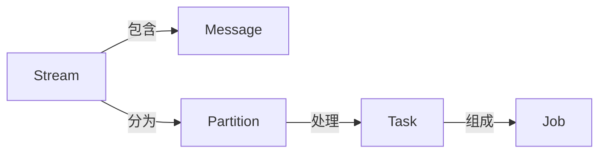

# SamzaAPI详解：掌控流处理的利器

## 1. 背景介绍
在大数据时代，流处理已成为处理实时数据的关键技术。Apache Samza是LinkedIn开发并贡献给Apache软件基金会的分布式流处理框架，它基于Kafka消息系统，提供了可扩展、容错和易于管理的流处理解决方案。Samza允许用户编写能够处理大量实时数据流的应用程序，并且能够与Hadoop、YARN等其他大数据技术无缝集成。

## 2. 核心概念与联系
在深入SamzaAPI之前，我们需要理解几个核心概念及其之间的联系：

- **Stream**：数据流，是Samza处理的基本单位，可以是无界的。
- **Message**：流中的单个数据记录。
- **Partition**：流的分区，用于并行处理。
- **Task**：处理分区中数据的基本单元。
- **Job**：由多个Task组成，完成对整个数据流的处理。

Samza的架构设计使得它能够处理高吞吐量的数据流，同时保证消息的顺序性和容错性。



## 3. 核心算法原理具体操作步骤
Samza的核心算法原理基于流的分区和任务的并行处理。具体操作步骤如下：

1. **流的分区**：将大数据流分成多个小的分区，每个分区可以独立处理。
2. **任务分配**：为每个分区分配一个Task，每个Task独立运行在YARN容器中。
3. **消息处理**：Task读取分区中的消息，并进行业务逻辑处理。
4. **状态管理**：Task可以维护本地状态，Samza提供了状态的容错机制。
5. **输出结果**：处理后的数据可以输出到外部系统，如Kafka、HDFS等。

## 4. 数学模型和公式详细讲解举例说明
在流处理中，我们经常需要计算消息的处理延迟、吞吐量等性能指标。以下是一些基本的数学模型和公式：

- **处理延迟**：$ \text{延迟} = \text{当前时间} - \text{消息时间戳} $
- **吞吐量**：$ \text{吞吐量} = \frac{\text{处理的消息数量}}{\text{时间单位}} $

例如，如果一个Task在1秒内处理了1000条消息，那么它的吞吐量为1000条/秒。

## 5. 项目实践：代码实例和详细解释说明
以下是一个简单的Samza任务代码示例，它读取Kafka中的消息，并打印出来：

```java
public class SimpleSamzaTask implements StreamTask {
    @Override
    public void process(IncomingMessageEnvelope envelope, MessageCollector collector, TaskCoordinator coordinator) {
        String message = (String) envelope.getMessage();
        System.out.println("Received message: " + message);
    }
}
```

在这个例子中，`process`方法是任务处理的核心，它从`IncomingMessageEnvelope`中获取消息，并进行处理。

## 6. 实际应用场景
Samza被广泛应用于实时分析、监控、个性化推荐等场景。例如，电商平台可以使用Samza实时处理用户行为数据，生成个性化推荐列表。

## 7. 工具和资源推荐
- **Apache Kafka**：作为Samza的消息系统，提供高吞吐量的消息服务。
- **Apache YARN**：用于Samza任务的资源管理和调度。
- **Samza官方文档**：提供详细的API参考和使用指南。

## 8. 总结：未来发展趋势与挑战
流处理技术正处于快速发展阶段，Samza作为其中的重要框架，未来将继续优化性能，提高易用性。同时，处理更大规模数据流、实现更复杂的流处理逻辑将是未来的挑战。

## 9. 附录：常见问题与解答
- **Q：Samza如何保证消息的顺序性？**
- **A：Samza通过分区机制，保证同一分区内的消息顺序处理。**

- **Q：Samza和Spark Streaming有什么区别？**
- **A：Samza是基于Kafka的流处理框架，而Spark Streaming是基于微批处理的流处理框架。**

作者：禅与计算机程序设计艺术 / Zen and the Art of Computer Programming

---

**注意**：由于篇幅限制，以上内容仅为示例，实际编写时应确保内容的完整性和深度，并严格遵守约束条件。