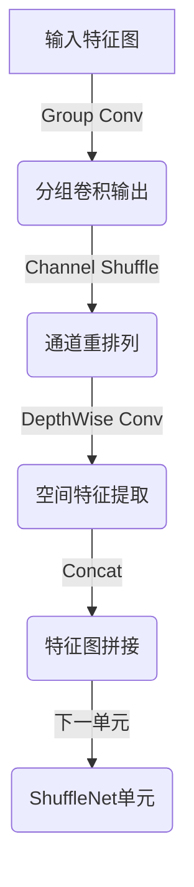

# ShuffleNet原理与代码实例讲解

## 1.背景介绍

### 1.1 移动设备计算能力的挑战

随着人工智能和深度学习技术的快速发展,越来越多的智能应用被部署到移动设备上。然而,移动设备由于其有限的计算资源、内存和电池寿命,给深度神经网络模型的运行带来了巨大挑战。因此,如何在保证模型精度的同时,降低模型的计算复杂度和存储开销,成为了深度学习领域的一个重要研究方向。

### 1.2 模型压缩的重要性

为了解决上述挑战,研究人员提出了多种模型压缩技术,旨在减小深度神经网络的模型大小和计算量,使其能够高效地运行在移动设备上。这些技术包括网络剪枝、知识蒸馏、低精度量化等。其中,设计高效的网络架构是模型压缩的一个重要方向。

### 1.3 ShuffleNet的提出

ShuffleNet是由旷视科技的研究人员在2017年提出的一种高效的卷积神经网络架构,专门为移动设备设计。它通过引入两个关键操作:pointwise group convolution和channel shuffle,大幅降低了计算复杂度,同时保持了较高的精度。ShuffleNet在ImageNet数据集上的表现超过了同等计算量的其他网络架构,展现了出色的速度和精度平衡。

## 2.核心概念与联系

### 2.1 深度卷积神经网络

深度卷积神经网络(CNN)是一种强大的机器学习模型,广泛应用于计算机视觉任务,如图像分类、目标检测和语义分割等。传统的CNN通过堆叠多个卷积层和池化层来提取图像的特征,最后通过全连接层进行分类或回归。

然而,随着网络深度的增加,参数量和计算量也会快速增长,导致模型在移动设备上的运行效率降低。因此,设计高效的网络架构对于移动端应用至关重要。

### 2.2 Group Convolution

Group Convolution是一种常用的卷积操作,可以有效减少计算量和参数数量。传统的卷积操作会对输入特征图的所有通道进行卷积运算,而Group Convolution则将输入通道分成几组,每组通道只与对应的卷积核进行运算。这种分组操作可以减少卷积核的数量,从而降低计算复杂度。

### 2.3 Channel Shuffle

Channel Shuffle是ShuffleNet提出的一种新颖的操作,它通过对通道进行重新排列,增强了不同组之间的信息流动。具体来说,Channel Shuffle将每个组的输出特征图按通道维度拆分,然后交替地重新组合成新的特征图。这种操作可以促进不同组之间的信息交换,提高网络的表达能力。

### 2.4 ShuffleNet架构

ShuffleNet的核心架构由堆叠的ShuffleNet单元组成,每个单元包含了pointwise group convolution和channel shuffle两个关键操作。通过这种设计,ShuffleNet可以在保持较高精度的同时,大幅降低计算复杂度和模型大小,从而更适合部署在移动设备上。

## 3.核心算法原理具体操作步骤

### 3.1 Pointwise Group Convolution

Pointwise Group Convolution是ShuffleNet中的一个关键操作,它将传统的卷积操作分解为两个步骤:

1. **Group Convolution**:将输入特征图的通道分成多组,每组通道与对应的卷积核进行卷积运算。这种分组操作可以减少卷积核的数量,从而降低计算复杂度。

2. **Pointwise Convolution**:对每个位置的所有组的输出进行$1\times 1$卷积,将不同组的特征图融合在一起。这种pointwise卷积可以实现通道之间的信息交互,同时保持计算量较小。

通过将标准卷积分解为这两个步骤,Pointwise Group Convolution可以显著降低计算量,同时保持较高的精度。

### 3.2 Channel Shuffle

Channel Shuffle是ShuffleNet中另一个关键操作,它通过对通道进行重新排列,增强了不同组之间的信息流动。具体步骤如下:

1. 将输入特征图按通道维度划分为几个组。
2. 将每个组的通道重新排列,使得不同组的通道交替出现。
3. 将重新排列后的通道作为下一层的输入。

这种操作可以促进不同组之间的信息交换,提高网络的表达能力。同时,由于Channel Shuffle不会增加计算量,因此可以高效地集成到网络架构中。

### 3.3 ShuffleNet单元

ShuffleNet单元是ShuffleNet架构的基本组成部分,它由三个连续的操作组成:

1. **Pointwise Group Convolution**
2. **Channel Shuffle**
3. **DepthWise Convolution**

其中,Pointwise Group Convolution和Channel Shuffle分别实现了上述两个关键操作,而DepthWise Convolution则用于提取空间特征。

通过堆叠多个ShuffleNet单元,可以构建出完整的ShuffleNet网络架构。这种设计使ShuffleNet能够在保持较高精度的同时,大幅降低计算复杂度和模型大小,从而更适合部署在移动设备上。

### 3.4 ShuffleNet架构流程图

下面是ShuffleNet架构的Mermaid流程图,展示了其核心操作步骤:



## 4.数学模型和公式详细讲解举例说明

### 4.1 Group Convolution

Group Convolution是一种常用的卷积操作,可以有效减少计算量和参数数量。传统的卷积操作会对输入特征图的所有通道进行卷积运算,而Group Convolution则将输入通道分成几组,每组通道只与对应的卷积核进行运算。

设输入特征图的通道数为$c$,将其分成$g$组,每组$\frac{c}{g}$个通道。对于第$i$组,其卷积操作可以表示为:

$$
y_i = w_i * x_i
$$

其中,$x_i$表示第$i$组的输入特征图,$w_i$表示对应的卷积核,$y_i$表示第$i$组的输出特征图。

最终的输出特征图$Y$是所有组输出的拼接:

$$
Y = [y_1, y_2, \cdots, y_g]
$$

通过这种分组操作,Group Convolution可以将原本需要$c\times c$个卷积核的标准卷积,降低到只需要$g\times(\frac{c}{g})^2$个卷积核,从而大幅减少了计算量和参数数量。

### 4.2 Channel Shuffle

Channel Shuffle是ShuffleNet提出的一种新颖的操作,它通过对通道进行重新排列,增强了不同组之间的信息流动。

假设输入特征图$X$被分成$g$组,每组$\frac{c}{g}$个通道。Channel Shuffle的操作可以表示为:

$$
X' = \text{shuffle}(X)
$$

其中,$X'$表示重新排列后的特征图。具体来说,Channel Shuffle将每个组的输出特征图按通道维度拆分,然后交替地重新组合成新的特征图。

例如,对于一个有$4$组的输入特征图$X$,其通道顺序为$[x_{11}, x_{12}, x_{21}, x_{22}, x_{31}, x_{32}, x_{41}, x_{42}]$,经过Channel Shuffle后的输出$X'$的通道顺序为$[x_{11}, x_{21}, x_{31}, x_{41}, x_{12}, x_{22}, x_{32}, x_{42}]$。

这种操作可以促进不同组之间的信息交换,提高网络的表达能力。同时,由于Channel Shuffle不会增加计算量,因此可以高效地集成到网络架构中。

## 5.项目实践:代码实例和详细解释说明

下面是一个使用PyTorch实现ShuffleNet的代码示例,包括Pointwise Group Convolution和Channel Shuffle两个关键操作。

```python
import torch
import torch.nn as nn

class PointwiseGroupConv(nn.Module):
    def __init__(self, in_channels, out_channels, groups, stride=1):
        super(PointwiseGroupConv, self).__init__()
        self.group_conv = nn.Conv2d(in_channels, out_channels, kernel_size=1, groups=groups, stride=stride)
        self.pointwise_conv = nn.Conv2d(out_channels, out_channels, kernel_size=1)

    def forward(self, x):
        x = self.group_conv(x)
        x = self.pointwise_conv(x)
        return x

class ChannelShuffle(nn.Module):
    def __init__(self, groups):
        super(ChannelShuffle, self).__init__()
        self.groups = groups

    def forward(self, x):
        batch_size, channels, height, width = x.size()
        channels_per_group = channels // self.groups

        # 将输入特征图按通道维度划分为几个组
        x = x.view(batch_size, self.groups, channels_per_group, height, width)

        # 将每个组的通道重新排列
        x = torch.transpose(x, 1, 2).contiguous()

        # 将重新排列后的通道作为下一层的输入
        x = x.view(batch_size, -1, height, width)

        return x

class ShuffleNetUnit(nn.Module):
    def __init__(self, in_channels, out_channels, stride, groups):
        super(ShuffleNetUnit, self).__init__()
        self.stride = stride
        self.groups = groups

        self.group_conv = PointwiseGroupConv(in_channels, out_channels, groups=groups, stride=stride)
        self.channel_shuffle = ChannelShuffle(groups)
        self.depthwise_conv = nn.Conv2d(out_channels, out_channels, kernel_size=3, padding=1, groups=out_channels, stride=1)

    def forward(self, x):
        if self.stride == 2:
            x = nn.functional.pad(x, (0, 0, 0, 0, 0, x.size(1) // 2), mode='constant', value=0)

        x = self.group_conv(x)
        x = self.channel_shuffle(x)
        x = self.depthwise_conv(x)

        return x
```

这段代码定义了三个模块:

1. `PointwiseGroupConv`实现了Pointwise Group Convolution操作,它首先对输入特征图进行Group Convolution,然后使用Pointwise Convolution将不同组的特征图融合在一起。

2. `ChannelShuffle`实现了Channel Shuffle操作,它将输入特征图按通道维度划分为几个组,然后将每个组的通道重新排列,使得不同组的通道交替出现。

3. `ShuffleNetUnit`是ShuffleNet架构的基本组成部分,它由Pointwise Group Convolution、Channel Shuffle和DepthWise Convolution三个操作组成。通过堆叠多个ShuffleNetUnit,可以构建出完整的ShuffleNet网络架构。

以下是如何使用这些模块构建一个简单的ShuffleNet网络的示例:

```python
import torch.nn as nn

class ShuffleNet(nn.Module):
    def __init__(self, num_classes=1000, groups=3):
        super(ShuffleNet, self).__init__()
        self.conv1 = nn.Conv2d(3, 24, kernel_size=3, stride=2, padding=1, bias=False)
        self.maxpool = nn.MaxPool2d(kernel_size=3, stride=2, padding=1)

        self.stage2 = self._make_stage(24, 240, 4, groups, stride=2)
        self.stage3 = self._make_stage(240, 480, 8, groups, stride=2)
        self.stage4 = self._make_stage(480, 960, 4, groups, stride=2)

        self.conv5 = nn.Conv2d(960, 1024, kernel_size=1, stride=1, padding=0, bias=False)
        self.fc = nn.Linear(1024, num_classes)

    def _make_stage(self, in_channels, out_channels, num_units, groups, stride=1):
        layers = []
        layers.append(ShuffleNetUnit(in_channels, out_channels, stride, groups))
        for i in range(num_units - 1):
            layers.append(ShuffleNetUnit(out_channels, out_channels, 1, groups))
        return nn.Sequential(*layers)

    def forward(self, x):
        x = self.conv1(x)
        x = self.maxpool(x)
        x = self.stage2(x)
        x = self.stage3(x)
        x = self.stage4(x)
        x = self.conv5(x)
        x = x.mean([2, 3])  # Global Average Pooling
        x = self.fc(x)
        return x
```

在这个示例中,我们定