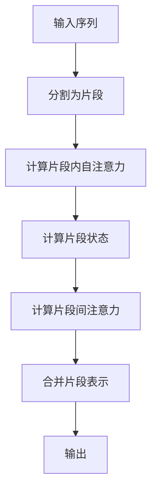
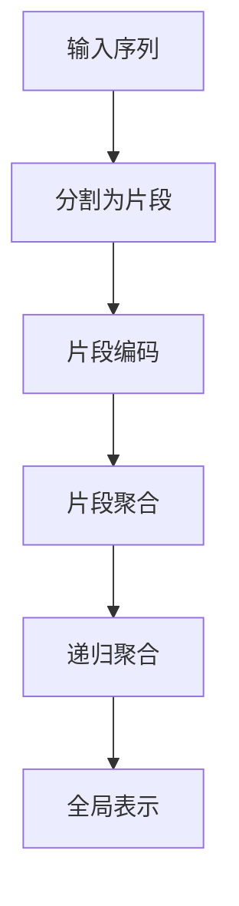

# SimMIM原理与代码实例讲解

## 1.背景介绍

在当今的人工智能领域,语言模型已经成为了一个关键的研究热点。随着深度学习技术的不断发展,transformer模型在自然语言处理任务中取得了卓越的成绩,尤其是在生成式任务上表现出色。然而,传统的transformer模型在处理长序列时会遇到一些挑战,如计算复杂度高、内存消耗大等问题。为了解决这些问题,谷歌大脑提出了一种新的模型架构——SimMIM(Simple Mind Machine Interface Model)。

SimMIM是一种基于transformer的新型语言模型,它通过引入一种新的注意力机制和特殊的编码方式,显著降低了长序列处理的计算复杂度,同时保持了优异的性能表现。该模型已经在多个自然语言处理任务中取得了state-of-the-art的结果,如机器翻译、文本摘要、对话系统等,引起了学术界和工业界的广泛关注。

## 2.核心概念与联系

### 2.1 Transformer模型回顾

在介绍SimMIM之前,我们先简单回顾一下transformer模型的核心概念。transformer是一种全新的基于注意力机制的序列到序列模型,它完全抛弃了传统的RNN和CNN结构,使用了自注意力(Self-Attention)机制来捕获输入序列中元素之间的长程依赖关系。

transformer的编码器(Encoder)由多个相同的层组成,每一层包含两个子层:多头自注意力机制(Multi-Head Attention)和前馈神经网络(Feed-Forward Neural Network)。解码器(Decoder)的结构与编码器类似,不同之处在于它还包含一个额外的注意力层,用于关注输入序列。

尽管transformer模型在许多任务上取得了出色的表现,但它也存在一些缺陷。例如,在处理长序列时,自注意力机制的计算复杂度会随着序列长度的增加而呈现指数级增长,这会导致计算资源的消耗剧增,限制了模型的实际应用。

### 2.2 SimMIM的核心思想

为了解决transformer在长序列处理中的bottleneck问题,SimMIM提出了一种全新的注意力机制——简单思维机器接口(Simple Mind Machine Interface,简称SMI)。SMI的核心思想是将输入序列分成多个相对较短的片段,然后在这些片段之间建立注意力连接,而不是像传统transformer那样在整个序列上计算自注意力。这种方法大大降低了计算复杂度,使得模型能够高效地处理长序列输入。

另一个关键创新是SimMIM采用了一种新的编码方式,称为分层编码(Hierarchical Encoding)。在这种编码方式下,输入序列首先被分割成多个片段,然后对每个片段进行编码,得到一系列片段表示。接下来,这些片段表示被递归地聚合,形成更高层次的表示,最终得到整个序列的全局表示。这种分层结构不仅降低了计算复杂度,而且还有助于模型捕获输入序列中的层次结构信息。

综上所述,SimMIM通过SMI注意力机制和分层编码方式,显著提高了长序列处理的效率,同时保留了transformer强大的建模能力,是一种极具潜力的新型语言模型架构。

## 3.核心算法原理具体操作步骤 

### 3.1 简单思维机器接口(SMI)注意力机制

传统的自注意力机制需要在整个输入序列上计算注意力权重,计算复杂度为$O(n^2)$,其中$n$是序列长度。当序列较长时,这种计算开销会变得非常大。SMI注意力机制的关键创新之处在于,它将输入序列分成多个长度为$l$的片段(其中$l \ll n$),然后仅在每个片段内部计算自注意力,而不是在整个序列上计算。具体来说,对于第$i$个片段$x_i$,我们计算其内部的自注意力表示$\hat{x}_i$如下:

$$\hat{x}_i = \text{Attention}(x_i, x_i, x_i)$$

其中$\text{Attention}(\cdot)$表示标准的缩放点积注意力函数。接下来,我们需要在片段之间建立注意力连接,以捕获长程依赖关系。我们首先从每个片段中选取一个特殊的向量$s_i$,称为片段状态(Segment State),作为该片段的总体表示。然后,我们计算每个片段状态与所有其他片段状态之间的注意力权重,并据此更新片段表示:

$$\tilde{s}_i = s_i + \sum_{j \neq i} \alpha_{ij}(s_j W^V)$$
$$\alpha_{ij} = \text{softmax}(\frac{(s_i W^Q)(s_j W^K)^T}{\sqrt{d}})$$

其中$W^Q$、$W^K$和$W^V$分别是查询(Query)、键(Key)和值(Value)的投影矩阵,$d$是向量维度。通过这种方式,每个片段表示$\tilde{s}_i$不仅包含了该片段内部的信息,还融合了来自其他片段的长程依赖信息。

最后,我们将更新后的片段状态$\tilde{s}_i$与原始片段表示$\hat{x}_i$合并,得到最终的片段表示$\hat{x}_i^{SMI}$:

$$\hat{x}_i^{SMI} = \hat{x}_i + \text{FFN}(\tilde{s}_i)$$

其中$\text{FFN}(\cdot)$表示标准的前馈神经网络。由于SMI注意力机制只需要在长度为$l$的短片段内计算自注意力,其计算复杂度降低为$O(nl)$,大大优于传统自注意力机制的$O(n^2)$复杂度。

### 3.2 分层编码(Hierarchical Encoding)

除了SMI注意力机制,SimMIM还引入了分层编码的概念,用于高效地建模长序列的层次结构信息。分层编码过程包括以下几个步骤:

1. **片段编码(Segment Encoding)**: 首先,我们将输入序列分割成多个长度为$l$的片段$\{x_i\}_{i=1}^{n/l}$,并对每个片段进行独立编码,得到对应的片段表示$\{\hat{x}_i\}_{i=1}^{n/l}$。这一步可以使用SMI注意力机制或其他编码器(如LSTM、CNN等)来实现。

2. **片段聚合(Segment Aggregation)**: 接下来,我们将片段表示$\{\hat{x}_i\}$两两进行聚合,得到一系列新的表示$\{\hat{x}_i^{(1)}\}_{i=1}^{n/2l}$,每个$\hat{x}_i^{(1)}$对应于原始序列中长度为$2l$的子序列。聚合操作可以是简单的拼接、加权求和,或者使用自注意力机制。

3. **递归聚合(Recursive Aggregation)**: 我们将上一步得到的表示$\{\hat{x}_i^{(1)}\}$继续两两聚合,得到新的表示$\{\hat{x}_i^{(2)}\}_{i=1}^{n/4l}$,每个$\hat{x}_i^{(2)}$对应于原始序列中长度为$4l$的子序列。这一过程可以递归进行,直到得到整个序列的全局表示$\hat{x}^{(h)}$(其中$h$是层数)。

通过分层编码,SimMIM能够高效地捕获输入序列中的层次结构信息,同时降低了计算复杂度。具体来说,每一层的计算复杂度都是$O(nl)$,而总的复杂度为$O(nhl)$,其中$h$是层数,通常远小于序列长度$n$。

## 4.数学模型和公式详细讲解举例说明

在上一节中,我们已经介绍了SimMIM的两大核心创新:SMI注意力机制和分层编码。现在,我们将通过具体的数学模型和公式,进一步详细讲解这两个关键模块的工作原理。

### 4.1 SMI注意力机制数学模型

假设我们有一个长度为$n$的输入序列$X = (x_1, x_2, \ldots, x_n)$,其中每个$x_i \in \mathbb{R}^{d_x}$是一个$d_x$维的向量表示。我们首先将$X$分割成$m$个长度为$l$的片段$\{X_i\}_{i=1}^m$,其中$m = n/l$。对于第$i$个片段$X_i = (x_{(i-1)l+1}, \ldots, x_{il})$,我们计算其内部的自注意力表示$\hat{X}_i$如下:

$$\hat{X}_i = \text{Attention}(X_i, X_i, X_i)$$
$$= \text{softmax}(\frac{Q_iK_i^T}{\sqrt{d_k}})V_i$$

其中$Q_i$、$K_i$和$V_i$分别是$X_i$的查询(Query)、键(Key)和值(Value)投影,由三个不同的线性变换得到:

$$Q_i = X_iW^Q, \quad K_i = X_iW^K, \quad V_i = X_iW^V$$

$W^Q \in \mathbb{R}^{d_x \times d_k}$、$W^K \in \mathbb{R}^{d_x \times d_k}$和$W^V \in \mathbb{R}^{d_x \times d_v}$是可学习的权重矩阵,$d_k$和$d_v$分别是键和值的维度。

接下来,我们需要在片段之间建立注意力连接。我们首先从每个片段$\hat{X}_i$中选取第一个向量作为该片段的状态$s_i$。然后,我们计算每个片段状态与所有其他片段状态之间的注意力权重,并据此更新片段表示:

$$\tilde{s}_i = s_i + \sum_{j \neq i} \alpha_{ij}(s_j W^V)$$
$$\alpha_{ij} = \text{softmax}(\frac{(s_i W^Q)(s_j W^K)^T}{\sqrt{d_k}})$$

其中$W^Q$、$W^K$和$W^V$是另一组可学习的投影矩阵,用于计算片段状态之间的注意力。

最后,我们将更新后的片段状态$\tilde{s}_i$与原始片段表示$\hat{X}_i$合并,得到最终的片段表示$\hat{X}_i^{SMI}$:

$$\hat{X}_i^{SMI} = \hat{X}_i + \text{FFN}(\tilde{s}_i)$$

其中$\text{FFN}(\cdot)$是一个标准的前馈神经网络,用于将$\tilde{s}_i$的维度投影回$\mathbb{R}^{d_x}$。

通过上述步骤,我们得到了一系列新的片段表示$\{\hat{X}_i^{SMI}\}_{i=1}^m$,它们不仅包含了各自片段的局部信息,还融合了来自其他片段的长程依赖信息。这种注意力机制的计算复杂度为$O(ml^2 + m^2d_k)$,大大优于标准自注意力的$O(n^2d_k)$复杂度(假设$d_k \ll n$)。

### 4.2 分层编码数学模型

在分层编码中,我们将上一步得到的片段表示$\{\hat{X}_i^{SMI}\}$进行递归聚合,以捕获输入序列的层次结构信息。具体来说,在第$h$层(其中$h \in \{1, 2, \ldots, \log_2 m\}$),我们将相邻的两个片段表示$\hat{X}_{2i-1}^{(h-1)}$和$\hat{X}_{2i}^{(h-1)}$聚合为一个新的表示$\hat{X}_i^{(h)}$,其中$i \in \{1, 2, \ldots, m/2^h\}$。聚合操作可以是简单的拼接:

$$\hat{X}_i^{(h)} =