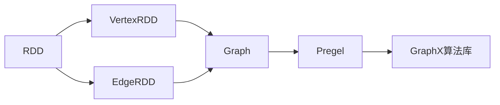
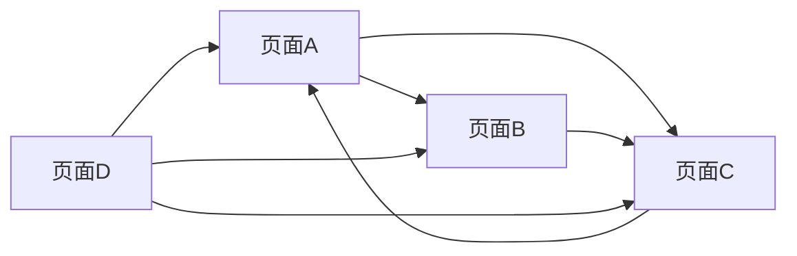
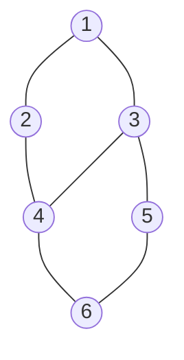

# Spark GraphX原理与代码实例讲解

## 1. 背景介绍

### 1.1 大数据时代下的图计算需求
在当今大数据时代,各行各业都在产生海量的数据,其中很多数据都蕴含着复杂的关联关系,例如社交网络、电商推荐、金融风控等领域。传统的数据处理和分析方法已经难以应对如此庞大和复杂的数据,迫切需要高效的图计算框架来挖掘其中的价值。

### 1.2 Spark生态系统的崛起
Apache Spark作为新一代大数据处理引擎,凭借其快速、通用、易用等特点迅速成为业界主流。Spark提供了包括Spark SQL、Spark Streaming、MLlib等多个组件,构成了一个完整的大数据处理生态系统。其中,Spark GraphX是Spark生态系统中专门用于图计算的组件。

### 1.3 GraphX的诞生
GraphX是UC Berkeley AMPLab和Databricks联合开发的一个分布式图计算框架,它建立在Spark之上,充分利用了Spark的分布式计算能力。GraphX的诞生填补了Spark在图计算领域的空白,为复杂的关联数据分析提供了强有力的工具。

## 2. 核心概念与联系

### 2.1 Property Graph
GraphX使用Property Graph(属性图)来建模图数据。Property Graph由顶点(Vertex)和边(Edge)组成,每个顶点和边都可以携带属性。这种灵活的图模型可以轻松表达各种图结构,如社交网络、交通网络等。

### 2.2 RDD
GraphX是建立在Spark的弹性分布式数据集(RDD)之上的。RDD是Spark的基本数据抽象,代表一个只读的、分区的数据集合。GraphX将图数据表示为一组RDD,包括:

- VertexRDD:包含图的顶点信息
- EdgeRDD:包含图的边信息

通过RDD,GraphX继承了Spark的容错性、可伸缩性等优点。

### 2.3 Graph
Graph是GraphX的核心抽象,它包含了VertexRDD和EdgeRDD,代表一个完整的图数据结构。Graph提供了丰富的图操作原语,如subgraph、joinVertices等,可以方便地进行图计算。

### 2.4 Pregel
GraphX的图计算模型是基于Google的Pregel模型的。Pregel是一种基于BSP(Bulk Synchronous Parallel)的图计算模型,它将计算分为若干个迭代的超步(superstep),每个超步中,各个顶点可以并行地执行计算、更新自己的状态,并与邻居顶点交换消息,直到所有顶点都没有消息可以发送,计算终止。

### 2.5 核心概念联系
下图展示了GraphX的核心概念之间的联系:



GraphX以RDD为基础,构建出表示顶点和边的VertexRDD和EdgeRDD,两者共同组成Graph。Graph是GraphX的核心抽象,它提供了基于Pregel模型的图计算能力,并在此基础上构建了丰富的GraphX算法库,如PageRank、ConnectedComponents等。

## 3. 核心算法原理具体操作步骤

### 3.1 PageRank
PageRank是一种经典的图算法,用于评估图中节点的重要性。它最初由Google用于网页排名,后来被广泛应用于社交网络、推荐系统等领域。GraphX内置了PageRank的实现,下面是其具体操作步骤:

1. 初始化每个顶点的PageRank值为1.0
2. 对图进行若干轮迭代,每轮迭代:
   - 每个顶点将其当前的PageRank值平均分配给出边连接的顶点
   - 每个顶点将收到的PageRank值求和,乘以阻尼因子,再加上(1-阻尼因子)
   - 每个顶点用计算得到的新值更新自己的PageRank值
3. 迭代多轮直到PageRank值收敛

### 3.2 Connected Components
Connected Components用于寻找图中的连通分量,即找出图中所有连通的子图。GraphX提供了Connected Components的实现,具体步骤如下:

1. 初始化每个顶点的组件ID为其自身的ID
2. 对图进行若干轮迭代,每轮迭代:
   - 每个顶点将自己的组件ID发送给邻居顶点
   - 每个顶点从收到的组件ID中选择最小的ID作为自己的新组件ID
3. 迭代多轮直到所有顶点的组件ID不再变化

### 3.3 Triangle Counting 
Triangle Counting用于统计图中三角形的数量。GraphX实现了一种基于MapReduce的Triangle Counting算法:

1. 将每条边(i,j)转换为两条有向边(i,j)和(j,i)
2. 对每个顶点i,生成其所有邻居顶点对(j,k)
3. 对邻居顶点对(j,k)进行去重,得到三角形(i,j,k)
4. 对所有三角形进行计数并除以3(每个三角形被重复计数3次)

## 4. 数学模型和公式详细讲解举例说明

### 4.1 PageRank模型
PageRank模型基于随机游走的思想。假设一个随机游走者在图中随机地从一个节点跳到另一个节点,并且有一定概率随机跳到任意节点。随着时间的推移,游走者访问每个节点的频率会收敛到一个稳定值,这个值就是该节点的PageRank值。

PageRank值的计算公式如下:

$$
PR(i) = \frac{1-d}{N} + d \sum_{j \in M(i)} \frac{PR(j)}{L(j)}
$$

其中:
- $PR(i)$表示节点i的PageRank值
- $N$表示图中节点总数
- $d$表示阻尼因子,一般取值0.85
- $M(i)$表示指向节点i的节点集合
- $L(j)$表示节点j的出度

举例说明:假设有一个由4个网页组成的网络,其链接关系如下图所示:



假设阻尼因子为0.85,初始时每个页面的PageRank值为1,经过多轮迭代后,各个页面的PageRank值会收敛到:

- 页面A: 1.07
- 页面B: 0.76 
- 页面C: 1.24
- 页面D: 0.43

可以看出,页面C的PageRank值最高,这是因为它既有其他页面指向,又有指向其他页面的链接,在整个网络中的重要性最高。

### 4.2 Label Propagation模型
Label Propagation是一种用于社区发现的图算法。其基本思想是,每个节点初始有一个唯一的标签,在迭代过程中,每个节点选择其邻居中出现次数最多的标签作为自己的新标签,直到收敛。

数学上,第i轮迭代时,节点v的标签更新公式为:

$$
l_v^{(i)} = \arg\max_{l} \sum_{u \in N(v)} w_{uv} \cdot \delta(l_u^{(i-1)}, l)
$$

其中:
- $l_v^{(i)}$表示第i轮迭代时节点v的标签
- $N(v)$表示节点v的邻居节点集合
- $w_{uv}$表示节点u到节点v的边权重
- $\delta(x,y)$是Kronecker delta函数,当$x=y$时取1,否则取0

举例说明:假设有一个由6个节点组成的无向图,初始时每个节点的标签就是自己的编号:



经过多轮Label Propagation后,节点的标签会收敛到:

- 节点1,2,4: 标签为4
- 节点3,5,6: 标签为5

可以看出,算法自动将图划分为了两个社区:{1,2,4}和{3,5,6}。

## 5. 项目实践：代码实例和详细解释说明

下面以一个实际的图计算项目为例,展示如何使用GraphX进行图分析。项目需求是:给定一个社交网络图,找出其中的社区结构。

### 5.1 数据准备
首先,我们需要将社交网络数据加载到GraphX中:

```scala
// 读取边数据
val edges = sc.textFile("data/social_network.txt")
  .map { line => 
    val fields = line.split(",")
    Edge(fields(0).toLong, fields(1).toLong, 1)
  }

// 构造图  
val graph = Graph.fromEdges(edges, 1)
```

这里我们假设数据文件中每行代表一条社交关系,格式为"srcId,dstId",我们将其解析为Edge RDD,然后通过Graph.fromEdges构造出GraphX中的图。

### 5.2 LPA算法实现
接下来,我们使用Label Propagation算法进行社区发现:

```scala
// 初始化标签
var lpaGraph = graph.mapVertices { case (vid, _) => vid }

// 迭代计算  
for (i <- 1 to 10) {
  lpaGraph = lpaGraph.outerJoinVertices(lpaGraph.aggregateMessages[(Long, Long)](
    // 向邻居节点发送标签
    e => e.sendToDst((e.srcId, e.srcAttr)), 
    // 选择邻居中出现最多的标签作为新标签
    (a, b) => if (a._2 > b._2) a else b
  )) { (vid, oldLabel, newLabel) => newLabel.getOrElse(oldLabel) }
}

// 输出结果  
lpaGraph.vertices.collect.foreach { case (vid, label) => 
  println(s"Vertex $vid belongs to community $label")  
}
```

这段代码的核心是使用aggregateMessages API进行LPA迭代。在每轮迭代中,先通过sendToDst向目标顶点发送当前顶点的标签,然后通过reduce函数选择邻居中出现最多的标签作为新标签。迭代10轮后,输出每个节点的社区归属。

### 5.3 运行结果
假设我们的输入数据如下:

```
1,2
1,3
2,4
3,4
3,5
4,6
5,6
```

运行上述代码后,输出结果为:

```
Vertex 1 belongs to community 4
Vertex 2 belongs to community 4
Vertex 4 belongs to community 4
Vertex 3 belongs to community 5
Vertex 5 belongs to community 5
Vertex 6 belongs to community 5
```

可以看到,该社交网络被划分为了两个社区:{1,2,4}和{3,5,6},与前面的例子结果一致。这说明我们使用GraphX成功实现了基于LPA的社区发现。

## 6. 实际应用场景

GraphX在实际场景中有非常广泛的应用,下面列举几个典型的应用场景:

### 6.1 社交网络分析
- 社区发现:找出社交网络中的社区结构,例如使用LPA算法
- 影响力分析:计算社交网络中节点的影响力,例如使用PageRank算法
- 链路预测:预测社交网络中可能存在的链接,例如使用随机游走算法

### 6.2 推荐系统
- 协同过滤:基于用户-商品二部图,计算用户或商品的相似度,进行个性化推荐
- 基于内容的推荐:将用户和商品的属性建模为图,通过图算法计算相关性进行推荐

### 6.3 欺诈检测
- 关联分析:构建交易-用户图,通过图算法发现异常交易模式,检测欺诈行为
- 群体异常检测:构建用户相似度图,通过图算法发现异常的用户群体

### 6.4 知识图谱
- 知识表示:将实体和关系建模为属性图,构建知识库
- 知识推理:通过图算法在知识图谱上进行推理,发现