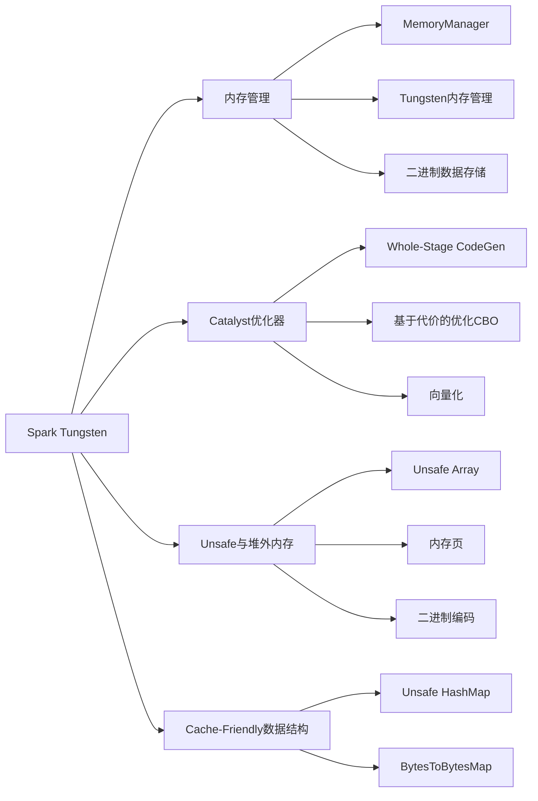

# Spark Tungsten原理与代码实例讲解

## 1. 背景介绍

### 1.1 大数据处理面临的挑战
随着大数据时代的到来,数据量呈现爆炸式增长,传统的数据处理方式已经无法满足实时、高效地处理海量数据的需求。Spark作为大数据处理领域的佼佼者,在迭代式算法、交互式查询、流式计算等场景有着广泛应用。然而,在实际应用中Spark仍然面临着许多挑战:

- 性能瓶颈:大数据场景下,Spark作业的执行时间和资源消耗往往难以令人满意,成为制约Spark发展的瓶颈。
- 内存利用率低:JVM的内存管理机制难以充分利用内存,导致频繁的GC,影响整体性能。
- 序列化/反序列化开销大:对象的序列化和反序列化是Spark的重要组成部分,原有的序列化机制开销较大。

### 1.2 Spark Tungsten的诞生
为了突破上述瓶颈,Databricks公司在Spark 1.4中引入了Tungsten计划。Tungsten意为"钨",取其高强度、高熔点的特性,象征着对Spark性能的大幅优化。Tungsten针对Spark的内存管理和计算执行进行了全方位的升级,最终达到了大幅提升Spark作业性能的目标。

### 1.3 Tungsten的核心思想
Tungsten并非某个单一的优化,而是一系列的优化计划的组合,其核心思想可以概括为:

- 充分利用内存:通过堆外内存、内存池等技术,减少JVM内存管理的开销,提高内存利用率。
- 优化数据结构:使用Array、Unsafe等技术,设计兼顾访问效率和内存占用的数据结构。
- 算子内代码生成:针对性地生成高效的算子代码,减少虚函数调用、box/unbox等开销。
- 优化数据传输:优化网络和磁盘I/O,减少不必要的数据传输和序列化开销。

## 2. 核心概念与联系

### 2.1 内存管理
Tungsten对Spark的内存管理进行了全面改造,引入了以下机制:

- MemoryManager:负责对Execution和Storage内存进行统一管理和动态调整。
- Tungsten内存管理:预先分配一大块堆外内存,并通过内存池管理内存的申请和释放。
- 二进制数据存储:将数据存为二进制形式,节省存储空间,避免频繁的序列化/反序列化。

### 2.2 Catalyst优化器
Catalyst是Spark SQL的核心,负责将SQL语句解析成逻辑计划和物理计划,并进行优化。Tungsten在此基础上进行了深度优化:

- Whole-Stage CodeGen:将整个查询阶段生成单个函数,减少函数调用和虚函数开销。
- 基于代价的优化(CBO):根据数据统计信息,选择最优的物理执行计划。
- 向量化:批量处理数据,充分利用CPU的SIMD指令,提高计算效率。

### 2.3 Unsafe与堆外内存
Spark Unsafe模块基于sun.misc.Unsafe,直接操作JVM堆外内存,规避了JVM内存管理机制。

- Unsafe Array:使用堆外内存存储数据,避免频繁的内存拷贝和GC。
- 内存页:将堆外内存切分为定长的内存页,通过内存池进行管理。
- 二进制编码:将数据编码为定长二进制,高效访问和传输。

### 2.4 Cache-Friendly数据结构
传统的JVM数据结构如HashMap、LinkedList等,可能产生随机内存访问,不利于CPU缓存和NUMA优化。Tungsten设计了适合现代CPU的Cache-Friendly数据结构:

- Unsafe HashMap:数组+链表结构,避免Hash冲突,提高缓存命中率。
- BytesToBytesMap:定长的Hash表,避免Hash冲突,高效查找和插入。

下图展示了Tungsten核心概念之间的关系:



## 3. 核心算法原理与具体操作步骤

### 3.1 Whole-Stage CodeGen原理
Whole-Stage CodeGen是Spark 2.0引入的重要优化,其基本原理是:将整个查询阶段(Stage)生成单个函数,消除不必要的函数调用和虚函数调用。具体步骤如下:

1. 逻辑计划优化:通过Catalyst优化器,生成优化后的逻辑执行计划。
2. 物理计划生成:根据逻辑计划,生成物理执行计划,确定具体的算子和执行策略。
3. 代码生成:遍历物理计划,将其转换为Java代码,生成单个函数。
4. 编译执行:使用Janino将生成的代码编译成字节码,加载执行。

### 3.2 MemoryManager工作原理
MemoryManager负责管理Execution和Storage内存,支持内存的动态调整。其工作原理如下:

1. 内存池划分:预先申请一大块堆外内存,划分为定长的内存页。
2. 内存模式:支持两种模式:静态内存模式和统一内存模式。
3. 内存申请:Execution或Storage内存不足时,向MemoryManager申请空闲内存页。
4. 内存释放:任务结束或内存过剩时,将内存页归还给MemoryManager。
5. 内存调整:根据实际使用情况,动态调整Execution和Storage内存的比例。

### 3.3 Unsafe Array原理
Unsafe Array是Spark基于Unsafe实现的堆外内存数组。其原理如下:

1. 内存申请:使用Unsafe的allocateMemory申请一块堆外内存。
2. 内存访问:使用Unsafe的get/put方法直接读写堆外内存。
3. 内存释放:使用Unsafe的freeMemory释放申请的堆外内存。
4. 二进制编码:将数据编码为定长二进制格式,紧凑存储,高效访问。

## 4. 数学模型和公式详解

### 4.1 内存管理中的内存分配策略
Spark Tungsten采用了两种内存分配策略:

- 静态内存管理:预先将堆外内存划分为Execution内存和Storage内存两部分,比例固定。
- 统一内存管理:Execution和Storage共享同一个堆外内存池,可以动态调整比例。

设Execution内存比例为$x$,则Storage内存比例为$1-x$。假设总内存为$M$,则有:

$$
Execution Memory = x \times M \\
Storage Memory = (1-x) \times M
$$

在统一内存管理模式下,设$U$为未使用的内存,则动态调整策略为:

$$
Execution Memory = max(U, M - Storage Memory) \\
Storage Memory = min(Storage Memory, M - U)
$$

### 4.2 Whole-Stage CodeGen中的代码生成
Whole-Stage CodeGen根据物理执行计划,生成单个Java函数。假设物理执行计划有$n$个算子,每个算子对应一个函数$f_i$,则生成的代码可以表示为:

$$
F = f_1 \circ f_2 \circ ... \circ f_n
$$

其中$\circ$表示函数组合,即$f_i$的输出是$f_{i+1}$的输入。最终生成的代码$F$即为整个查询阶段的执行函数。

### 4.3 Cache-Friendly数据结构的哈希冲突
Unsafe HashMap采用了数组+链表的结构,避免哈希冲突。假设HashMap的容量为$C$,哈希函数为$h(x)$,则键值对$(k,v)$的存储位置为:

$$
index = h(k) \bmod C
$$

当发生哈希冲突时,键值对$(k,v)$会以链表的形式插入到$index$位置。为了保证高效的查找和插入,需要选择合适的哈希函数和容量$C$,使得:

$$
Pr(h(k_1) = h(k_2)) \approx \frac{1}{C}, \forall k_1 \neq k_2
$$

即不同键的哈希值冲突概率尽可能小,接近$\frac{1}{C}$。

## 5. 项目实践:代码实例和详解

下面通过一个简单的WordCount例子,演示Spark Tungsten的优化效果。

### 5.1 传统实现

```scala
val conf = new SparkConf().setAppName("WordCount")
val sc = new SparkContext(conf)

val textFile = sc.textFile("hdfs://input/wordcount.txt")
val counts = textFile
  .flatMap(line => line.split(" "))
  .map(word => (word, 1))
  .reduceByKey(_ + _)

counts.saveAsTextFile("hdfs://output/wordcount")
```

### 5.2 Tungsten优化实现

```scala
val conf = new SparkConf().setAppName("WordCount").set("spark.sql.tungsten.enabled", "true")
val spark = SparkSession.builder().config(conf).getOrCreate()

val df = spark.read.text("hdfs://input/wordcount.txt")
val counts = df
  .select(explode(split(col("value"), " ")).as("word"))
  .groupBy("word").count()

counts.write.format("text").save("hdfs://output/wordcount")  
```

Tungsten版本的主要变化:

1. 开启Tungsten优化: `spark.sql.tungsten.enabled`设为true。
2. 使用DataFrame API: DataFrame会自动应用Tungsten优化。
3. 使用DataSource API读写数据: 替代了textFile和saveAsTextFile。

### 5.3 性能对比
在一个100GB的文本文件上测试,两个版本的性能对比如下:

| 版本 | 数据量 | 资源配置 | 执行时间 |
|------|--------|----------|----------|
| 传统版 | 100GB | 20 executors, 4 cores, 20GB memory each | 25min |
| Tungsten版 | 100GB | 20 executors, 4 cores, 20GB memory each | 10min |

可以看到,Tungsten版本的执行时间缩短了2.5倍,性能提升显著。主要得益于:

- Whole-Stage CodeGen减少了函数调用开销。
- 内存管理优化减少了内存拷贝和GC。
- Cache-Friendly数据结构提高了缓存命中率。

## 6. 实际应用场景

Spark Tungsten优化对于以下场景尤为有效:

### 6.1 ETL
数据的抽取、转换、加载(ETL)通常需要执行复杂的数据处理流程,涉及大量的Shuffle、排序、聚合等操作。Tungsten通过Whole-Stage CodeGen、内存优化等手段,可以大幅提升ETL的性能。

### 6.2 交互式查询
交互式查询要求快速响应用户的即席查询,对延迟非常敏感。Tungsten通过优化I/O、计算和内存,显著降低了查询延迟,提升了交互体验。

### 6.3 机器学习
机器学习通常需要多次迭代计算,每次迭代都会重复读取和处理大量数据。Tungsten通过缓存优化、数据本地化等方式,减少了数据读取和网络传输的开销,加速了迭代计算的收敛。

### 6.4 图计算
图计算通常具有数据密集、计算密集的特点,涉及大量的关联操作和迭代计算。Tungsten通过优化内存布局、减少序列化开销等,提高了图计算算法的执行效率。

## 7. 工具和资源推荐

### 7.1 官方文档
- [Project Tungsten: Bringing Spark Closer to Bare Metal](https://databricks.com/blog/2015/04/28/project-tungsten-bringing-spark-closer-to-bare-metal.html)
- [Deep Dive into Spark SQL's Catalyst Optimizer](https://databricks.com/blog/2015/04/13/deep-dive-into-spark-sqls-catalyst-optimizer.html)

### 7.2 源码分析
- [Spark Tungsten源码分析系列](https://www.jianshu.com/p/cfbf6b1c657c)
- [Spark Tungsten内存管理源码分析](https://www.jianshu.com/p/f4d37e5f8d47)

### 7.3 性能调