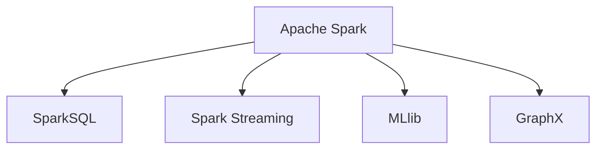
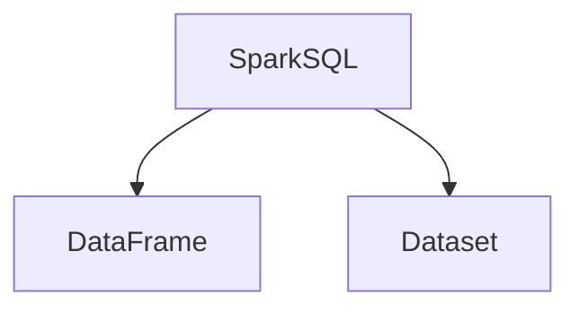
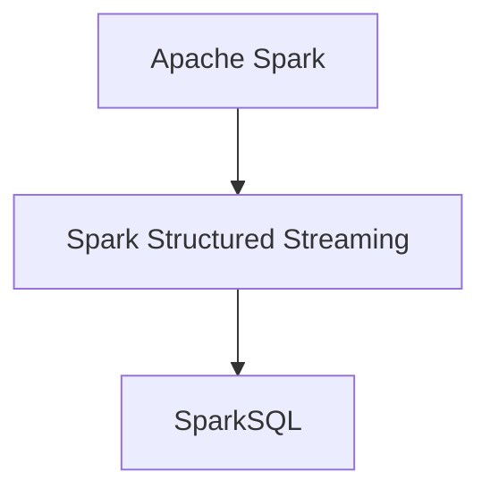
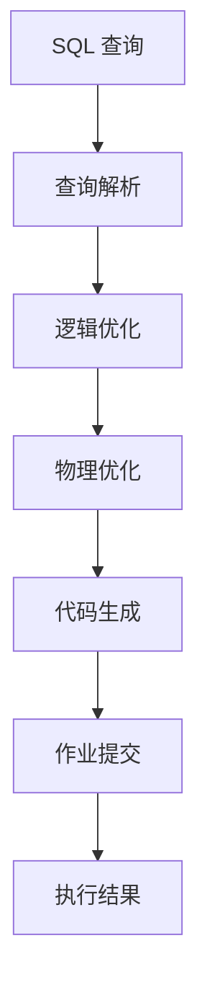
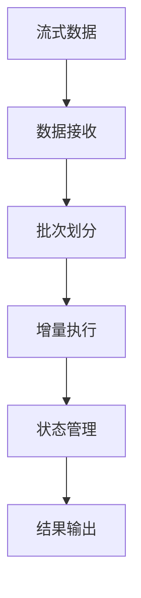

# SparkSQL在实时分析中的应用

## 1. 背景介绍

### 1.1 大数据时代的到来

随着互联网、移动互联网、物联网等新兴技术的快速发展,海量数据的产生已经成为一种常态。传统的数据处理方式已经无法满足当前数据量的需求,大数据时代的到来给数据分析带来了巨大的挑战和机遇。

### 1.2 实时数据分析的需求

在当今快节奏的商业环境中,企业需要实时获取数据洞察力以保持竞争优势。传统的基于批处理的数据分析方法已无法满足实时决策的需求。实时数据分析不仅可以提高业务效率,还能够发现隐藏的模式和趋势,从而做出更明智的决策。

### 1.3 Spark 生态系统的兴起

Apache Spark 作为一种新兴的大数据处理引擎,凭借其高性能、通用性和易用性,在大数据领域受到了广泛关注。Spark 生态系统中的 SparkSQL 提供了结构化数据处理的能力,使得在实时数据分析场景中具有重要的应用价值。

## 2. 核心概念与联系

### 2.1 Spark 与 SparkSQL

Apache Spark 是一个用于大数据处理的统一分析引擎,它支持批处理、交互式查询、机器学习、流式处理和图形处理等多种工作负载。SparkSQL 是 Spark 生态系统中的一个模块,它提供了结构化数据处理的能力,支持 SQL 查询、DataFrame 和 Dataset API。



### 2.2 DataFrame 和 Dataset

DataFrame 是 SparkSQL 中的一种分布式数据集合,它以列的形式组织数据,类似于关系型数据库中的表格。Dataset 是 DataFrame 的一种特殊形式,它提供了对象编程接口,并支持编译时类型安全性。



### 2.3 Spark Structured Streaming

Spark Structured Streaming 是 Spark 生态系统中用于流式处理的组件。它基于 SparkSQL 引擎,将流式数据视为一系列不断追加的批次,从而实现了低延迟、高吞吐量和端到端的容错性。



## 3. 核心算法原理具体操作步骤

### 3.1 Spark SQL 查询执行流程

Spark SQL 查询的执行流程包括以下几个主要步骤:

1. **查询解析**: 将 SQL 查询语句解析为逻辑执行计划。
2. **逻辑优化**: 对逻辑执行计划进行优化,如谓词下推、投影剪裁等。
3. **物理优化**: 将优化后的逻辑执行计划转换为物理执行计划。
4. **代码生成**: 根据物理执行计划生成可执行代码。
5. **作业提交**: 将生成的代码提交到 Spark 集群执行。



### 3.2 Spark Structured Streaming 工作原理

Spark Structured Streaming 将流式数据视为一系列不断追加的小批次,并对每个小批次执行类似于批处理的操作。它的工作原理可以概括为以下几个步骤:

1. **数据接收**: 从各种数据源(如 Kafka、文件系统等)接收流式数据。
2. **批次划分**: 将流式数据划分为一系列小批次。
3. **增量执行**: 对每个小批次执行增量执行,生成增量结果。
4. **状态管理**: 维护和更新查询状态,以支持有状态的流式计算。
5. **结果输出**: 将增量结果输出到各种接收器(如文件系统、控制台等)。



## 4. 数学模型和公式详细讲解举例说明

在实时数据分析中,常常需要对数据进行一些统计和数学计算。SparkSQL 提供了丰富的函数库,支持各种数学运算、统计分析和数据处理操作。

### 4.1 统计函数

SparkSQL 提供了一系列统计函数,用于计算数据的基本统计量,如均值、方差、标准差等。例如,可以使用 `avg`、`variance` 和 `stddev` 函数计算数值列的均值、方差和标准差:

$$
\begin{align*}
\text{均值} &= \frac{1}{n}\sum_{i=1}^{n}x_i \\
\text{方差} &= \frac{1}{n}\sum_{i=1}^{n}(x_i - \bar{x})^2 \\
\text{标准差} &= \sqrt{\frac{1}{n}\sum_{i=1}^{n}(x_i - \bar{x})^2}
\end{align*}
$$

其中 $n$ 是样本数量, $x_i$ 是第 $i$ 个样本值, $\bar{x}$ 是样本均值。

### 4.2 窗口函数

窗口函数是 SparkSQL 中一种强大的功能,它可以对分区数据进行滑动窗口计算。常用的窗口函数包括 `rank`、`dense_rank`、`row_number` 等,可以用于计算排名、累计和等操作。

例如,使用 `row_number` 函数可以为每个分区内的记录赋予一个唯一的行号:

$$
\text{row_number}(x) = \sum_{i=1}^{x}\mathbb{1}_{x_i \in \text{partition}}
$$

其中 $\mathbb{1}$ 是指示函数,当 $x_i$ 属于当前分区时取值为 1,否则为 0。

### 4.3 用户定义函数

SparkSQL 还支持用户自定义函数(UDF),使用 Scala、Java 或 Python 编写。UDF 可以扩展 SparkSQL 的功能,实现自定义的数据处理逻辑。例如,可以定义一个 UDF 来计算两个向量之间的欧几里得距离:

$$
d(x, y) = \sqrt{\sum_{i=1}^{n}(x_i - y_i)^2}
$$

其中 $x = (x_1, x_2, \dots, x_n)$ 和 $y = (y_1, y_2, \dots, y_n)$ 是两个 $n$ 维向量。

## 5. 项目实践: 代码实例和详细解释说明

为了更好地理解 SparkSQL 在实时数据分析中的应用,我们将通过一个实际项目来演示。该项目旨在实时分析网站的用户行为数据,包括用户浏览记录、点击记录等,以便及时发现热门内容和用户趋势。

### 5.1 数据源

在本项目中,我们将使用 Apache Kafka 作为数据源。Kafka 是一个分布式流式处理平台,广泛应用于实时数据管道和流式应用程序。我们将模拟生成网站用户行为数据,并将其发送到 Kafka 主题中。

```scala
import org.apache.kafka.clients.producer.{KafkaProducer, ProducerRecord}
import java.util.Properties
import scala.util.Random

// 配置 Kafka 生产者
val props = new Properties()
props.put("bootstrap.servers", "localhost:9092")
props.put("key.serializer", "org.apache.kafka.common.serialization.StringSerializer")
props.put("value.serializer", "org.apache.kafka.common.serialization.StringSerializer")

val producer = new KafkaProducer[String, String](props)

// 模拟生成用户行为数据
val random = new Random()
val users = (1 to 1000).map(_.toString)
val pages = (1 to 100).map(i => s"page$i")

while (true) {
  val user = users(random.nextInt(users.length))
  val page = pages(random.nextInt(pages.length))
  val event = s"$user,$page,${System.currentTimeMillis()}"
  val record = new ProducerRecord[String, String]("user_events", event)
  producer.send(record)
  Thread.sleep(100)
}
```

### 5.2 Spark Structured Streaming 应用

接下来,我们将使用 Spark Structured Streaming 从 Kafka 主题读取用户行为数据,并进行实时分析。我们将统计每个页面的浏览量、点击量,以及最近一小时内的热门页面。

```scala
import org.apache.spark.sql.functions._
import org.apache.spark.sql.streaming.Trigger

// 创建 SparkSession
val spark = SparkSession.builder()
  .appName("UserBehaviorAnalysis")
  .getOrCreate()

// 定义 Kafka 数据源
val kafkaSource = spark.readStream
  .format("kafka")
  .option("kafka.bootstrap.servers", "localhost:9092")
  .option("subscribe", "user_events")
  .load()

// 解析数据
val events = kafkaSource.selectExpr("CAST(value AS STRING)")
  .as[String]
  .map(_.split(","))
  .map(arr => (arr(0), arr(1), arr(2).toLong))
  .toDF("user", "page", "timestamp")

// 统计页面浏览量和点击量
val viewStats = events
  .groupBy($"page")
  .agg(count("*").as("views"))

val clickStats = events
  .groupBy($"page")
  .agg(countDistinct("user").as("clicks"))

// 计算最近一小时内的热门页面
val hotPages = events
  .withWatermark("timestamp", "1 hour")
  .groupBy(window($"timestamp", "1 hour"), $"page")
  .agg(count("*").as("views"))
  .select($"window.end", $"page", $"views")
  .orderBy($"views".desc)

// 启动流式查询
val viewQuery = viewStats
  .writeStream
  .outputMode("complete")
  .format("console")
  .queryName("ViewStats")
  .trigger(Trigger.ProcessingTime("10 seconds"))
  .start()

val clickQuery = clickStats
  .writeStream
  .outputMode("complete")
  .format("console")
  .queryName("ClickStats")
  .trigger(Trigger.ProcessingTime("10 seconds"))
  .start()

val hotQuery = hotPages
  .writeStream
  .outputMode("complete")
  .format("console")
  .queryName("HotPages")
  .trigger(Trigger.ProcessingTime("10 seconds"))
  .start()

// 等待终止
viewQuery.awaitTermination()
clickQuery.awaitTermination()
hotQuery.awaitTermination()
```

在上述代码中,我们首先从 Kafka 主题读取用户行为数据,并解析出用户 ID、页面 ID 和时间戳。然后,我们使用 Structured Streaming 进行以下操作:

1. 统计每个页面的浏览量,即访问该页面的总次数。
2. 统计每个页面的点击量,即访问该页面的独立用户数。
3. 计算最近一小时内的热门页面,即按照浏览量降序排列的页面列表。

最后,我们启动三个流式查询,并将结果输出到控制台。每隔 10 秒,查询将输出一次最新的统计结果。

通过这个项目,我们可以看到 SparkSQL 在实时数据分析中的强大功能,包括从外部数据源读取流式数据、使用 SQL 进行数据转换和聚合、支持窗口函数和时间操作等。

## 6. 实际应用场景

SparkSQL 在实时数据分析领域有广泛的应用场景,包括但不限于以下几个方面:

### 6.1 网站/应用程序分析

通过分析网站或移动应用程序的用户行为数据,可以实时了解用户的浏览习惯、点击模式和流量趋势。这对于优化用户体验、个性化推荐和营销策略等具有重要意义。

### 6.2 物联网数据分析

在物联网领域,需要实时处理来自各种传感器和设备的海量数据流。SparkSQL 可以用于实时监控设备状态、检测异常情况,并进行预测性维护。

### 6.3 金融风险监控

金融机构需要实时监控交易数据,以发现可疑活动和潜在风险。SparkSQL 可以用于实时分析交易模式、检测欺诈行为,并及时采取应对措施。

### 6.4 实时推荐系统

在电子商务、社交媒体和内容推荐等领域,实时推荐系统可以根据用户的实时行