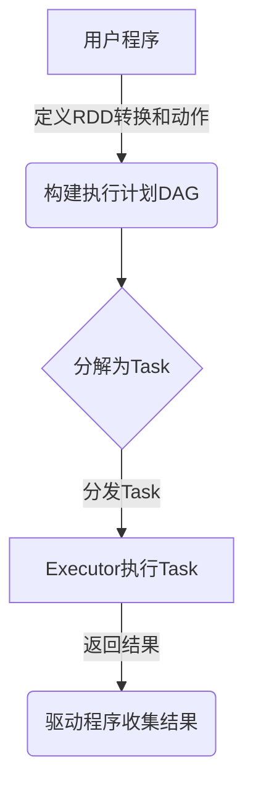

# Spark原理与代码实例讲解

## 1.背景介绍

Apache Spark是一种快速、通用的集群计算系统,旨在提供高性能的分布式数据处理能力。它最初是由加州大学伯克利分校的AMPLab所开发,后来捐赠给Apache软件基金会,成为Apache的一个顶级项目。

Spark的核心思想是基于内存计算,通过将数据集缓存在内存中,可以显著提高数据处理的效率。与传统的基于磁盘的Hadoop MapReduce系统相比,Spark能够更高效地处理迭代计算、交互式查询和流式计算等场景。

Spark提供了丰富的编程接口,支持多种编程语言,包括Scala、Java、Python和R。它还支持多种数据源,如HDFS、Hive、Cassandra等,可以轻松与其他大数据系统集成。

Spark的设计理念是将计算过程分为多个独立的任务,并将这些任务分发到集群中的多个工作节点上并行执行。这种分布式计算模型使Spark能够充分利用集群资源,实现高度的并行性和容错性。

## 2.核心概念与联系

Spark的核心概念主要包括以下几个方面:

### 2.1 RDD (Resilient Distributed Dataset)

RDD是Spark的基础数据结构,表示一个不可变、分区的记录集合。RDD可以从外部数据源(如HDFS、HBase等)创建,也可以通过对现有RDD执行转换操作而产生新的RDD。RDD支持两种操作:转换(Transformation)和动作(Action)。

### 2.2 Spark上下文(SparkContext)

SparkContext是Spark应用程序的入口点,用于创建RDD、累加器和广播变量等。它还负责与Spark集群的资源管理器(如YARN或Standalone)进行通信,以便分配资源和调度任务。

### 2.3 Spark SQL

Spark SQL是Spark中用于结构化数据处理的模块。它提供了一种类似SQL的查询语言,可以方便地处理各种格式的结构化数据,如Hive表、Parquet文件等。Spark SQL还支持使用DataFrame和Dataset API进行编程式数据处理。

### 2.4 Spark Streaming

Spark Streaming是Spark中用于流式数据处理的模块。它可以从各种数据源(如Kafka、Flume等)实时获取数据流,并使用类似于批处理的方式进行处理。

### 2.5 MLlib (Machine Learning Library)

MLlib是Spark中的机器学习库,提供了多种机器学习算法的实现,如分类、回归、聚类等。MLlib可以与Spark的其他模块(如Spark SQL)无缝集成,实现端到端的机器学习工作流。

### 2.6 GraphX

GraphX是Spark中用于图形计算和图形并行处理的模块。它提供了一种高效的图形数据结构和图形运算符,可以用于处理大规模图形数据。

这些核心概念相互关联,共同构成了Spark的整体架构。例如,RDD是Spark的基础数据结构,而Spark SQL、Spark Streaming和MLlib等模块都基于RDD进行数据处理。SparkContext则是整个Spark应用程序的入口点,负责与集群资源管理器进行交互。

## 3.核心算法原理具体操作步骤

Spark的核心算法原理主要体现在RDD的转换操作和动作操作上。

### 3.1 RDD转换操作

转换操作是指对RDD进行各种转换,生成新的RDD。常见的转换操作包括:

- **map**: 对RDD中的每个元素执行指定的函数操作,生成新的RDD。
- **flatMap**: 类似于map,但是每个输入元素可以映射为0个或多个输出元素。
- **filter**: 返回一个新的RDD,只包含满足指定条件的元素。
- **union**: 返回一个新的RDD,它是两个RDD的并集。
- **join**: 对两个RDD执行内连接操作。
- **groupByKey**: 对RDD中的元素进行分组,返回一个新的(key, iterator)对的RDD。
- **reduceByKey**: 对RDD中的元素进行聚合操作,返回一个新的(key, value)对的RDD。

这些转换操作都是懒加载的,即只有在执行动作操作时,才会真正触发计算。

### 3.2 RDD动作操作

动作操作是指对RDD执行计算,并返回结果或将结果保存到外部存储系统。常见的动作操作包括:

- **count**: 返回RDD中元素的个数。
- **collect**: 将RDD中的所有元素以数组的形式返回到驱动程序。
- **reduce**: 使用指定的函数对RDD中的元素进行聚合操作。
- **take**: 返回RDD中的前n个元素。
- **saveAsTextFile**: 将RDD的元素以文本文件的形式保存到外部存储系统。

动作操作会触发Spark作业的执行,并根据RDD的血统关系(lineage)自动构建出执行计划。

### 3.3 Spark作业执行流程

Spark作业的执行流程如下:

1. 用户编写Spark应用程序,定义RDD的转换操作和动作操作。
2. 当执行动作操作时,Spark会根据RDD的血统关系构建出执行计划(DAG)。
3. Spark将执行计划分解为多个任务(Task),并将这些任务分发到各个工作节点(Executor)上执行。
4. 工作节点执行任务,并将结果返回给驱动程序或保存到外部存储系统。
5. 驱动程序收集并处理结果数据。

在执行过程中,Spark会自动处理数据分区、任务调度、容错等细节,用户只需关注业务逻辑即可。



## 4.数学模型和公式详细讲解举例说明

在Spark中,一些核心算法和模型涉及到数学公式和模型。以下是一些重要的数学模型和公式,以及它们在Spark中的应用。

### 4.1 PageRank算法

PageRank算法是Google用于网页排名的著名算法,它也被广泛应用于图形计算和社交网络分析等领域。PageRank算法的核心思想是,一个网页的重要性不仅取决于它被其他网页链接的次数,还取决于链接它的网页的重要性。

PageRank算法的数学模型如下:

$$PR(u) = \frac{1-d}{N} + d \sum_{v \in B_u} \frac{PR(v)}{L(v)}$$

其中:

- $PR(u)$ 表示网页 $u$ 的PageRank值
- $N$ 是网络中网页的总数
- $B_u$ 是链接到网页 $u$ 的网页集合
- $L(v)$ 是网页 $v$ 的出链接数
- $d$ 是一个阻尼系数,通常取值为0.85

在Spark的GraphX模块中,提供了PageRank算法的实现,可以方便地对大规模图形数据进行PageRank计算。

### 4.2 K-means聚类算法

K-means是一种常用的无监督聚类算法,广泛应用于数据挖掘、图像处理等领域。K-means算法的目标是将数据集划分为K个簇,使得簇内数据点之间的距离尽可能小,而簇间数据点之间的距离尽可能大。

K-means算法的数学模型如下:

$$J = \sum_{i=1}^{K} \sum_{x \in C_i} \left\Vert x - \mu_i \right\Vert^2$$

其中:

- $K$ 是簇的数量
- $C_i$ 是第 $i$ 个簇
- $\mu_i$ 是第 $i$ 个簇的质心
- $\left\Vert x - \mu_i \right\Vert^2$ 是数据点 $x$ 到质心 $\mu_i$ 的欧几里得距离的平方

K-means算法的目标是最小化目标函数 $J$,即找到最优的簇划分和质心位置。

在Spark的MLlib模块中,提供了K-means算法的实现,可以高效地对大规模数据集进行聚类分析。

### 4.3 逻辑回归模型

逻辑回归是一种常用的监督学习算法,主要用于二分类问题。逻辑回归模型的数学公式如下:

$$P(Y=1|X) = \frac{1}{1 + e^{-(\beta_0 + \beta_1X_1 + \beta_2X_2 + \cdots + \beta_nX_n)}}$$

其中:

- $P(Y=1|X)$ 是给定特征向量 $X$ 时,目标变量 $Y$ 取值为1的概率
- $\beta_0$ 是常数项
- $\beta_1, \beta_2, \cdots, \beta_n$ 是特征系数
- $X_1, X_2, \cdots, X_n$ 是特征向量

逻辑回归模型的目标是找到最优的参数 $\beta_0, \beta_1, \cdots, \beta_n$,使得模型在训练数据上的预测效果最好。

在Spark的MLlib模块中,提供了逻辑回归算法的实现,可以高效地对大规模数据集进行二分类建模。

### 4.4 矩阵分解模型

矩阵分解是一种常用的协同过滤算法,广泛应用于推荐系统、链接预测等领域。矩阵分解的数学模型如下:

$$R \approx P^T Q$$

其中:

- $R$ 是一个 $m \times n$ 的评分矩阵,表示 $m$ 个用户对 $n$ 个项目的评分
- $P$ 是一个 $m \times k$ 的用户特征矩阵
- $Q$ 是一个 $n \times k$ 的项目特征矩阵
- $k$ 是隐式特征的维度

矩阵分解的目标是找到最优的 $P$ 和 $Q$,使得 $P^T Q$ 近似于原始评分矩阵 $R$。

在Spark的MLlib模块中,提供了矩阵分解算法的实现,可以高效地对大规模评分数据进行建模和推荐。

这些数学模型和公式在Spark中的应用,体现了Spark在大数据处理和机器学习领域的强大能力。通过将这些算法与Spark的分布式计算框架相结合,可以高效地处理海量数据,并获得高质量的分析结果。

## 5.项目实践:代码实例和详细解释说明

为了更好地理解Spark的原理和使用方法,我们将通过一个实际项目来演示Spark的代码实例。在这个项目中,我们将使用Spark进行电影评分数据的分析和推荐。

### 5.1 数据集介绍

我们将使用MovieLens数据集,这是一个著名的电影评分数据集,由明尼苏达大学计算机系提供。该数据集包含了大约2000万条电影评分记录,涉及27000部电影和138000名用户。

数据集的格式如下:

```
userId,movieId,rating,timestamp
```

每一行表示一个用户对一部电影的评分记录,包括用户ID、电影ID、评分和时间戳。

### 5.2 数据加载

首先,我们需要加载数据集到Spark中。以下是使用Spark SQL加载数据的代码示例:

```scala
import org.apache.spark.sql.SparkSession

val spark = SparkSession.builder()
  .appName("MovieLensRecommender")
  .getOrCreate()

val ratings = spark.read
  .option("inferSchema", "true")
  .csv("ratings.csv")
  .toDF("userId", "movieId", "rating", "timestamp")
```

这段代码创建了一个SparkSession,并使用Spark SQL的CSV数据源加载了"ratings.csv"文件。加载后的数据被存储在一个DataFrame中,包含四列:userId、movieId、rating和timestamp。

### 5.3 数据探索和预处理

加载数据后,我们可以对数据进行探索和预处理,以便后续的分析和建模。以下是一些常见的操作:

```scala
// 查看数据schema
ratings.printSchema()

// 查看前几行数据
ratings.show(5)

// 统计评分记录数
ratings.count()

// 去除评分为0的记录
val validRatings = ratings.filter("rating > 0")

// 将数据随机分为训练集和测试集
val Array(trainData, testData) = validRatings.randomSplit(Array(0.8, 0.2))
```

这些操作包括查看数据schema、查看前几行数据、统计