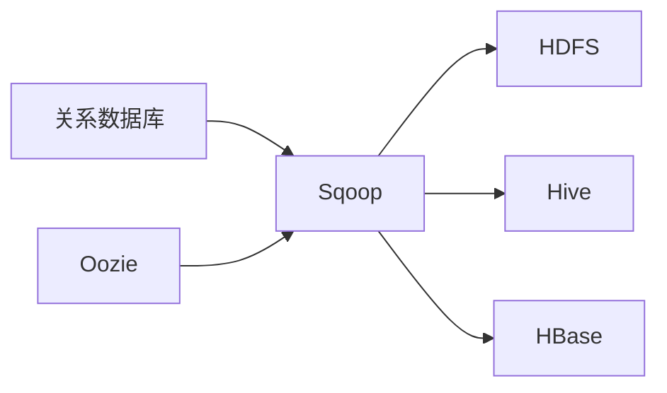

# Sqoop导入导出控制指令完全解析

## 1. 背景介绍

### 1.1 大数据时代的数据交换需求
在大数据时代,海量数据的存储和处理已经成为各行各业的普遍需求。企业需要在不同的存储系统之间高效地交换数据,以支撑业务的正常运转和数据分析。然而,不同的数据存储系统,如关系型数据库、Hadoop分布式文件系统(HDFS)、NoSQL数据库等,在数据格式和访问方式上存在差异,使得数据交换面临诸多挑战。

### 1.2 Sqoop的诞生
为了解决异构数据源之间的数据交换问题,Apache软件基金会推出了Sqoop项目。Sqoop是一款开源的数据导入导出工具,它提供了一种高效的方式,可以在Hadoop生态系统和结构化数据存储(如关系数据库)之间双向传输数据。

### 1.3 Sqoop的应用场景
Sqoop广泛应用于以下场景:
- 将关系型数据库中的数据导入到Hadoop生态系统中,如HDFS、Hive、HBase等,以便进行大规模数据处理和分析。
- 将Hadoop处理后的结果数据导出到关系型数据库中,供其他应用程序使用或生成报表。
- 在不同的Hadoop集群或数据存储系统之间迁移数据。

## 2. 核心概念与联系

### 2.1 Sqoop的架构
Sqoop基于MapReduce框架,使用MapReduce作业来实现并行化的数据传输。Sqoop的核心组件包括:
- Sqoop客户端:用于提交数据导入导出任务的命令行工具。
- Sqoop服务器:运行在Hadoop集群上,负责接收和执行Sqoop任务。
- 连接器:用于与不同的数据源进行交互,如JDBC连接器、HDFS连接器、Hive连接器等。

### 2.2 导入和导出过程
Sqoop支持两种主要的数据传输操作:导入和导出。
- 导入:将数据从外部数据源(如关系数据库)传输到Hadoop生态系统中。
- 导出:将Hadoop生态系统中的数据传输到外部数据源中。

### 2.3 Sqoop与Hadoop生态系统的关系
Sqoop与Hadoop生态系统紧密集成,可以与多个Hadoop组件协同工作:
- HDFS:Sqoop可以将数据导入到HDFS,或从HDFS导出数据。
- Hive:Sqoop支持将数据直接导入Hive表,或将Hive查询结果导出到关系数据库。
- HBase:Sqoop可以将数据导入HBase表,或从HBase表导出数据。
- Oozie:Sqoop可以与Oozie工作流集成,实现自动化的数据传输任务。

下图展示了Sqoop在Hadoop生态系统中的位置和与其他组件的交互:



## 3. 核心算法原理与具体操作步骤

### 3.1 数据导入原理
Sqoop导入数据的基本原理如下:
1. Sqoop客户端提交导入任务,指定源数据库的连接信息、目标数据存储的位置等参数。
2. Sqoop服务器根据任务配置,生成MapReduce作业。
3. MapReduce作业启动多个Map任务,每个Map任务负责从源数据库读取一部分数据。
4. Map任务使用JDBC连接器连接源数据库,执行查询语句,将结果数据写入HDFS或其他目标存储。
5. 如果启用了Combiner或Reduce阶段,还可以对导入的数据进行聚合或处理。
6. 导入完成后,生成的数据文件存储在HDFS或其他指定位置。

### 3.2 数据导出原理
Sqoop导出数据的基本原理如下:
1. Sqoop客户端提交导出任务,指定目标数据库的连接信息、源数据存储的位置等参数。
2. Sqoop服务器根据任务配置,生成MapReduce作业。
3. MapReduce作业启动多个Map任务,每个Map任务负责读取HDFS或其他源存储中的一部分数据。
4. Map任务使用JDBC连接器连接目标数据库,执行插入或更新语句,将数据写入目标表。
5. 如果启用了Combiner或Reduce阶段,还可以对导出的数据进行聚合或处理。
6. 导出完成后,数据成功写入目标数据库。

### 3.3 导入导出的具体操作步骤
以下是使用Sqoop进行数据导入和导出的具体操作步骤:

#### 3.3.1 数据导入
1. 准备源数据库和目标Hadoop集群环境,确保Sqoop可以访问。
2. 编写Sqoop导入命令,指定以下关键参数:
   - `--connect`:源数据库的JDBC连接字符串。
   - `--username`和`--password`:源数据库的认证信息。
   - `--table`:要导入的源表名称。
   - `--target-dir`:HDFS上的目标目录。
   - `--num-mappers`:并行Map任务的数量。
3. 执行Sqoop导入命令,启动数据导入过程。
4. 监控导入任务的执行进度和日志输出。
5. 导入完成后,检查HDFS上生成的数据文件。

示例命令:
```shell
sqoop import \
  --connect jdbc:mysql://localhost:3306/mydb \
  --username root \
  --password password \
  --table employees \
  --target-dir /data/employees \
  --num-mappers 4
```

#### 3.3.2 数据导出
1. 准备源Hadoop集群环境和目标数据库,确保Sqoop可以访问。
2. 编写Sqoop导出命令,指定以下关键参数:
   - `--connect`:目标数据库的JDBC连接字符串。
   - `--username`和`--password`:目标数据库的认证信息。
   - `--table`:要导出到的目标表名称。
   - `--export-dir`:HDFS上的源数据目录。
   - `--num-mappers`:并行Map任务的数量。
3. 执行Sqoop导出命令,启动数据导出过程。
4. 监控导出任务的执行进度和日志输出。
5. 导出完成后,检查目标数据库中的数据是否正确写入。

示例命令:
```shell
sqoop export \
  --connect jdbc:mysql://localhost:3306/mydb \
  --username root \
  --password password \
  --table exported_employees \
  --export-dir /data/employees \
  --num-mappers 4
```

## 4. 数学模型和公式详细讲解举例说明

### 4.1 数据分片与并行度
Sqoop利用MapReduce的并行处理能力来提高数据传输的效率。在导入和导出过程中,Sqoop根据指定的并行度(`--num-mappers`参数)将数据分成多个分片,每个分片由一个Map任务处理。

假设要导入的表有 $N$ 条记录,并行度为 $M$,则每个Map任务处理的记录数 $n$ 可以表示为:

$$ n = \lceil \frac{N}{M} \rceil $$

其中,$\lceil x \rceil$ 表示对 $x$ 向上取整。

例如,如果要导入一个包含1000万条记录的表,并指定并行度为8,则每个Map任务需要处理:

$$ n = \lceil \frac{10,000,000}{8} \rceil = 1,250,000 $$

即每个Map任务大约处理125万条记录。

### 4.2 数据分片的边界条件
为了确定每个Map任务处理的数据范围,Sqoop需要计算数据分片的边界条件。Sqoop通过在源表上执行查询来获取最小值和最大值,然后根据并行度将数据范围划分为多个分片。

假设源表有一个数字类型的主键列 $id$,最小值为 $min_id$,最大值为 $max_id$,并行度为 $M$,则每个分片的边界条件可以表示为:

$$ 
\begin{aligned}
lower_bound_i &= min_id + i \times \lfloor \frac{max_id - min_id + 1}{M} \rfloor \\
upper_bound_i &= lower_bound_i + \lfloor \frac{max_id - min_id + 1}{M} \rfloor - 1
\end{aligned}
$$

其中,$i$表示分片的编号(从0开始),$\lfloor x \rfloor$表示对$x$向下取整。

例如,如果源表的$id$列最小值为1,最大值为1000万,并行度为8,则每个分片的边界条件为:

$$
\begin{aligned}
lower_bound_0 &= 1 + 0 \times \lfloor \frac{10,000,000 - 1 + 1}{8} \rfloor = 1 \\
upper_bound_0 &= 1 + \lfloor \frac{10,000,000 - 1 + 1}{8} \rfloor - 1 = 1,250,000 \\
lower_bound_1 &= 1 + 1 \times \lfloor \frac{10,000,000 - 1 + 1}{8} \rfloor = 1,250,001 \\
upper_bound_1 &= 1,250,001 + \lfloor \frac{10,000,000 - 1 + 1}{8} \rfloor - 1 = 2,500,000 \\
\ldots \\
lower_bound_7 &= 1 + 7 \times \lfloor \frac{10,000,000 - 1 + 1}{8} \rfloor = 8,750,001 \\
upper_bound_7 &= 8,750,001 + \lfloor \frac{10,000,000 - 1 + 1}{8} \rfloor - 1 = 10,000,000
\end{aligned}
$$

每个Map任务根据分配到的边界条件,生成相应的SQL查询语句来获取数据。

## 5. 项目实践:代码实例和详细解释说明

下面通过一个实际的项目实践,演示如何使用Sqoop进行数据导入和导出。

### 5.1 环境准备
- Hadoop集群:版本2.x或以上
- MySQL数据库:版本5.x或以上
- Sqoop:版本1.4.x

### 5.2 数据导入示例
假设我们有一个MySQL数据库,其中包含一个名为`employees`的表,我们希望将该表的数据导入到Hadoop集群的HDFS中。

#### 5.2.1 MySQL表结构
```sql
CREATE TABLE employees (
  id INT PRIMARY KEY,
  name VARCHAR(100),
  age INT,
  department VARCHAR(100)
);
```

#### 5.2.2 Sqoop导入命令
```shell
sqoop import \
  --connect jdbc:mysql://localhost:3306/mydb \
  --username root \
  --password password \
  --table employees \
  --target-dir /data/employees \
  --num-mappers 4 \
  --fields-terminated-by ',' \
  --lines-terminated-by '\n'
```

命令解释:
- `--connect`:指定MySQL数据库的JDBC连接字符串。
- `--username`和`--password`:指定MySQL数据库的认证信息。
- `--table`:指定要导入的MySQL表名称。
- `--target-dir`:指定HDFS上的目标目录,用于存储导入的数据。
- `--num-mappers`:指定并行执行的Map任务数量。
- `--fields-terminated-by`:指定字段之间的分隔符。
- `--lines-terminated-by`:指定行之间的分隔符。

#### 5.2.3 导入结果验证
导入完成后,可以在HDFS的`/data/employees`目录下找到导入的数据文件。使用以下命令查看数据:
```shell
hadoop fs -cat /data/employees/part-m-00000
```

输出示例:
```
1,John Doe,30,Sales
2,Jane Smith,25,Marketing
3,Bob Johnson,35,Engineering
```

### 5.3 数据导出示例
假设我们已经在Hadoop集群的HDFS中存储了一些数据,现在希望将这些数据导出到MySQL数据库中。

#### 5.3.1 HDFS数据格式
假设HDFS上的数据文件`/data/exported_employees`的内容如下:
```
4,Alice Brown,28,Human Resources
5,Charlie Davis,32,Finance
6,Eva Wilson,29,Operations
```

#### 5.3.2 MySQL目标表
在MySQL中创建一个与数据格式匹配的目标表:
```sql
CREATE TABLE exported_employees (
  id INT PRIMARY KEY,
  name VARCHAR(100),
  age INT,
  department VARCHAR(100)
);
```

#### 5.3.3 Sqoop导出命令
```shell
sqoop export \
  --connect jdbc:mysql://localhost:3306/mydb \
  --username root \
  --password password \
  --table exported_employees \
  --export-dir /data/exported_employees \
  --num-