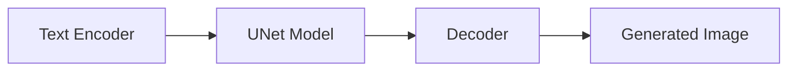
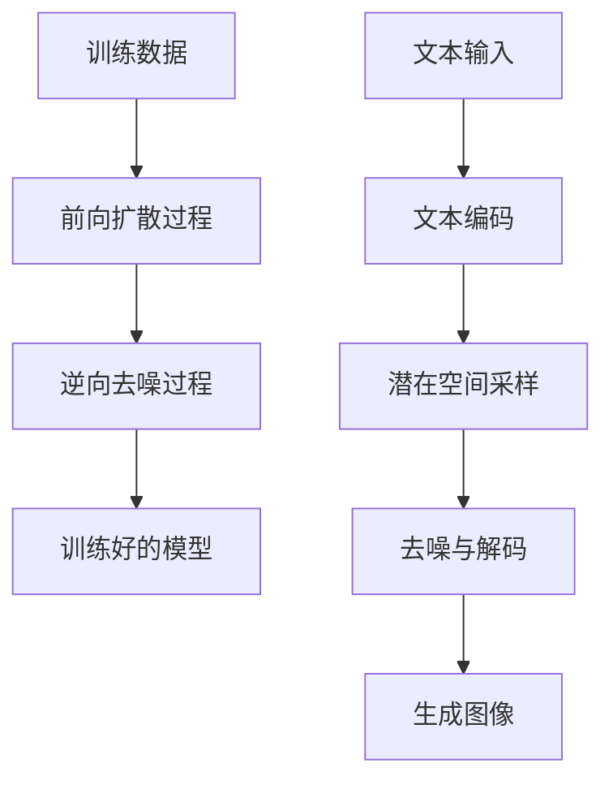

# Stable Diffusion原理与代码实例讲解

## 1.背景介绍
### 1.1 生成式人工智能的发展历程
### 1.2 Stable Diffusion的诞生与意义 
### 1.3 Stable Diffusion在文本到图像生成领域的应用前景

## 2.核心概念与联系
### 2.1 扩散模型(Diffusion Model)
#### 2.1.1 前向扩散过程
#### 2.1.2 逆向去噪过程  
### 2.2 变分自编码器(VAE)
#### 2.2.1 VAE的基本原理
#### 2.2.2 VAE在Stable Diffusion中的作用
### 2.3 注意力机制(Attention)
#### 2.3.1 自注意力机制
#### 2.3.2 交叉注意力机制
### 2.4 Stable Diffusion模型架构概览

## 3.核心算法原理与具体操作步骤
### 3.1 训练阶段
#### 3.1.1 数据准备与预处理
#### 3.1.2 前向扩散过程训练
#### 3.1.3 逆向去噪过程训练
### 3.2 推理阶段  
#### 3.2.1 文本编码
#### 3.2.2 潜在空间采样
#### 3.2.3 去噪与解码
### 3.3 Stable Diffusion训练与推理流程图

## 4.数学模型和公式详细讲解举例说明
### 4.1 扩散模型的数学表示
#### 4.1.1 前向扩散过程数学公式
$$q(x_t|x_{t-1}) = \mathcal{N}(x_t; \sqrt{1-\beta_t} x_{t-1}, \beta_t \mathbf{I})$$
#### 4.1.2 逆向去噪过程数学公式  
$$p_\theta(x_{t-1}|x_t) = \mathcal{N}(x_{t-1}; \mu_\theta(x_t, t), \sigma_\theta(x_t, t))$$
### 4.2 变分自编码器的数学表示
#### 4.2.1 VAE的目标函数
$$\mathcal{L}(\theta, \phi) = \mathbb{E}_{q_\phi(z|x)}[\log p_\theta(x|z)] - D_{KL}(q_\phi(z|x) || p(z))$$
### 4.3 注意力机制的数学表示
#### 4.3.1 自注意力机制计算公式
$$\text{Attention}(Q, K, V) = \text{softmax}(\frac{QK^T}{\sqrt{d_k}})V$$

## 5.项目实践：代码实例和详细解释说明
### 5.1 环境配置与依赖安装
### 5.2 Stable Diffusion模型实现代码
#### 5.2.1 模型定义
#### 5.2.2 前向扩散过程实现
#### 5.2.3 逆向去噪过程实现
### 5.3 模型训练代码
#### 5.3.1 数据加载与预处理
#### 5.3.2 训练循环
#### 5.3.3 模型保存与加载
### 5.4 模型推理代码
#### 5.4.1 文本编码
#### 5.4.2 潜在空间采样
#### 5.4.3 去噪与解码
### 5.5 生成图像展示与分析

## 6.实际应用场景
### 6.1 创意设计领域
#### 6.1.1 广告设计
#### 6.1.2 产品设计
### 6.2 娱乐媒体领域  
#### 6.2.1 电影与动画
#### 6.2.2 游戏设计
### 6.3 教育与科普领域
#### 6.3.1 教学辅助工具
#### 6.3.2 科普内容生成

## 7.工具和资源推荐
### 7.1 开源实现
#### 7.1.1 CompVis/stable-diffusion
#### 7.1.2 AUTOMATIC1111/stable-diffusion-webui
### 7.2 训练数据集
#### 7.2.1 LAION-5B
#### 7.2.2 Conceptual Captions
### 7.3 社区与交流平台
#### 7.3.1 Hugging Face
#### 7.3.2 Stable Diffusion Discord社区

## 8.总结：未来发展趋势与挑战
### 8.1 Stable Diffusion的优势与局限性
### 8.2 文本到图像生成技术的发展趋势
#### 8.2.1 模型性能与效率提升
#### 8.2.2 多模态融合与交互
#### 8.2.3 个性化与定制化生成
### 8.3 未来面临的挑战与机遇
#### 8.3.1 版权与伦理问题
#### 8.3.2 应用场景拓展与创新

## 9.附录：常见问题与解答
### 9.1 Stable Diffusion与DALL-E 2、Midjourney等模型的异同
### 9.2 如何微调Stable Diffusion模型以适应特定领域
### 9.3 生成图像的多样性与一致性如何权衡
### 9.4 Stable Diffusion在视频生成领域的应用探索

作者：禅与计算机程序设计艺术 / Zen and the Art of Computer Programming