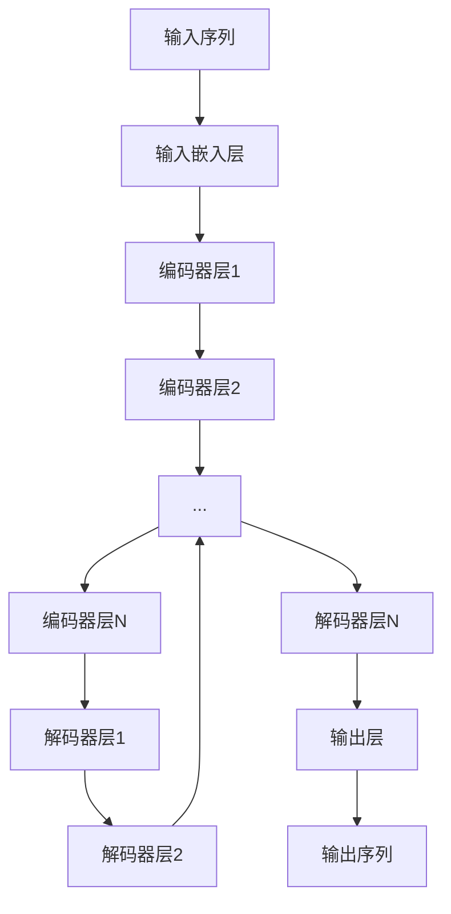

# T5(Text-to-Text Transfer Transformer) - 原理与代码实例讲解

## 1.背景介绍

在自然语言处理(NLP)领域,Transformer模型已经成为主流架构,展现出卓越的性能表现。作为Transformer的扩展,T5(Text-to-Text Transfer Transformer)模型被提出,旨在统一不同的NLP任务到一个文本到文本(text-to-text)的形式。T5模型由谷歌AI团队于2019年发布,它将所有NLP任务都转化为了序列到序列(sequence-to-sequence)的形式,使用相同的数据和模型来完成不同的NLP任务,展现出了强大的泛化能力。

### 1.1 Transformer模型回顾

在介绍T5模型之前,我们先简要回顾一下Transformer模型的基本架构。Transformer是一种全新的基于注意力机制(Attention Mechanism)的序列到序列模型,不再依赖于循环神经网络(RNN)和卷积神经网络(CNN)。它完全摒弃了循环结构,使用自注意力(Self-Attention)机制来捕获输入序列中任意两个位置之间的依赖关系。

Transformer的核心组件包括:

- **Embedding层**: 将输入序列(如文本)转换为向量表示
- **编码器(Encoder)**: 由多个相同的编码器层组成,每一层包含多头自注意力(Multi-Head Attention)和前馈神经网络(Feed-Forward Neural Network)
- **解码器(Decoder)**: 与编码器类似,由多个解码器层组成,不同之处在于解码器层还包含一个额外的注意力子层,用于关注编码器的输出

### 1.2 T5模型的优势

传统的NLP任务通常被分为不同的类别,如文本分类、机器翻译、问答系统等,每个任务都需要专门的模型架构和训练方式。而T5模型的核心思想是将所有NLP任务都统一转化为文本到文本的形式,使用相同的模型架构和训练方式来完成不同的任务。这种统一的框架带来了以下优势:

1. **简化模型复杂性**: 不再需要为每个NLP任务设计专门的模型架构,降低了模型复杂性。

2. **提高泛化能力**: 在大规模语料库上进行预训练,可以让模型捕获到更多的语言知识,提高了模型在不同任务上的泛化能力。

3. **知识迁移**: 由于使用相同的模型架构,不同任务之间的知识可以相互迁移,提高了模型性能。

4. **多任务学习**: T5可以同时在多个任务上进行训练,实现多任务学习,进一步提升泛化能力。

## 2.核心概念与联系

### 2.1 序列到序列(Sequence-to-Sequence)

T5模型将所有NLP任务都转化为序列到序列(Sequence-to-Sequence)的形式。这意味着无论输入是什么(如文本、图像等),都会被转换为一个输入序列;同样,模型的输出也会被转换为一个输出序列。例如,在机器翻译任务中,输入序列是源语言文本,输出序列是目标语言文本。

为了实现这种统一的框架,T5引入了一种特殊的标记(Task Prefix)来指示当前任务的类型。例如,对于问答任务,输入序列可以表示为`"问答: 问题 + 上下文文本"`。模型会根据这个前缀生成相应的答案作为输出序列。

### 2.2 预训练与微调(Pretraining & Fine-tuning)

与其他Transformer模型类似,T5也采用了两阶段训练策略:

1. **预训练(Pretraining)**: 在大规模无监督语料库上进行自监督式预训练,让模型捕获到丰富的语言知识。

2. **微调(Fine-tuning)**: 在特定任务的标注数据集上进行监督式微调,让模型学习针对该任务的知识。

在预训练阶段,T5采用了掩码语言模型(Masked Language Modeling)和次序预测(Next Sentence Prediction)等自监督目标。与BERT等模型不同的是,T5使用了一种新的自回归语言建模(Auto-regressive Language Modeling)目标,即给定前缀序列,模型需要预测后续的序列。这种方式更加贴近实际的序列到序列任务,有助于提高模型性能。

在微调阶段,T5会根据具体任务构造输入序列和目标序列,并在相应的数据集上进行监督式训练。由于使用了统一的序列到序列框架,不同任务之间的知识可以相互迁移,提高了泛化能力。

### 2.3 多头自注意力机制(Multi-Head Attention)

与原始Transformer模型一样,T5的编码器和解码器都采用了多头自注意力机制来捕获序列中元素之间的依赖关系。多头自注意力机制可以被视为多个独立的注意力机制的集合,每个注意力头都会关注序列中不同的位置关系,最终将所有注意力头的结果进行拼接,捕获到更丰富的依赖信息。

在T5中,编码器的自注意力机制用于捕获输入序列中元素之间的依赖关系;而解码器的自注意力机制则用于捕获输出序列中元素之间的依赖关系。此外,解码器还包含一个额外的注意力子层,用于关注编码器的输出,从而捕获输入序列和输出序列之间的依赖关系。

## 3.核心算法原理具体操作步骤

### 3.1 T5模型架构

T5模型的整体架构与原始Transformer模型非常相似,主要由以下几个部分组成:

1. **输入嵌入层(Input Embeddings)**: 将输入序列(包括任务前缀和输入文本)转换为向量表示。

2. **编码器(Encoder)**: 由多个相同的编码器层组成,每一层包含多头自注意力和前馈神经网络。编码器用于捕获输入序列中元素之间的依赖关系。

3. **解码器(Decoder)**: 与编码器类似,由多个解码器层组成。不同之处在于,解码器层还包含一个额外的注意力子层,用于关注编码器的输出,从而捕获输入序列和输出序列之间的依赖关系。

4. **输出层(Output Layer)**: 将解码器的输出转换为目标序列的概率分布。

下面是T5模型架构的Mermaid流程图:



### 3.2 输入输出表示

在T5中,所有的输入和输出都被表示为文本序列的形式。对于每个任务,都需要定义一个特殊的任务前缀(Task Prefix),用于指示当前的任务类型。例如,对于机器翻译任务,输入序列可以表示为`"翻译英语到法语: 输入文本"`。

为了处理不同长度的输入和输出序列,T5采用了与原始Transformer模型相同的位置编码(Positional Encoding)方式,将序列中每个元素的位置信息编码到向量表示中。

### 3.3 预训练目标

在预训练阶段,T5采用了一种新的自回归语言建模(Auto-regressive Language Modeling)目标,即给定前缀序列,模型需要预测后续的序列。具体来说,预训练目标包括以下两个部分:

1. **掩码语言模型(Masked Language Modeling)**: 与BERT类似,在输入序列中随机掩码一部分tokens,模型需要预测这些被掩码的tokens。

2. **次序预测(Next Sentence Prediction)**: 给定一对输入序列,模型需要预测它们是否为连续的序列。

这种预训练目标更加贴近实际的序列到序列任务,有助于提高模型性能。

### 3.4 微调过程

在微调阶段,T5会根据具体任务构造输入序列和目标序列,并在相应的数据集上进行监督式训练。以机器翻译任务为例,输入序列可以表示为`"翻译英语到法语: 输入文本"`,目标序列则是对应的法语翻译结果。

在训练过程中,T5采用了标准的交叉熵损失函数,目标是最小化模型预测的目标序列与真实序列之间的差异。由于使用了统一的序列到序列框架,不同任务之间的知识可以相互迁移,提高了泛化能力。

## 4.数学模型和公式详细讲解举例说明

### 4.1 注意力机制(Attention Mechanism)

注意力机制是Transformer模型的核心组件,它允许模型动态地关注输入序列中的不同部分,捕获长距离依赖关系。在T5中,注意力机制的计算过程如下:

给定一个查询向量(Query) $q$、键向量(Key) $k$ 和值向量(Value) $v$,注意力机制首先计算查询向量和所有键向量之间的相似度分数:

$$\text{Attention}(q, k, v) = \text{softmax}\left(\frac{qk^T}{\sqrt{d_k}}\right)v$$

其中, $d_k$ 是键向量的维度,用于缩放点积的值,防止过大或过小的值导致梯度消失或梯度爆炸。

softmax函数用于将相似度分数转换为概率分布,然后将值向量 $v$ 根据这个概率分布进行加权求和,得到注意力输出。

在多头自注意力机制中,查询、键和值会被线性投影到不同的子空间,并在每个子空间中计算注意力。最终,所有子空间的注意力输出会被拼接起来,形成最终的注意力输出。

### 4.2 位置编码(Positional Encoding)

由于Transformer模型没有循环或卷积结构,无法直接捕获序列中元素的位置信息。因此,T5采用了位置编码的方式,将位置信息编码到输入序列的向量表示中。

具体来说,T5使用了与原始Transformer模型相同的正弦位置编码函数:

$$PE_{(pos, 2i)} = \sin\left(pos / 10000^{2i / d_{model}}\right)$$
$$PE_{(pos, 2i+1)} = \cos\left(pos / 10000^{2i / d_{model}}\right)$$

其中, $pos$ 表示序列中元素的位置, $i$ 表示向量维度的索引, $d_{model}$ 是模型的隐藏层维度。

位置编码向量会与输入序列的向量表示相加,从而将位置信息融入到向量表示中。这种方式允许模型学习到序列中元素的相对位置和绝对位置信息。

### 4.3 损失函数

在微调阶段,T5采用了标准的交叉熵损失函数,目标是最小化模型预测的目标序列与真实序列之间的差异。

对于一个长度为 $T$ 的目标序列 $y = (y_1, y_2, \dots, y_T)$,交叉熵损失函数可以表示为:

$$\mathcal{L}(y, \hat{y}) = -\sum_{t=1}^T \log P(y_t | y_{<t}, x)$$

其中, $\hat{y} = (\hat{y}_1, \hat{y}_2, \dots, \hat{y}_T)$ 是模型预测的目标序列, $x$ 是输入序列, $P(y_t | y_{<t}, x)$ 表示在给定之前的目标序列 $y_{<t}$ 和输入序列 $x$ 的条件下,预测正确的目标token $y_t$ 的概率。

在训练过程中,模型的目标是最小化这个损失函数,从而使预测序列与真实序列之间的差异最小化。

## 5.项目实践：代码实例和详细解释说明

在这一部分,我们将使用Python和Hugging Face的Transformers库来实现一个基于T5的文本生成任务。具体来说,我们将训练一个模型,根据给定的问题生成相应的答案。

### 5.1 安装依赖库

首先,我们需要安装所需的Python库:

```bash
pip install transformers datasets
```

### 5.2 加载数据集

我们将使用Hugging Face的`datasets`库来加载一个开源的问答数据集。这里以`squad`数据集为例:

```python