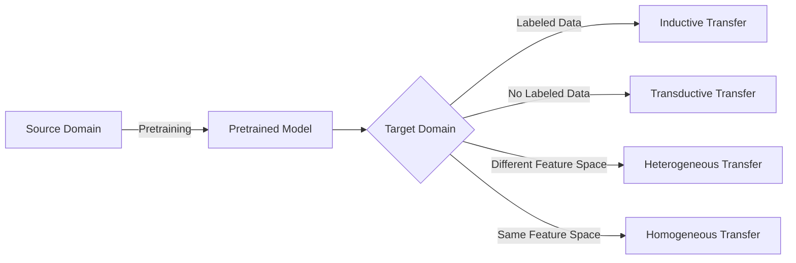

# Transfer Learning 原理与代码实战案例讲解

## 1. 背景介绍
### 1.1 什么是 Transfer Learning
Transfer Learning(迁移学习)是一种机器学习方法,它利用已经训练好的模型参数来初始化目标任务的模型参数,从而达到提高目标任务训练效率和效果的目的。与传统的从头开始训练模型不同,迁移学习通过借鉴已有的知识,可以显著减少所需的训练数据量,加快训练速度,并提升模型性能。

### 1.2 为什么需要 Transfer Learning
在现实世界中,大量的机器学习应用场景都面临着标注数据缺乏的问题。获取高质量的标注数据往往需要大量的人力物力,耗时耗力。而迁移学习可以通过借助相关领域的知识,来弥补目标领域标注数据不足的问题,从而降低模型开发的难度和成本。

此外,很多任务的知识其实是可以共享的。比如图像分类任务中,不同的分类问题虽然具体类别不同,但底层的特征表示可能是相通的。通过在大规模数据集上预训练好的通用模型,再迁移到具体任务上微调,可以显著提升模型性能。这种"先共享后微调"的思路已经成为当前业界的主流做法。

### 1.3 Transfer Learning 的应用场景
Transfer Learning 在计算机视觉、自然语言处理等领域得到了广泛应用,一些典型的应用场景包括:

- 图像分类:利用在 ImageNet 等大规模数据集上预训练的模型,迁移到特定领域的图像分类任务中。
- 目标检测:利用预训练好的图像分类模型,提取通用的图像特征,再针对目标检测任务进行微调。
- 语义分割:采用类似目标检测的迁移学习方式,借助分类模型来初始化语义分割模型。
- 文本分类:在大规模语料库上预训练好的词向量或语言模型,可迁移到下游的文本分类任务中。
- 机器翻译:利用在其他语言对上训练的翻译模型,迁移到低资源语言对的机器翻译中。

## 2. 核心概念与联系
### 2.1 基本概念
- Source Domain(源领域):已有标注数据的领域,可以用于模型预训练。
- Target Domain(目标领域):实际要解决的问题所在的领域,往往缺乏足够的标注数据。
- Pretraining(预训练):在源领域的数据上训练模型,为迁移学习做准备。
- Fine-tuning(微调):在目标领域的数据上微调预训练模型,使其适应新的任务。

### 2.2 核心思想
迁移学习的核心思想是找到不同任务间的相关性,并加以利用。通常认为不同任务会共享一些底层的特征表示,因此可以通过在源领域学习通用的特征,再迁移到目标领域进行微调。这种做法可以显著减少目标领域所需的标注数据,同时提升模型性能。

### 2.3 不同类型的迁移学习
根据源领域和目标领域的相似程度,以及标注数据的多少,迁移学习可以分为以下几类:

- 同构迁移学习:源领域和目标领域的特征空间相同,如图像分类任务间的迁移。
- 异构迁移学习:源领域和目标领域的特征空间不同,如文本到图像的迁移。 
- 归纳式迁移学习:目标领域存在少量标注数据,可用于模型微调。
- 直推式迁移学习:目标领域完全没有标注数据,只能利用预训练模型做特征提取。

下图展示了这几类迁移学习的联系与区别:



## 3. 核心算法原理具体操作步骤
迁移学习的具体操作步骤可以概括为以下几步:

### 3.1 选择合适的预训练模型
根据目标任务的特点,选择一个合适的预训练模型作为基础。通常使用在大规模数据集上训练的通用模型,如计算机视觉领域的 ImageNet 预训练模型,自然语言处理领域的 BERT、GPT 等预训练语言模型。

### 3.2 删除预训练模型的输出层
由于预训练模型的输出层是针对源领域的任务设计的,因此需要删除原有的输出层,替换为适配目标任务的新输出层。比如将最后的分类层替换为新的类别数。

### 3.3 冻结预训练模型的部分权重
为了加快训练速度和防止过拟合,我们通常会冻结预训练模型的部分权重,只微调其中的一部分。比如冻结 ResNet 的前几个 stage,只微调最后几个 stage 和输出层。

### 3.4 用目标领域数据进行微调
利用目标领域的标注数据,对模型进行微调。通常使用较小的学习率,以免破坏预训练模型学到的特征。微调的轮数也通常比较少,以免过拟合。

### 3.5 评估模型性能
在目标领域的测试集上评估微调后的模型性能,以验证迁移学习的效果。如果效果不理想,可以考虑调整超参数,或者换用其他的预训练模型再次尝试。

## 4. 数学模型和公式详细讲解举例说明
迁移学习的数学原理可以用以下公式来表示:

假设源领域的数据为 $D_s=\{(x_i^s,y_i^s)\}_{i=1}^{n_s}$,目标领域的数据为 $D_t=\{(x_i^t,y_i^t)\}_{i=1}^{n_t}$,其中 $x$ 表示输入特征,$y$ 表示标签,$n_s$ 和 $n_t$ 分别表示源领域和目标领域的样本数量。

我们的目标是学习一个目标领域的模型 $f_t:X_t \rightarrow Y_t$,使其能够很好地拟合目标领域的数据分布。传统的机器学习方法通常只使用目标领域的数据 $D_t$ 来训练模型:

$$
\min_{f_t} \frac{1}{n_t} \sum_{i=1}^{n_t} L(f_t(x_i^t), y_i^t)
$$

其中 $L$ 表示损失函数。但是在迁移学习中,我们希望利用源领域的知识来辅助目标领域的学习。因此,我们先在源领域的数据 $D_s$ 上训练一个模型 $f_s:X_s \rightarrow Y_s$:

$$
\min_{f_s} \frac{1}{n_s} \sum_{i=1}^{n_s} L(f_s(x_i^s), y_i^s)
$$

然后,我们将源领域模型 $f_s$ 的部分参数迁移到目标领域模型 $f_t$ 中,再在目标领域的数据 $D_t$ 上进行微调:

$$
\min_{f_t} \frac{1}{n_t} \sum_{i=1}^{n_t} L(f_t(x_i^t), y_i^t) + \lambda R(f_t, f_s)
$$

其中 $R$ 表示正则化项,用于约束目标模型 $f_t$ 与源模型 $f_s$ 的差异,$\lambda$ 为正则化系数。常见的正则化方式有 L2 正则化:

$$
R(f_t, f_s) = \|w_t - w_s\|_2^2
$$

其中 $w_t$ 和 $w_s$ 分别表示目标模型和源模型的权重参数。这种正则化方式鼓励目标模型的权重与源模型接近,从而达到迁移学习的效果。

## 5. 项目实践:代码实例和详细解释说明
下面以 PyTorch 为例,展示如何用迁移学习来解决图像分类问题。

### 5.1 加载预训练模型

```python
import torchvision.models as models

# 加载预训练的 ResNet-50 模型
model = models.resnet50(pretrained=True) 
```

这里我们使用 torchvision 提供的预训练 ResNet-50 模型作为基础。pretrained=True 表示加载在 ImageNet 数据集上预训练的权重。

### 5.2 替换输出层

```python
# 假设目标任务有 10 个类别
num_classes = 10  

# 替换最后的全连接层
in_features = model.fc.in_features
model.fc = nn.Linear(in_features, num_classes)
```

ResNet-50 模型的最后一层是一个全连接层,对应 ImageNet 的 1000 个类别。我们需要将其替换为适配目标任务的新全连接层。in_features 表示上一层的输出维度,num_classes 表示目标任务的类别数。

### 5.3 冻结部分权重

```python
# 冻结 ResNet 的前4个 stage,只微调最后一个 stage 
for param in model.parameters():
    param.requires_grad = False

for param in model.layer4.parameters():
    param.requires_grad = True

for param in model.fc.parameters():
    param.requires_grad = True
```

这里我们冻结了 ResNet 的前4个 stage,只微调最后一个 stage 和新的全连接层。requires_grad=False 表示不计算该参数的梯度,从而在训练时不会更新其值。

### 5.4 微调模型

```python
# 定义损失函数和优化器
criterion = nn.CrossEntropyLoss() 
optimizer = optim.SGD(model.parameters(), lr=1e-3, momentum=0.9)

# 训练模型
for epoch in range(num_epochs):
    for inputs, labels in dataloader:
        outputs = model(inputs) 
        loss = criterion(outputs, labels)
        
        optimizer.zero_grad()
        loss.backward()
        optimizer.step()
```

这里我们使用交叉熵损失函数和 SGD 优化器,以较小的学习率(1e-3)对模型进行微调。每个 epoch 遍历一次数据集,并对每个 batch 的数据进行前向传播、计算损失、反向传播和参数更新。

### 5.5 评估模型

```python
# 在测试集上评估模型性能
model.eval()
with torch.no_grad():
    correct = 0
    total = 0
    for inputs, labels in test_dataloader:
        outputs = model(inputs)
        _, predicted = torch.max(outputs.data, 1)
        total += labels.size(0)
        correct += (predicted == labels).sum().item()

    print(f'Accuracy: {100 * correct / total:.2f}%')
```

最后,我们在测试集上评估微调后的模型性能。model.eval() 表示将模型切换到评估模式,torch.no_grad() 表示不计算梯度,以减少内存开销。我们统计模型预测正确的样本数,并计算整体的准确率。

## 6. 实际应用场景
迁移学习在许多实际场景中都有广泛应用,下面列举几个典型的例子:

### 6.1 医学图像分析
医学图像数据标注成本高,样本量少,非常适合使用迁移学习。比如利用在自然图像上预训练的模型,迁移到医学图像的分类、检测、分割等任务中,可以显著提升模型性能,加速新模型的开发。

### 6.2 工业缺陷检测
工业生产中,不同产品的缺陷类型和数据分布差异较大,样本量也比较少。利用迁移学习,可以将一个产品的缺陷检测模型迁移到另一个产品上,大大减少数据标注和模型训练的成本。

### 6.3 智能安防
在智能安防领域,不同场景的监控数据差异较大,很难获得大量的标注数据。利用在公开数据集上预训练的人脸识别、行为分析等模型,可以快速构建适用于特定场景的智能安防系统。

### 6.4 客服智能问答
不同企业的客服问题和语料差异较大,标注成本高。利用在开放领域问答数据上预训练的语言模型,再迁移到特定企业的客服问答任务中,可以显著减少训练数据的需求,提升问答质量。

## 7. 工具和资源推荐
为了方便大家学习和实践迁移学习,这里推荐一些常用的工具和资源:

- PyTorch Transfer Learning