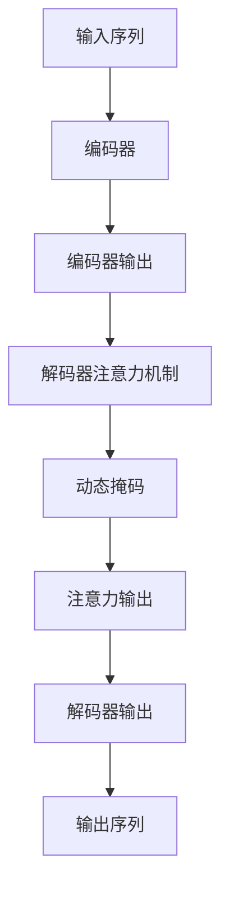

# Transformer大模型实战 使用动态掩码而不是静态掩码

## 1.背景介绍

在自然语言处理(NLP)领域,Transformer模型凭借其强大的并行计算能力和长期依赖捕捉能力,已经成为主流的序列到序列(Seq2Seq)模型架构。然而,传统的Transformer使用静态掩码来忽略未来位置的信息,这种方法存在一些局限性。动态掩码则提供了一种更加灵活和高效的方式来处理序列数据,特别是在生成式任务中,如机器翻译、文本摘要和对话系统等。

### 1.1 Transformer模型回顾

Transformer是一种基于注意力机制的序列到序列模型,由编码器(Encoder)和解码器(Decoder)组成。编码器将输入序列映射到连续的向量表示,解码器则根据编码器的输出和自身的输出生成目标序列。

Transformer模型中的核心组件是多头注意力(Multi-Head Attention)和前馈神经网络(Feed-Forward Neural Network)。多头注意力允许模型同时关注输入序列的不同表示,而前馈神经网络则对每个位置的表示进行非线性转换。

### 1.2 静态掩码的局限性

在传统的Transformer解码器中,使用了一种称为"静态掩码"的技术,它通过设置掩码矩阵来防止注意力机制关注未来的位置。这种方法虽然简单有效,但存在一些局限性:

1. **计算效率低下**:静态掩码需要为每个输入序列重新计算掩码矩阵,这在处理大量数据时会导致计算开销增加。

2. **缺乏灵活性**:静态掩码假设了序列的长度是固定的,这在处理可变长度序列时可能会导致性能下降。

3. **无法利用未来信息**:在某些生成式任务中,如对话系统,能够利用未来信息可能会带来性能提升。

为了解决这些问题,研究人员提出了动态掩码(Dynamic Masking)的概念,它提供了一种更加灵活和高效的方式来处理序列数据。

## 2.核心概念与联系

### 2.1 动态掩码概念

动态掩码是一种在解码器的注意力机制中动态生成掩码的技术。与静态掩码不同,动态掩码不需要预先计算掩码矩阵,而是根据当前的解码状态动态生成掩码。

在动态掩码中,解码器的注意力机制只关注当前位置及之前的位置,忽略未来位置的信息。这种方式不仅计算效率更高,而且可以处理可变长度的序列,并且在某些情况下还可以利用未来信息来提高性能。

### 2.2 动态掩码与注意力机制的联系

动态掩码与注意力机制密切相关。在Transformer模型中,注意力机制用于计算查询(Query)向量与键(Key)向量之间的相似性分数,然后根据这些分数对值(Value)向量进行加权求和,得到注意力输出。

在传统的静态掩码中,掩码矩阵是预先计算的,用于屏蔽未来位置的信息。而在动态掩码中,掩码是根据当前解码状态动态生成的,因此可以更加灵活地控制注意力机制的行为。

动态掩码通常与注意力机制的"缩放点积注意力"(Scaled Dot-Product Attention)一起使用,其中掩码矩阵用于修改注意力分数,从而实现动态忽略未来位置的信息。



上图展示了动态掩码在Transformer解码器中的工作流程。输入序列首先经过编码器得到编码器输出,然后在解码器的注意力机制中应用动态掩码,生成注意力输出。最终,解码器根据注意力输出生成目标输出序列。

## 3.核心算法原理具体操作步骤

实现动态掩码的核心算法原理是基于"缩放点积注意力"(Scaled Dot-Product Attention)机制。下面我们将详细介绍动态掩码在注意力机制中的具体操作步骤。

### 3.1 缩放点积注意力回顾

在介绍动态掩码之前,我们先回顾一下缩放点积注意力的计算过程。给定查询(Query)矩阵 $Q$、键(Key)矩阵 $K$ 和值(Value)矩阵 $V$,缩放点积注意力的计算公式如下:

$$\mathrm{Attention}(Q, K, V) = \mathrm{softmax}\left(\frac{QK^T}{\sqrt{d_k}}\right)V$$

其中,$ \sqrt{d_k} $是一个缩放因子,用于防止内积过大导致梯度消失或爆炸。

### 3.2 动态掩码的实现步骤

1. **生成掩码张量**

   首先,我们需要根据当前的解码状态生成一个掩码张量 $M$。对于序列长度为 $L$ 的输入,掩码张量 $M$ 是一个 $L \times L$ 的布尔张量,其中 $M_{i,j}$ 表示在位置 $i$ 是否应该关注位置 $j$ 的信息。

   对于动态掩码,我们希望在每个位置 $i$ 只关注当前位置及之前的位置,因此掩码张量 $M$ 应该是一个下三角矩阵,其中主对角线及下三角部分的元素为 $1$,其余元素为 $0$。

2. **修改注意力分数**

   接下来,我们将掩码张量 $M$ 应用于注意力分数矩阵。注意力分数矩阵是通过计算查询矩阵 $Q$ 和键矩阵 $K$ 的点积得到的:

   $$\mathrm{Scores} = \frac{QK^T}{\sqrt{d_k}}$$

   我们可以将掩码张量 $M$ 与注意力分数矩阵相乘,从而将未来位置的注意力分数设置为一个非常小的值(如 $-\infty$),这样在后续的 softmax 操作中,这些位置的注意力权重就会接近于 $0$,实现了动态忽略未来位置的效果:

   $$\mathrm{Masked\_Scores} = \mathrm{Scores} \odot M - (1 - M) \cdot \mathrm{mask\_value}$$

   其中,$ \odot $表示元素wise乘积,$ \mathrm{mask\_value} $是一个非常大的负数(如 $-1e9$),用于将未来位置的注意力分数设置为一个非常小的值。

3. **计算注意力输出**

   最后,我们将修改后的注意力分数矩阵 $ \mathrm{Masked\_Scores} $输入到 softmax 函数中,得到注意力权重矩阵。然后,我们将注意力权重矩阵与值矩阵 $V$ 相乘,得到最终的注意力输出:

   $$\mathrm{Attention}(Q, K, V) = \mathrm{softmax}(\mathrm{Masked\_Scores})V$$

通过上述步骤,我们成功地在注意力机制中引入了动态掩码,实现了在每个位置只关注当前位置及之前位置的目标,从而避免了静态掩码的局限性。

## 4.数学模型和公式详细讲解举例说明

在上一节中,我们介绍了动态掩码在缩放点积注意力机制中的实现步骤。现在,我们将通过一个具体的数学示例,详细说明动态掩码的工作原理。

假设我们有一个长度为 $4$ 的输入序列,查询矩阵 $Q$、键矩阵 $K$ 和值矩阵 $V$ 如下所示:

$$Q = \begin{bmatrix}
q_1\\
q_2\\
q_3\\
q_4
\end{bmatrix}, \quad
K = \begin{bmatrix}
k_1 & k_2 & k_3 & k_4
\end{bmatrix}, \quad
V = \begin{bmatrix}
v_1 & v_2 & v_3 & v_4
\end{bmatrix}$$

我们的目标是在每个位置只关注当前位置及之前的位置,忽略未来位置的信息。

### 4.1 生成掩码张量

首先,我们需要生成一个 $4 \times 4$ 的掩码张量 $M$,其中主对角线及下三角部分的元素为 $1$,其余元素为 $0$:

$$M = \begin{bmatrix}
1 & 0 & 0 & 0\\
1 & 1 & 0 & 0\\
1 & 1 & 1 & 0\\
1 & 1 & 1 & 1
\end{bmatrix}$$

### 4.2 修改注意力分数

接下来,我们计算注意力分数矩阵 $\mathrm{Scores}$:

$$\mathrm{Scores} = \frac{QK^T}{\sqrt{d_k}} = \begin{bmatrix}
q_1k_1 & q_1k_2 & q_1k_3 & q_1k_4\\
q_2k_1 & q_2k_2 & q_2k_3 & q_2k_4\\
q_3k_1 & q_3k_2 & q_3k_3 & q_3k_4\\
q_4k_1 & q_4k_2 & q_4k_3 & q_4k_4
\end{bmatrix}$$

然后,我们将掩码张量 $M$ 应用于注意力分数矩阵 $\mathrm{Scores}$,得到修改后的注意力分数矩阵 $\mathrm{Masked\_Scores}$:

$$\mathrm{Masked\_Scores} = \mathrm{Scores} \odot M - (1 - M) \cdot \mathrm{mask\_value}$$

假设 $\mathrm{mask\_value} = -1e9$,则:

$$\mathrm{Masked\_Scores} = \begin{bmatrix}
q_1k_1 & -1e9 & -1e9 & -1e9\\
q_2k_1 & q_2k_2 & -1e9 & -1e9\\
q_3k_1 & q_3k_2 & q_3k_3 & -1e9\\
q_4k_1 & q_4k_2 & q_4k_3 & q_4k_4
\end{bmatrix}$$

可以看到,在每一行中,未来位置的注意力分数都被设置为一个非常小的值 $-1e9$,这样在后续的 softmax 操作中,这些位置的注意力权重就会接近于 $0$,实现了动态忽略未来位置的效果。

### 4.3 计算注意力输出

最后,我们将修改后的注意力分数矩阵 $\mathrm{Masked\_Scores}$ 输入到 softmax 函数中,得到注意力权重矩阵 $\mathrm{Attention\_Weights}$:

$$\mathrm{Attention\_Weights} = \mathrm{softmax}(\mathrm{Masked\_Scores})$$

然后,我们将注意力权重矩阵与值矩阵 $V$ 相乘,得到最终的注意力输出 $\mathrm{Attention\_Output}$:

$$\mathrm{Attention\_Output} = \mathrm{Attention\_Weights}V$$

通过上述示例,我们可以清楚地看到动态掩码在注意力机制中的工作原理。在每个位置,注意力机制只关注当前位置及之前的位置,从而避免了静态掩码的局限性,提高了计算效率和灵活性。

## 5.项目实践:代码实例和详细解释说明

为了更好地理解动态掩码的实现,我们将提供一个基于PyTorch的代码示例,并对关键部分进行详细解释。

```python
import torch
import torch.nn as nn

class ScaledDotProductAttention(nn.Module):
    def __init__(self, d_k):
        super().__init__()
        self.d_k = d_k

    def forward(self, q, k, v, mask=None):
        # 计算注意力分数
        scores = torch.matmul(q, k.transpose(-2, -1)) / (self.d_k ** 0.5)

        # 应用动态掩码
        if mask is not None:
            scores = scores.masked_fill(mask == 0, -1e9)

        # 计算注意力权重
        attn_weights = nn.functional.softmax(scores, dim=-1)

        # 计算注意力输出
        attn_output = torch.matmul(