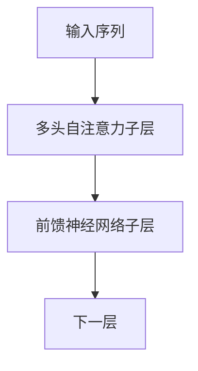
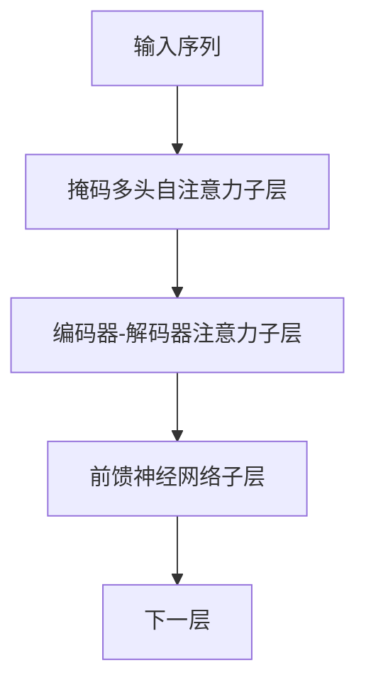

# Transformer大模型实战 使用多语言模型

## 1.背景介绍

在自然语言处理领域,Transformer模型自2017年被提出以来,一直是深度学习模型的主流选择。它的出现解决了长期以来循环神经网络在长序列建模中存在的梯度消失和计算效率低下的问题。Transformer模型采用了自注意力机制,能够有效地捕捉序列中任意两个位置之间的长程依赖关系,从而在机器翻译、文本生成、语音识别等任务中取得了卓越的表现。

随着模型规模和训练数据的不断增大,大型预训练语言模型(Large Pre-trained Language Models, PLMs)开始崭露头角。这些模型在海量无标注语料库上进行预训练,学习到了通用的语言表示能力,然后只需在特定任务上进行少量微调(fine-tuning),就能将预训练知识迁移到下游任务中,显著提高了性能。代表性的大型预训练语言模型包括GPT、BERT、XLNet等。

其中,以Transformer为核心的多语言模型(Multilingual Models)备受关注。多语言模型在单一模型中融合了多种语言的知识,不仅能够在跨语言的自然语言理解和生成任务上发挥作用,而且还能够通过语言之间的知识迁移,提高低资源语言的性能。随着模型规模和训练语料的持续增长,多语言模型正在成为解决多语言挑战的有力工具。

## 2.核心概念与联系

### 2.1 Transformer模型

Transformer模型是一种基于注意力机制的序列到序列(Sequence-to-Sequence)模型,主要由编码器(Encoder)和解码器(Decoder)两部分组成。

#### 2.1.1 编码器(Encoder)

编码器的主要作用是将输入序列映射为一系列连续的表示向量,称为关键向量(Key Vectors)和值向量(Value Vectors)。编码器由多个相同的层组成,每一层包括两个子层:

1. 多头自注意力子层(Multi-Head Attention Sublayer)
2. 前馈神经网络子层(Feed-Forward Neural Network Sublayer)

多头自注意力子层通过计算输入序列中每个位置与所有其他位置的注意力权重,捕捉序列中的长程依赖关系。前馈神经网络子层则对每个位置的表示向量进行非线性变换,提供了额外的建模能力。

#### 2.1.2 解码器(Decoder)

解码器的作用是根据编码器的输出和输入序列,生成目标序列。解码器的结构与编码器类似,也由多个相同的层组成,每一层包括三个子层:

1. 掩码多头自注意力子层(Masked Multi-Head Attention Sublayer)
2. 编码器-解码器注意力子层(Encoder-Decoder Attention Sublayer)
3. 前馈神经网络子层(Feed-Forward Neural Network Sublayer)

掩码多头自注意力子层用于捕捉目标序列中的依赖关系,但在自回归生成过程中,需要防止注意力机制利用未来的信息。编码器-解码器注意力子层则通过关注编码器的输出,将输入序列的信息融入到解码器中。

### 2.2 多语言模型(Multilingual Models)

多语言模型是一种在单一模型中融合了多种语言知识的预训练语言模型。与单语言模型相比,多语言模型不仅能够处理多种语言的任务,而且还能够利用语言之间的相似性,提高低资源语言的性能。

构建多语言模型的关键在于如何有效地表示和融合多种语言的信息。常见的做法包括:

1. **词汇表共享**(Vocabulary Sharing)
2. **语言标记**(Language Tokens)
3. **语言嵌入**(Language Embeddings)

词汇表共享是指多种语言共享同一个词汇表,可以减少模型参数,但会增加歧义。语言标记则是在输入序列中添加语言标识符,明确指示当前语言。语言嵌入是为每种语言学习一个嵌入向量,并将其与输入序列的表示相加。

多语言模型在预训练阶段使用多语言语料,学习到多种语言的共享表示。在微调阶段,可以选择性地继续使用多语言数据,或只使用特定语言的数据进行微调。

## 3.核心算法原理具体操作步骤

### 3.1 Transformer编码器

Transformer编码器的核心是多头自注意力机制。给定一个长度为 $n$ 的输入序列 $\boldsymbol{x} = (x_1, x_2, \ldots, x_n)$,我们首先将每个词 $x_i$ 映射为一个词嵌入向量 $\boldsymbol{e}_i \in \mathbb{R}^{d_\text{model}}$。然后,我们计算查询向量(Query Vectors)、关键向量(Key Vectors)和值向量(Value Vectors):

$$
\begin{aligned}
\boldsymbol{Q} &= \boldsymbol{X} \boldsymbol{W}^Q \\
\boldsymbol{K} &= \boldsymbol{X} \boldsymbol{W}^K \\
\boldsymbol{V} &= \boldsymbol{X} \boldsymbol{W}^V
\end{aligned}
$$

其中 $\boldsymbol{W}^Q, \boldsymbol{W}^K, \boldsymbol{W}^V \in \mathbb{R}^{d_\text{model} \times d_k}$ 是可学习的投影矩阵,用于将词嵌入向量映射到查询、关键和值空间。

接下来,我们计算查询向量与所有关键向量之间的点积,得到注意力分数矩阵 $\boldsymbol{A} \in \mathbb{R}^{n \times n}$:

$$
\boldsymbol{A} = \text{softmax}\left(\frac{\boldsymbol{Q}\boldsymbol{K}^\top}{\sqrt{d_k}}\right)
$$

其中,缩放因子 $\sqrt{d_k}$ 用于防止点积过大导致的梯度不稳定问题。然后,我们将注意力分数矩阵与值向量相乘,得到注意力输出:

$$
\text{Attention}(\boldsymbol{Q}, \boldsymbol{K}, \boldsymbol{V}) = \boldsymbol{A}\boldsymbol{V}
$$

为了捕捉不同的依赖关系,我们使用多头注意力机制,将查询、关键和值向量进行 $h$ 路线性投影,分别计算注意力输出,最后将它们拼接起来:

$$
\begin{aligned}
\text{MultiHead}(\boldsymbol{Q}, \boldsymbol{K}, \boldsymbol{V}) &= \text{Concat}(\text{head}_1, \ldots, \text{head}_h)\boldsymbol{W}^O \\
\text{where}\; \text{head}_i &= \text{Attention}(\boldsymbol{Q}\boldsymbol{W}_i^Q, \boldsymbol{K}\boldsymbol{W}_i^K, \boldsymbol{V}\boldsymbol{W}_i^V)
\end{aligned}
$$

其中 $\boldsymbol{W}_i^Q, \boldsymbol{W}_i^K, \boldsymbol{W}_i^V \in \mathbb{R}^{d_\text{model} \times d_k}$ 和 $\boldsymbol{W}^O \in \mathbb{R}^{hd_k \times d_\text{model}}$ 都是可学习的投影矩阵。

最后,我们对多头注意力输出和输入进行残差连接,并进行层归一化(Layer Normalization),得到编码器的输出表示:

$$
\boldsymbol{Z} = \text{LayerNorm}(\boldsymbol{X} + \text{MultiHead}(\boldsymbol{Q}, \boldsymbol{K}, \boldsymbol{V}))
$$

### 3.2 Transformer解码器

Transformer解码器的结构与编码器类似,但有以下几点不同:

1. 在自注意力子层中,我们使用掩码多头自注意力机制,防止注意力机制利用未来的信息。
2. 增加了一个编码器-解码器注意力子层,用于将编码器的输出融入解码器中。

#### 3.2.1 掩码多头自注意力

在自回归生成过程中,我们需要防止注意力机制利用未来的信息。因此,在计算注意力分数矩阵时,我们将未来位置的注意力分数设置为负无穷,以消除它们对当前位置的影响:

$$
\boldsymbol{A}_{ij} = \begin{cases}
\frac{\boldsymbol{q}_i\boldsymbol{k}_j^\top}{\sqrt{d_k}} & \text{if}\; i \geq j \\
-\infty & \text{otherwise}
\end{cases}
$$

其余计算步骤与编码器中的多头自注意力机制相同。

#### 3.2.2 编码器-解码器注意力

编码器-解码器注意力子层的作用是将编码器的输出 $\boldsymbol{Z}$ 融入到解码器中。具体来说,我们将解码器的输出 $\boldsymbol{Y}$ 作为查询向量,编码器的输出 $\boldsymbol{Z}$ 作为关键向量和值向量,计算注意力输出:

$$
\text{AttOutput} = \text{Attention}(\boldsymbol{Y}\boldsymbol{W}^Q, \boldsymbol{Z}\boldsymbol{W}^K, \boldsymbol{Z}\boldsymbol{W}^V)
$$

其中 $\boldsymbol{W}^Q, \boldsymbol{W}^K, \boldsymbol{W}^V$ 是可学习的投影矩阵。注意力输出与解码器的输出进行残差连接和层归一化,得到编码器-解码器注意力子层的输出。

最终,解码器的输出表示由掩码多头自注意力子层、编码器-解码器注意力子层和前馈神经网络子层的输出组合而成。

### 3.3 多语言模型预训练

多语言模型的预训练过程与单语言模型类似,但需要处理多种语言的语料。常见的预训练目标包括:

1. **掩码语言模型**(Masked Language Modeling, MLM)
2. **下一句预测**(Next Sentence Prediction, NSP)
3. **交替语言建模**(Alternating Language Modeling)

掩码语言模型是指随机掩码输入序列中的一些词,并让模型预测被掩码的词。下一句预测则是判断两个句子是否相邻。交替语言建模是指在同一个序列中交替出现不同语言的片段,模型需要预测被掩码的词及其语言。

在预训练过程中,我们需要构建一个多语言语料库,包含多种语言的文本数据。为了有效地表示和融合多种语言的信息,我们可以采用词汇表共享、语言标记或语言嵌入等策略。

预训练完成后,我们可以在特定的下游任务上进行微调,将预训练知识迁移到目标任务中。根据任务的性质,我们可以选择继续使用多语言数据进行微调,或只使用特定语言的数据进行微调。

## 4.数学模型和公式详细讲解举例说明

在本节中,我们将详细讲解Transformer模型中的数学模型和公式,并给出具体的例子说明。

### 4.1 注意力机制(Attention Mechanism)

注意力机制是Transformer模型的核心,它允许模型在计算目标输出时,动态地关注输入序列中的不同部分。给定一个查询向量 $\boldsymbol{q}$、一组关键向量 $\boldsymbol{K} = [\boldsymbol{k}_1, \boldsymbol{k}_2, \ldots, \boldsymbol{k}_n]$ 和一组值向量 $\boldsymbol{V} = [\boldsymbol{v}_1, \boldsymbol{v}_2, \ldots, \boldsymbol{v}_n]$,注意力机制的计算过程如下:

1. 计算查询向量与每个关键向量之间的相似度分数:

   $$
   \alpha_i = \frac{\exp(\boldsymbol{q} \cdot \boldsymbol{k}_i)}{\sum_{j=1}^n \exp(\boldsymbol{q} \cdot \boldsymbol{k}_j)}
   $$

   其中 $\alpha_i$ 表示查