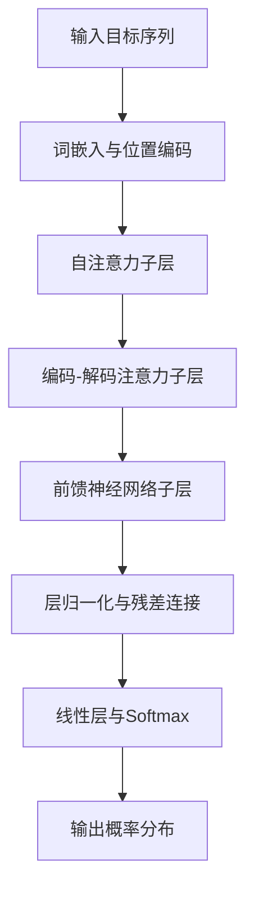

# Transformer大模型实战 解码器总览

## 1.背景介绍

近年来,随着深度学习的快速发展,Transformer模型在自然语言处理(NLP)领域取得了巨大成功。作为一种基于注意力机制的序列到序列(Seq2Seq)模型,Transformer在机器翻译、文本生成、语言理解等任务上表现出色。而Transformer模型的核心组件之一就是解码器(Decoder)。

解码器在Transformer模型中扮演着至关重要的角色。它负责根据编码器的输出,逐步生成目标序列。解码器的设计和实现直接影响着模型的性能和生成质量。本文将深入探讨Transformer解码器的原理、架构以及实现细节,帮助读者全面理解这一关键组件。

### 1.1 Transformer模型概述
#### 1.1.1 Transformer的诞生背景
#### 1.1.2 Transformer的整体架构
#### 1.1.3 Transformer的优势与应用

### 1.2 解码器在Transformer中的作用
#### 1.2.1 解码器的功能与任务
#### 1.2.2 解码器与编码器的关系
#### 1.2.3 解码器在生成过程中的重要性

## 2.核心概念与联系

要深入理解Transformer解码器,我们需要首先掌握其中涉及的核心概念。这些概念包括注意力机制、自注意力、位置编码等。同时,我们还要明确这些概念之间的联系和协同工作方式。

### 2.1 注意力机制(Attention Mechanism)
#### 2.1.1 注意力机制的基本原理
#### 2.1.2 注意力机制的数学表示
#### 2.1.3 注意力机制在Transformer中的应用

### 2.2 自注意力(Self-Attention)
#### 2.2.1 自注意力的概念与动机
#### 2.2.2 自注意力的计算过程
#### 2.2.3 自注意力在解码器中的作用

### 2.3 位置编码(Positional Encoding)
#### 2.3.1 位置编码的必要性
#### 2.3.2 位置编码的实现方式
#### 2.3.3 位置编码在解码器中的应用

### 2.4 残差连接与层归一化
#### 2.4.1 残差连接的作用与实现
#### 2.4.2 层归一化的作用与实现
#### 2.4.3 残差连接与层归一化在解码器中的应用

## 3.核心算法原理具体操作步骤

在掌握了解码器的核心概念后,我们来详细探讨其中的关键算法原理。解码器的核心算法包括自注意力计算、编码-解码注意力计算以及前馈神经网络等。理解这些算法的具体操作步骤,对于实现高效、高质量的解码器至关重要。

### 3.1 自注意力计算
#### 3.1.1 自注意力的输入与输出
#### 3.1.2 计算Query、Key、Value矩阵
#### 3.1.3 计算注意力权重与加权求和
#### 3.1.4 多头自注意力机制

### 3.2 编码-解码注意力计算 
#### 3.2.1 编码-解码注意力的输入与输出
#### 3.2.2 计算Query、Key、Value矩阵
#### 3.2.3 计算注意力权重与加权求和
#### 3.2.4 编码-解码注意力在解码器中的应用

### 3.3 前馈神经网络
#### 3.3.1 前馈神经网络的结构
#### 3.3.2 前馈神经网络的前向计算
#### 3.3.3 前馈神经网络在解码器中的作用

### 3.4 解码器的整体计算流程



## 4.数学模型和公式详细讲解举例说明

为了更好地理解解码器的工作原理,我们需要深入探讨其背后的数学模型和公式。这包括注意力机制的数学表示、自注意力的计算公式、位置编码的数学形式等。通过详细的公式讲解和具体的例子说明,读者可以对解码器的数学原理有更深入的认识。

### 4.1 注意力机制的数学表示
#### 4.1.1 注意力权重的计算公式
$$
\alpha_{ij} = \frac{\exp(e_{ij})}{\sum_{k=1}^{n} \exp(e_{ik})}
$$
其中,$\alpha_{ij}$表示第$i$个查询向量对第$j$个键值向量的注意力权重,$e_{ij}$表示两个向量的相似度得分。

#### 4.1.2 注意力加权求和的计算公式
$$
\mathbf{c}_i = \sum_{j=1}^{n} \alpha_{ij} \mathbf{v}_j
$$
其中,$\mathbf{c}_i$表示第$i$个查询向量的注意力上下文向量,$\mathbf{v}_j$表示第$j$个值向量。

### 4.2 自注意力的计算公式
#### 4.2.1 计算Query、Key、Value矩阵的公式
$$
\mathbf{Q} = \mathbf{X} \mathbf{W}^Q \\
\mathbf{K} = \mathbf{X} \mathbf{W}^K \\  
\mathbf{V} = \mathbf{X} \mathbf{W}^V
$$
其中,$\mathbf{X}$表示输入序列的嵌入表示,$\mathbf{W}^Q, \mathbf{W}^K, \mathbf{W}^V$分别表示线性变换的权重矩阵。

#### 4.2.2 计算自注意力输出的公式
$$
\text{Attention}(\mathbf{Q}, \mathbf{K}, \mathbf{V}) = \text{softmax}(\frac{\mathbf{Q}\mathbf{K}^T}{\sqrt{d_k}})\mathbf{V}
$$
其中,$d_k$表示键向量的维度,用于缩放点积结果。

### 4.3 位置编码的数学形式
#### 4.3.1 正弦位置编码的公式
$$
\text{PE}_{(pos,2i)} = \sin(pos / 10000^{2i/d_{model}}) \\
\text{PE}_{(pos,2i+1)} = \cos(pos / 10000^{2i/d_{model}})
$$
其中,$pos$表示位置索引,$i$表示维度索引,$d_{model}$表示嵌入维度。

#### 4.3.2 位置编码与词嵌入相加的公式
$$
\mathbf{X} = \mathbf{E} + \mathbf{PE}
$$
其中,$\mathbf{E}$表示词嵌入矩阵,$\mathbf{PE}$表示位置编码矩阵。

## 5.项目实践：代码实例和详细解释说明

为了帮助读者更好地掌握Transformer解码器的实现,本节将提供详细的代码实例和解释说明。我们将使用Python和PyTorch框架来实现解码器的各个组件,包括自注意力层、编码-解码注意力层、前馈神经网络等。通过对代码的逐行解释,读者可以深入理解解码器的实现细节。

### 5.1 解码器的整体结构
```python
class TransformerDecoder(nn.Module):
    def __init__(self, num_layers, d_model, num_heads, d_ff, dropout=0.1):
        super(TransformerDecoder, self).__init__()
        self.layers = nn.ModuleList([DecoderLayer(d_model, num_heads, d_ff, dropout) for _ in range(num_layers)])
        self.norm = nn.LayerNorm(d_model)
        
    def forward(self, x, enc_output, src_mask, tgt_mask):
        for layer in self.layers:
            x = layer(x, enc_output, src_mask, tgt_mask)
        return self.norm(x)
```
解码器由多个解码器层(DecoderLayer)组成,每个层包含自注意力、编码-解码注意力和前馈神经网络三个子层。最后使用层归一化对输出进行归一化处理。

### 5.2 解码器层的实现
```python
class DecoderLayer(nn.Module):
    def __init__(self, d_model, num_heads, d_ff, dropout=0.1):
        super(DecoderLayer, self).__init__()
        self.self_attn = MultiHeadAttention(d_model, num_heads)
        self.enc_dec_attn = MultiHeadAttention(d_model, num_heads)
        self.ff = PositionwiseFeedForward(d_model, d_ff)
        
        self.norm1 = nn.LayerNorm(d_model)
        self.norm2 = nn.LayerNorm(d_model)
        self.norm3 = nn.LayerNorm(d_model)
        
        self.dropout1 = nn.Dropout(dropout)
        self.dropout2 = nn.Dropout(dropout)
        self.dropout3 = nn.Dropout(dropout)
        
    def forward(self, x, enc_output, src_mask, tgt_mask):
        # 自注意力子层
        x2 = self.self_attn(x, x, x, tgt_mask)
        x = self.norm1(x + self.dropout1(x2))
        
        # 编码-解码注意力子层
        x2 = self.enc_dec_attn(x, enc_output, enc_output, src_mask)
        x = self.norm2(x + self.dropout2(x2))
        
        # 前馈神经网络子层
        x2 = self.ff(x)
        x = self.norm3(x + self.dropout3(x2))
        
        return x
```
解码器层包含三个子层:自注意力、编码-解码注意力和前馈神经网络。每个子层后面都使用残差连接和层归一化。注意力子层使用了MultiHeadAttention类,前馈神经网络使用了PositionwiseFeedForward类。

### 5.3 多头注意力机制的实现
```python
class MultiHeadAttention(nn.Module):
    def __init__(self, d_model, num_heads):
        super(MultiHeadAttention, self).__init__()
        assert d_model % num_heads == 0
        self.d_k = d_model // num_heads
        self.num_heads = num_heads
        
        self.W_q = nn.Linear(d_model, d_model)
        self.W_k = nn.Linear(d_model, d_model)
        self.W_v = nn.Linear(d_model, d_model)
        self.W_o = nn.Linear(d_model, d_model)
        
    def forward(self, q, k, v, mask=None):
        batch_size, seq_len, _ = q.size()
        
        # 线性变换
        q = self.W_q(q).view(batch_size, seq_len, self.num_heads, self.d_k).transpose(1, 2)
        k = self.W_k(k).view(batch_size, seq_len, self.num_heads, self.d_k).transpose(1, 2)
        v = self.W_v(v).view(batch_size, seq_len, self.num_heads, self.d_k).transpose(1, 2)
        
        # 计算注意力权重
        attn_weights = torch.matmul(q, k.transpose(-2, -1)) / math.sqrt(self.d_k)
        if mask is not None:
            attn_weights = attn_weights.masked_fill(mask == 0, -1e9)
        attn_weights = F.softmax(attn_weights, dim=-1)
        
        # 加权求和
        attn_output = torch.matmul(attn_weights, v)
        attn_output = attn_output.transpose(1, 2).contiguous().view(batch_size, seq_len, -1)
        
        # 线性变换
        output = self.W_o(attn_output)
        
        return output
```
多头注意力机制将输入的查询(q)、键(k)、值(v)通过线性变换得到多组不同的表示,然后并行计算多个注意力头。最后将多个头的输出拼接并经过线性变换得到最终的注意力输出。

### 5.4 位置编码的实现
```python
class PositionalEncoding(nn.Module):
    def __init__(self, d_model, max_len=5000):
        super(PositionalEncoding, self).__init__()
        pe = torch.zeros(max_len, d_model)
        position = torch.arange(0, max_len, dtype=torch.float).unsqueeze(1)
        div_term = torch.exp(torch.arange(0, d_model, 2).float() * (-math.log(10000.0) / d_model))
        pe[:, 0::2] = torch.sin(position * div_term)
        pe[:, 1::2] = torch.cos(position * div_term)
        pe = pe.unsqueeze(0).transpose(0, 1)
        self.register_buffer('pe', pe)
        
    def forward(self, x):
        x = x + self.pe[:x.size(0), :]
        return x