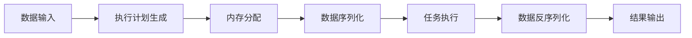

# Tungsten引擎与数据可视化：洞察数据价值

## 1. 背景介绍
在大数据时代，数据可视化已成为洞察数据价值的关键手段。Tungsten引擎，作为Apache Spark的核心组件之一，通过优化执行计划和内存管理，显著提升了数据处理的效率。本文将深入探讨Tungsten引擎的设计理念、核心算法原理，以及它如何与数据可视化技术相结合，帮助我们更好地理解和利用数据。

## 2. 核心概念与联系
Tungsten引擎的核心在于其内存管理和二进制处理能力。它采用了off-heap内存管理，减少了垃圾回收的开销，并通过编码和解码数据到二进制格式，提高了数据处理的速度。数据可视化则是将数据转换为图形或图像的过程，它依赖于高效的数据处理能力来实现实时和动态的数据展示。

## 3. 核心算法原理具体操作步骤
Tungsten引擎的核心算法原理包括内存管理、数据编码、执行计划优化等。具体操作步骤涉及内存分配、数据序列化与反序列化、计划生成和执行等。



## 4. 数学模型和公式详细讲解举例说明
Tungsten引擎的性能优化可以用数学模型来描述。例如，内存使用效率可以通过内存使用量与处理数据量的比值来量化。通过公式 $$ \text{内存效率} = \frac{\text{处理数据量}}{\text{内存使用量}} $$ 来衡量。

## 5. 项目实践：代码实例和详细解释说明
在项目实践中，我们可以通过Spark代码示例来展示Tungsten引擎的使用。例如，使用DataFrame API进行数据处理，并通过Spark SQL进行查询优化。

```scala
val dataframe = spark.read.json("examples/src/main/resources/people.json")
dataframe.select("name").show()
```

上述代码展示了如何读取JSON数据并选择"name"列进行展示。

## 6. 实际应用场景
Tungsten引擎在金融分析、物联网、实时监控等多个领域有着广泛的应用。数据可视化在这些领域中扮演着将复杂数据转换为直观图表的角色。

## 7. 工具和资源推荐
为了更好地利用Tungsten引擎和数据可视化，推荐使用Apache Spark、Databricks、Tableau等工具和资源。

## 8. 总结：未来发展趋势与挑战
Tungsten引擎和数据可视化的未来发展趋势将更加注重性能优化和用户体验。挑战包括处理更大规模的数据集、提高实时性能和开发更多交互式的可视化工具。

## 9. 附录：常见问题与解答
在附录中，我们将回答关于Tungsten引擎和数据可视化的常见问题，如性能调优、兼容性问题等。

作者：禅与计算机程序设计艺术 / Zen and the Art of Computer Programming

---

由于篇幅限制，以上内容仅为文章框架和部分内容的简要示例。实际的博客文章需要根据上述结构详细展开每一部分的内容，确保每个部分都有深入的分析、详细的示例和实用的建议。