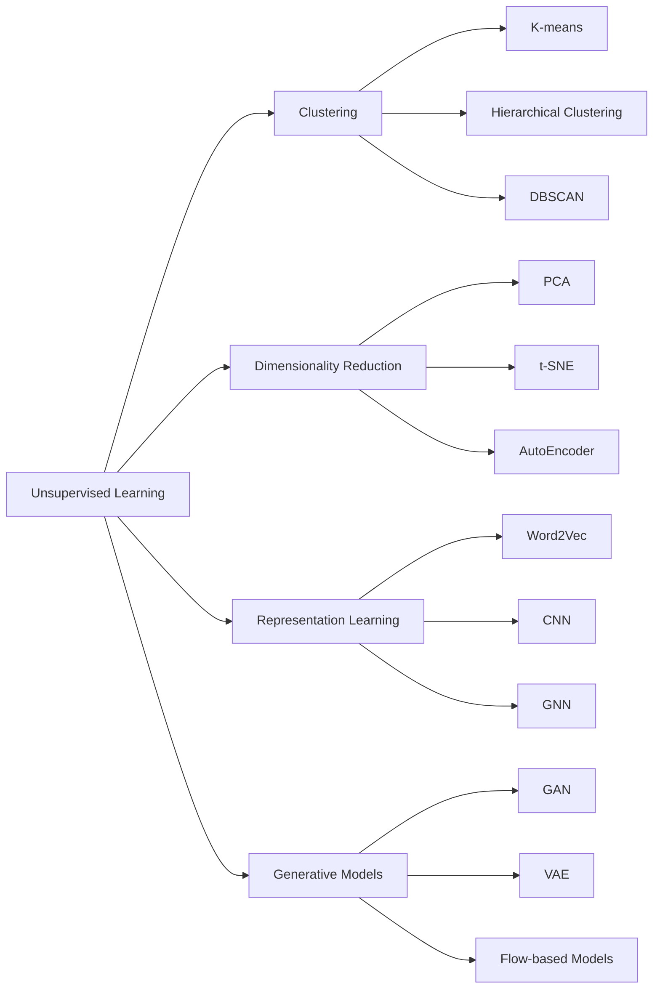

# Unsupervised Learning

## 1. 背景介绍

无监督学习(Unsupervised Learning)是机器学习的一个重要分支,它旨在从没有标记或很少标记的数据中学习隐藏的模式和结构。与监督学习不同,无监督学习算法不依赖于预先定义的标签或输出,而是试图自主地发现数据内在的规律和表示。

无监督学习在许多领域都有广泛的应用,例如:

- 客户细分:根据客户的购买行为、人口统计学特征等将其分组,以便进行有针对性的营销。  
- 异常检测:识别数据中的异常模式或离群值,如欺诈检测、设备故障诊断等。
- 降维:将高维数据映射到低维空间,以便于可视化、压缩和特征提取。
- 推荐系统:通过挖掘用户行为模式,为其推荐相关的商品或内容。

近年来,随着大数据时代的到来和计算能力的提升,无监督学习受到了越来越多的关注。许多前沿的无监督学习算法,如生成对抗网络(GAN)、变分自编码器(VAE)等,都取得了令人瞩目的成果。

## 2. 核心概念与联系

### 2.1 聚类(Clustering)

聚类是无监督学习中最经典和最基础的任务之一。它的目标是将相似的样本自动归类到同一个簇,而不同簇之间的样本差异较大。常见的聚类算法包括:

- K-means:通过迭代优化,将样本分配到 K 个簇中心点。
- 层次聚类:通过递归地合并或分裂簇,生成一个树状的聚类结构。
- DBSCAN:基于样本密度,可以发现任意形状的簇,并识别噪声点。

### 2.2 降维(Dimensionality Reduction) 

降维技术旨在将高维数据映射到低维空间,同时尽可能保留数据的原始结构和特征。常见的降维方法有:

- PCA(Principal Component Analysis):通过线性变换,将数据投影到方差最大的几个正交方向上。
- t-SNE(t-Distributed Stochastic Neighbor Embedding):通过非线性变换,在低维空间中保持原始数据的相似性。
- AutoEncoder:利用神经网络,学习数据的低维编码表示,再重构出原始输入。

### 2.3 表示学习(Representation Learning)

表示学习的目标是自动学习数据的有效特征表示,从而可以更好地完成下游任务。近年来,基于深度学习的表示学习方法取得了巨大成功,例如:

- Word2Vec:学习单词的分布式向量表示,捕捉单词之间的语义关系。
- CNN(Convolutional Neural Networks):通过卷积和池化操作,提取图像的层次化特征。
- GNN(Graph Neural Networks):直接在图结构数据上学习节点的嵌入表示。

### 2.4 生成模型(Generative Models)

生成模型旨在学习数据的生成机制,从而可以生成与训练数据相似的新样本。代表性的生成模型包括:

- GAN(Generative Adversarial Networks):通过生成器和判别器的对抗学习,生成逼真的图像、文本等。
- VAE(Variational AutoEncoder):在自编码器的基础上引入变分推断,学习数据的概率分布。
- Flow-based Models:通过可逆变换将简单分布映射为复杂分布,实现精确密度估计和采样。

下图展示了这些核心概念之间的联系:



## 3. 核心算法原理具体操作步骤

### 3.1 K-means聚类

K-means是最经典和应用最广泛的聚类算法之一。其基本步骤如下:

1. 随机选择 K 个初始簇中心点。
2. 重复以下步骤,直到收敛:
   - 对每个样本,计算其到各个簇中心的距离,并将其分配到距离最近的簇。
   - 对每个簇,更新其中心点为该簇所有样本的均值。
3. 输出最终的 K 个簇及其中心点。

### 3.2 主成分分析(PCA) 

PCA通过线性变换将数据投影到正交的主成分方向上,实现降维。其主要步骤为:

1. 对数据进行中心化,即减去每个特征的均值。
2. 计算数据的协方差矩阵。
3. 对协方差矩阵进行特征值分解,得到特征值和特征向量。
4. 选择前 k 个最大特征值对应的特征向量,构成变换矩阵。
5. 将原始数据乘以变换矩阵,得到降维后的数据。

### 3.3 自编码器(AutoEncoder)

自编码器通过编码器和解码器两部分组成,学习数据的低维表示。其训练过程如下:

1. 初始化编码器和解码器的参数。
2. 重复以下步骤,直到收敛:
   - 将输入数据传入编码器,得到低维编码。
   - 将低维编码传入解码器,重构出原始数据。
   - 计算重构误差,并通过反向传播更新参数。
3. 最终得到训练好的编码器和解码器。

### 3.4 生成对抗网络(GAN)

GAN通过生成器和判别器的对抗学习,生成与真实数据相似的样本。其训练过程如下:

1. 初始化生成器和判别器的参数。
2. 重复以下步骤,直到收敛:
   - 从真实数据和随机噪声中采样一批数据。
   - 用真实数据训练判别器,使其能够区分真实样本和生成样本。
   - 用随机噪声生成一批假样本,并用判别器的反馈训练生成器,使其能够生成更逼真的样本。
3. 最终得到训练好的生成器,可用于生成新样本。

## 4. 数学模型和公式详细讲解举例说明

### 4.1 K-means的目标函数

K-means聚类的目标是最小化所有样本到其所属簇中心的距离平方和。其目标函数为:

$$J = \sum_{i=1}^{n} \sum_{j=1}^{k} w_{ij} \lVert x_i - \mu_j \rVert^2$$

其中,$n$为样本数,$k$为簇的数量,$w_{ij}$为样本$x_i$属于簇$j$的指示变量($w_{ij} \in \{0, 1\}$),$\mu_j$为簇$j$的中心点。

在优化过程中,固定$w_{ij}$,可以得到$\mu_j$的更新公式:

$$\mu_j = \frac{\sum_{i=1}^{n} w_{ij} x_i}{\sum_{i=1}^{n} w_{ij}}$$

即簇中心等于该簇内所有样本的均值向量。

### 4.2 PCA的优化目标

PCA的目标是找到一组正交基,使得数据在这组基上的投影方差最大化。设原始数据矩阵为$X \in \mathbb{R}^{n \times d}$,降维后的数据矩阵为$Z \in \mathbb{R}^{n \times k}$,变换矩阵为$W \in \mathbb{R}^{d \times k}$,则有:

$$Z = XW$$

PCA的优化目标可以表示为:

$$\max_{W} \mathrm{tr}(W^T X^T X W), \quad \mathrm{s.t.} \quad W^T W = I$$

其中,$\mathrm{tr}(\cdot)$表示矩阵的迹,$I$为单位矩阵。可以证明,该优化问题的解为数据协方差矩阵$X^T X$的前$k$个最大特征值对应的特征向量。

### 4.3 AutoEncoder的重构误差

AutoEncoder通过最小化输入数据与重构数据之间的误差来学习数据的低维表示。设编码器为$f_{\phi}(\cdot)$,解码器为$g_{\theta}(\cdot)$,则AutoEncoder的重构误差可以表示为:

$$L(\phi, \theta) = \frac{1}{n} \sum_{i=1}^{n} \lVert x_i - g_{\theta}(f_{\phi}(x_i)) \rVert^2$$

其中,$x_i$为第$i$个输入样本。通过梯度下降法最小化重构误差,可以学习到最优的编码器和解码器参数。

### 4.4 GAN的损失函数

GAN的目标是训练一个生成器$G$和一个判别器$D$,使得生成器能够生成与真实数据分布相似的样本,而判别器能够区分真实样本和生成样本。其损失函数可以表示为:

$$\min_{G} \max_{D} V(D, G) = \mathbb{E}_{x \sim p_{\mathrm{data}}(x)}[\log D(x)] + \mathbb{E}_{z \sim p_{z}(z)}[\log (1 - D(G(z)))]$$

其中,$p_{\mathrm{data}}(x)$为真实数据分布,$p_{z}(z)$为随机噪声分布。生成器$G$试图最小化该损失函数,而判别器$D$试图最大化该损失函数。通过交替优化,最终达到纳什均衡,生成器可以生成逼真的样本。

## 5. 项目实践：代码实例和详细解释说明

下面以Python为例,给出几个无监督学习算法的简单实现:

### 5.1 K-means聚类

```python
import numpy as np

class KMeans:
    def __init__(self, n_clusters, max_iter=300):
        self.n_clusters = n_clusters
        self.max_iter = max_iter
        self.centroids = None
        
    def fit(self, X):
        # 随机选择初始中心点
        idx = np.random.choice(X.shape[0], self.n_clusters, replace=False)
        self.centroids = X[idx]
        
        for _ in range(self.max_iter):
            # 计算每个样本到中心点的距离
            distances = np.sqrt(((X - self.centroids[:, np.newaxis])**2).sum(axis=2))
            
            # 将每个样本分配到最近的簇
            labels = np.argmin(distances, axis=0)
            
            # 更新中心点
            for i in range(self.n_clusters):
                self.centroids[i] = X[labels == i].mean(axis=0)
                
    def predict(self, X):
        distances = np.sqrt(((X - self.centroids[:, np.newaxis])**2).sum(axis=2))
        return np.argmin(distances, axis=0)
```

该实现包含以下几个关键步骤:

1. 在`__init__`方法中,初始化簇的数量和最大迭代次数。
2. 在`fit`方法中,随机选择初始中心点,然后迭代更新样本的簇分配和中心点。
3. 在`predict`方法中,根据训练好的中心点,预测新样本的簇标签。

### 5.2 PCA降维

```python
import numpy as np

class PCA:
    def __init__(self, n_components):
        self.n_components = n_components
        self.components = None
        self.mean = None
        
    def fit(self, X):
        # 数据中心化
        self.mean = X.mean(axis=0)
        X = X - self.mean
        
        # 计算协方差矩阵
        cov = np.cov(X, rowvar=False)
        
        # 特征值分解
        eigenvalues, eigenvectors = np.linalg.eigh(cov)
        
        # 选择前n_components个特征向量
        idx = np.argsort(eigenvalues)[::-1]
        self.components = eigenvectors[:, idx[:self.n_components]]
        
    def transform(self, X):
        X = X - self.mean
        return np.dot(X, self.components)
```

该实现包含以下几个关键步骤:

1. 在`__init__`方法中,初始化降维后的维度。
2. 在`fit`方法中,对数据进行中心化,计算协方差矩阵,并通过特征值分解得到主成分。
3. 在`transform`方法中,将数据投影到选定的主成分上,实现降维。

### 5.3 AutoEncoder

```python
import torch
import torch.nn as nn
import torch.optim as optim

class AutoEncoder(nn.Module