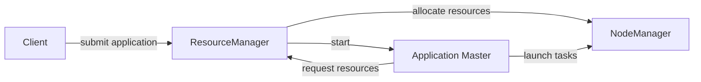

## 1.背景介绍

在现代大数据处理中，资源管理和任务调度是至关重要的两个环节。而Apache Hadoop YARN (Yet Another Resource Negotiator)正是为此而生。YARN是Hadoop的一个重要组成部分，它负责整个Hadoop集群的资源管理和任务调度。

YARN的核心组件包括ResourceManager、NodeManager和ApplicationMaster。其中，ResourceManager负责整个集群的资源管理和分配，NodeManager负责单个节点的资源管理和任务执行，而ApplicationMaster则是每个应用程序的主控制器，负责应用程序的生命周期管理、任务调度和监控。

本文将重点介绍Application Master的原理和实现，带领读者深入理解其工作机制，并通过实际代码示例揭示其内部运作逻辑。

## 2.核心概念与联系

在深入探讨Application Master之前，我们首先需要了解一些核心概念：

- **Application**：在YARN中，一个Application代表一个用户提交的运行在YARN上的分布式应用程序。每个Application都有一个唯一的Application ID。

- **Application Master**：每个Application都有一个Application Master，它负责该Application的所有任务的调度和监控。Application Master是Application的主控制器。

- **Container**：Container是YARN中的资源抽象，它封装了某个节点上的一部分资源，如内存、CPU等。Application的任务运行在Container中。

下面是一个描述Application Master与其他组件关系的Mermaid流程图：



## 3.核心算法原理具体操作步骤

Application Master的工作流程可以分为以下几个步骤：

1. **启动**：当ResourceManager接收到一个新的Application提交请求时，它会为这个Application启动一个新的Application Master。

2. **资源请求**：Application Master会根据Application的需求向ResourceManager请求资源，ResourceManager会根据集群的资源情况分配资源。

3. **任务调度**：Application Master会根据分配到的资源和Application的任务需求，决定在哪个NodeManager上启动哪个任务。

4. **监控**：Application Master会持续监控所有任务的运行状态，如果有任务失败，它会重新调度该任务。

5. **结束**：当Application的所有任务都完成时，Application Master会向ResourceManager报告Application的完成状态，并结束自己的生命周期。

## 4.数学模型和公式详细讲解举例说明

在YARN的资源调度中，一个重要的问题是如何公平地分配资源。这是一个典型的优化问题，可以用线性规划的方法来求解。

假设我们有$n$个Application，每个Application $i$需要的资源量为$r_i$，并且我们有总共$R$的资源可供分配。我们的目标是最大化每个Application获得的资源量与其需求的比例的最小值，即：

$$
\max_{x_1,\ldots,x_n} \min_i \frac{x_i}{r_i}
$$

其中$x_i$是分配给Application $i$的资源量。这是一个线性规划问题，可以用标准的线性规划算法来求解。

## 5.项目实践：代码实例和详细解释说明

下面我们通过一个简单的代码示例来展示Application Master的工作流程。这个示例是一个简单的MapReduce任务，它的Application Master的主要工作是启动一个Mapper任务和一个Reducer任务。

```java
public class MyApplicationMaster {
    private ResourceManager resourceManager;
    private ApplicationId appId;
    private Map<TaskId, Container> mapTaskContainers = new HashMap<>();
    private Map<TaskId, Container> reduceTaskContainers = new HashMap<>();

    public MyApplicationMaster(ResourceManager resourceManager, ApplicationId appId) {
        this.resourceManager = resourceManager;
        this.appId = appId;
    }

    public void start() {
        // Request resources for map tasks
        for (int i = 0; i < numMapTasks; i++) {
            ResourceRequest request = createResourceRequest();
            resourceManager.allocate(request);
        }

        // Wait for resources to be allocated
        while (mapTaskContainers.size() < numMapTasks) {
            AllocateResponse response = resourceManager.allocate(appId);
            for (Container container : response.getAllocatedContainers()) {
                mapTaskContainers.put(createTaskId(), container);
            }
        }

        // Launch map tasks
        for (Map.Entry<TaskId, Container> entry : mapTaskContainers.entrySet()) {
            launchTask(entry.getKey(), entry.getValue(), "map");
        }

        // Same for reduce tasks...
    }

    // Other methods...
}
```

在这个示例中，我们首先请求资源，然后等待资源被分配，最后在分配到的资源上启动任务。这就是Application Master的基本工作流程。

## 6.实际应用场景

YARN被广泛应用在大数据处理领域，尤其是在Hadoop生态系统中。无论是批处理的MapReduce，还是实时处理的Spark，或是交互式查询的Hive，都依赖于YARN进行资源管理和任务调度。

此外，YARN也被用于机器学习和深度学习领域。例如，TensorFlow和PyTorch等深度学习框架，都可以运行在YARN上，利用YARN进行分布式训练。

## 7.工具和资源推荐

- Apache Hadoop：YARN是Hadoop的一部分，通过学习和使用Hadoop，可以更好地理解和掌握YARN。

- Apache Tez：Tez是一个基于YARN的数据处理框架，它提供了一种灵活的API，可以更好地控制任务的执行流程。

- Apache Slider：Slider是一个可以将任何应用程序部署到YARN上的工具，通过Slider，可以将自己的应用程序运行在YARN上。

## 8.总结：未来发展趋势与挑战

随着大数据处理的需求日益增长，YARN面临着更大的挑战。一方面，如何更有效地利用资源，提高集群的利用率，是一个重要的研究方向。另一方面，如何支持更多种类的应用程序，如流处理、图计算等，也是YARN需要解决的问题。

此外，随着容器技术的发展，如何将YARN与容器技术结合，提供更灵活的资源管理和任务调度，也是YARN的一个发展方向。

## 9.附录：常见问题与解答

1. **Q: Application Master挂了怎么办？**

   A: 如果Application Master挂了，ResourceManager会重新启动一个新的Application Master。这是YARN的一个重要特性，它可以保证Application在失败后能够恢复。

2. **Q: YARN如何公平地分配资源？**

   A: YARN有一个公平调度器(Fair Scheduler)，它会根据每个Application的需求和优先级，公平地分配资源。具体的算法可以参考上面的数学模型部分。

3. **Q: YARN和Mesos有什么区别？**

   A: YARN和Mesos都是资源管理系统，但它们的设计理念和使用场景有所不同。YARN更侧重于大数据处理，而Mesos更像是一个通用的集群管理系统，可以运行各种类型的应用程序。

作者：禅与计算机程序设计艺术 / Zen and the Art of Computer Programming