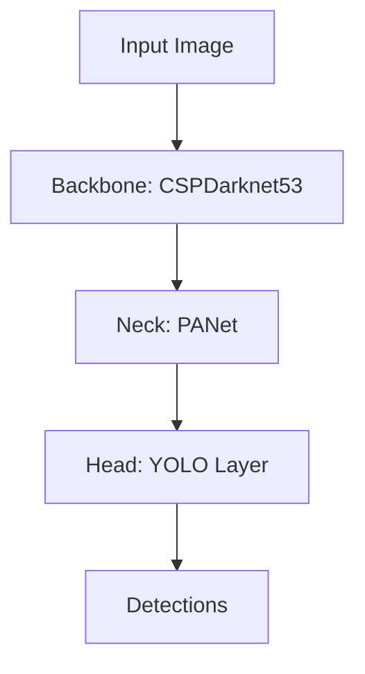

# YOLOv5原理与代码实例讲解

## 1. 背景介绍
### 1.1 目标检测的发展历程
#### 1.1.1 传统目标检测方法
#### 1.1.2 基于深度学习的目标检测方法
#### 1.1.3 YOLO系列算法的诞生与发展

### 1.2 YOLOv5的优势与特点
#### 1.2.1 实时性与高精度的平衡
#### 1.2.2 模型轻量化与部署便捷性
#### 1.2.3 开源社区的活跃与支持

## 2. 核心概念与联系
### 2.1 卷积神经网络（CNN）基础
#### 2.1.1 卷积层与池化层
#### 2.1.2 激活函数与损失函数
#### 2.1.3 反向传播与梯度下降

### 2.2 Anchor机制与先验框
#### 2.2.1 Anchor的概念与作用
#### 2.2.2 先验框的生成与匹配
#### 2.2.3 正负样本的平衡与损失计算

### 2.3 特征金字塔网络（FPN）
#### 2.3.1 多尺度特征融合的必要性
#### 2.3.2 自下而上与自上而下的特征传递
#### 2.3.3 横向连接与特征融合

### 2.4 YOLOv5的网络结构
#### 2.4.1 Backbone：CSPDarknet53
#### 2.4.2 Neck：PANet
#### 2.4.3 Head：YOLO Layer



## 3. 核心算法原理具体操作步骤
### 3.1 图像预处理
#### 3.1.1 图像尺寸调整与填充
#### 3.1.2 图像归一化与增强
#### 3.1.3 标注格式转换

### 3.2 模型前向推理
#### 3.2.1 Backbone特征提取
#### 3.2.2 Neck特征融合
#### 3.2.3 Head预测输出

### 3.3 损失函数计算
#### 3.3.1 分类损失：BCE Loss
#### 3.3.2 定位损失：GIoU Loss
#### 3.3.3 置信度损失：BCE Loss

### 3.4 后处理与非极大值抑制（NMS）
#### 3.4.1 边界框解码
#### 3.4.2 置信度阈值过滤
#### 3.4.3 非极大值抑制去除重叠框

## 4. 数学模型和公式详细讲解举例说明
### 4.1 交并比（IoU）计算
$$
IoU = \frac{Area_{overlap}}{Area_{union}}
$$

### 4.2 GIoU损失函数
$$
GIoU = IoU - \frac{Area_{c} - Area_{union}}{Area_{c}}
$$
其中，$Area_{c}$表示包含预测框和真实框的最小矩形区域面积。

### 4.3 Focal Loss
$$
FL(p_t) = -\alpha_t(1-p_t)^\gamma \log(p_t)
$$
其中，$p_t$表示预测概率，$\alpha_t$和$\gamma$为平衡因子和聚焦因子。

## 5. 项目实践：代码实例和详细解释说明
### 5.1 数据集准备与标注
#### 5.1.1 数据集下载与组织
#### 5.1.2 标注工具的选择与使用
#### 5.1.3 数据集划分与格式转换

### 5.2 模型训练与超参数调优
#### 5.2.1 配置文件的设置
#### 5.2.2 训练脚本的运行
#### 5.2.3 超参数的选择与调优

```python
# 训练脚本示例
python train.py --data coco.yaml --cfg yolov5s.yaml --weights '' --batch-size 64 --epochs 300
```

### 5.3 模型测试与评估
#### 5.3.1 测试集的准备
#### 5.3.2 评估指标的计算
#### 5.3.3 可视化结果的生成

```python
# 测试脚本示例
python test.py --data coco.yaml --weights yolov5s.pt --img 640 --conf 0.001 --iou 0.65
```

### 5.4 模型部署与优化
#### 5.4.1 ONNX模型的导出
#### 5.4.2 TensorRT加速
#### 5.4.3 移动端部署

## 6. 实际应用场景
### 6.1 智慧安防
#### 6.1.1 人脸识别与行人检测
#### 6.1.2 异常行为分析
#### 6.1.3 车辆与车牌识别

### 6.2 工业质检
#### 6.2.1 缺陷检测
#### 6.2.2 产品分类与计数
#### 6.2.3 尺寸测量与偏差分析

### 6.3 无人驾驶
#### 6.3.1 道路标志与信号灯检测
#### 6.3.2 车道线与障碍物识别
#### 6.3.3 行人与车辆跟踪

## 7. 工具和资源推荐
### 7.1 数据标注工具
#### 7.1.1 LabelImg
#### 7.1.2 CVAT
#### 7.1.3 精灵标注助手

### 7.2 开源数据集
#### 7.2.1 COCO
#### 7.2.2 Pascal VOC
#### 7.2.3 Open Images

### 7.3 开发框架与库
#### 7.3.1 PyTorch
#### 7.3.2 TensorFlow
#### 7.3.3 OpenCV

## 8. 总结：未来发展趋势与挑战
### 8.1 模型轻量化与实时性提升
### 8.2 小样本与无监督学习
### 8.3 多模态融合与知识蒸馏
### 8.4 可解释性与鲁棒性

## 9. 附录：常见问题与解答
### 9.1 如何选择合适的YOLOv5模型版本？
### 9.2 数据增强技巧有哪些？
### 9.3 如何处理类别不平衡问题？
### 9.4 模型训练过程中出现NaN怎么办？
### 9.5 如何进一步提升YOLOv5的性能？

YOLOv5是目标检测领域的一个重要里程碑，其高效、准确的检测性能和易用性使其在学术界和工业界得到广泛应用。本文从算法原理、数学模型、代码实践等多个角度对YOLOv5进行了深入探讨，旨在帮助读者全面理解YOLOv5的内在机制和实现细节。

YOLOv5的成功离不开其背后优秀的设计理念和技术创新。从Backbone的CSPDarknet53，到Neck的PANet，再到Head的YOLO Layer，每一个模块都经过精心设计和优化，最终形成了一个高效协调的目标检测网络。同时，Anchor机制、Focal Loss、GIoU Loss等技术的引入，有效地解决了样本不平衡、小目标检测等难题，进一步提升了YOLOv5的性能。

在实际应用中，YOLOv5在智慧安防、工业质检、无人驾驶等领域展现出了巨大的潜力。通过合理的数据准备、模型训练和调优，YOLOv5可以在不同场景下实现高精度、实时的目标检测。同时，模型轻量化和部署优化技术的发展，使得YOLOv5能够在资源受限的嵌入式设备上高效运行，拓宽了其应用范围。

展望未来，YOLOv5还有许多值得探索的方向。模型轻量化和实时性提升、小样本和无监督学习、多模态融合和知识蒸馏等技术的进一步发展，将为YOLOv5注入新的活力。同时，可解释性和鲁棒性的研究也将成为重要课题，提升YOLOv5在实际应用中的可信度和稳定性。

总之，YOLOv5是目标检测领域的一座高峰，但探索之路仍在继续。相信通过研究者和开发者的不断努力，YOLOv5将继续在学术研究和工业应用中发挥重要作用，推动人工智能技术的进步和发展。

作者：禅与计算机程序设计艺术 / Zen and the Art of Computer Programming