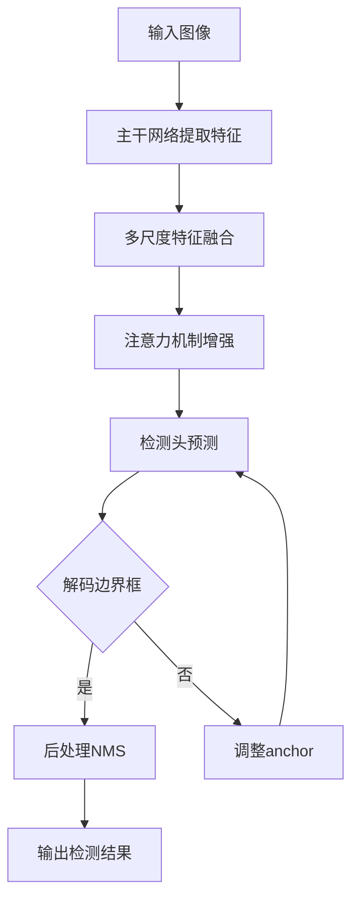

# YOLOv6的未来：探索人工智能的边界，创造更美好的未来

## 1. 背景介绍
### 1.1 人工智能的发展历程
#### 1.1.1 早期人工智能
#### 1.1.2 机器学习的崛起 
#### 1.1.3 深度学习的突破

### 1.2 计算机视觉的演进
#### 1.2.1 传统计算机视觉方法
#### 1.2.2 基于深度学习的计算机视觉 
#### 1.2.3 目标检测算法的发展

### 1.3 YOLO系列算法概述
#### 1.3.1 YOLOv1-YOLOv3
#### 1.3.2 YOLOv4和YOLOv5
#### 1.3.3 YOLOv6的诞生

## 2. 核心概念与联系
### 2.1 卷积神经网络(CNN)
#### 2.1.1 卷积层
#### 2.1.2 池化层
#### 2.1.3 全连接层

### 2.2 目标检测的基本概念
#### 2.2.1 边界框(Bounding Box)
#### 2.2.2 锚框(Anchor Box)
#### 2.2.3 非极大值抑制(NMS)

### 2.3 YOLOv6的关键创新
#### 2.3.1 主干网络结构优化
#### 2.3.2 注意力机制的引入
#### 2.3.3 损失函数的改进

## 3. 核心算法原理具体操作步骤
### 3.1 YOLOv6的网络结构
#### 3.1.1 主干网络
#### 3.1.2 检测头设计
#### 3.1.3 注意力模块

### 3.2 训练过程
#### 3.2.1 数据预处理和增强
#### 3.2.2 损失函数计算
#### 3.2.3 反向传播与参数更新

### 3.3 推理过程
#### 3.3.1 输入图像预处理
#### 3.3.2 前向传播
#### 3.3.3 后处理与结果输出

## 4. 数学模型和公式详细讲解举例说明
### 4.1 卷积操作的数学表示
#### 4.1.1 二维卷积
#### 4.1.2 多通道卷积
#### 4.1.3 转置卷积

### 4.2 目标检测的数学建模
#### 4.2.1 边界框回归
#### 4.2.2 分类概率计算
#### 4.2.3 损失函数设计

### 4.3 注意力机制的数学原理
#### 4.3.1 通道注意力
#### 4.3.2 空间注意力 
#### 4.3.3 自注意力机制

## 5. 项目实践：代码实例和详细解释说明
### 5.1 数据准备
#### 5.1.1 数据集下载与组织
#### 5.1.2 数据标注格式转换
#### 5.1.3 数据增强策略

### 5.2 模型训练
#### 5.2.1 配置文件设置
#### 5.2.2 训练脚本运行
#### 5.2.3 训练过程可视化

### 5.3 模型测试与部署
#### 5.3.1 测试脚本运行
#### 5.3.2 性能评估指标计算
#### 5.3.3 模型转换与部署优化

## 6. 实际应用场景
### 6.1 智能安防
#### 6.1.1 人脸识别
#### 6.1.2 行为分析
#### 6.1.3 异常事件检测

### 6.2 智慧交通
#### 6.2.1 车辆检测与跟踪
#### 6.2.2 交通标志识别
#### 6.2.3 车流量统计

### 6.3 智能医疗
#### 6.3.1 医学影像分析
#### 6.3.2 辅助诊断
#### 6.3.3 手术规划

## 7. 工具和资源推荐
### 7.1 数据集
#### 7.1.1 COCO数据集
#### 7.1.2 PASCAL VOC数据集
#### 7.1.3 自定义数据集

### 7.2 开发框架
#### 7.2.1 PyTorch
#### 7.2.2 TensorFlow
#### 7.2.3 PaddlePaddle

### 7.3 开源项目
#### 7.3.1 MMDetection
#### 7.3.2 Detectron2
#### 7.3.3 YOLOv6官方仓库

## 8. 总结：未来发展趋势与挑战
### 8.1 轻量化与模型压缩
#### 8.1.1 剪枝与量化
#### 8.1.2 知识蒸馏
#### 8.1.3 神经网络架构搜索

### 8.2 多模态融合
#### 8.2.1 图像-文本联合建模
#### 8.2.2 视频-音频联合分析
#### 8.2.3 跨模态信息交互

### 8.3 无监督与自监督学习
#### 8.3.1 对比学习
#### 8.3.2 生成式对抗网络
#### 8.3.3 元学习

## 9. 附录：常见问题与解答
### 9.1 如何选择合适的目标检测算法？
### 9.2 目标检测算法的评估指标有哪些？
### 9.3 如何处理目标检测中的类别不平衡问题？
### 9.4 目标检测模型的训练技巧有哪些？
### 9.5 如何进行目标检测模型的部署优化？

YOLOv6作为YOLO系列算法的最新进展，在延续了YOLO系列算法速度快、精度高的优势的同时，进一步优化了网络结构，引入了注意力机制，改进了损失函数，使得YOLOv6在速度和精度上都有了显著提升。

在网络结构方面，YOLOv6采用了更加高效的主干网络，通过引入残差结构和深度可分离卷积，在保证特征提取能力的同时降低了计算复杂度。同时，YOLOv6还设计了多尺度特征融合模块，充分利用不同尺度的特征信息，提高了对不同大小目标的检测能力。

在注意力机制方面，YOLOv6引入了通道注意力和空间注意力模块，通过自适应地调整不同通道和空间位置的权重，使得网络能够更加关注目标区域，抑制背景干扰，提高检测精度。

在损失函数方面，YOLOv6改进了传统的目标检测损失函数，引入了IoU损失和focal loss，有效地缓解了正负样本不平衡的问题，提高了对困难样本的检测能力。

YOLOv6的出现，为目标检测领域带来了新的突破。它不仅在算法性能上取得了显著进步，而且为实际应用提供了更加高效、可靠的解决方案。无论是智能安防、智慧交通还是智能医疗等领域，YOLOv6都展现出了广阔的应用前景。

然而，YOLOv6的发展也面临着诸多挑战。如何进一步提高检测精度，同时保持实时性；如何实现模型的轻量化和部署优化；如何利用无监督和自监督学习的思想，减少对大规模标注数据的依赖；如何实现多模态信息的融合，提供更加全面、准确的检测结果，这些都是YOLOv6未来需要继续探索和突破的方向。

YOLOv6代表了目标检测领域的最新进展，展现了人工智能技术的巨大潜力。随着算法的不断发展和完善，YOLOv6必将在更多领域得到广泛应用，为人类生活带来更多便利和改变。让我们一起期待YOLOv6的未来，见证人工智能创造更加美好的世界。

作者：禅与计算机程序设计艺术 / Zen and the Art of Computer Programming