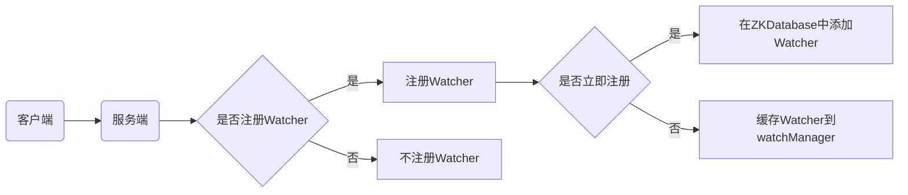
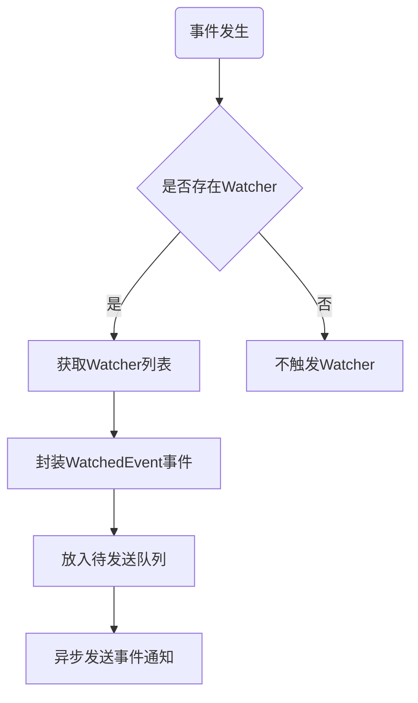
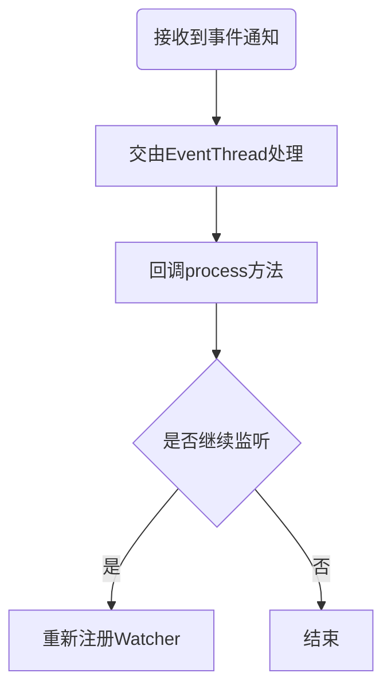

# Zookeeper Watcher机制原理与代码实例讲解

## 1. 背景介绍
### 1.1 Zookeeper简介
Zookeeper是一个开源的分布式协调服务框架,由雅虎创建,是Google Chubby的开源实现。它提供了简单的分布式协调服务,如命名服务、配置管理、分布式锁、分布式队列等,可以帮助我们更容易地构建分布式应用。

### 1.2 Watcher机制在Zookeeper中的重要性
在Zookeeper中,Watcher机制是一个非常重要且强大的特性。它允许客户端在指定的Znode上注册Watcher,当Znode发生某些事件(如数据改变、Znode删除等)时,服务器会向客户端发送通知。这使得分布式系统能够对Zookeeper上数据和事件的变化作出快速的响应。

### 1.3 Watcher机制的应用场景
Watcher机制在分布式系统中有广泛的应用,如:

1. 分布式锁:监听锁Znode的删除事件,判断是否获得锁。
2. 配置管理:监听配置Znode的数据变更,实时更新本地配置。 
3. HA高可用:监听Master节点存活性,进行主备切换。
4. 集群管理:监听集群节点的变化,实现动态扩容。

## 2. 核心概念与联系
### 2.1 Znode
Znode是Zookeeper的核心概念,它是Zookeeper树形结构中的数据节点,用于存储数据。每个Znode都可以有子Znode,从而形成一个树形结构。Znode可以分为持久节点和临时节点。

### 2.2 Watcher
Watcher是Zookeeper中的事件监听器,用于监听Znode上发生的特定事件,并在事件发生时触发相应的操作。每个Watcher只能被触发一次,触发后需要重新注册。

### 2.3 事件类型
Zookeeper中定义了多种事件类型,表示不同的Znode变更情况,常见的有:

1. None(-1):连接状态事件
2. NodeCreated(1):Znode创建事件  
3. NodeDeleted(2):Znode删除事件
4. NodeDataChanged(3):Znode数据变更事件
5. NodeChildrenChanged(4):Znode子节点变更事件

### 2.4 Watcher与Znode、事件的关系
Watcher机制建立在Znode与事件之上,Watcher需要注册在指定的Znode上,并针对特定的事件类型进行监听。当Znode上发生相应事件时,注册的Watcher将被触发执行。

## 3. 核心原理与实现机制
### 3.1 Watcher注册流程


客户端在向服务端发送请求时,可以选择是否注册Watcher。如果注册,根据注册时机的不同,Watcher可以立即注册到ZKDatabase中,也可以先缓存到WatchManager中,等待事件发生时再注册。

### 3.2 事件触发流程


当Znode上发生相应事件时,服务端会检查是否存在该事件的Watcher。如果存在,则获取Watcher列表,封装成WatchedEvent事件,放入待发送队列,并异步地向客户端发送事件通知。

### 3.3 客户端回调处理


客户端接收到事件通知后,会交由EventThread线程进行处理,并回调Watcher的process方法。用户可以在process方法中实现自定义的事件处理逻辑。如果需要继续监听,需要重新注册Watcher。

## 4. 数学模型与公式
### 4.1 Zookeeper Watcher数量估算
假设Zookeeper集群中有$N$个节点,每个节点上平均有$M$个Znode,每个Znode平均注册了$W$个Watcher,则整个集群的Watcher总数$T$可以估算为:

$$
T = N * M * W
$$

例如,一个3节点的Zookeeper集群,每个节点有1000个Znode,每个Znode平均注册了5个Watcher,则总的Watcher数量为:

$$
T = 3 * 1000 * 5 = 15000
$$

### 4.2 Watcher触发延迟估算
假设Zookeeper服务端处理一个事件通知的时间为$t$,网络延迟为$d$,则一个事件从发生到客户端接收到通知的延迟$L$可以估算为:

$$
L = t + 2d
$$

例如,服务端处理一个事件通知需要2ms,网络单向延迟为1ms,则事件触发延迟为:

$$
L = 2 + 2 * 1 = 4 (ms)
$$

## 5. 代码实例讲解
下面通过一个简单的Java代码实例,演示如何使用Zookeeper的Watcher机制监听Znode的数据变化。

```java
public class WatcherDemo implements Watcher {
    private static final String CONNECT_STRING = "localhost:2181";
    private static final int SESSION_TIMEOUT = 5000;
    private String path = "/watcher-demo";
    private ZooKeeper zooKeeper;

    public static void main(String[] args) throws IOException, InterruptedException, KeeperException {
        WatcherDemo demo = new WatcherDemo();
        demo.startZK();
        demo.createZNode();
        demo.watchZNode();
        demo.updateZNode();
        demo.deleteZNode();
        demo.stopZK();
    }

    private void startZK() throws IOException {
        zooKeeper = new ZooKeeper(CONNECT_STRING, SESSION_TIMEOUT, this);
    }

    private void createZNode() throws InterruptedException, KeeperException {
        zooKeeper.create(path, "hello".getBytes(), ZooDefs.Ids.OPEN_ACL_UNSAFE, CreateMode.PERSISTENT);
    }

    private void watchZNode() throws InterruptedException, KeeperException {
        zooKeeper.getData(path, this, null);
    }

    private void updateZNode() throws InterruptedException, KeeperException {
        zooKeeper.setData(path, "world".getBytes(), -1);
    }

    private void deleteZNode() throws InterruptedException, KeeperException {
        zooKeeper.delete(path, -1);
    }

    private void stopZK() throws InterruptedException {
        zooKeeper.close();
    }

    @Override
    public void process(WatchedEvent event) {
        if (event.getType() == Event.EventType.NodeDataChanged) {
            try {
                byte[] data = zooKeeper.getData(path, false, null);
                System.out.println("Data changed: " + new String(data));
            } catch (Exception e) {
                e.printStackTrace();
            }
        }
    }
}
```

这个例子主要流程如下:

1. 创建一个Znode `/watcher-demo` 
2. 在该Znode上注册一个数据变更的Watcher
3. 更新该Znode的数据
4. Watcher被触发,打印出变更后的数据
5. 删除该Znode,关闭ZooKeeper连接

## 6. 实际应用场景
### 6.1 分布式锁
利用Zookeeper的临时Znode和Watcher机制,可以实现分布式锁。多个客户端在同一个Znode上创建临时子节点,谁创建成功就获得锁。没有获得锁的客户端在该Znode上注册Watcher监听子节点的变化,当持有锁的客户端释放锁时,其他客户端会收到通知,重新尝试获取锁。

### 6.2 配置管理
将应用配置信息存储在Zookeeper的Znode中,应用启动时从Zookeeper上读取配置。同时在配置Znode上注册Watcher,当配置发生变更时,应用能够及时收到通知,重新加载配置。这样可以实现配置的集中管理和动态更新。

### 6.3 集群成员管理
可以在Zookeeper上创建一个专门存储集群成员信息的Znode,如`/members`。每个集群成员在该Znode下创建一个临时子节点,如`/members/m1`。成员节点可以在子节点上存储自己的IP、端口等信息。同时所有成员都在`/members`上注册子节点变更的Watcher,当有成员加入或退出集群时,其他成员都能收到通知,更新自己的成员列表。

## 7. 工具和资源推荐
### 7.1 ZooKeeper官网
官网提供了Zookeeper的下载、文档、教程等资源。  
https://zookeeper.apache.org/

### 7.2 Curator客户端
Curator是Netflix开源的一个Zookeeper客户端框架,提供了更高层次的API,简化了Zookeeper的使用。  
https://curator.apache.org/

### 7.3 《从Paxos到Zookeeper》
这是一本详细讲解Zookeeper原理和实践的书籍,对理解Zookeeper内部机制很有帮助。  
https://book.douban.com/subject/26292004/

### 7.4 Zookeeper Recipes
Zookeeper官方文档中提供了一些常用的使用模式和代码示例,如分布式锁、队列等。  
https://zookeeper.apache.org/doc/current/recipes.html

## 8. 总结与展望
### 8.1 Watcher机制的优缺点
Watcher机制为Zookeeper提供了强大的分布式通知能力,使得分布式系统能够及时响应数据和事件的变化。但同时Watcher也有一些需要注意的地方:

1. 一次性:每个Watcher只能被触发一次,触发后需要重新注册。
2. 时序性:通知是异步发送的,收到通知时状态可能已经发生了新的变化。
3. 丢失通知:在特定情况下(如客户端断开重连),可能会丢失事件通知。

### 8.2 未来的改进方向
目前Zookeeper的Watcher机制还存在一些改进空间,如:

1. 支持持久化的Watcher,触发后无需重新注册。
2. 提供事务性的Watcher,保证状态的一致性。
3. 优化Watcher的性能,提高通知的实时性。

随着分布式系统的不断发展,相信Zookeeper的Watcher机制也会不断演进,为构建高可用、高性能的分布式应用提供更好的支持。

## 9. 附录:常见问题
### 9.1 Watcher是一次性的吗?
是的,Watcher是一次性的,触发后需要重新注册。这是Zookeeper的一个设计选择,主要是为了避免Watcher的累积导致服务端压力过大。同时这也简化了服务端的实现。

### 9.2 客户端断开连接会导致Watcher丢失吗?
当客户端与服务端断开连接时,注册的Watcher并不会丢失。重新连接后,服务端会将断开期间发生的事件通知给客户端。但是如果在会话超时之前没有重连,则注册的临时Znode和Watcher都会被清理。

### 9.3 Watcher通知是有序的吗?
Watcher通知是异步发送的,但是对于同一个客户端,通知是按照事件发生的顺序进行投递的。多个客户端之间的通知顺序不做保证。

### 9.4 注册Watcher影响Zookeeper性能吗?
注册Watcher本身对Zookeeper性能的影响很小。但是当事件发生时,大量的Watcher触发可能会导致Zookeeper的网络I/O压力骤增。因此在设计和使用Watcher时,需要注意控制Watcher的数量,避免过多的Watcher累积。

作者：禅与计算机程序设计艺术 / Zen and the Art of Computer Programming