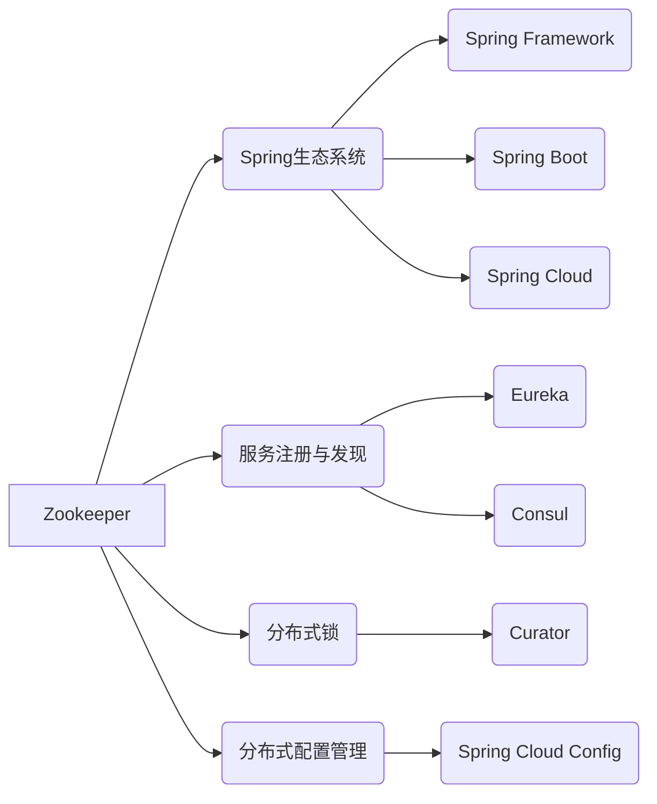

# Zookeeper与Spring生态系统集成应用

## 1. 背景介绍
### 1.1 Zookeeper的起源与发展
### 1.2 Spring生态系统概述
### 1.3 Zookeeper在Spring生态中的应用价值

## 2. 核心概念与联系
### 2.1 Zookeeper的核心概念
#### 2.1.1 数据模型
#### 2.1.2 节点类型
#### 2.1.3 Watcher机制
#### 2.1.4 ACL权限控制
### 2.2 Spring生态系统的核心组件
#### 2.2.1 Spring Framework
#### 2.2.2 Spring Boot
#### 2.2.3 Spring Cloud
### 2.3 Zookeeper与Spring生态的关联
#### 2.3.1 在Spring中使用Zookeeper
#### 2.3.2 Zookeeper在Spring Cloud中的应用

## 3. 核心算法原理具体操作步骤
### 3.1 Zookeeper的一致性算法
#### 3.1.1 Zab协议
#### 3.1.2 Paxos算法
#### 3.1.3 Leader选举
### 3.2 Zookeeper的Watch机制
#### 3.2.1 Watch的注册与触发
#### 3.2.2 Watch的实现原理
### 3.3 在Spring中操作Zookeeper
#### 3.3.1 使用Curator客户端
#### 3.3.2 使用Spring Data Zookeeper

## 4. 数学模型和公式详细讲解举例说明
### 4.1 Zab协议的数学模型
#### 4.1.1 Zab协议的状态机模型
#### 4.1.2 Zab协议的消息广播模型
### 4.2 Paxos算法的数学模型
#### 4.2.1 Paxos算法的角色定义
#### 4.2.2 Paxos算法的两阶段提交
### 4.3 数学公式的应用举例
#### 4.3.1 计算Zookeeper集群中的法定人数
#### 4.3.2 计算Zookeeper的吞吐量和延迟

## 5. 项目实践：代码实例和详细解释说明
### 5.1 使用Spring Boot集成Zookeeper
#### 5.1.1 添加Zookeeper依赖
#### 5.1.2 配置Zookeeper连接信息
#### 5.1.3 使用Zookeeper实现分布式锁
### 5.2 在Spring Cloud中使用Zookeeper实现服务注册与发现
#### 5.2.1 搭建Zookeeper集群环境
#### 5.2.2 配置Spring Cloud Zookeeper依赖
#### 5.2.3 实现服务注册与发现
### 5.3 使用Zookeeper实现分布式配置管理
#### 5.3.1 在Zookeeper中存储配置信息
#### 5.3.2 使用Spring Cloud Config与Zookeeper集成
#### 5.3.3 实现配置的动态更新

## 6. 实际应用场景
### 6.1 分布式锁的应用
#### 6.1.1 在高并发场景下的资源同步
#### 6.1.2 防止任务重复执行
### 6.2 服务注册与发现的应用
#### 6.2.1 实现服务的负载均衡
#### 6.2.2 实现服务的高可用
### 6.3 分布式配置管理的应用
#### 6.3.1 集中管理应用配置
#### 6.3.2 实现配置的版本控制与回滚

## 7. 工具和资源推荐
### 7.1 Zookeeper可视化工具
#### 7.1.1 ZooInspector
#### 7.1.2 Exhibitor
### 7.2 Spring生态相关资源
#### 7.2.1 Spring官方文档
#### 7.2.2 Spring Boot学习资源
#### 7.2.3 Spring Cloud学习资源

## 8. 总结：未来发展趋势与挑战
### 8.1 Zookeeper的未来发展
#### 8.1.1 Zookeeper的演进路线
#### 8.1.2 Zookeeper面临的挑战
### 8.2 Spring生态系统的未来趋势
#### 8.2.1 Spring生态的持续演进
#### 8.2.2 Spring生态面临的机遇与挑战

## 9. 附录：常见问题与解答
### 9.1 Zookeeper常见问题
#### 9.1.1 Zookeeper集群节点数量的选择
#### 9.1.2 Zookeeper的性能优化
#### 9.1.3 Zookeeper的安全配置
### 9.2 Spring集成Zookeeper常见问题
#### 9.2.1 Spring Boot如何配置Zookeeper
#### 9.2.2 Spring Cloud如何使用Zookeeper实现服务注册与发现
#### 9.2.3 Spring中使用Zookeeper需要注意的事项



Zookeeper是一个开源的分布式协调服务，它提供了一组简单的原语，可用于构建分布式应用程序。Zookeeper的核心是一个类似文件系统的数据模型，它由一组节点（Znode）组成，每个节点可以存储数据并拥有一个唯一的路径。Zookeeper使用Zab协议来保证数据的一致性，Zab协议是一种基于Paxos算法的原子广播协议。

在Spring生态系统中，Zookeeper被广泛应用于服务注册与发现、分布式锁和分布式配置管理等场景。Spring Cloud Zookeeper是Spring Cloud生态系统中的一个子项目，它提供了与Zookeeper集成的功能，使得在Spring应用程序中使用Zookeeper变得更加简单和方便。

在服务注册与发现方面，Spring Cloud Zookeeper可以作为服务注册中心，类似于Eureka和Consul。当一个服务实例启动时，它会将自己的服务信息注册到Zookeeper中的指定节点上。其他服务可以通过Zookeeper来发现和调用这个服务。Spring Cloud Zookeeper会自动处理服务实例的注册和发现，使得服务之间的调用变得透明。

在分布式锁方面，Zookeeper提供了一种基于临时顺序节点的分布式锁实现。通过在Zookeeper中创建一个临时顺序节点，多个客户端可以争夺锁的获取。Spring Integration Zookeeper模块提供了使用Zookeeper实现分布式锁的功能，可以方便地在Spring应用程序中使用分布式锁。

在分布式配置管理方面，Spring Cloud Config可以与Zookeeper集成，将应用程序的配置信息存储在Zookeeper中。通过在Zookeeper中修改配置信息，可以实现配置的动态更新，而无需重启应用程序。Spring Cloud Config与Zookeeper的集成使得配置管理变得更加灵活和可扩展。

下面是一个使用Spring Boot集成Zookeeper实现分布式锁的代码示例：

```java
@Configuration
public class ZookeeperConfig {

    @Bean
    public CuratorFramework curatorFramework() {
        CuratorFramework curatorFramework = CuratorFrameworkFactory.builder()
                .connectString("localhost:2181")
                .retryPolicy(new ExponentialBackoffRetry(1000, 3))
                .build();
        curatorFramework.start();
        return curatorFramework;
    }

    @Bean
    public InterProcessMutex interProcessMutex(CuratorFramework curatorFramework) {
        return new InterProcessMutex(curatorFramework, "/locks/my-lock");
    }
}

@Service
public class MyService {

    @Autowired
    private InterProcessMutex interProcessMutex;

    public void doSomething() {
        try {
            interProcessMutex.acquire();
            // 执行业务逻辑
        } catch (Exception e) {
            // 处理异常
        } finally {
            try {
                interProcessMutex.release();
            } catch (Exception e) {
                // 处理异常
            }
        }
    }
}
```

在上面的代码中，我们首先配置了一个CuratorFramework的Bean，用于连接Zookeeper。然后创建了一个InterProcessMutex的Bean，表示一个分布式锁。在MyService中，我们注入了InterProcessMutex，并在doSomething方法中使用`acquire`方法获取锁，执行业务逻辑后使用`release`方法释放锁。

Zookeeper与Spring生态系统的集成为构建分布式应用程序提供了强大的支持。通过使用Zookeeper提供的分布式协调服务，可以更容易地实现服务注册与发现、分布式锁和分布式配置管理等功能。Spring生态系统与Zookeeper的无缝集成，使得开发人员可以专注于业务逻辑的实现，而不必过多关注底层的分布式细节。

未来，Zookeeper将继续演进，提供更加高效和可靠的分布式协调服务。同时，Spring生态系统也在不断发展，引入了更多的分布式解决方案，如Spring Cloud Alibaba等。随着云原生架构的兴起，Zookeeper和Spring生态系统将在构建云原生应用程序中发挥更加重要的作用。

总之，Zookeeper与Spring生态系统的集成为构建高可用、可扩展的分布式应用程序提供了坚实的基础。通过深入理解Zookeeper的原理和Spring生态系统的使用，开发人员可以更好地应对分布式环境下的挑战，构建出更加可靠和高效的应用程序。

作者：禅与计算机程序设计艺术 / Zen and the Art of Computer Programming