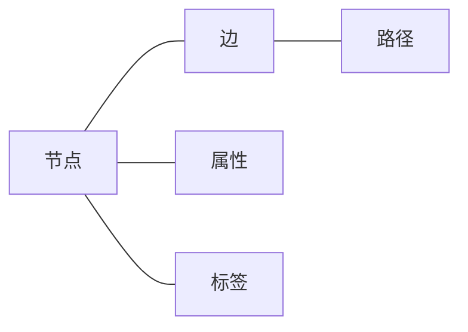
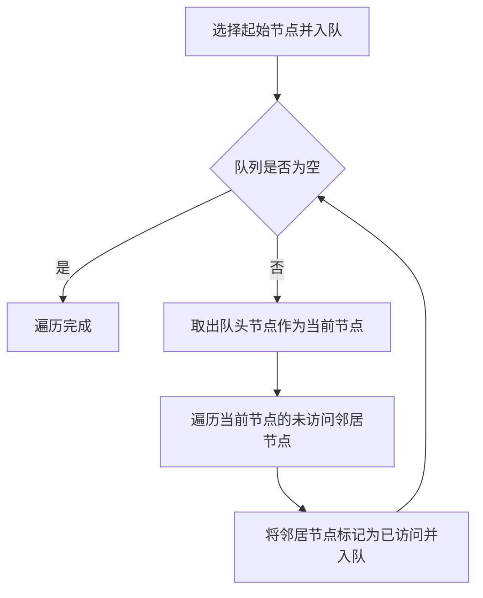
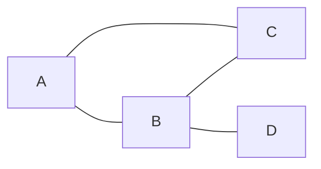

# 【AI大数据计算原理与代码实例讲解】图数据库

## 1.背景介绍
### 1.1 大数据时代的数据管理挑战
随着大数据时代的到来,海量、高速、多样的数据正在快速增长。传统的关系型数据库在处理高度关联的复杂数据时遇到了性能瓶颈。为了应对大数据带来的挑战,图数据库应运而生。

### 1.2 什么是图数据库
图数据库是一种NoSQL数据库,它使用图结构来存储和查询数据。在图数据库中,数据被建模为节点(Node)和边(Edge)。节点代表实体,边代表实体之间的关系。这种数据模型非常适合处理高度关联的数据。

### 1.3 图数据库的优势
与传统关系型数据库相比,图数据库有以下优势:
- 高性能:图数据库针对图结构数据进行了优化,在处理复杂关联查询时性能更优。
- 灵活性:图模型可以轻松应对数据模式的变化,无需预先定义复杂的表结构。 
- 易用性:使用图的概念对数据建模更加直观,开发人员易于理解和使用。

## 2.核心概念与联系
### 2.1 节点(Node)
节点是图中的基本单元,用于表示实体对象,如人、地点、事物等。每个节点可以有多个属性来描述实体的特征。例如,一个"人"节点可能包含姓名、年龄、性别等属性。

### 2.2 边(Edge)  
边表示节点之间的关系。一个边连接两个节点,表示它们之间存在某种关联。边也可以有属性,用于描述关系的类型或强度。常见的关系类型有:
- 单向关系:如"员工"到"部门"的从属关系。
- 双向关系:如"用户"和"用户"之间的好友关系。
- 多元关系:如"作者"、"论文"和"会议"之间的多元关系。

### 2.3 属性(Property)
属性用于描述节点或边的特征。属性以键值对的形式存在,其中键是属性的名称,值是属性的具体内容。例如,一个"人"节点可能有"name"、"age"、"gender"等属性。

### 2.4 标签(Label)
标签用于对节点进行分类。一个节点可以有多个标签,表示它属于不同的类别。例如,一个"人"节点可能同时具有"员工"和"管理者"的标签。

### 2.5 路径(Path)
路径是图中节点和边的一个序列,表示节点之间的一条遍历路线。通过路径,可以发现节点之间的间接关系和联系。

以下是图数据库核心概念的 Mermaid 流程图:


## 3.核心算法原理具体操作步骤
图数据库的核心算法主要包括图的遍历、最短路径查找、连通子图检测等。下面以广度优先搜索(BFS)算法为例,介绍其具体操作步骤。

### 3.1 广度优先搜索(BFS)算法
BFS是一种图的遍历算法,它从起始节点出发,按照边的顺序依次访问图中的节点。BFS使用队列来存储待访问的节点,具体步骤如下:
1. 选择一个起始节点,将其标记为已访问,并加入队列。
2. 当队列不为空时,重复以下操作:
   - 从队列头部取出一个节点,作为当前节点。
   - 遍历当前节点的所有未访问过的邻居节点。
   - 将这些邻居节点标记为已访问,并加入队列。
3. 重复步骤2,直到队列为空,表示遍历完成。

以下是BFS算法的Mermaid流程图:


## 4.数学模型和公式详细讲解举例说明
图可以用数学模型来表示。最常见的图模型是 G=(V,E),其中:
- V 表示节点(Vertex)的集合。
- E 表示边(Edge)的集合,每条边是一个二元组 (u,v),表示从节点 u 到节点 v 的有向边。

例如,考虑以下无向图:


该图可以表示为:
- V = {A, B, C, D}
- E = {{A,B}, {A,C}, {B,C}, {B,D}}

设图 G=(V,E),其中 |V|=n,|E|=m。以下是一些常见的图论概念和公式:

- 度(Degree):节点 v 的度,记为 $d(v)$,表示与节点 v 相连的边的数量。无向图中,度数等于与该节点相连的边数;有向图中,分为入度和出度。
  - 入度 $d^-(v)$:以节点 v 为终点的边的数量。
  - 出度 $d^+(v)$:以节点 v 为起点的边的数量。

- 完全图(Complete Graph):任意两个节点之间都有边相连的简单无向图。n 个节点的完全图有 $\frac{n(n-1)}{2}$ 条边。

- 邻接矩阵(Adjacency Matrix):用矩阵表示图的方法。设图 G 有 n 个节点,则邻接矩阵 A 是一个 n×n 的方阵,其中:
$$
  A_{ij} = \begin{cases}
    1, & \text{if (i,j) $\in$ E} \\
    0, & \text{otherwise}
  \end{cases}
$$

- 邻接表(Adjacency List):用列表表示图的方法。对于每个节点 v,保存一个列表,记录所有与 v 直接相连的节点。

例如,上述无向图的邻接矩阵为:
$$
A = \begin{bmatrix}
0 & 1 & 1 & 0\\
1 & 0 & 1 & 1\\
1 & 1 & 0 & 0\\
0 & 1 & 0 & 0
\end{bmatrix}
$$

其邻接表表示为:
- A: [B, C]
- B: [A, C, D] 
- C: [A, B]
- D: [B]

## 5.项目实践:代码实例和详细解释说明

下面以 Python 语言为例,演示如何使用图数据库 Neo4j 进行图的创建、查询和遍历。

### 5.1 安装 Neo4j 和 Python 驱动
首先,需要安装 Neo4j 数据库和 Python 的 Neo4j 驱动。可以从官网下载 Neo4j,并使用 pip 安装 neo4j 驱动:
```bash
pip install neo4j
```

### 5.2 连接 Neo4j 数据库
使用 Python 的 neo4j 驱动连接到 Neo4j 数据库:
```python
from neo4j import GraphDatabase

uri = "neo4j://localhost:7687"
user = "neo4j"
password = "password"

driver = GraphDatabase.driver(uri, auth=(user, password))
```

### 5.3 创建节点和边
使用 Cypher 查询语言创建节点和边:
```python
def create_graph(driver):
    with driver.session() as session:
        session.run("CREATE (a:Person {name:'Alice', age:25})")
        session.run("CREATE (b:Person {name:'Bob', age:30})")
        session.run("CREATE (c:Person {name:'Charlie', age:35})")
        session.run("CREATE (a)-[:KNOWS]->(b)")
        session.run("CREATE (a)-[:KNOWS]->(c)")
        session.run("CREATE (b)-[:KNOWS]->(c)")
```

### 5.4 查询节点和边
使用 Cypher 查询语言查询节点和边:
```python
def query_graph(driver):
    with driver.session() as session:
        result = session.run("MATCH (p:Person) RETURN p.name AS name, p.age AS age")
        for record in result:
            print(f"Name: {record['name']}, Age: {record['age']}")
        
        result = session.run("MATCH (p1:Person)-[:KNOWS]->(p2:Person) RETURN p1.name AS p1, p2.name AS p2")
        for record in result:
            print(f"{record['p1']} knows {record['p2']}")
```

### 5.5 遍历图
使用 Cypher 查询语言进行图的遍历,例如查找两个节点之间的最短路径:
```python
def traverse_graph(driver):
    with driver.session() as session:
        result = session.run("MATCH p=shortestPath((a:Person {name:'Alice'})-[*]-(b:Person {name:'Charlie'})) RETURN p")
        for record in result:
            print(record['p'])
```

### 5.6 完整示例代码
```python
from neo4j import GraphDatabase

uri = "neo4j://localhost:7687"
user = "neo4j"
password = "password"

driver = GraphDatabase.driver(uri, auth=(user, password))

def create_graph(driver):
    with driver.session() as session:
        session.run("CREATE (a:Person {name:'Alice', age:25})")
        session.run("CREATE (b:Person {name:'Bob', age:30})")
        session.run("CREATE (c:Person {name:'Charlie', age:35})")
        session.run("CREATE (a)-[:KNOWS]->(b)")
        session.run("CREATE (a)-[:KNOWS]->(c)")
        session.run("CREATE (b)-[:KNOWS]->(c)")

def query_graph(driver):
    with driver.session() as session:
        result = session.run("MATCH (p:Person) RETURN p.name AS name, p.age AS age")
        for record in result:
            print(f"Name: {record['name']}, Age: {record['age']}")
        
        result = session.run("MATCH (p1:Person)-[:KNOWS]->(p2:Person) RETURN p1.name AS p1, p2.name AS p2")
        for record in result:
            print(f"{record['p1']} knows {record['p2']}")

def traverse_graph(driver):
    with driver.session() as session:
        result = session.run("MATCH p=shortestPath((a:Person {name:'Alice'})-[*]-(b:Person {name:'Charlie'})) RETURN p")
        for record in result:
            print(record['p'])

if __name__ == "__main__":
    create_graph(driver)
    query_graph(driver)
    traverse_graph(driver)
    driver.close()
```

以上代码演示了如何使用 Python 连接 Neo4j 数据库,并进行图的创建、查询和遍历。通过 Cypher 查询语言,可以方便地对图数据进行操作和分析。

## 6.实际应用场景
图数据库在许多领域都有广泛的应用,下面列举几个典型的应用场景:

### 6.1 社交网络分析
社交网络是图数据库的一个典型应用场景。将用户作为节点,用户之间的关系(如好友关系)作为边,可以构建一个社交网络图。通过图数据库,可以实现以下功能:
- 好友推荐:通过分析用户的共同好友,推荐潜在的好友。
- 社区发现:通过图的聚类算法,发现社交网络中的社区结构。
- 影响力分析:通过计算节点的中心性指标,如 PageRank、中介中心性等,评估用户的影响力。

### 6.2 知识图谱
知识图谱是一种结构化的知识库,用图的形式表示实体及其之间的关系。知识图谱在智能问答、语义搜索、推荐系统等领域有广泛应用。使用图数据库构建知识图谱,可以实现:
- 实体链接:将文本中的实体提及与知识图谱中的实体节点关联起来。
- 关系抽取:从文本中抽取实体之间的关系,丰富知识图谱。
- 知识推理:通过图的遍历和推理算法,发现隐含的实体关系。

### 6.3 推荐系统
推荐系统可以使用图数据库来表示用户、物品及其之间的交互关系。将用户和物品作为节点,用户对物品的评分或购买行为作为边,构建一个二部图。基于图的推荐算法,如协同过滤、随机游走等,可以实现个性化推荐。

### 6.4 网络安全
在网络安全领域,图数据库可以用于分析网络流量、检测异常行为等。将 IP 地址、端口、协议等信息作为节点,网络连接作为边,构建一个网络通信图。通过图的分析算法,可以:
- 识别僵尸网络:通过分析节