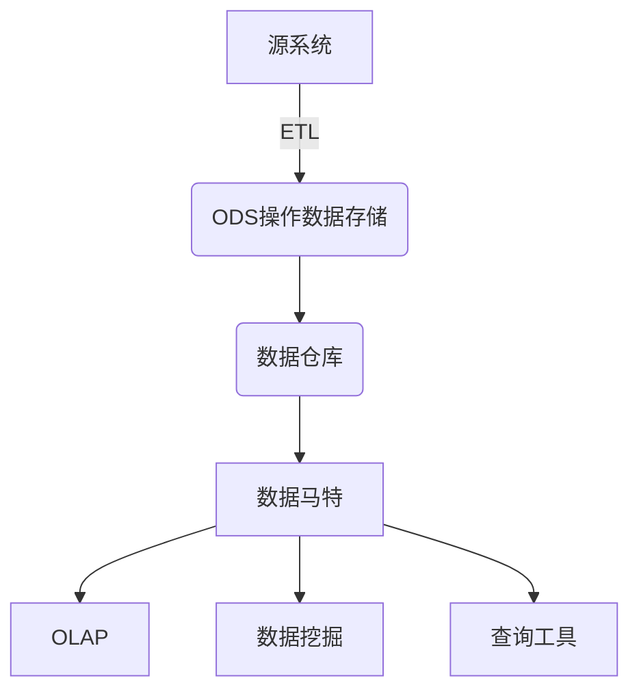
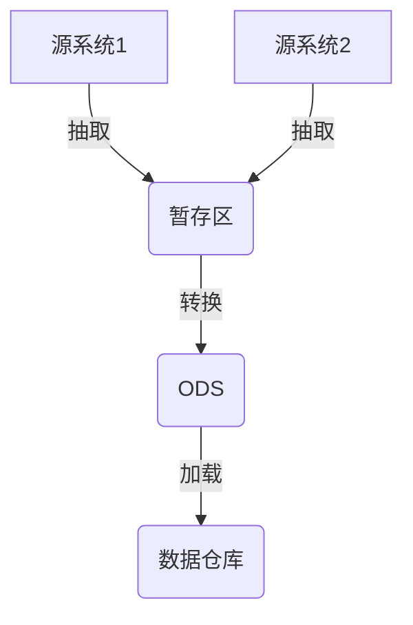
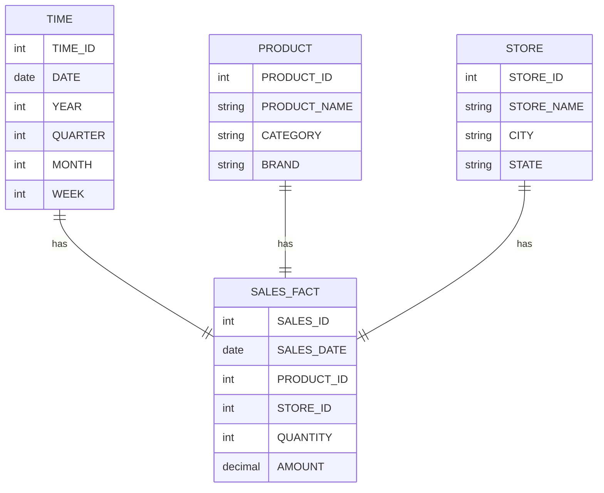

# 【AI大数据计算原理与代码实例讲解】数据仓库

## 1.背景介绍

### 1.1 数据仓库的定义

数据仓库(Data Warehouse)是一种面向主题的(Subject Oriented)、集成的(Integrated)、相对稳定的(Non-Volatile)、反映历史数据(Time-Variant)的数据集合,用于支持管理决策。它是一个大型的数据库,专门用于存储企业的历史数据,为企业的决策支持系统提供数据支持。

### 1.2 数据仓库的特点

- **面向主题(Subject Oriented)**:数据仓库中的数据按照不同的主题域进行组织和存储,例如销售、财务、人力资源等,这样便于用户对特定领域的数据进行分析。

- **集成(Integrated)**:数据仓库将来自不同源系统的数据进行清洗、转换和集成,消除了数据之间的不一致性和冗余,为用户提供了一个统一的数据视图。

- **相对稳定(Non-Volatile)**:数据仓库中的数据是只读的,不允许直接更新和删除,只能通过定期的数据加载过程来更新数据。

- **反映历史数据(Time-Variant)**:数据仓库不仅存储当前的数据快照,还保留了历史数据,以支持对历史数据的分析和趋势预测。

### 1.3 数据仓库的作用

数据仓库的主要作用是为企业的决策支持系统提供数据支持,具体包括:

1. **决策支持**:通过对历史数据的分析,为企业的战略决策和业务运营提供依据。

2. **业务分析**:对企业的销售、财务、生产等各个方面的数据进行深入分析,发现潜在的商机和问题。

3. **数据挖掘**:在数据仓库中发现隐藏的模式和规律,为企业的营销策略、客户关系管理等提供支持。

4. **查询和报表**:根据用户的需求,快速生成各种分析报表和查询结果。

## 2.核心概念与联系

### 2.1 数据仓库的体系结构

数据仓库的体系结构通常包括以下几个核心组件:



1. **源系统(Source Systems)**:企业内部的各种运营系统,如ERP、CRM等,它们是数据的来源。

2. **ODS(Operation Data Store)**:操作数据存储,用于暂时存储从源系统抽取的数据,作为数据仓库的数据缓冲区。

3. **ETL(Extract, Transform, Load)**:从源系统抽取数据、转换数据格式、加载到数据仓库的过程。

4. **数据仓库(Data Warehouse)**:存储集成后的历史数据,为决策支持系统提供数据支持。

5. **数据马特(Data Mart)**:面向特定主题或部门的数据集市,从数据仓库中抽取相关数据,为特定的分析需求服务。

6. **OLAP(On-Line Analytical Processing)**:联机分析处理,用于多维度分析和数据挖掘。

7. **数据挖掘(Data Mining)**:从数据仓库中发现隐藏的模式和规律,为决策提供支持。

8. **查询工具(Query Tools)**:用于从数据仓库中查询和生成报表。

### 2.2 数据仓库与OLTP的区别

数据仓库与OLTP(On-Line Transaction Processing,联机事务处理)系统有着明显的区别:

| 特性 | 数据仓库 | OLTP系统 |
|------|----------|----------|
| 数据类型 | 主要存储历史数据,用于分析决策 | 存储当前运营数据,用于日常事务处理 |
| 数据操作 | 主要是查询操作,很少更新和插入 | 频繁的更新、插入和删除操作 |
| 数据模型 | 面向主题的多维数据模型 | 面向应用的扁平数据模型 |
| 查询类型 | 复杂的分析型查询,涉及大量数据 | 简单的事务型查询,涉及少量数据 |
| 用户数量 | 相对较少的用户 | 大量并发用户 |
| 数据一致性 | 数据来源于不同系统,一致性较差 | 数据来源于单一系统,一致性较好 |

## 3.核心算法原理具体操作步骤

### 3.1 ETL过程

ETL(Extract, Transform, Load)是构建数据仓库的核心过程,包括以下三个主要步骤:

1. **抽取(Extract)**:从源系统中抽取所需的数据,可以是全量抽取或增量抽取。

2. **转换(Transform)**:对抽取的数据进行清洗、转换和集成,包括数据格式转换、数据规范化、数据去重、数据补全等操作。

3. **加载(Load)**:将转换后的数据加载到数据仓库中,可以是全量加载或增量加载。

ETL过程通常由专门的ETL工具来完成,如Informatica、DataStage等。下面是ETL过程的一个典型流程:



1. 从源系统1和源系统2抽取所需数据到暂存区。

2. 对暂存区中的数据进行转换,包括清洗、转换和集成,将转换后的数据加载到ODS。

3. 从ODS中抽取数据,加载到数据仓库中。

### 3.2 数据建模

数据建模是设计数据仓库的关键步骤,主要包括以下几个步骤:

1. **选择建模方法**:常用的建模方法有维度建模(Dimensional Modeling)和实体关系建模(Entity-Relationship Modeling)。维度建模更适合数据仓库,因为它能够很好地支持多维分析。

2. **确定维度和事实**:维度表(Dimension Table)存储描述性数据,如产品、时间、地区等;事实表(Fact Table)存储度量数据,如销售额、成本等。

3. **设计维度表**:维度表通常采用雪花模型或星型模型,包括主键、描述性属性和外键。

4. **设计事实表**:事实表包括度量值和维度表的外键,通常采用高度去规范化的设计。

5. **建立维度层次结构**:为维度表建立层次结构,支持不同粒度的数据分析。

6. **确定聚集粒度**:根据分析需求确定事实表的聚集粒度,如日、周、月等。

以销售数据为例,一个典型的维度建模如下:



## 4.数学模型和公式详细讲解举例说明

在数据仓库中,常用的数学模型和公式主要包括:

### 4.1 数据压缩算法

由于数据仓库中存储了大量的历史数据,因此需要使用数据压缩算法来减小数据的存储空间。常用的压缩算法包括:

1. **RLE(Run-Length Encoding)**:对于连续重复的数据,使用一对值(值,重复次数)来表示。压缩率取决于数据的重复程度。

2. **字典编码**:将重复出现的模式用一个较短的码字代替,从而减小存储空间。常用的字典编码算法有LZW、Huffman编码等。

3. **位映射**:对于取值范围较小的数据,可以使用位映射的方式进行压缩。例如,对于只有0和1两个值的数据,可以使用1位来存储。

4. **小批量编码**:将数据分成小批量,对每个小批量进行编码,可以提高压缩率。

5. **列存储**:将数据按列存储,对于具有相似值的列,可以获得较高的压缩率。

### 4.2 数据分区算法

数据分区是将数据按照某种规则划分成多个区域存储,可以提高查询效率。常用的分区算法包括:

1. **范围分区**:根据数据值的范围进行分区,例如按年份或月份分区。

2. **哈希分区**:根据数据值的哈希值进行分区,可以实现较好的数据分布。

3. **列表分区**:根据数据值的列表进行分区,适用于离散值较少的场景。

4. **复合分区**:结合多种分区方式,例如先按范围分区,再按哈希分区。

对于范围分区,常用的公式是:

$$区间范围 = \frac{最大值 - 最小值}{分区数}$$

例如,将销售数据按年份分区,最小年份为2010,最大年份为2020,分10个区间,则每个区间的范围为:

$$区间范围 = \frac{2020 - 2010}{10} = 1年$$

因此,分区范围为:

- 2010年
- 2011年
- 2012年
- ...
- 2019年
- 2020年

### 4.3 数据采样算法

在数据仓库中,常需要对大量数据进行采样,以便进行分析和建模。常用的采样算法包括:

1. **简单随机采样**:从总体中随机抽取样本,每个个体被抽中的概率相等。

2. **分层采样**:先将总体划分为若干层,再在每层内进行简单随机采样。

3. **系统抽样**:按照固定间隔从总体中抽取样本,例如每隔10个个体抽取一个。

4. **聚类采样**:先将总体划分为若干个群集,再随机抽取部分群集作为样本。

对于简单随机采样,常用的公式是:

$$样本容量 = \frac{z^2 \times p \times (1-p)}{e^2}$$

其中:

- $z$是置信水平对应的标准正态分布值,通常取1.96(95%置信水平)
- $p$是总体中感兴趣的比例,通常取0.5以获得最大样本量
- $e$是允许的误差范围

例如,要估计一个总体的比例,允许误差为5%,置信水平为95%,则样本容量为:

$$样本容量 = \frac{1.96^2 \times 0.5 \times (1-0.5)}{0.05^2} \approx 384$$

## 5.项目实践:代码实例和详细解释说明

以下是一个使用Python实现简单ETL流程的示例代码,从CSV文件中抽取数据,进行转换后加载到SQLite数据库中。

### 5.1 抽取(Extract)

```python
import csv

def extract_data(file_path):
    """
    从CSV文件中抽取数据
    :param file_path: 文件路径
    :return: 数据列表
    """
    data = []
    with open(file_path, 'r') as file:
        reader = csv.reader(file)
        next(reader)  # 跳过标题行
        for row in reader:
            data.append(row)
    return data
```

### 5.2 转换(Transform)

```python
from datetime import datetime

def transform_data(data):
    """
    转换数据格式
    :param data: 原始数据列表
    :return: 转换后的数据列表
    """
    transformed_data = []
    for row in data:
        # 转换日期格式
        date_str = row[2]
        date_obj = datetime.strptime(date_str, '%m/%d/%Y').date()
        
        # 转换数值类型
        quantity = int(row[3])
        amount = float(row[4])
        
        transformed_data.append([row[0], row[1], date_obj, quantity, amount])
    return transformed_data
```

### 5.3 加载(Load)

```python
import sqlite3

def load_data(data, db_path):
    """
    将数据加载到SQLite数据库
    :param data: 转换后的数据列表
    