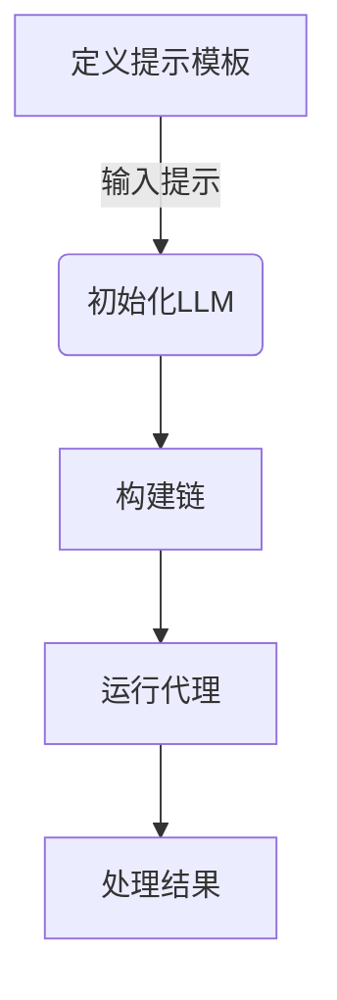

# 【LangChain编程：从入门到实践】

## 1. 背景介绍

### 1.1 人工智能发展简介

人工智能(Artificial Intelligence, AI)是当代科技发展的热点领域之一,近年来受到了广泛关注和投资。AI旨在通过计算机系统模拟人类智能,实现机器学习、自然语言处理、计算机视觉等功能。随着算力的不断提升和大数据时代的到来,AI技术取得了长足进步,在各行各业得到了广泛应用。

### 1.2 大语言模型的兴起

近年来,大型语言模型(Large Language Models, LLMs)成为AI领域的一股重要力量。LLMs通过训练海量文本数据,学习自然语言的语义和上下文关系,从而具备出色的自然语言理解和生成能力。GPT-3、BERT、PALM等知名语言模型的出现,为自然语言处理领域带来了革命性变化。

### 1.3 LangChain的诞生

LangChain是一个针对大型语言模型的开源框架,旨在简化LLMs在各种应用场景中的开发和部署。它提供了模块化的构建块,使开发人员能够轻松构建、组合和扩展LLM应用程序。LangChain支持多种LLM后端,如OpenAI、Anthropic、Cohere等,并与多种数据源无缝集成,如文件、Web、API等。

## 2. 核心概念与联系

### 2.1 LangChain核心概念

LangChain的核心概念包括代理(Agents)、链(Chains)、提示模板(Prompt Templates)、内存(Memory)等。

#### 2.1.1 代理(Agents)

代理是LangChain中最高层次的抽象,它封装了完成特定任务所需的所有逻辑。代理可以由多个链组成,并通过内存来保存和访问上下文信息。

#### 2.1.2 链(Chains)

链是LangChain中的基本构建块,它将多个组件(如LLM、工具等)连接在一起,形成一个可重用的序列。链可以嵌套使用,构建复杂的工作流程。

#### 2.1.3 提示模板(Prompt Templates)

提示模板用于定义向LLM发送的输入提示的结构和格式。它可以包含静态文本、动态变量和指令,帮助LLM更好地理解和响应任务。

#### 2.1.4 内存(Memory)

内存用于存储和检索代理执行过程中的上下文信息,如先前的对话、中间结果等。这有助于代理保持任务的连贯性和一致性。

### 2.2 LangChain与其他AI框架的关系

LangChain并不是一个独立的LLM,而是一个构建在现有LLM之上的抽象层。它可以与多种LLM后端(如GPT-3、PALM等)集成,并利用它们的自然语言处理能力。同时,LangChain也可以与其他AI框架(如Hugging Face、TensorFlow等)协同工作,构建更加复杂和强大的AI应用程序。

LangChain的优势在于它提供了一种统一的、模块化的方式来组合和扩展LLM应用程序,降低了开发和部署的复杂性。

## 3. 核心算法原理具体操作步骤

### 3.1 LangChain工作流程概览

LangChain的工作流程通常包括以下几个步骤:

1. **定义提示模板**: 使用提示模板定义向LLM发送的输入提示的结构和格式。

2. **初始化LLM**: 选择并初始化所需的LLM后端,如OpenAI的GPT-3。

3. **构建链**: 根据任务需求,将LLM、工具、内存等组件组合成一个或多个链。

4. **运行代理**: 创建代理,将链和其他组件传递给代理,并执行任务。

5. **处理结果**: 从代理获取执行结果,并根据需要进行后续处理或展示。

这个工作流程的核心思想是将复杂的任务分解为模块化的组件,通过链和代理的组合来实现灵活的功能扩展和复用。



### 3.2 提示模板定义

提示模板是与LLM进行交互的关键。LangChain提供了多种方式来定义提示模板,包括:

- `PromptTemplate`: 用于定义静态提示模板。
- `FewShotPromptTemplate`: 用于定义包含示例输入输出对的提示模板。
- `Jinja2PromptTemplate`: 使用Jinja2模板语言定义动态提示模板。

以下是一个使用`PromptTemplate`定义静态提示模板的示例:

```python
from langchain import PromptTemplate

prompt = PromptTemplate(
    input_variables=["product"],
    template="请为以下产品撰写一段营销文案: {product}",
)
```

在这个示例中,我们定义了一个包含`{product}`占位符的提示模板,用于生成针对特定产品的营销文案。

### 3.3 初始化LLM

LangChain支持多种LLM后端,包括OpenAI、Anthropic、Cohere等。初始化LLM的方式取决于所选后端的API。以OpenAI的GPT-3为例:

```python
from langchain.llms import OpenAI

llm = OpenAI(model_name="text-davinci-003", temperature=0.7)
```

在这个示例中,我们初始化了一个OpenAI的GPT-3语言模型实例,并设置了温度参数(`temperature`)来控制输出的随机性。

### 3.4 构建链

链是LangChain的核心组件,用于将LLM、工具、内存等组件组合成一个可重用的序列。LangChain提供了多种预定义的链,如`LLMChain`、`ConversationChain`、`SequentialChain`等。

以下是一个使用`LLMChain`构建简单链的示例:

```python
from langchain.chains import LLMChain

chain = LLMChain(llm=llm, prompt=prompt)
```

在这个示例中,我们将之前定义的LLM和提示模板组合成一个`LLMChain`实例。这个链可以直接调用,将输入传递给LLM并获取响应。

### 3.5 运行代理

代理是LangChain中最高层次的抽象,它封装了完成特定任务所需的所有逻辑。代理可以由一个或多个链组成,并利用内存来保存和访问上下文信息。

以下是一个使用`initialize_agent`函数创建代理的示例:

```python
from langchain.agents import initialize_agent
from langchain.agents import AgentType

agent = initialize_agent(
    agent_type=AgentType.CONVERSATIONAL_REACT_DESCRIPTION,
    tools=[chain],
    llm=llm,
    handle_parsing_errors=True,
)
```

在这个示例中,我们创建了一个对话式代理,它包含了之前定义的链和LLM。`AgentType.CONVERSATIONAL_REACT_DESCRIPTION`指定了代理的类型,它会根据用户的输入自动选择合适的工具(即链)来执行任务。

### 3.6 处理结果

运行代理后,我们可以获取执行结果并进行后续处理或展示。以下是一个示例:

```python
product_to_market = "iPhone 14 Pro Max"
result = agent.run(product_to_market)
print(result)
```

在这个示例中,我们将`"iPhone 14 Pro Max"`作为输入传递给代理,并打印出代理生成的营销文案结果。

## 4. 数学模型和公式详细讲解举例说明

虽然LangChain主要关注自然语言处理任务,但它也可以与数学模型和公式相结合,用于解决更加复杂的问题。以下是一个使用LangChain和数学公式的示例。

假设我们需要计算一个函数在给定区间内的积分值。我们可以定义一个提示模板,包含函数表达式和积分区间:

```python
from langchain import PromptTemplate

prompt = PromptTemplate(
    input_variables=["function", "lower_bound", "upper_bound"],
    template="计算以下函数在给定区间内的积分值:\n"
            "函数: {function}\n"
            "积分区间: [{lower_bound}, {upper_bound}]\n"
            "请给出计算步骤和最终结果。",
)
```

接下来,我们可以将提示模板与LLM结合,构建一个`LLMChain`:

```python
from langchain.chains import LLMChain
from langchain.llms import OpenAI

llm = OpenAI(model_name="text-davinci-003", temperature=0.7)
chain = LLMChain(llm=llm, prompt=prompt)
```

现在,我们可以调用这个链,传递函数表达式和积分区间作为输入:

```python
function = "x^2 + 2*x + 1"
lower_bound = 0
upper_bound = 2

result = chain.run(function, lower_bound, upper_bound)
print(result)
```

LLM将尝试解析函数表达式和积分区间,并给出计算步骤和最终结果。例如,输出可能如下:

```
计算步骤:
1. 将函数表达式化简为 f(x) = (x+1)^2
2. 计算不定积分: ∫f(x)dx = ∫(x+1)^2dx = (x+1)^3/3 + C
3. 计算定积分在给定区间 [0, 2] 内的值:
   F(2) - F(0) = [(2+1)^3/3] - [(0+1)^3/3] = 27/3 - 1/3 = 8

最终结果:
函数 x^2 + 2*x + 1 在区间 [0, 2] 内的积分值为 8。
```

在这个示例中,LLM能够正确解析函数表达式和积分区间,并给出合理的计算步骤和结果。我们可以将LangChain与数学公式相结合,解决更多类似的问题。

需要注意的是,LLM的数学能力有一定的局限性,对于复杂的数学问题,可能需要结合其他专门的数学工具和库。

## 5. 项目实践:代码实例和详细解释说明

在这一部分,我们将通过一个实际项目来展示如何使用LangChain构建一个智能问答系统。这个系统可以根据给定的文本内容回答相关问题。

### 5.1 项目概述

我们将构建一个简单的智能问答系统,它可以:

1. 从文本文件中加载内容。
2. 基于文本内容回答相关问题。
3. 支持上下文记忆,以保持对话的连贯性。

### 5.2 项目设置

首先,我们需要安装LangChain和相关依赖项:

```bash
pip install langchain openai
```

接下来,我们创建一个Python文件`qa_system.py`作为项目入口点。

### 5.3 加载文本内容

我们将使用LangChain提供的`TextLoader`加载一个文本文件作为知识库。在`qa_system.py`中添加以下代码:

```python
from langchain.document_loaders import TextLoader

loader = TextLoader('data/example.txt')
documents = loader.load()
```

这段代码将从`data/example.txt`文件中加载文本内容,并将其转换为`Documents`对象。

### 5.4 创建向量存储

为了提高问答系统的性能,我们将使用向量存储来索引文本内容。在`qa_system.py`中添加以下代码:

```python
from langchain.vectorstores import FAISS
from langchain.text_splitter import CharacterTextSplitter

text_splitter = CharacterTextSplitter(chunk_size=1000, chunk_overlap=0)
texts = text_splitter.split_documents(documents)

vectorstore = FAISS.from_documents(texts, embedding=embeddings)
```

这段代码将文本内容分割成多个块,并使用FAISS向量存储库索引这些块。`embeddings`是一个预先初始化的嵌入模型,用于将文本转换为向量表示。

### 5.5 构建问答链

接下来,我们将构建一个`RetrievalQA`链,用于基于向量存储回答问题。在`qa_system.py`中添加以下代码:

```python
from langchain.chains import RetrievalQA
from langchain.llms import OpenAI

llm = OpenAI(model_name="text-davinci-003", temperature=0.7)
qa = RetrievalQA.from_chain_type(
    llm=llm,
    chain_type="stuff",
    retriever=vectorstore.as_retriever(),
    return_source_documents=True,
)
```

这段代码初始化了一个OpenAI的LLM实例,并使用`RetrievalQA`链将其与向量存储相结合。`chain_type="