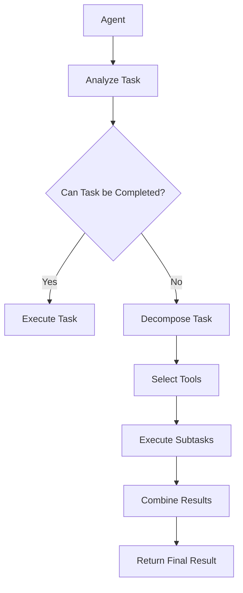

# 【LangChain编程：从入门到实践】大模型技术浪潮

## 1. 背景介绍

### 1.1 人工智能的新时代

人工智能(AI)技术在过去几年里取得了长足的进步,尤其是大型语言模型(Large Language Models,LLMs)的出现,为各行各业带来了革命性的变革。这些模型通过消化海量的文本数据,学习人类语言的模式和知识,从而能够生成高质量、连贯的文本输出,并回答各种复杂的问题。

随着计算能力的不断提升和训练数据的exponentially增长,大型语言模型的性能也在不断提高。例如OpenAI的GPT-3拥有1750亿个参数,展现出惊人的语言生成和理解能力。而最新的GPT-4更是将参数数量提升到一个新的高度,在各种基准测试中表现出色,甚至能够处理复杂的视觉和推理任务。

### 1.2 LangChain的兴起

尽管大型语言模型展现出巨大的潜力,但如何将它们集成到实际应用中,并充分发挥其能力,仍然是一个巨大的挑战。这就催生了LangChain这个强大的框架的诞生。

LangChain是一个用于构建应用程序与语言模型进行交互的Python库。它提供了一系列模块化的构建块,使开发人员能够轻松地组合不同的组件,构建复杂的工作流程。无论是简单的问答系统,还是复杂的自然语言处理(NLP)应用,LangChain都能提供强大的支持。

LangChain的核心理念是将语言模型视为一种"工具",通过将其与其他工具(如数据检索、计算等)相结合,实现更强大的功能。它还提供了一系列实用工具,如代理(Agents)、内存(Memory)和工具(Tools),帮助开发人员构建智能化的应用程序。

### 1.3 本文内容概览

本文将全面介绍LangChain的核心概念、架构和使用方法。我们将从基础知识出发,逐步深入探讨LangChain的各个模块,并通过实际示例展示如何将其应用于实践中。无论您是AI新手还是经验丰富的开发人员,本文都将为您提供宝贵的见解和实用技巧。

让我们一起踏上这段激动人心的LangChain编程之旅,探索大模型技术在各个领域的无限可能性!

## 2. 核心概念与联系

在深入了解LangChain之前,我们先来认识一些核心概念,这些概念贯穿于整个框架之中,是理解和使用LangChain的基础。

### 2.1 语言模型(Language Models)

语言模型是LangChain的核心,它们是经过大规模训练的机器学习模型,能够理解和生成人类语言。常见的语言模型包括GPT-3、GPT-4、BERT、T5等。LangChain支持多种语言模型的集成,让您可以根据需求选择最合适的模型。

### 2.2 代理(Agents)

代理是LangChain中的一个重要概念,它是一种智能系统,能够根据给定的目标和工具,自主地计划和执行任务。代理可以分解复杂的任务,选择合适的工具执行子任务,并将结果整合起来。这种能力使得代理可以完成各种复杂的任务,如问答、任务规划、代码生成等。

代理的工作流程如下所示:



### 2.3 工具(Tools)

工具是LangChain中的另一个关键概念。工具可以是任何能够执行特定任务的函数或API,例如网页抓取、数据库查询、计算等。代理可以根据任务需求,选择和组合不同的工具来完成复杂的任务。

LangChain内置了许多常用工具,如Wikipedia查询、Python REPL、文本拆分等。您也可以轻松地定义和集成自己的自定义工具。

### 2.4 内存(Memory)

内存是LangChain中用于存储代理与人类交互历史的组件。它允许代理记住过去的对话和上下文信息,从而进行更连贯、更有意义的对话。内存可以采用不同的形式,如向量数据库、简单的Python对象等。

通过将内存与代理相结合,我们可以构建具有持续性和上下文感知能力的智能系统。

### 2.5 提示模板(Prompt Templates)

提示模板是LangChain中用于构建提示(Prompts)的工具。提示是指向语言模型输入的指令或问题,它决定了模型的输出。

LangChain提供了多种提示模板,如输入变量模板、条件模板等,使您可以灵活地构建复杂的提示。通过优化提示,您可以获得更好的模型输出质量。

### 2.6 链(Chains)

链是LangChain中用于组合多个组件(如代理、工具、内存等)的机制。它定义了组件之间的交互方式,使您可以构建复杂的工作流程。

LangChain提供了多种预定义的链,如序列链(SequentialChain)、简单链(SimpleChain)等,您也可以根据需求定制自己的链。

通过将上述核心概念组合在一起,LangChain为您提供了一个强大而灵活的框架,用于构建各种智能应用程序。接下来,我们将深入探讨LangChain的核心算法原理和具体操作步骤。

## 3. 核心算法原理具体操作步骤

在前面的章节中,我们已经了解了LangChain的核心概念。现在,让我们深入探讨LangChain的核心算法原理和具体操作步骤。

### 3.1 语言模型的工作原理

语言模型是LangChain的核心,它们是基于深度学习技术训练而成的机器学习模型。这些模型通过消化大量的文本数据,学习语言的模式和知识,从而能够生成连贯、自然的文本输出。

常见的语言模型架构包括:

1. **Transformer模型**: 这是目前最流行的语言模型架构,由Attention机制和自注意力层(Self-Attention Layers)组成。它能够有效地捕捉长距离的语义依赖关系。GPT系列和BERT等模型都基于Transformer架构。

2. **RNN模型**: 循环神经网络(Recurrent Neural Networks, RNNs)是较早的语言模型架构,通过循环连接来处理序列数据。常见的RNN变体包括LSTM和GRU。

3. **CNN模型**: 卷积神经网络(Convolutional Neural Networks, CNNs)最初被广泛应用于计算机视觉领域,但也可以用于处理文本数据。

语言模型的训练过程通常采用自监督学习(Self-Supervised Learning)的方式。模型会在大量的文本语料库上进行预训练,学习语言的统计规律和语义关系。在预训练完成后,这些模型可以通过微调(Fine-tuning)的方式,针对特定的任务和数据集进行进一步的训练。

### 3.2 LangChain的工作流程

LangChain的工作流程可以概括为以下几个步骤:

1. **定义代理(Agent)**: 首先,您需要定义一个代理,它将负责执行任务。代理可以是预定义的,也可以是自定义的。

2. **设置工具(Tools)**: 接下来,您需要为代理提供一组工具,这些工具将被用于执行子任务。工具可以是内置的,也可以是自定义的。

3. **配置内存(Memory)**: 如果需要,您可以为代理配置内存,用于存储对话历史和上下文信息。

4. **构建提示模板(Prompt Templates)**: 根据任务需求,您可以定制提示模板,以优化语言模型的输出质量。

5. **执行任务**: 一旦所有组件就绪,代理就可以开始执行任务了。它会分析任务,选择合适的工具执行子任务,并将结果整合起来。

6. **输出结果**: 最后,代理会将最终结果输出给用户。

下面是一个简单的示例,展示了如何使用LangChain构建一个基本的问答系统:

```python
from langchain import OpenAI, Wikipedia, ConversationChain

# 初始化语言模型
llm = OpenAI(temperature=0)

# 定义Wikipedia工具
wiki = Wikipedia()

# 构建对话链
conversation = ConversationChain(
    llm=llm,
    memory=None,
    prompt=None,
    output_key="result"
)

# 开始对话
while True:
    query = input("Human: ")
    result = conversation.run(input=query, tools=[wiki])
    print(f"AI: {result['result']}")
```

在这个示例中,我们首先初始化了OpenAI的语言模型。然后,我们定义了Wikipedia工具,用于查询相关信息。接下来,我们构建了一个对话链(ConversationChain),它将管理对话流程。

在循环中,我们接受用户的输入,并将其传递给对话链。对话链会根据需要使用Wikipedia工具查询相关信息,并将结果输出给用户。

这只是一个简单的示例,但它展示了LangChain的基本工作流程。在实际应用中,您可以根据需求定制各种组件,构建更加复杂和强大的系统。

### 3.3 代理的决策过程

代理是LangChain中一个非常重要的概念,它负责执行任务并做出决策。代理的决策过程可以概括为以下几个步骤:

1. **任务分析**: 代理首先会分析给定的任务,判断是否可以直接执行。如果任务足够简单,代理会直接执行并返回结果。

2. **任务分解**: 如果任务过于复杂,无法直接执行,代理会将其分解为多个子任务。

3. **工具选择**: 对于每个子任务,代理会从可用的工具集中选择合适的工具来执行。

4. **子任务执行**: 代理会调用选定的工具,并传递必要的参数,执行子任务。

5. **结果整合**: 一旦所有子任务完成,代理会将各个子任务的结果整合起来,形成最终的输出。

6. **输出结果**: 最后,代理会将最终结果输出给用户或其他系统组件。

代理的决策过程可以通过以下伪代码来概括:

```
def agent_decision_process(task):
    if can_execute_task(task):
        return execute_task(task)
    else:
        subtasks = decompose_task(task)
        results = []
        for subtask in subtasks:
            tool = select_tool(subtask)
            result = execute_tool(tool, subtask)
            results.append(result)
        return combine_results(results)
```

在这个伪代码中,`can_execute_task`函数用于判断任务是否可以直接执行。如果可以,则直接调用`execute_task`函数执行任务并返回结果。否则,代理会调用`decompose_task`函数将任务分解为子任务。

对于每个子任务,代理会调用`select_tool`函数选择合适的工具,然后调用`execute_tool`函数执行子任务并获取结果。最后,代理会调用`combine_results`函数将所有子任务的结果整合起来,形成最终的输出。

代理的决策过程是LangChain中一个非常关键的部分,它决定了系统的智能性和灵活性。通过定制代理的行为和决策逻辑,您可以构建出各种复杂的智能系统。

## 4. 数学模型和公式详细讲解举例说明

虽然LangChain主要关注于自然语言处理和任务执行,但在某些情况下,它也需要处理数学公式和模型。在本节中,我们将探讨LangChain如何处理数学公式,以及一些常见的数学模型和公式。

### 4.1 处理数学公式

LangChain提供了一种简单的方式来处理数学公式。您可以使用LaTeX语法在文本中嵌入数学公式,LangChain会自动将其渲染为漂亮的数学符号。

例如,您可以在提示(Prompt)中包含以下LaTeX公式:

```
$$ f(x) = x^2 + 2x + 1 $$
```

LangChain会将其渲染为:

$$ f(x) = x^2 + 2x + 1 $$

这种方式非常直观,