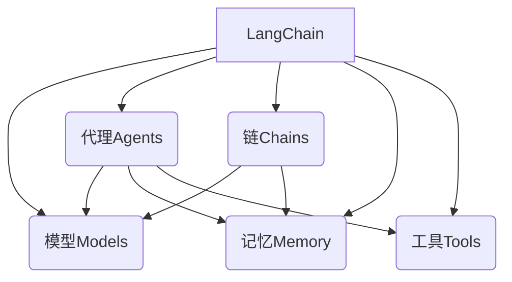
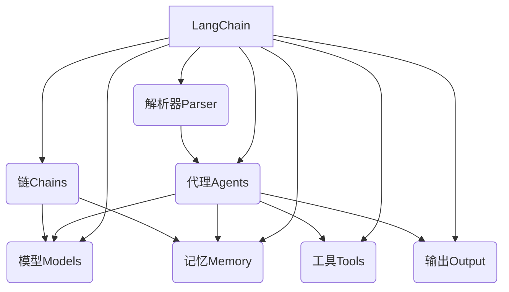

# 【LangChain编程：从入门到实践】大模型接口

## 1.背景介绍

### 1.1 大模型时代的到来

近年来,大型语言模型(Large Language Models, LLMs)在自然语言处理(NLP)领域取得了令人瞩目的进展。这些模型通过在海量文本数据上进行预训练,学习了丰富的语言知识和上下文关联能力,可以生成流畅、连贯、内容丰富的文本输出。

代表性的大模型有 GPT-3、PaLM、ChatGPT 等,它们展现出了强大的文本生成、问答、总结、翻译等能力,在多个领域产生了广泛的影响和应用前景。随着模型规模和性能的不断提升,大模型正在成为推动 AI 发展的重要力量。

### 1.2 LangChain:统一大模型接口

尽管大模型展现出了巨大的潜力,但将它们应用到实际场景中仍然面临诸多挑战。不同的大模型拥有不同的 API 接口,使用方式和参数设置也有所差异,这增加了开发者的学习和集成成本。此外,如何高效利用大模型的能力,结合特定的业务需求,也是一个值得探索的课题。

LangChain 是一个旨在统一大模型接口、简化开发流程的 Python 库。它为常见的大模型提供了统一的接口封装,使开发者可以轻松集成不同的模型。同时,LangChain 还提供了一系列实用的功能模块,如代理(Agents)、记忆(Memory)、工具(Tools)等,帮助开发者构建更加智能和人性化的应用程序。

本文将全面介绍 LangChain 的核心概念、架构和使用方法,并通过实例展示如何利用 LangChain 开发基于大模型的应用程序。无论你是大模型新手还是资深开发者,相信这篇文章都能为你提供有价值的见解和实践经验。

## 2.核心概念与联系

### 2.1 LangChain 核心概念

LangChain 的核心概念包括模型(Models)、代理(Agents)、链(Chains)、记忆(Memory)、工具(Tools)等,它们共同构建了 LangChain 的功能框架。

1. **模型(Models)**:模型是 LangChain 的核心组件,它封装了各种大型语言模型的接口,如 GPT-3、Claude、PaLM 等。LangChain 支持多种模型提供商,如 OpenAI、Anthropic、Cohere 等,开发者可以根据需求选择合适的模型。

2. **代理(Agents)**:代理是 LangChain 中的智能代理,它可以根据特定的目标和工具进行决策和行动。代理通过与模型交互,利用记忆和工具完成复杂的任务。

3. **链(Chains)**:链是一系列预定义的组件序列,用于处理特定的任务流程。例如,问答链(Question Answering Chain)可用于从文本中查找答案;总结链(Summarization Chain)可用于生成文本摘要。

4. **记忆(Memory)**:记忆模块用于存储代理与人类的对话历史、上下文信息等,以保持对话的连贯性和一致性。LangChain 支持多种记忆存储方式,如内存、文件、数据库等。

5. **工具(Tools)**:工具是代理可以调用的外部功能或 API,用于执行特定的任务。例如,搜索工具可用于从互联网查找信息;Python REPL 工具可用于执行 Python 代码。

这些核心概念相互关联,共同构建了 LangChain 的功能框架。开发者可以根据需求,灵活组合和配置这些组件,以构建智能化的应用程序。



### 2.2 LangChain 与大模型的关系

LangChain 并不是一个独立的大型语言模型,而是一个用于简化大模型应用开发的框架。它提供了统一的接口和功能模块,帮助开发者更高效地利用各种大模型的能力。

LangChain 与大模型的关系可以概括为:

- **接口封装**:LangChain 封装了多个大模型提供商(如 OpenAI、Anthropic 等)的 API 接口,使开发者可以使用统一的方式与不同的大模型进行交互。

- **功能增强**:LangChain 提供了代理、链、记忆、工具等功能模块,赋予大模型更强的智能化能力,如任务规划、上下文记忆、外部知识整合等。

- **应用开发**:借助 LangChain,开发者可以更轻松地将大模型集成到实际应用中,构建如问答系统、智能助手、自动化工作流等功能。

因此,LangChain 可以看作是大模型与实际应用之间的桥梁,它降低了大模型应用开发的复杂性,提高了开发效率,同时也扩展了大模型的功能边界。

## 3.核心算法原理具体操作步骤

### 3.1 LangChain 架构概览

LangChain 的架构可以概括为以下几个核心组件:

1. **模型(Model)组件**:负责与不同的大型语言模型(如 GPT-3、Claude 等)进行交互,发送请求并获取响应。

2. **代理(Agent)组件**:代理是 LangChain 的智能控制中心,它根据特定的目标和可用的工具,规划和执行一系列操作,完成复杂的任务。

3. **链(Chain)组件**:链是一系列预定义的组件序列,用于处理特定的任务流程,如问答、总结、文本生成等。

4. **记忆(Memory)组件**:记忆模块用于存储代理与人类的对话历史、上下文信息等,以保持对话的连贯性和一致性。

5. **工具(Tool)组件**:工具是代理可以调用的外部功能或 API,用于执行特定的任务,如搜索、计算、代码执行等。

6. **解析器(Parser)组件**:解析器用于分析和理解用户的输入,将其转换为代理可以理解和处理的格式。

7. **输出(Output)组件**:输出组件负责将代理的响应结果格式化并呈现给用户。

这些组件通过有机的协作,构建了 LangChain 的整体功能框架。下面我们将详细介绍其中的核心算法原理和操作步骤。



### 3.2 代理决策算法

代理(Agent)是 LangChain 中的智能控制中心,它根据特定的目标和可用的工具,规划和执行一系列操作,完成复杂的任务。代理的决策算法是 LangChain 的核心算法之一,它决定了代理如何选择和执行操作。

LangChain 中常用的代理决策算法包括:

1. **零射手(ZeroShotAgent)算法**:零射手算法是最基本的代理决策算法。它将目标和可用工具描述传递给大模型,让模型根据上下文生成操作序列,然后执行这些操作。这种算法简单直观,但可能会受到大模型偏差和局限性的影响。

2. **反馈优化(ReAct)算法**:反馈优化算法是一种基于强化学习的算法。它通过不断尝试不同的操作序列,并根据反馈调整策略,最终找到最优的操作序列。这种算法可以更好地处理复杂任务,但需要更多的计算资源和训练时间。

3. **构造性搜索(ConstituentSearch)算法**:构造性搜索算法将任务分解为多个子任务,然后递归地解决每个子任务,最终组合成完整的解决方案。这种算法适用于可分解的复杂任务,但需要合理的任务分解策略。

4. **基于规则的算法**:除了上述算法,LangChain 还支持基于规则的算法,允许开发者根据特定的业务逻辑定制代理的决策过程。

无论采用何种算法,代理的决策过程通常包括以下几个步骤:

1. 观察当前状态,包括目标、可用工具、记忆等信息。
2. 根据算法生成可能的操作序列。
3. 执行操作序列,获取结果。
4. 根据结果和反馈,更新状态和决策策略。
5. 重复上述步骤,直到达成目标或终止条件。

通过这种决策算法,代理可以智能地规划和执行操作,完成复杂的任务。开发者可以根据具体场景选择合适的算法,或者定制自己的算法,以获得更好的性能和效果。

### 3.3 链式任务处理

链(Chain)是 LangChain 中用于处理特定任务流程的组件序列。它将多个组件(如模型、工具、记忆等)按照预定义的顺序连接起来,形成一个完整的任务处理管道。

链式任务处理的核心算法步骤如下:

1. **初始化链**:根据任务类型和需求,选择合适的链类型(如问答链、总结链等),并初始化链对象。

2. **配置组件**:为链中的每个组件配置必要的参数,如模型选择、工具列表、记忆存储方式等。

3. **输入数据**:将需要处理的数据(如文本、查询等)作为输入传递给链的起始组件。

4. **链式执行**:链中的每个组件按照预定义的顺序依次执行,上一个组件的输出作为下一个组件的输入。

5. **中间处理**:在执行过程中,链可以根据需要进行中间处理,如记忆存储、工具调用、模型查询等。

6. **输出结果**:最后一个组件的输出即为整个链的最终结果。

链式任务处理的优点在于它将复杂的任务分解为多个可组合的步骤,每个步骤由专门的组件处理,从而提高了任务处理的模块化和可扩展性。同时,链还可以灵活地插入中间处理逻辑,如记忆、工具调用等,增强了任务处理的智能化能力。

LangChain 提供了多种预定义的链类型,如问答链(Question Answering Chain)、总结链(Summarization Chain)、文本生成链(Text Generation Chain)等,开发者可以直接使用或自定义链来满足特定的需求。

下面是一个使用问答链处理问答任务的示例:

```python
from langchain.chains import QAWithSourcesChain
from langchain.llms import OpenAI

# 初始化链
chain = QAWithSourcesChain(llm=OpenAI(), chain_type="stuff")

# 输入数据
docs = ["Artificial intelligence is the simulation of human intelligence processes by machines, especially computer systems."]
question = "What is artificial intelligence?"

# 执行链
result = chain({"input_documents": docs, "question": question}, return_only_outputs=True)

print(result['result'])
```

在这个示例中,我们首先初始化了一个问答链,并配置了 OpenAI 模型作为链中的语言模型组件。然后,我们将文档和问题作为输入传递给链。链会依次执行内部的组件,最终输出问题的答案。

通过链式任务处理,LangChain 简化了复杂任务的开发流程,提高了代码的可读性和可维护性,同时也增强了任务处理的智能化能力。

## 4.数学模型和公式详细讲解举例说明

在 LangChain 中,数学模型和公式主要体现在代理决策算法和链式任务处理的实现上。下面我们将详细讲解其中涉及的一些数学模型和公式。

### 4.1 马尔可夫决策过程(MDP)

代理的决策算法可以建模为一个马尔可夫决策过程(Markov Decision Process, MDP)。MDP 是一种用于描述序列决策问题的数学框架,它包括以下几个要素:

- 状态集合 $S$:代表代理可能处于的所有状态。
- 动作