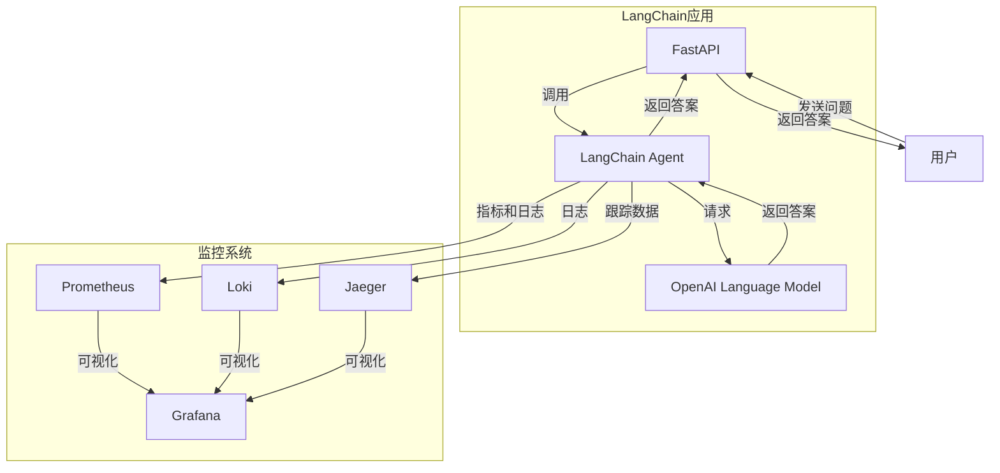

# 【LangChain编程：从入门到实践】应用监控

## 1. 背景介绍

随着人工智能和自然语言处理技术的快速发展,越来越多的企业开始将这些技术应用于生产环境中。LangChain是一个强大的Python库,旨在帮助开发人员构建可扩展的人工智能应用程序。它提供了一种模块化的方式来组合各种组件,如语言模型、知识库和其他数据源,从而创建复杂的工作流程。

在生产环境中部署LangChain应用程序时,监控其性能和行为至关重要。有效的监控可以帮助您及时发现并解决潜在问题,确保应用程序的稳定性和可靠性。本文将深入探讨如何监控LangChain应用程序,包括监控指标、日志记录、分布式跟踪等方面。

### 1.1 LangChain应用程序监控的重要性

监控是确保LangChain应用程序健康运行的关键。以下是一些监控的主要好处:

1. **性能优化**: 通过监控系统资源利用率、延迟和吞吐量等指标,可以识别瓶颈并优化性能。
2. **故障排查**: 当出现问题时,监控数据可以帮助快速定位根本原因。
3. **容量规划**: 通过分析历史数据,可以更好地预测未来需求并进行容量规划。
4. **成本优化**: 监控可以帮助您识别资源浪费,从而优化成本。

### 1.2 LangChain应用程序监控的挑战

尽管监控LangChain应用程序具有重要意义,但也存在一些挑战:

1. **复杂性**: LangChain应用程序通常涉及多个组件,如语言模型、知识库和外部API,增加了监控的复杂性。
2. **数据隐私**: 由于LangChain应用程序可能处理敏感数据,因此需要确保监控数据不会泄露这些信息。
3. **可观察性**: 由于LangChain应用程序的分布式和异步特性,跟踪请求的完整生命周期可能具有挑战性。

## 2. 核心概念与联系

在监控LangChain应用程序时,需要关注以下几个核心概念:

### 2.1 指标 (Metrics)

指标是描述系统状态和性能的数字数据。常见的指标包括:

- **系统指标**: CPU利用率、内存使用、磁盘I/O等。
- **应用程序指标**: 请求率、延迟、错误率等。
- **业务指标**: 特定于应用程序的指标,如生成的文本质量分数。

收集和分析这些指标可以帮助您了解系统的整体健康状况,并及时发现潜在问题。

### 2.2 日志 (Logs)

日志记录应用程序的事件和状态,提供了对系统行为的洞察。在LangChain应用程序中,日志可以包括:

- 请求和响应详情
- 异常和错误信息
- 调试信息
- 审计跟踪

通过分析日志,您可以更好地了解系统的运行情况,并进行故障排查和问题调试。

### 2.3 分布式跟踪 (Distributed Tracing)

LangChain应用程序通常由多个分布式组件组成,每个组件都可能依赖于其他服务。分布式跟踪有助于可视化整个请求的生命周期,跨越多个服务和进程边界。

通过分布式跟踪,您可以:

- 了解请求是如何在不同组件之间流动的
- 识别延迟的根源
- 发现系统瓶颈
- 分析错误和异常的来源

### 2.4 可观察性 (Observability)

可观察性是指从外部观察系统内部状态的能力。它结合了指标、日志和分布式跟踪,为您提供了全面了解系统行为的方式。

通过提高可观察性,您可以:

- 主动发现和诊断问题
- 深入了解系统的运行情况
- 做出数据驱动的决策
- 提高系统的可靠性和稳定性

## 3. 核心算法原理具体操作步骤

监控LangChain应用程序涉及以下几个关键步骤:

### 3.1 指标收集

收集相关指标是监控的第一步。您可以使用各种工具和库来收集系统指标和应用程序指标。以下是一些常见的选择:

- **Prometheus**: 一个开源的系统监控和警报工具包,支持多种指标收集方式。
- **Micrometer**: 一个供应商中立的应用程序指标收集框架,与Spring Boot等框架集成。
- **OpenTelemetry**: 一个用于指标、日志和分布式跟踪的开源观测工具。

收集指标的具体步骤如下:

1. 选择合适的指标收集工具或库。
2. 在应用程序代码中集成指标收集器,记录感兴趣的指标。
3. 配置指标收集器,设置指标的命名空间、标签等元数据。
4. 将指标数据推送到指标存储系统,如Prometheus或InfluxDB。

### 3.2 日志记录

良好的日志记录实践对于监控LangChain应用程序至关重要。以下是一些日志记录的最佳实践:

1. **使用结构化日志**: 结构化日志比传统的文本日志更易于处理和分析。
2. **记录关键事件**: 记录请求、响应、异常、警告等关键事件。
3. **添加上下文信息**: 包括请求ID、用户ID、跟踪ID等上下文信息,以便进行关联和追踪。
4. **使用适当的日志级别**: 将日志分为不同的级别,如DEBUG、INFO、WARNING和ERROR,以便于过滤和分析。
5. **集中式日志管理**: 将日志从多个源收集到一个中央位置,以便于查询和分析。

一些常用的日志记录工具包括:

- **Logback** (Java)
- **log4j** (Java)
- **logging** (Python)

### 3.3 分布式跟踪

对于分布式LangChain应用程序,分布式跟踪是一个必不可少的监控组件。以下是实现分布式跟踪的基本步骤:

1. **选择分布式跟踪工具**: 常见的选择包括Jaeger、Zipkin和AWS X-Ray。
2. **在应用程序中集成跟踪库**: 使用OpenTelemetry或供应商特定的库,如Jaeger客户端。
3. **生成跟踪数据**: 在应用程序代码中生成跨度(Span)和跟踪(Trace)数据。
4. **传播跟踪上下文**: 在分布式组件之间传播跟踪上下文,以关联跨度。
5. **收集和可视化跟踪数据**: 将跟踪数据发送到跟踪后端,并使用可视化工具进行分析。

### 3.4 监控可视化和警报

收集了指标、日志和跟踪数据后,您需要一种方式来可视化和分析这些数据。以下是一些常见的方法:

1. **Grafana**: 一个开源的数据可视化和监控工具,支持多种数据源。
2. **Kibana**: Elastic Stack的一部分,用于可视化和分析日志数据。
3. **Jaeger UI**: Jaeger的Web UI,用于可视化分布式跟踪数据。

除了可视化,您还需要设置警报规则,以便在出现异常情况时及时通知相关人员。常见的警报工具包括:

- **Prometheus Alertmanager**
- **PagerDuty**
- **OpsGenie**

## 4. 数学模型和公式详细讲解举例说明

在监控LangChain应用程序时,您可能需要使用一些数学模型和公式来计算和分析指标。以下是一些常见的例子:

### 4.1 服务级别指标 (SLI/SLO)

服务级别指标 (SLI) 和服务级别目标 (SLO) 是衡量服务可用性和性能的重要指标。

**可用性 SLI**:

$$
可用性 = \frac{成功请求数}{总请求数}
$$

**延迟 SLI**:

$$
延迟 = \sum_{i=1}^{n} \frac{请求响应时间_i}{n}
$$

其中 $n$ 是请求总数。

基于这些 SLI,您可以设置 SLO,例如:

- 可用性 SLO: 99.9%
- 延迟 SLO: 95% 的请求响应时间小于 500 毫秒

### 4.2 指数加权移动平均 (EWMA)

指数加权移动平均 (EWMA) 是一种计算指标平滑值的方法,它给予最近的观测值更高的权重。EWMA 常用于监控延迟和错误率等指标。

$$
EWMA_t = \alpha \times value_t + (1 - \alpha) \times EWMA_{t-1}
$$

其中 $\alpha$ 是平滑因子 (0 < $\alpha$ < 1),决定了新观测值对平均值的影响程度。$\alpha$ 值越大,新观测值的权重越高。

### 4.3 异常检测

异常检测是监控的一个重要方面,旨在发现数据中的异常模式。常见的异常检测算法包括:

- **三sigma法则**: 如果一个数据点偏离均值超过三个标准差,则被视为异常。
- **机器学习模型**: 使用机器学习算法 (如隔离森林、一类 SVM 等) 来识别异常。

例如,使用三sigma法则检测延迟异常:

$$
\begin{aligned}
\mu &= \frac{1}{n}\sum_{i=1}^{n}x_i \\
\sigma &= \sqrt{\frac{1}{n}\sum_{i=1}^{n}(x_i - \mu)^2} \\
x_i &\text{ is an anomaly if } |x_i - \mu| > 3\sigma
\end{aligned}
$$

其中 $\mu$ 是均值, $\sigma$ 是标准差。

## 5. 项目实践: 代码实例和详细解释说明

在本节中,我们将通过一个示例项目来演示如何监控 LangChain 应用程序。该项目是一个简单的问答系统,使用 LangChain 和 OpenAI 的语言模型来回答用户的问题。

### 5.1 项目架构



该系统由以下几个主要组件组成:

- **FastAPI**: 一个用于构建 Web API 的 Python 框架,用于接收用户的问题并返回答案。
- **LangChain Agent**: 使用 LangChain 库与 OpenAI 语言模型进行交互,生成问题的答案。
- **OpenAI 语言模型**: 一个由 OpenAI 提供的大型语言模型,用于生成自然语言响应。
- **Prometheus**: 一个开源的系统监控和警报工具包,用于收集应用程序指标。
- **Loki**: 一个水平可扩展的日志聚合系统,用于收集和存储应用程序日志。
- **Jaeger**: 一个开源的分布式跟踪系统,用于收集和可视化跟踪数据。
- **Grafana**: 一个开源的数据可视化和监控工具,用于可视化指标、日志和跟踪数据。

### 5.2 指标收集

在本示例中,我们使用 Prometheus 来收集应用程序指标。首先,我们需要在 LangChain Agent 中集成 Prometheus 客户端库。

```python
from prometheus_client import start_http_server, Counter, Histogram

# 创建指标
REQUEST_COUNT = Counter('langchain_request_count', 'Total number of requests')
REQUEST_LATENCY = Histogram('langchain_request_latency_seconds', 'Request latency in seconds')

# 启动 Prometheus 