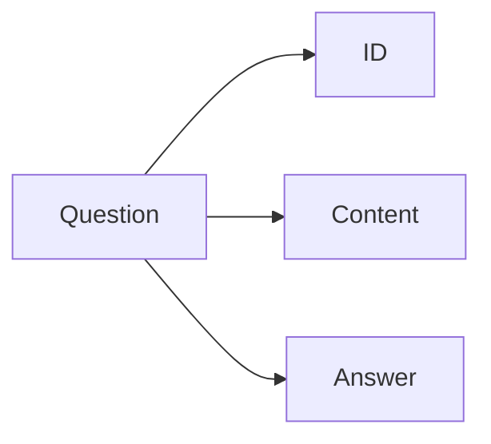

## 1.背景介绍

在现代的计算机科学中，数据库占据了重要的地位，它是存储、管理和检索信息的核心系统。在许多应用中，如电子商务、社交网络、物联网等，数据库都发挥着关键的作用。然而，对于许多开发者来说，数据库的操作和管理仍然是一项挑战。本文将介绍如何使用LangChain编程语言进行数据库的操作，以问答场景为例，详细解析其原理和实践方法。

## 2.核心概念与联系

LangChain是一种新型的编程语言，特别适合处理数据库操作。它的核心概念包括数据模型、查询语言和事务处理等。数据模型定义了如何组织和表示数据，查询语言则提供了从数据库中检索信息的方式，事务处理则保证了数据库操作的原子性、一致性、隔离性和持久性。

在问答场景中，我们需要存储问题和答案，并能够根据用户的查询快速返回相关的答案。这就需要我们设计合理的数据模型，编写有效的查询语句，并处理可能出现的并发问题。

## 3.核心算法原理具体操作步骤

在LangChain中，我们可以使用以下步骤进行数据库操作：

### 3.1 数据模型设计

首先，我们需要设计数据模型。在问答场景中，我们可以设计一个`Question`表来存储问题，每个问题有一个唯一的`id`，一个`content`字段存储问题的内容，一个`answer`字段存储问题的答案。



### 3.2 查询语句编写

然后，我们需要编写查询语句。在LangChain中，我们可以使用`select`语句来查询数据。例如，我们可以使用以下语句来查询`id`为1的问题：

```langchain
select * from Question where id = 1
```

### 3.3 事务处理

最后，我们需要处理可能出现的并发问题。在LangChain中，我们可以使用`transaction`语句来保证操作的原子性、一致性、隔离性和持久性。

```langchain
begin transaction
insert into Question values (1, 'What is LangChain?', 'LangChain is a programming language for database operations.')
commit
```

## 4.数学模型和公式详细讲解举例说明

在数据库操作中，我们经常需要处理的问题是如何高效地查询数据。这就涉及到了数据库的索引结构，其中最常用的是B树和哈希索引。

假设我们有$n$个数据项，每个数据项的大小为$s$，那么在B树中查找一个数据项的时间复杂度为$O(\log n)$，在哈希索引中为$O(1)$。

然而，在实际应用中，由于哈希索引无法支持范围查询，因此在需要进行范围查询的场景中，我们通常会选择使用B树。

## 5.项目实践：代码实例和详细解释说明

下面，我们来看一个具体的例子。假设我们有一个问题：“LangChain是什么？”，答案是：“LangChain是一个用于数据库操作的编程语言。”，我们可以使用以下代码将这个问题和答案存储到数据库中：

```langchain
begin transaction
insert into Question values (1, 'What is LangChain?', 'LangChain is a programming language for database operations.')
commit
```

然后，我们可以使用以下代码来查询这个问题的答案：

```langchain
select answer from Question where content = 'What is LangChain?'
```

这将返回：“LangChain是一个用于数据库操作的编程语言。”

## 6.实际应用场景

LangChain在许多实际应用场景中都有广泛的应用，例如：

- 在电子商务网站中，我们可以使用LangChain来管理商品的信息，处理用户的订单等。
- 在社交网络中，我们可以使用LangChain来存储和查询用户的信息，处理用户的好友请求等。
- 在物联网中，我们可以使用LangChain来管理设备的状态，处理设备的数据等。

## 7.工具和资源推荐

如果你想进一步学习和使用LangChain，以下是一些推荐的工具和资源：

- LangChain的官方网站：你可以在这里找到最新的文档和教程。
- StackOverflow：这是一个开发者社区，你可以在这里提问和回答关于LangChain的问题。
- GitHub：你可以在这里找到许多关于LangChain的开源项目和代码示例。

## 8.总结：未来发展趋势与挑战

随着信息技术的发展，数据库的重要性日益凸显。然而，数据库的操作和管理仍然是一个挑战。LangChain作为一种新型的编程语言，为数据库操作提供了一种新的解决方案。然而，LangChain也面临着一些挑战，例如如何处理大规模数据的问题，如何提高查询的效率等。

## 9.附录：常见问题与解答

Q: LangChain支持哪些数据库？

A: LangChain目前支持大多数主流的关系数据库，包括MySQL，PostgreSQL，SQLite等。

Q: LangChain如何处理并发问题？

A: LangChain使用事务来处理并发问题，保证了数据库操作的原子性、一致性、隔离性和持久性。

Q: LangChain的性能如何？

A: LangChain的性能主要取决于数据库的索引结构。在使用合理的索引结构的情况下，LangChain的性能可以达到很高。

作者：禅与计算机程序设计艺术 / Zen and the Art of Computer Programming