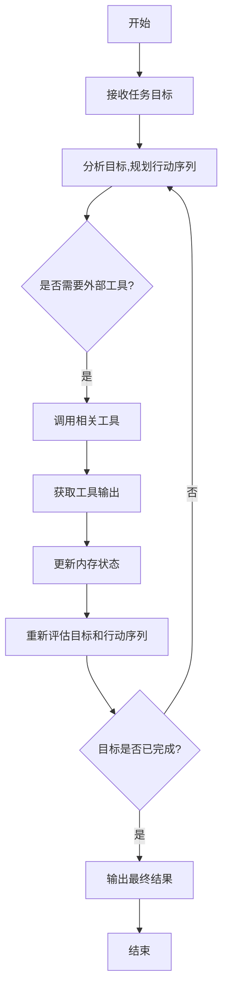

# 【大模型应用开发 动手做AI Agent】LangChain中的工具和工具包

## 1.背景介绍

### 1.1 大模型时代的到来

近年来,大型语言模型(Large Language Models, LLMs)在自然语言处理领域取得了令人瞩目的成就。这些模型通过在海量文本数据上进行预训练,学习到了丰富的语言知识和上下文理解能力,展现出惊人的生成性和理解性能力。

代表性的大模型有 GPT-3、PaLM、ChatGPT 等,它们能够生成看似人类水平的文本输出,在问答、写作、编程等多个领域表现出色。大模型时代的到来,为人工智能应用开发带来了全新的机遇和挑战。

### 1.2 LangChain:构建大模型应用的工具

为了更好地利用大模型的强大能力,需要围绕它们构建应用程序和工作流。LangChain 是一个用于构建大模型应用程序的Python库,它提供了一系列模块化的工具和组件,帮助开发者高效地集成大模型,并与外部数据源和其他系统进行交互。

LangChain 的核心理念是将大模型视为一个"工具",通过组合不同的工具链(Chains)、代理(Agents)、内存(Memory)等组件,开发出功能强大且可控的应用程序。无论是构建问答系统、自动化写作助手,还是开发定制化的语言智能应用,LangChain 都为开发者提供了强有力的支持。

## 2.核心概念与联系

### 2.1 LLM(Large Language Model)

LLM 是 LangChain 中最核心的概念,它指的是大型语言模型,如 GPT-3、PaLM 等。LangChain 支持多种 LLM 提供商,包括 OpenAI、Anthropic、Cohere 等,开发者可以根据需求选择合适的模型。

LLM 在 LangChain 中扮演着"智能大脑"的角色,负责根据输入生成相应的输出。但 LLM 本身只是一个"黑盒",需要通过其他组件来控制它的行为和输出。

### 2.2 Prompt

Prompt 是与 LLM 进行交互的关键。它是一段用自然语言表述的指令,告诉 LLM 我们期望它执行什么任务。合理设计 Prompt 对于获得高质量的输出至关重要。

LangChain 提供了多种 Prompt 模板和工具,帮助开发者构建高效的 Prompt。例如,可以使用 `PromptTemplate` 定义带有占位符的 Prompt 模板,然后使用 `FewShotPromptTemplate` 提供示例输入输出对,指导 LLM 学习任务。

### 2.3 Chains

Chains 是 LangChain 中的核心概念之一。它将 LLM 与其他组件(如 Prompt、工具等)连接起来,形成一个可复用的工作流程。通过链式调用不同的组件,开发者可以构建出复杂的应用程序逻辑。

LangChain 提供了多种预定义的 Chains,如 `LLMChain`、`ConversationChain`、`SequentialChain` 等,也支持开发者自定义 Chains。Chains 的模块化设计使得应用程序的构建和维护变得更加灵活和可扩展。

### 2.4 Agents

Agents 是 LangChain 中一种特殊的 Chains,它赋予 LLM 一定的"智能"和"自主性"。与传统的 Chains 不同,Agents 能够根据当前状态和目标,自主地计划和执行一系列行动(Actions)来完成任务。

Agents 的核心思想是将复杂任务分解为一系列较小的步骤,并利用 LLM 的推理能力来规划和选择合适的 Actions。这种"分而治之"的方法使得 Agents 能够处理更加复杂的任务,展现出更高级别的智能行为。

### 2.5 Tools

Tools 是 Agents 可以调用的外部功能模块,它们为 LLM 提供了与外部世界交互的能力。Tools 可以是各种形式,如 Web 搜索、数据库查询、文件操作等。

通过将 Tools 集成到 Agents 中,开发者可以赋予 LLM 获取和操作外部数据的能力,从而大大扩展其应用场景。LangChain 提供了一些预定义的 Tools,如 `Wikipedia`、`Wolfram Alpha` 等,同时也支持自定义 Tools。

### 2.6 Memory

Memory 是 LangChain 中用于存储和管理上下文信息的组件。在进行对话或执行多步骤任务时,Memory 可以帮助 LLM 记住之前的交互历史和中间结果,从而保持对话的连贯性和任务的一致性。

LangChain 支持多种 Memory 类型,如 `ConversationBufferMemory`、`ConversationEntityMemory` 等。开发者可以根据应用场景选择合适的 Memory 实现,或者自定义 Memory 来满足特殊需求。

上述概念相互关联,共同构建了 LangChain 的核心框架。通过灵活组合这些模块化组件,开发者可以构建出各种功能强大且可控的大模型应用程序。

## 3.核心算法原理具体操作步骤

LangChain 的核心算法原理主要体现在 Agents 的工作机制上。Agents 通过将复杂任务分解为一系列较小的步骤,并利用 LLM 的推理能力来规划和选择合适的 Actions,从而展现出更高级别的智能行为。

以下是 Agents 的工作流程:

1. **接收任务目标**:Agent 首先接收到用户指定的任务目标,这个目标通常是一个自然语言描述。

2. **分析目标,规划行动序列**:Agent 利用 LLM 的推理能力,分析任务目标的含义和要求,并规划出一系列潜在的行动步骤来完成该目标。这些行动步骤可能包括调用外部工具、进行中间计算、查询知识库等。

3. **判断是否需要外部工具**:对于某些行动步骤,Agent 可能需要调用外部工具来获取所需的信息或执行特定的操作。如果当前步骤需要外部工具,则进入下一步;否则,直接跳转到重新评估目标和行动序列的步骤。

4. **调用相关工具**:如果当前步骤需要外部工具,Agent 会从可用的工具集合中选择合适的工具,并调用该工具执行相应的操作。

5. **获取工具输出**:Agent 获取工具执行的输出结果,这些结果可能是文本、数据或其他形式的信息。

6. **更新内存状态**:Agent 将工具的输出结果存储到内存中,以保持任务执行的连续性和一致性。

7. **重新评估目标和行动序列**:根据工具的输出结果和当前的内存状态,Agent 重新评估任务目标是否已经完成,如果还未完成,则重新规划剩余的行动步骤。

8. **判断目标是否已完成**:如果任务目标已经完成,则Agent 将输出最终结果;否则,回到第3步,继续执行下一个行动步骤。

9. **输出最终结果**:当所有行动步骤都执行完毕,任务目标达成后,Agent 将最终结果输出给用户。

通过上述迭代式的分解-规划-执行-评估过程,Agents 能够灵活地利用 LLM 的推理能力和外部工具的功能,逐步完成复杂的任务。这种"分而治之"的方法使得 Agents 展现出更高级别的智能行为,超越了单一 LLM 的能力范围。

## 4.数学模型和公式详细讲解举例说明

在 LangChain 中,数学模型和公式主要体现在 LLM 的内部机制上。LLM 是基于深度学习技术训练而来的,其核心是一种叫做 Transformer 的神经网络架构。

Transformer 架构的核心思想是利用自注意力(Self-Attention)机制来捕捉输入序列中的长程依赖关系。自注意力机制能够让每个输出位置都关注到整个输入序列的信息,从而更好地建模序列数据。

### 4.1 自注意力机制

自注意力机制的数学表示如下:

$$
\text{Attention}(Q, K, V) = \text{softmax}\left(\frac{QK^T}{\sqrt{d_k}}\right)V
$$

其中:

- $Q$ 是查询(Query)矩阵,表示当前位置需要关注的信息
- $K$ 是键(Key)矩阵,表示整个输入序列的信息
- $V$ 是值(Value)矩阵,表示需要更新的目标信息
- $d_k$ 是缩放因子,用于防止点积过大导致梯度消失

通过计算查询 $Q$ 与每个键 $K$ 的相似性得分,然后对这些得分进行 softmax 归一化,最终得到一个注意力分布。将注意力分布与值矩阵 $V$ 相乘,即可获得当前位置关注到的全局信息表示。

### 4.2 多头注意力机制

为了进一步提高表示能力,Transformer 采用了多头注意力(Multi-Head Attention)机制,将注意力分成多个子空间,每个子空间单独计算注意力,最后将所有子空间的结果拼接起来:

$$
\text{MultiHead}(Q, K, V) = \text{Concat}(head_1, \dots, head_h)W^O
$$
$$
\text{where } head_i = \text{Attention}(QW_i^Q, KW_i^K, VW_i^V)
$$

其中 $W_i^Q$、$W_i^K$、$W_i^V$ 和 $W^O$ 都是可学习的线性变换矩阵,用于将查询、键、值和多头注意力结果进行投影。

通过多头注意力机制,Transformer 能够从不同的子空间捕捉到输入序列的不同特征,从而提高模型的表示能力。

### 4.3 Transformer 编码器和解码器

Transformer 架构由编码器(Encoder)和解码器(Decoder)两个主要部分组成。

编码器的作用是将输入序列编码为一系列向量表示,捕捉输入序列的上下文信息。编码器由多个相同的编码器层堆叠而成,每个编码器层包含了多头自注意力子层和前馈神经网络子层。

解码器的作用是根据编码器的输出和目标序列生成最终的输出序列。解码器由多个相同的解码器层堆叠而成,每个解码器层包含了两个多头注意力子层(一个用于捕捉目标序列的自注意力,另一个用于关注编码器输出)和一个前馈神经网络子层。

通过编码器-解码器的架构,Transformer 能够有效地建模输入和输出序列之间的映射关系,实现序列到序列(Sequence-to-Sequence)的任务,如机器翻译、文本生成等。

### 4.4 预训练和微调

LLM 通常是在大规模无标注语料库上进行预训练得到的。预训练过程中,模型学习到了丰富的语言知识和上下文理解能力。

对于特定的下游任务,我们需要在预训练模型的基础上进行微调(Fine-tuning),使模型的参数进一步优化,以更好地适应该任务的特征。

微调过程中,通常会在预训练模型的最后一层添加一个特定的输出层,用于生成下游任务所需的输出(如分类标签、生成序列等)。然后,在带标注的下游任务数据集上,对整个模型(包括预训练部分和新添加的输出层)进行端到端的训练,更新模型参数。

通过预训练和微调的两阶段训练策略,LLM 能够在保留通用语言知识的同时,针对特定任务进行专门的优化,展现出强大的泛化能力。

以上是 