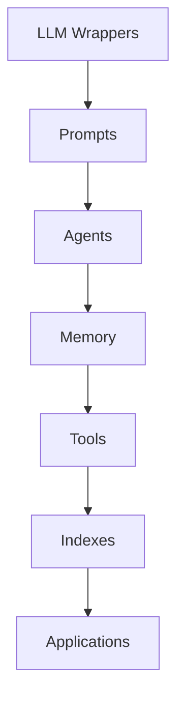

# 【大模型应用开发 动手做AI Agent】何谓LangChain

## 1.背景介绍

### 1.1 大模型时代的到来

近年来,人工智能领域取得了长足的进步,尤其是大型语言模型(Large Language Models, LLMs)的出现,为人工智能应用开发带来了革命性的变化。LLMs通过在海量文本数据上进行预训练,学习到了丰富的自然语言知识和能力,可以用于多种自然语言处理任务,如问答、文本生成、摘要、翻译等。

代表性的LLMs包括OpenAI的GPT系列(GPT-3)、Google的LaMDA、DeepMind的Chinchilla、以及最近的PaLM、ChatGPT等。这些大模型拥有数十亿甚至上百亿的参数量,在自然语言理解和生成方面展现出了惊人的能力,引发了学术界和工业界的广泛关注。

### 1.2 LLMs应用开发的挑战

尽管LLMs展现出了强大的语言能力,但将其应用于实际场景并非易事。主要挑战包括:

1. **模型访问**:获取LLMs的API访问权限并非易事,需要付费或与模型提供商建立合作关系。
2. **模型调用**:直接调用LLMs的API进行推理通常需要编写复杂的代码,涉及请求构建、响应解析等步骤。
3. **任务定制**:LLMs经过通用预训练,需要针对特定任务进行进一步的微调(fine-tuning)或提示学习(prompt learning)。
4. **多模型集成**:实际应用中可能需要集成多个LLMs以及其他AI模型(如计算机视觉模型),增加了系统的复杂性。
5. **模型评估**:评估LLMs输出的质量和可靠性是一个挑战,需要专门的评估策略。

针对上述挑战,需要一种统一的框架和工具链,简化LLMs应用开发的流程,提高开发效率。LangChain就是为解决这一需求而诞生的开源项目。

## 2.核心概念与联系

### 2.1 LangChain概述

LangChain是一个用于构建大型语言模型(LLMs)应用程序的Python库。它旨在简化LLMs的访问、使用和迭代,使开发人员能够快速构建可扩展的LLMs应用程序,同时保持代码的简洁性和可维护性。

LangChain的核心理念是将LLMs视为"组件",并提供了一系列模块化的构建块,用于构建复杂的应用程序流程。这些构建块包括:

- **LLM包装器(Wrappers)**:用于与不同LLMs(如GPT-3、Claude等)的API进行交互。
- **Prompts**:用于构建提示(Prompts),以指导LLMs完成特定任务。
- **Agents**:基于LLMs构建智能代理,用于执行复杂的多步骤任务。
- **Memory**:用于为LLMs提供上下文信息和记忆能力。
- **工具(Tools)**:用于集成外部工具和API,扩展LLMs的功能。
- **索引(Indexes)**:用于构建语义搜索和问答系统。

通过组合和链接这些构建块,开发人员可以快速构建各种LLMs应用程序,如智能助手、问答系统、自动化工作流等。

### 2.2 LangChain架构概览

LangChain的整体架构可以概括为以下几个核心组件:



1. **LLM Wrappers**: 提供对各种LLMs(如GPT-3、Claude等)的访问和调用接口。
2. **Prompts**: 用于构建提示(Prompts),指导LLMs完成特定任务。
3. **Agents**: 基于LLMs构建智能代理,用于执行复杂的多步骤任务。
4. **Memory**: 为LLMs提供上下文信息和记忆能力,以维持对话状态。
5. **Tools**: 集成外部工具和API,扩展LLMs的功能,如文件操作、Web搜索等。
6. **Indexes**: 构建语义搜索和问答系统,基于文档数据构建索引。
7. **Applications**: 最终的应用程序,如智能助手、问答系统、自动化工作流等。

这些组件可以灵活组合,构建出各种复杂的LLMs应用程序。LangChain还提供了一些预构建的Agents,如conversational-react-description等,可以直接使用或进行定制。

## 3.核心算法原理具体操作步骤

### 3.1 LLM Wrappers

LangChain提供了多个LLM Wrappers,用于与不同LLM提供商的API进行交互。常用的Wrappers包括:

- `OpenAI`: 用于访问OpenAI的GPT-3等模型。
- `Anthropic`: 用于访问Anthropic的Claude等模型。
- `Cohere`: 用于访问Cohere的NLP模型。
- `HuggingFaceHub`: 用于访问HuggingFace Hub上的各种预训练模型。
- `LlamaCpp`: 用于访问本地部署的LLaMA模型。

使用Wrappers的基本步骤如下:

1. 导入相应的Wrapper类。
2. 创建Wrapper实例,提供必要的认证信息(如API密钥)。
3. 调用Wrapper的`call`方法,传入提示文本,获取LLM的输出。

以OpenAI的GPT-3为例:

```python
from langchain.llms import OpenAI

# 创建OpenAI Wrapper实例
llm = OpenAI(model_name="text-davinci-003", openai_api_key="YOUR_API_KEY")

# 调用LLM
output = llm("请给我一个Python列表排序的例子")
print(output)
```

### 3.2 Prompts

Prompts是指导LLMs完成特定任务的提示信息。LangChain提供了多种Prompt构建方式,包括:

- **PromptTemplate**: 使用模板字符串构建Prompts。
- **FewShotPromptTemplate**: 使用少量示例(Few-Shot)构建Prompts。
- **PromptTemplateFromExamples**: 从示例输入输出对构建Prompts。

以PromptTemplate为例:

```python
from langchain.prompts import PromptTemplate

# 定义Prompt模板
prompt = PromptTemplate(
    input_variables=["food"],
    template="我最喜欢吃{food}了。它真的很美味!"
)

# 使用模板生成Prompt
prompt_str = prompt.format(food="披萨")
print(prompt_str)
```

输出:

```
我最喜欢吃披萨了。它真的很美味!
```

### 3.3 Agents

Agents是基于LLMs构建的智能代理,用于执行复杂的多步骤任务。LangChain提供了多种预构建的Agent,如:

- **ZeroShotAgent**: 零示例Agent,根据任务描述自主规划和执行。
- **ConversationalAgent**: 对话式Agent,维持对话上下文和记忆。
- **ReActAgent**: 基于React描述执行任务的Agent。

以ConversationalAgent为例:

```python
from langchain.agents import ConversationalAgent, Tool
from langchain.memory import ConversationBufferMemory

# 定义Tools
tools = [
    Tool(
        name="Wikipedia",
        func=lambda q: f"Wikipedia结果: {q}",
        description="用于访问Wikipedia搜索结果"
    )
]

# 创建内存
memory = ConversationBufferMemory(memory_key="chat_history")

# 创建Agent
agent = ConversationalAgent(llm=llm, tools=tools, memory=memory)

# 与Agent交互
agent.run("请告诉我Python列表排序的方法")
```

Agent会根据任务描述自主选择和调用相关Tools,并维持对话上下文和记忆。

### 3.4 Memory

Memory用于为LLMs提供上下文信息和记忆能力,以维持对话状态。LangChain提供了多种Memory实现,包括:

- **ConversationBufferMemory**: 缓存对话历史记录。
- **ConversationBufferWindowMemory**: 缓存固定长度的对话历史记录。
- **ConversationEntityMemory**: 存储对话中提及的实体信息。
- **ConversationSummaryMemory**: 对对话进行摘要,存储摘要信息。

以ConversationBufferMemory为例:

```python
from langchain.memory import ConversationBufferMemory

# 创建内存实例
memory = ConversationBufferMemory()

# 添加对话记录
memory.save_context({"input": "你好"}, {"output": "您好,很高兴为您服务!"})
memory.save_context({"input": "请告诉我Python列表排序的方法"}, {"output": "Python列表可以使用sort()方法进行排序..."})

# 获取对话历史记录
print(memory.buffer)
```

输出:

```python
[Human: 你好, AI: 您好,很高兴为您服务!, Human: 请告诉我Python列表排序的方法, AI: Python列表可以使用sort()方法进行排序...]
```

### 3.5 Tools

Tools用于集成外部工具和API,扩展LLMs的功能。LangChain提供了多种预构建的Tools,如:

- **Python REPL**: 执行Python代码。
- **Wikipedia**: 查询Wikipedia。
- **Wolfram Alpha**: 调用Wolfram Alpha知识库。
- **Requests**: 发送HTTP请求。
- **文件操作**: 读写文件。

开发人员也可以自定义Tools。Tools可以与Agents集成,由Agent根据任务需求自主调用。

以Python REPL为例:

```python
from langchain.tools import PythonREPLTool

# 创建Python REPL Tool
python_repl = PythonREPLTool()

# 调用Tool
result = python_repl.run("print([1, 3, 2, 5, 4]); sorted_list = sorted([1, 3, 2, 5, 4]); print(sorted_list)")
print(result)
```

输出:

```python
[1, 3, 2, 5, 4]
[1, 2, 3, 4, 5]
```

### 3.6 Indexes

Indexes用于构建语义搜索和问答系统,基于文档数据构建索引。LangChain支持多种索引类型,包括:

- **VectorStoreIndexCreator**: 基于向量存储构建索引。
- **ChunkingIndexCreator**: 基于文档分块构建索引。
- **TextFileIndexCreator**: 基于文本文件构建索引。
- **PDFIndexCreator**: 基于PDF文件构建索引。

以VectorStoreIndexCreator为例:

```python
from langchain.indexes import VectorStoreIndexCreator
from langchain.vectorstores import Chroma

# 准备文档数据
docs = [
    "Python是一种解释型、面向对象、动态数据类型的高级程序设计语言。",
    "Python源代码使用缩进来定义作用域,不使用花括号或关键字。",
    "Python支持多种编程范式,包括结构化编程、面向对象编程、函数式编程等。"
]

# 创建向量存储
vector_store = Chroma.from_texts(docs, embeddings)

# 创建索引
index_creator = VectorStoreIndexCreator(vector_store)
index = index_creator.create_index()

# 查询索引
query = "Python是什么样的编程语言?"
result = index.query(query)
print(result)
```

索引支持快速的语义搜索和问答,可用于构建知识库和问答系统。

## 4.数学模型和公式详细讲解举例说明

虽然LangChain主要关注于构建LLMs应用程序,但在某些场景下,数学模型和公式也扮演着重要角色。例如,在处理数值数据或进行机器学习任务时,数学模型和公式就显得尤为重要。

在这一部分,我们将介绍一些与LangChain相关的数学模型和公式,并通过实例加以说明。

### 4.1 文本嵌入

文本嵌入(Text Embedding)是将文本映射到向量空间的过程,是自然语言处理中的一个关键步骤。在LangChain中,文本嵌入被广泛用于构建语义索引、计算文本相似度等场景。

常用的文本嵌入模型包括Word2Vec、GloVe、BERT等。这些模型通过在大量文本数据上进行预训练,学习到了单词或句子的向量表示,能够捕捉语义信息。

以BERT为例,其输出的句子嵌入可以表示为:

$$\vec{s} = \sum_{i=1}^{n} \alpha_i \vec{t}_i$$

其中,\\(\vec{s}\\)是句子嵌入向量,\\(\vec{t}_i\\)是第\\(i\\)个词的词嵌入向量,\\(\alpha_i\\)是对应的注意力权重。

在LangChain中,我们可以使用H